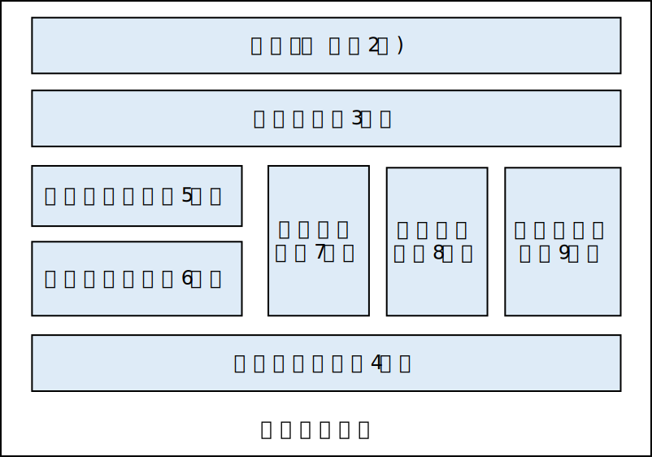

# 机器学习系统：设计和实现

本开源项目试图给读者讲解现代机器学习系统的设计原理和实现经验。

## 适用读者

本书的常见读者包括：

-   **学生：**
    随着大量机器学习课程在大学中的普及，学生已经开始掌握大量机器学习的基础理论和神经网络的实现。然而，需要训练出可以实际应用的机器学习模型，需要对现代机器学习系统有充分的认识。

-   **科研人员：**
    研发新型的机器学习模型不仅仅需要会使用基础的机器学习系统接口。同时，新型的模型往往需要给系统提供新的自定义算子（Custom
    Operators），又或者是会利用高级的分布式执行算子来实现大模型的开发。这一系列需求都需要对底层系统具有充分认识。

-   **开发人员：**
    大量的数据和AI驱动的公司都部署了机器学习基础设施。这一设施的核心就是机器学习系统。因此了解机器学习系统有助于开发人员对于系统性能调优，以定位问题，并且根据业务需求对机器学习系统进行深度定制。

## 构建指南

请参考[构建指南](INFO.md)来了解如何构建本书的网页版本和PDF版本。

## 写作指南

我们欢迎大家来一起贡献和更新本书的内容。常见的贡献方式是提交PR来更新和添加Markdown文件。写作的风格和图片要求请参考[风格指南](STYLE_GUIDE.md)。同时，机器学习领域涉及到大量的中英文翻译，相关的翻译要求请参考[术语指南](TERMINOLOGY.md)。

## 内容介绍

一个现代的机器学习框架往往具有如下图所示的基本架构。

-   **编程接口:** 一个机器学习框架面向用户的编程接口（Programming
    interface）需要特殊设计。编程接口提供简单易用的编程函数（往往是PyThon）从而让用户定义出各式各样的神经网络和相关的训练过程。同时，编程接口要兼顾性能：神经网络的执行可以调用硬件相关C和C++函数（许多加速器和操作系统的编程接口）。该部分的内容将在第2章展开。

-   **计算图：**
    用户定义的机器学习程序往往会表达成一个计算图（Computational
    graph）。这个计算图使得用户并行计算和异步执行得以实现。该部分内容将在第3章展开。

-   **计算加速器：**
    现代计算加速器提供了丰富的编程接口让应用来优化其相关性能。而如何高效使用计算加速器是许多机器学习框架的核心。我们将在第4章中讨论加速器的加速原理和相关使用技巧。

-   **编译器前端：**
    在将计算图发送到加速器执行之前，机器学习框架往往会对计算图做一系列硬件无关的一系列优化，这一过程被称之为：编译器前端。其中核心步骤是对用户定义的神经网络训练实现自动微分。在此期间，计算图会被表示为中间表达（Intermediate
    Representation），并同时应用类型系统和静态分析等一系列技术。我们将在第5章中讨论相关内容。

-   **编译器后端：**
    编译器前端生成的中间表达可以进一步针对硬件的特性（例如说，L2/L3大小，指令流水线长度）进行性能优化，硬件算子选择，内存分配。这一以硬件为核心的编译过程被称为：编译器后端，该部分内容将在第6章中讨论。

-   **数据处理：**
    机器学习框架会集成多种数据管理模块。其中包括数据预处理模块，模型参数checkpoint，模型可视化和训练结果可视化等。该部分内容将在第7章中讨论。

-   **模型部署：**
    在模型完成训练后，用乎需要对模型进行部署。该过程中，我们会根据部署硬件的特点进行模型格式的转换，针对硬件特性进行推理性能优化。同时，移动硬件往往具有小内存的特点。因此大量的模型压缩技术也在部署中得到应用。这些相关内容将在第8章中讨论。

-   **分布式训练：**
    当模型的训练需要大量内存和算力的时候，机器学习框架会提供原生的分布式执行编程接口。分布式机器学习系统已经在工业界得到大量的部署。相关内容会在第9章讨论。

除了上述核心组件以外，机器学习系统作为一个依然高速发展的前沿学科，还有大量的问题正在被密集研究，相关的前沿问题将在本书的第10章中展开讨论。另外，机器学习算法相关的理论知识是本书的预备知识，本书不做深入讨论，基础的机器学习理论知识可以在附录中找到。