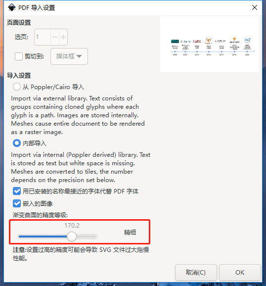
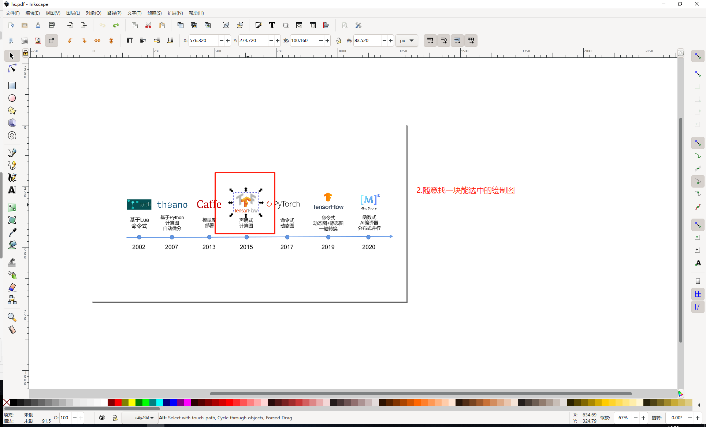
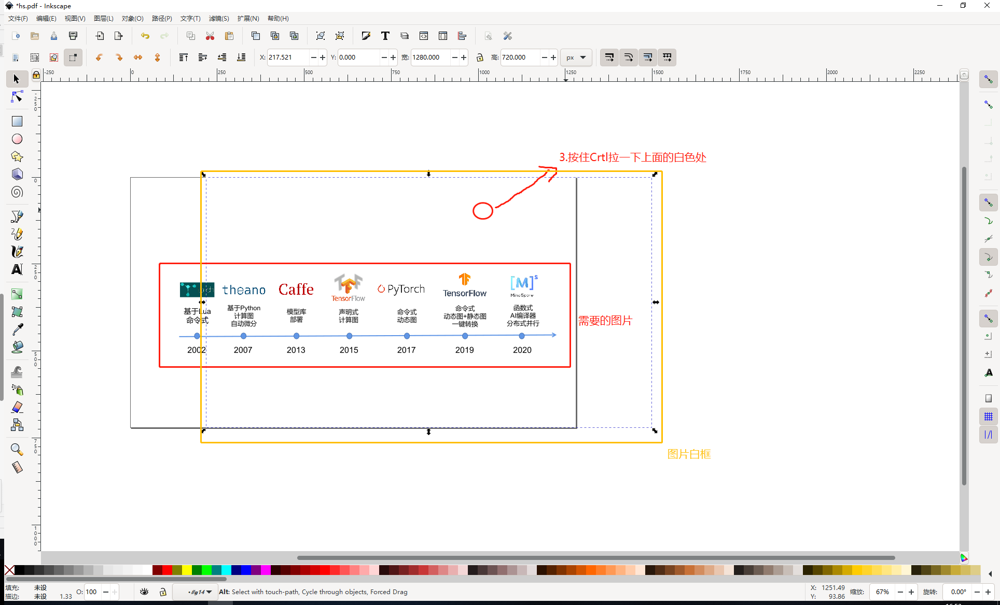

# 样式规范
从LaTeX迁移到Markdown。工具列表：
* [Pandoc:](https://pandoc.org/getting-started.html) LaTeX转换为Markdown。
* [Inkscape:](https://inkscape.org/release/inkscape-1.1.1/) pdf图片文件转换成svg图片文件

书写内容：
* 页面划分：每章建一个目录，以一级子章节的维度建一个md页面，[参考地址](https://github.com/openmlsys/openmlsys-zh/tree/master/chapter_programming_interface) 。
* 图存放位置： openmlsys-zh/img/自己章节，如openmlsys-zh/img/ch01，把自己章节的图片全部放置在对应目录。

## 文本

* LaTeX文件转换Markdown文件
    * Linux下安装Pandoc命令：agt-get install pandoc
    * 使用Pandoc命令：pandoc -s example.tex -o example.md
* 使用Pandoc转换后需要注意修改的地方
    * 表格需要手动改
    * 图片需要手动改
    * 公式部分可能会有不正确，需要注意
    * 代码部分需要手动改，样式如下：
    ```markdown
      ``` python
      import os
      import argparse
      ```
    ```
    * 转换得到的md中，如果使用了"-"语法，则不能出现以下形式的内容:
    ```markdown
      - title
  
          content content content content content con...
    ```
    即"-"之后空了一行，且内容行首空了4格，否则d2lbook会编译失败:
  
## 图片

* 软件
    * 使用PPT制图，以pdf导出，再使用Inkscape转成svg。
    * Inkscape软件使用：
        * 用Inkscape打开pdf，渐变曲线精细度选择为精细。
        
        * 选中图片，我们可以看到图和其白底
        
        * 随意找一块能选择的图，此时会出现周边有虚框
        
        * 按住ctrl拉一下白色框，此时能将图片和白框分离出来，按Delete删除白框。
        
        * 选择文件-文档属性-缩放页面内容-缩放页面到绘图或选区。
        
        * 最后保存图片，用Pycharm看图片效果如下：无白色底，大小刚好框住整图。
        
        
* 样式
    * 格式：
        * svg：自己绘制的图片需要用svg，注意去掉白底
        * png：一些常规举例图片不需去除白底的可以使用png
    * md里插入图片，大小选择宽度800个像素(可以依据自己生成的网页效果调整大小)，label自动生成，例如：
    ```python
        
        :width:`800px`
        :label:`img_workflow`
    ```
  
* 版权
    * 不使用网络图片
* 位置
    * 两张图不可以较邻近
        * 两张图拼一下
* 引用
    * 图片引用如下
     ```python
        
        :width:`800px`
        :label:`img_workflow`
        我们给这个图片打了标签img_workflow,此时对其进行引用如下
        机器学习系统工作流如 :numref:`img_workflow` 。必须注意的是在引用时冒号前要空有一个字符距离。
    ```
   * 表格或者章节引用和图片引用类似，流程依旧是打上标签，然后用 :numref:‘引用的标签’
* 其他转换方式
    * 如果图中有很多公式，使用工具导入可能会有大量公式乱码，此时可以将图保存为.png格式。
    * 使用[在线图片去底工具](https://www.aigei.com/bgremover/) 将图片中的白底去除。
 
    
    

