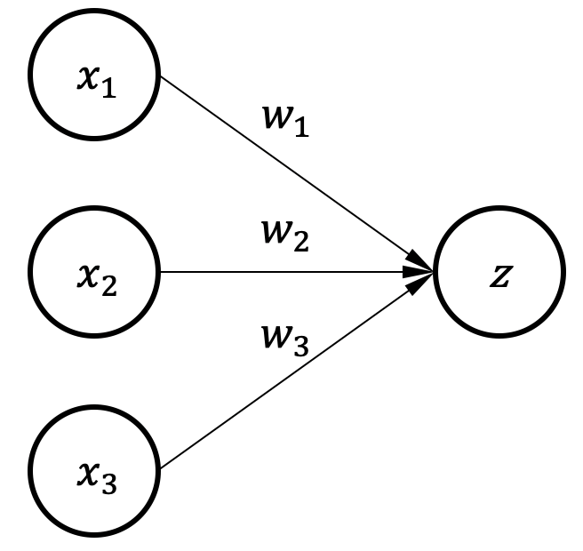
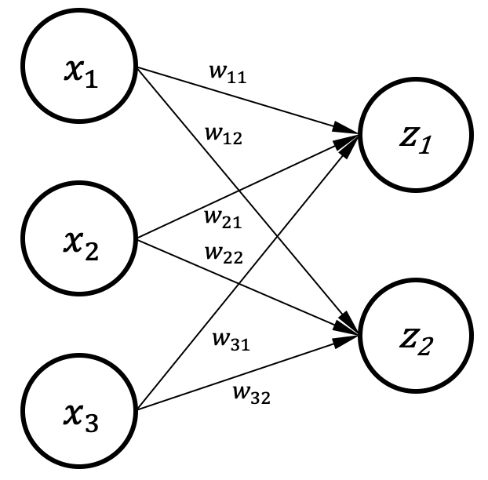
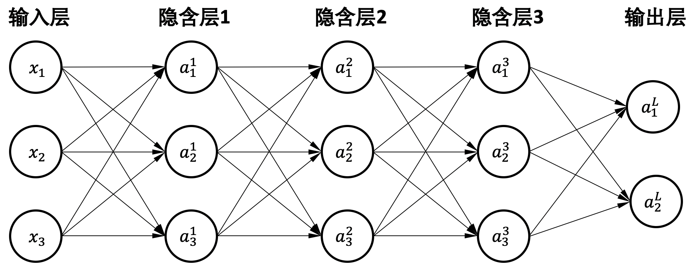
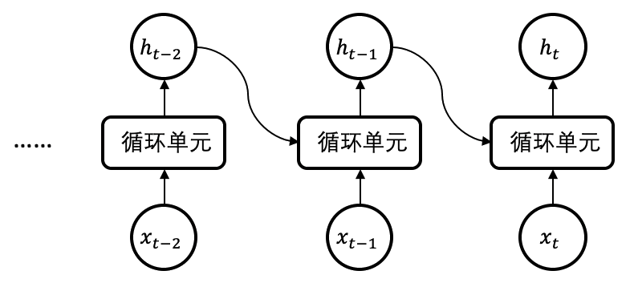

## 神经网络

### 感知器

:width:`600px`
:label:`single_neuron`

 :numref:`single_neuron`是一个神经元的例子，输入数据$x$根据连线上的权重$w$做加权求和得到输出$z$，我们把这样的模型叫作**感知器**（Perceptron）。
 因为输入和输出之间只有一层神经连接，这个模型也叫做单层感知器。 :numref:`single_neuron`的模型计算可以写为：$z = w_{1}x_{1}+ w_{2}x_{2} + w_{3}x_{3}$。

当输入数据用列向量${x}=[x_1,x_2,x_3]^T$表示，模型权重用行向量${w}=[w_1,w_2,w_3]$表示，那么输出的标量$z$可以写为：

$$z = 
\begin{bmatrix}
w_1,w_2,w_3\\
\end{bmatrix}
\begin{bmatrix}
x_1\\
x_2\\
x_3
\end{bmatrix}
={w}{x}$$

我们可以利用输出标量$z$为输入的加权组合来实现特定任务。
比如，可以对"好苹果"和"坏苹果"进行分类，输入的$x_1,x_2,x_3$分别代表三种不同的特征：1）红色的程度，2）有没有洞，3）大小。如果苹果的大小对这个判断没有影响，那么对应的权重就为零。
这个神经网络的训练，其实就是选择合适的权重，来实现我们的任务。比如我们可以选择合适的权重，使得当$z$小于等于$0$时代表"坏苹果"，而当$z$大于$0$时则是"好苹果"。
则最终的分类输出标签$y$如下，为$1$时代表好，$0$代表坏。这个神经元的输入和输出之间只有一层，所以可以成为单层神经网络。

$$
y =
\begin{cases}
1 &  z>0 \\
0 & z \leq 0 \\
\end{cases}$$

### 决策边界vs.偏置

通过选择合适的权重以$z$大于或小于$0$来对输入数据做分类的话，可以在数据空间上获得一个**决策边界**
（Decision Boundary）。如 :numref:`single_neuron_decision_boundary2`所示，以神经元输出$z=0$作为输出标签$y$的决策边界，
没有偏置时决策边界必然经过坐标原点，如果数据样本点不以原点来分开，会导致分类错误。
为了解决这个问题，可以在神经元上加入一个**偏置**（Bias）。 :numref:`single_neuron_bias2`
是一个有偏置$b$的神经元模型，可以用 :eqref:`singleneuron_bias`表达： 
$$z = w_{1}x_{1}+ w_{2}x_{2}+ w_{3}x_{3} + b$$
:eqlabel:`singleneuron_bias`

:width:`600px`
:label:`single_neuron_decision_boundary2`

:width:`600px`
:label:`single_neuron_bias2`

有了偏置以后，决策边界（直线、平面或超平面）可以不经过坐标原点，因此能更好地分类样本。
准确来说，决策边界把这些样本数据分成两个不同的类别，这个边界是
$\{x_1, x_2, x_3 | w_{1}x_{1}+ w_{2}x_{2}+ w_{3}x_{3} + b = 0\}$。

### 逻辑回归

上述神经元的输入和输出是线性关系，为了提供非线性的数据表达能力，可以在神经元输出上加上**激活函数**（Activation
Function），最常见的激活函数有Sigmoid、Tanh、ReLU和Softmax等。
比如，上述神经元以$z=0$为分界来做分类任务，那么我们可不可以让神经元输出一个概率呢？比如输出$0~1$，$1$代表输入数据$100\%$为某一类。
为了让神经元输出$0~1$，可以在$z$上加一个逻辑函数**Sigmoid**，
如 :eqref:`sigmoid`所示，Sigmoid把数值限制在0和1之中，通过一个简单的临界值（如：0.5）来决定最终输出的标签是否属于某个类别。这个方法叫做**逻辑回归**（Logistic
Regression）。

$$a = f({z}) = \frac{1}{1+{\rm e}^{-{z}}}$$
:eqlabel:`sigmoid`

### 多个神经元

:width:`600px`
:label:`two_neurons2`

上述网络只有一个输出，若多个神经元在一起就可以有多个输出。 :numref:`two_neurons2`是有两个输出的网络，每个输出都和所有输入相连，所以也被称**全连接层**（Fully-Connected(FC) Layer），
可由下述式子 :eqref:`fc_cal`表示X。

$$z_{1} &= w_{11}x_{1} + w_{12}x_{2} + w_{13}x_{3} + b_1 \notag \\ z_{2} &= w_{21}x_{1} + w_{22}x_{2} + w_{23}x_{3} + b_2$$
:eqlabel:`fc_cal`

如下式子表示了矩阵方法的实现：

$$
{z} =
\begin{bmatrix}
z_1 \\
z_2
\end{bmatrix}
=
\begin{bmatrix}
w_{11} & w_{12} & w_{13}\\
w_{21} & w_{22} & w_{23}\\
\end{bmatrix}
\begin{bmatrix}
x_1\\
x_2\\
x_3
\end{bmatrix}
+
\begin{bmatrix}
b_1 \\ b_2
\end{bmatrix}
= {W}{x} + {b}$$

多输出的网络可以实现多分类问题，比如有10个数值输出，每个数值分别代表一类物品的概率，每个输出在$0$到$1$之间，10个输出之和为$1$。
可用 :eqref:`e_softmax`的**Softmax** 函数来实现，$K$为输出的个数：

$$f({z})_{i} = \frac{{\rm e}^{z_{i}}}{\sum_{k=1}^{K}{\rm e}^{z_{k}}}$$
:eqlabel:`e_softmax`

### 多层感知器

**多层感知器**（Multi-Layer
Perceptron，MLP）通过叠加多层全连接层来提升网络的表达能力。相比单层网络，多层感知器有很多中间层的输出并不暴露给最终输出，这些层被称为**隐含层**（Hidden
Layers）。这个例子中的网络可以通过下方的串联式矩阵运算实现，其中$W^l$和$b^l$代表不同层的权重矩阵和偏置，$l$代表层号，$L$代表输出层。

$${z} = f({W^L}f({W^3}f({W^2}f({W^1}{x} + {b^1}) + {b^2}) + {b^3}) + {b^L})$$

在深度学习时代，网络模型基本都是多层的神经网络层连接起来的，输入数据经过多层的特征提取，可以学到不同抽象层级的**特征向量**（Feature
Vector）。下面我们介绍一下其他常用的神经网络层。

### 卷积网络

:width:`600px`
:label:`conv_computation_v4`

**卷积神经网络** （Convolutional Neural
Network，CNN）由多层**卷积层**（Convolutional
Layer）组成，常用于计算机视觉任务。
 :numref:`conv_computation_v4`描述了一个卷积运算的例子。
根据卷积的特点，我们可以知道两个事实：1）一个卷积核的通道数，等于输入的通道数；2）输出的通道数，等于卷积核的数量。

 :numref:`conv_computation_v4`例子中，卷积核每次滑动一个数值的范围来进行卷积操作，我们称它的**步长**（Stride）为1。此外，如果希望输入的边缘数值也能被考虑在内的话，则需要对边缘做**填零**（Zero
Padding）操作。 :numref:`conv_computation_v4`例子中，如果输入的每个通道上下左右都填充一圈零，那么输出的大小则为$4\times 4\times 1$。填零的圈数取决于卷积核的大小，卷积核越大则填零圈数越大。

为了对输入的图像数据做特征提取，卷积核数量往往比输入数据的通道数据要多，这样的话输出数据的数值会很多，计算量变大。然而图像数据中相邻像素的特征往往相似，所以我们可以对相邻的输出特征进行聚合操作。**池化层**就是为了实现这个目的，我们通常有两种池化方法最大值池化（Max
Pooling）和平均值池化（Mean
Pooling）。如 :numref:`pooling_v3`所示，假设池化的卷积核高宽为$2\times2$，输入$4\times4$的数据，步长为2（步长为1时，则输出等于输入），则输出为$2\times2$。

:width:`600px`
:label:`pooling_v3`

卷积层和全连接层都是很常用的，但是卷积层在输入是高维度的图像时，需要的参数量远远小于全连接层。卷积层的运算和全连接层是类似的，前者基于高维度张量运算，后者基于二维矩阵运算。

### 时序模型

现实生活中除了图像还有大量时间序列数据，例如视频、股票价格等等。**循环神经网络**（Recurrent
Neural Networks，RNN）是一种处理序列数据的深度学习模型结构。序列数据是一串连续的数据$\{x_1, x_2, \dots, x_n\}$，比如每个$x$代表一个句子中的单词。

为了可以接收一连串的输入序列，如 :numref:`rnn_simple_cell2`所示，朴素循环神经网络使用了循环单元（Cell）作为计算单元，用隐状态（Hidden
State）来存储过去输入的信息。具体来说，对输入模型的每个数据$x$，根据公式 :eqref:`aligned`，循环单元会反复计算新的隐状态，用于记录当前和过去输入的信息。而新的隐状态会被用到下一单元的计算中。

$${h}_t = {W}[{x}_t; {h}_{t-1}] + {b}$$
:eqlabel:`aligned`

:width:`600px`
:label:`rnn_simple_cell2`

然而这种简单的朴素循环神经网络有严重的信息遗忘问题。比如说我们的输入是"我是中国人，我的母语是\_\_\_"，隐状态记住了"中国人"的信息，使得网络最后可以预测出"中文"一词；但是如果句子很长的时候，隐状态可能记不住太久之前的信息了，比如说"我是中国人，我去英国读书，后来在法国工作，我的母语是\_\_\_"，这时候在最后的隐状态中关于"中国人"的信息可能会被因为多次的更新而遗忘了。
为了解决这个问题，后面有人提出了各种各样的改进方法，其中最有名的是长短期记忆（Long
Short-Term
Memory，LSTM）。关于时序的模型还有很多很多，比如近年来出现的Transformer等等。
