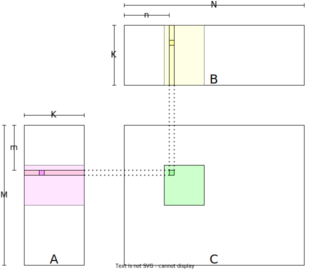
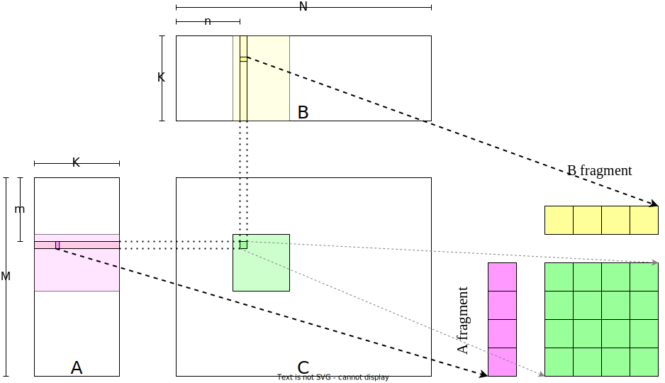
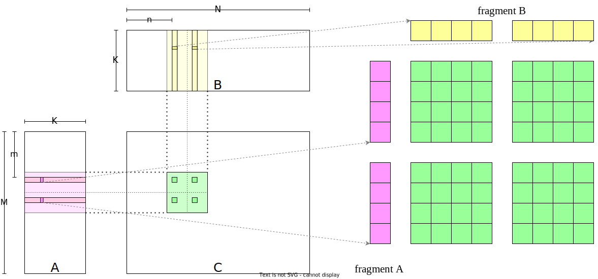
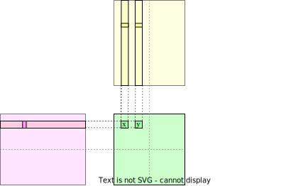
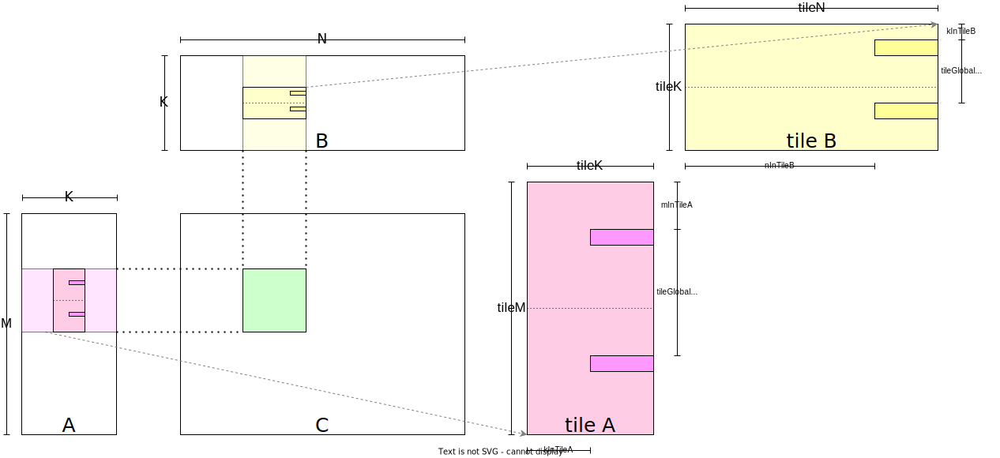
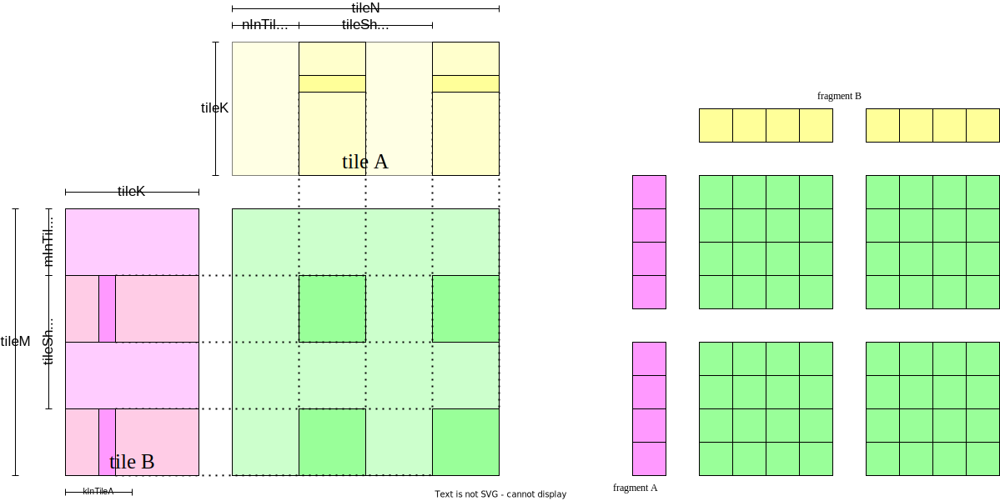
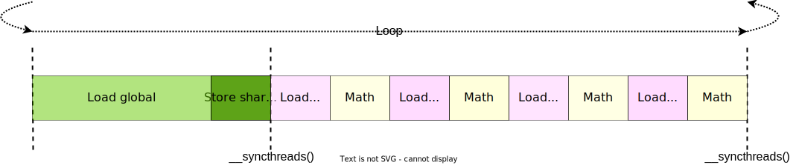
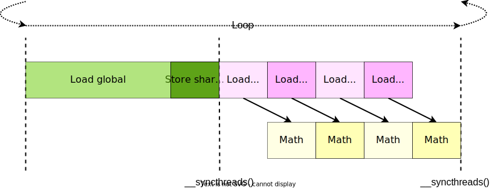
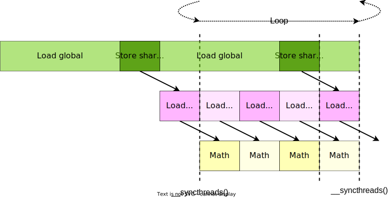

## 加速器实践

上一节中介绍了调用第三方库或算子优化器的外部接口从而利用硬件加速器加速计算，这种方法要求我们算法的算子全部被第三方库或是算法优化器所支持，对于一些特殊的自定义算子很有可能不被支持，因此能自行实现高性能算子是实现定制化分布式系统的一个极为重要的能力。本节将会以广义矩阵乘法为例，通过提高计算强度、使用共享内存、优化内存读取流水线等方法最终取得接近硬件加速器性能峰值的实现，同时介绍若干性能优化的关键技术。选择广义矩阵乘法的原因是在深度学习中全连接网络的重要组件就是广义矩阵乘法，事实上，卷积操作也往往是通过im2col等方法将其转化为广义矩阵乘法；此外实现一个高性能的广义矩阵乘法算子相比其他算子（如矩阵转置）对开发者的编程能力和底层硬件架构要求更高。

### 环境

本节的实践有以下的软件环境依赖：

* Eigen：Eigen是一个线性代数C++模板库，用户可以只使用几条语句完成多线程线性代数运算。
* OpenMP（可选）：OpenMP是用于共享内存并行系统的多处理器程序设计的一套指导性编译处理方案，我们可以使用OpenMP对Eigen的计算进行加速。
* CUDA Toolkit：CUDA Toolkit是英伟达发布的CUDA工具包，其包含了CUDA编译器（NVCC），CUDA线性代数库（cuBLAS）等组件。
本节的实践都是在CPU Intex Xeon E5-2650 v3，GPU Nvidia Geforce RTX 3080；系统Ubuntu 18.04版本，CUDA Toolkit 11.1进行的。

#### 安装

* Eigen：Eigen的安装可以通过使用包管理器安装（如使用指令`apt install libeigen3-dev`），也可以从[官网](https://eigen.tuxfamily.org/index.php?title=Main_Page)下载。
* OpenMP（可选）：通常会被大多数编译器默认支持，如果没有被支持的话可以使用包管理器安装（如使用指令`apt install libomp-dev`）。
* CUDA Toolkit：CUDA Toolkit的安装建议按照[官方的提示](https://developer.nvidia.com/cuda-downloads)安装，也可以通过使用包管理器安装（如使用指令`apt install cuda`）。

### 广义矩阵乘法的朴素实现

:label:`sec-accelerator-naive`

广义矩阵乘法指GEMM（General Matrix Multiplication），即$C = \alpha A\times B + \beta C$，其中$A\in\mathbb{R}^{M\times K}, B\in\mathbb{R}^{K\times N}, C\in\mathbb{R}^{M\times N}$。

矩阵$C$ 的第$m$行第$n$列元素$C_{m, n}$ 是由矩阵$A$中第$m$行$K$维向量和矩阵$B$中第$n$列$K$维向量的内积与$C_{m, n}$原始值加权求和得到的，因此在这种视角下的CPU代码为：

```c++
float A[M][K];
float B[K][N];
float C[M][N];
float alpha, beta;

for (unsigned m = 0; m < M; ++m) {
    for (unsigned n = 0; n < N; ++n) {
        float c = 0;
        for (unsigned k = 0; k < K; ++k) {
            c += A[m][k] * B[k][n];
        }
        C[m][n] = alpha * c + beta * C[m][n];
    }
}
```

因此可以看到，矩阵$C$ 中各个元素的计算是独立的。我们可以利用GPU的大量线程去分别计算矩阵$C$ 中相应的元素，以达到并行计算的目的，GPU核函数将如下所示：

```c++
__global__ void gemmKernel(const float * A,
                           const float * B, float * C,
                           float alpha, float beta, unsigned M, unsigned N,
                           unsigned K) {
  unsigned int m = threadIdx.x + blockDim.x * blockIdx.x;
  unsigned int n = threadIdx.y + blockDim.y * blockIdx.y;
  if (m >= M || n >= N)
      return;
  float c = 0;
  for (unsigned k = 0; k < K; ++k) {
    c += A[m * K + k] * B[k * N + n];
  }
  c = c * alpha;
  float result = c;
  if (beta != 0) {
    result = result + C[m * N + n] * beta;
  }
  C[m * N + n] = result;
}
```

其可视化结构如 :numref:`cuda_naive_gemm`所示，矩阵$C$中每一个元素由一个线程计算，在GPU Kernel的第5和6行计算该线程对应矩阵$C$中的元素行号$m$及列号$n$，然后在第9到11行该线程利用行号与列号读取矩阵$A$和矩阵$B$中相应的行列向量元素并计算向量内积，最后在第17行将结果写回$C$矩阵。


:width:` 800px`
:label:`cuda_naive_gemm`

使用以下代码启动核函数：

```c++
void gemmNaive(const float *A, const float *B, float *C,
               float alpha, float beta, unsigned M,
               unsigned N, unsigned K) {
  dim3 block(16, 16);
  dim3 grid((M - 1) / block.x + 1, (N - 1) / block.y + 1);

  gemmKernel<<<grid, block>>>(A, B, C, alpha, beta, M, N, K);
}
```

在这里我们令每个线程块处理矩阵$C$中$16\times16$个元素，因此我们开启$(M - 1) / 16 + 1 \times (N - 1) / 16 + 1$个线程块用于计算整个矩阵$C$。

接下来我们生成数据并执行：

```c++
#include <Eigen/Core>

using namespace Eigen;
int main() {
  unsigned M = 2048, N = 2048, K = 1024;
  float alpha = 1., beta = 1.;
  float *deviceAPrt, *deviceBPtr, *deviceCPtr;
  Matrix<float, Dynamic, Dynamic, RowMajor> A{M, K}, B{K, N}, C{M, N};
  A.setRandom();
  B.setRandom();
  C.setRandom();
  cudaMalloc(&deviceAPrt, M * K * sizeof(float));
  cudaMemcpy(deviceAPrt, A.data(), M * K * sizeof(float),
             cudaMemcpyHostToDevice);
  cudaMalloc(&deviceBPtr, K * N * sizeof(float));
  cudaMemcpy(deviceBPtr, B.data(), K * N * sizeof(float),
             cudaMemcpyHostToDevice);
  cudaMalloc(&deviceCPtr, M * N * sizeof(float));
  cudaMemcpy(deviceCPtr, C.data(), M * N * sizeof(float),
             cudaMemcpyHostToDevice);
  gemmNaive(deviceAPrt, deviceBPtr, deviceCPtr, alpha, beta, M, N, K);
  cudaDeviceSynchronize();
}
```
我们在代码的第8到11行利用Eigen构建并初始化矩阵$A, B, C$。在代码的第12到20行分配GPU内存并将CPU数据拷贝到GPU端。最后我们在第21行执行函数并在22行等待该函数结束。

接下来我们需要对我们实现的GPU代码测速并验证其数值正确性。对GPU代码的测速我们使用`cudaEvent`，`cudaEvent`可以记录GPU端程序事务并用来计算两个事务之间的耗时，使用方法如下段代码：

```c++
cudaEvent_t startEvent, stopEvent;
cudaEventCreate(&startEvent);
cudaEventCreate(&stopEvent);

cudaEventRecord(startEvent);
gemmNaive(deviceAPrt, deviceBPtr, deviceCPtr, alpha, beta, M, N, K);
cudaEventRecord(stopEvent);

cudaEventSynchronize(stopEvent);
float milliseconds = 0;
cudaEventElapsedTime(&milliseconds, startEvent, stopEvent);
printf("Average Time: %.3f ms\n", milliseconds);

cudaEventDestroy(stopEvent);
cudaEventDestroy(startEvent);
```

具体地，我们首先声明类型为`cudaEvent_t`的变量，然后使用第2及第3行所示代码创建GPU事务，在待测的GPU代码起始时使用第5行的代码记录起始事务并在GPU代码结束后使用第7行的代码记录结束事务。通过使用第9到第12行代码计算两次事务间的时间差并打印，最后使用第12及第13行代码销毁GPU事务。

执行这段代码，得到输出结果：

```
Average Time: 46.354 ms
```

接下来我们实现数值验证的相关代码并计算CPU耗时：

```c++
#include <omp.h>

// ...

int main() {
  // ...
  Matrix<float, Dynamic, Dynamic, RowMajor> hostResult{M, N},
      deviceResult{M, N};
  omp_set_num_threads(omp_get_num_procs());
  clock_t begin, end;
  begin = clock();
  hostResult = alpha * (A * B) + beta * C;
  end = clock();
  printf("Average Time: %.3f ms\n", double(end - begin) / CLOCKS_PER_SEC * 1e3);
  cudaMemcpy(deviceResult.data(), deviceCPtr, M * N * sizeof(float),
             cudaMemcpyDeviceToHost);
  cudaDeviceSynchronize();
  
  Eigen::Array<float, Eigen::Dynamic, Eigen::Dynamic> diffArray =
      (hostResult - deviceResult).array().abs();
  printf("Max Error: %f\n", diffArray.maxCoeff());
}
```

我们在第9到14行使用CPU计算结果并计时，在第15行将GPU计算的结果拷贝到CPU内存中，在第19到21行计算误差并打印。值得注意的是我们在第9行使用了OpenMP以启用CPU多线程计算一般矩阵乘法。

完整代码在[first_attempt.cu](https://github.com/openmlsys/openmlsys-cuda/blob/main/first_attempt.cu)中，编译及执行指令如下：

```bash
mkdir build && cd build
cmake ..
make first_attempt
./first_attempt
```

输出结果为：

```
Average Time: 48.961 ms
Max Error: 0.000092
```

我们可以使用以下公式粗略的计算GPU的峰值吞吐量：2$\times$频率$\times$单精度计算单元数量 ，其中单精度计算单元数量等于GPU中流多处理器（SM）数量乘每个流多处理器中单精度计算单元数量；并用以下公式粗略的计算我们代码的吞吐量：2$\times$数据量$\div$时间：

```c++
int main() {
  // ...
  int gpu_rank = 0;
  cudaDeviceProp deviceProp{};
  cudaGetDeviceProperties(&deviceProp, gpu_rank);
  cudaSetDevice(gpu_rank);
  double boostFrequency = deviceProp.clockRate / 1e6;
  int1 fp32CoresNum = 128;
  double peakPerformance = boostFrequency * fp32CoresNum * 2;
  printf("FP32 peak throughput %.3f GFLOPS\n", peakPerformance);
  double GFLOPS = 2 * 1e-9 * M * N * K / (milliseconds * 1e-3);
  printf("Average Throughput: %.3f GFLOPS\n", GFLOPS);
}
```

执行可以输出：

```
FP32 peak throughput 29767.680 GFLOPS
Average Throughput: 185.313 GFLOPS
```
可以发现目前的代码距离设备峰值性能仍有较大的差距。在整个计算过程中计算密集最大的过程为矩阵乘法$A\times B$，其时间复杂度为$O(M*N*K)$，而整个计算过程时间复杂度为$O(M*N*K+2*M*N)$，因此对矩阵乘法的优化是提升性能的关键。

#### 使用封装结构代替指针

在上面的实现中，由于二维矩阵的数据是使用一维数组进行存储，所以在访问数据时需要使用行坐标与二维矩阵宽度的乘积和列坐标的和来索引到具体位置的元素，这样的访问方式并不直观且在后续逐渐复杂的实现中容易出错。因此，我们可以自定义一个结构体，通过重载 `()` 运算符，实现对矩阵元素的二维索引，同时我们提供 `addOffset` 方法用于加入一个固定的偏移，具体实现如下：

```c++
template <typename T>
struct __device_builtin__ Tensor2D {
  T *const __restrict__ ptr;
  const unsigned rows, cols;
  int _rowOffset{0}, _colOffset{0};
 
  template <typename t>
  __host__ __device__ Tensor2D(t &&ptr, unsigned rows, unsigned cols)
      : ptr{reinterpret_cast<T *>(ptr)}, rows{rows}, cols{cols} {};

  __host__ __device__ T &operator()(unsigned row, unsigned col) const {
    return ptr[_colOffset + col + (row + _rowOffset) * cols];
  }
  
  template <typename t = T>
  __host__ __device__ void addOffset(int rowOffset, int colOffset) {
    _rowOffset += rowOffset;
    _colOffset += colOffset * sizeof(t) / sizeof(T);
  }
};
```
另外，我们在读取数据数据之前需要对偏移判断是否越界，因此我们增加以下方法：
```c++
template <typename T>
struct __device_builtin__ Tensor2D {
  // ...
  __host__ __device__ bool validRowOffset(int rowOffset) const {
    return (_rowOffset + rowOffset) < rows;
  }

  __host__ __device__ bool validColOffset(int colOffset) const {
    return (_colOffset + colOffset) < cols;
  }

  __host__ __device__ bool validOffset(int rowOffset,
                                       int colOffset) const {
    return validRowOffset(rowOffset) && validColOffset(colOffset);
  }
};
```
完整代码在[util.cuh](https://github.com/openmlsys/openmlsys-cuda/blob/main/util.cuh)。
最终，我们可以将GPU核函数改写为以下形式：

```c++
__global__ void gemmKernel(const float * A,
                           const float * B, float * C,
                           float alpha, float beta, unsigned M, unsigned N,
                           unsigned K) {
  unsigned int m = threadIdx.x + blockDim.x * blockIdx.x;
  unsigned int n = threadIdx.y + blockDim.y * blockIdx.y;
  Tensor2D<const float> tensorA{A, M, K};
  Tensor2D<const float> tensorB{B, K, N};
  Tensor2D<float> tensorC{C, M, N};
  if (!tensorC.validOffset(m, n)) return;
  float c = 0;
  for (unsigned k = 0; k < K; ++k) {
    c += tensorA(m, k) * tensorB(k, n);
  }
  c = c * alpha;
  float result = c;
  if (beta != 0) {
    result = result + tensorC(m, n) * beta;
  }
  tensorC(m, n) = result;
}
```

### 提高计算强度

计算强度（Compute Intensity）指计算指令数量与访存指令数量的比值，在现代GPU中往往有大量计算单元但只有有限的访存带宽，程序很容易出现计算单元等待数据读取的问题，因此提高计算强度是提升程序性能的一条切实有限的指导思路。对于之前实现的GPU核函数，我们可以粗略计算其计算强度：在$K$次循环的内积计算中，对矩阵$A$与矩阵$B$的每次读取会计算一次浮点乘法与浮点加法，因此计算强度为1——两次浮点运算除以两次数据读取。之前的版本是每个线程负责处理矩阵$C$的一个元素——计算矩阵$A$的一行与矩阵$B$的一列的内积，我们可以通过使每个线程计算$C$更多的元素——计算矩阵$A$的多行与矩阵$B$的多列的内积——从而提升计算强度。具体地，如果在$K$次循环的内积计算中一次读取矩阵$A$中的$m$个元素和矩阵$B$中的$n$个元素，那么访存指令为$m+n$条，而计算指令为$2mn$条，所以计算强度为$\frac{2mn}{m+n}$，因此可以很容易发现提高$m$和$n$会带来计算强度的提升。

我们在上一个代码例子中对全局内存的访问与存储都是借助 `float` 指针完成的，具体到硬件指令集上实际是使用指令 `LDG.E` 与 `STG.E` 完成的。我们可以使用128位宽指令`LDG.E.128` 与 `STG.E.128`  一次读取多个 `float` 数。使用宽指令的好处一方面有简化了指令序列，使用一个宽指令代替四个标准指令可以节省十几个指令的发射周期，这可以为计算指令的发射争取到额外的时间；此外128比特正好等于一个cache line的长度，使用宽指令也有助于提高cache line的命中率。但我们并不提倡在一切代码中过度追求宽指令的使用，开发者应当将更多的时间关注并行性设计和局部数据复用等更直接的优化手段。

具体的实现如下，由于每个 `float` 类型大小为32个比特，我们可以将4个 `float` 堆叠在一起构成一个128比特的 `float4` 类，对 `float4` 的访存将会是使用宽指令完成。虽然CUDA Toolkit已经有实现的 `float4` 类，但是为了代码抽象我们将自行实现我们自己的 `float4` 类。

```c++
struct __device_builtin__ __builtin_align__(16) float4 {
  float data[4];

  __host__ __device__ float operator[](unsigned idx) const { return data[idx]; }

  __host__ __device__ float &operator[](unsigned idx) { return data[idx]; }

  __host__ __device__ float4 operator*(float other) const {
    return float4{data[0] * other, data[1] * other, data[2] * other,
                  data[3] * other};
  }

  __host__ __device__ float4 operator+(const float4 &other) const {
    return float4{data[0] + other.data[0], data[1] + other.data[1],
                  data[2] + other.data[2], data[3] + other.data[3]};
  }
};
```

我们重载了`[]`运算符，从而可以通过索引访问`float4` 内部元素。此外我们定义了 `float4` 与 `float` 乘法及 `float4` 与 `float4` 加法的实现，方便对后续代码抽象。完整代码在[util.cuh](https://github.com/openmlsys/openmlsys-cuda/blob/main/util.cuh)中。

在实现GPU核函数过程中要注意，每个线程需要从原本各读取矩阵$A$和矩阵$B$中一个 `float` 数据变为各读取4个 `float` 数据，这就要求现在每个线程负责处理矩阵$C$中$4\times 4$的矩阵块，我们称之为 `thread tile` 。相应的GPU核函数应为以下形式：

```c++
__global__ void gemmKernel(const float *__restrict__ A,
                           const float *__restrict__ B, float *__restrict__ C,
                           float alpha, float beta, unsigned M, unsigned N,
                           unsigned K) {
  constexpr unsigned ratio = sizeof(float4) / sizeof(float);
  unsigned int m = (threadIdx.x + blockDim.x * blockIdx.x) * ratio;
  unsigned int n = (threadIdx.y + blockDim.y * blockIdx.y) * ratio;
  Tensor2D<const float> tensorA{A, M, K};
  tensorA.addOffset(m, 0);
  Tensor2D<const float4> tensorB{B, K, N / ratio};
  tensorB.addOffset(0, n / ratio);
  Tensor2D<float4> tensorC{C, M, N / ratio};
  tensorC.addOffset(m, n / ratio);
  if (!tensorC.validOffset(0, 0)) return;

  float4 c[4];
  memset(c, 0, sizeof(c));
  for (unsigned k = 0; k < K; ++k) {
    float4 fragmentA{};
    for (unsigned i = 0; i < ratio; ++i) {
      fragmentA[i] = tensorA(i, k);
    }
    float4 fragmentB = tensorB(k, 0);

    for (unsigned i = 0; i < ratio; ++i) {
      c[i] = c[i] + fragmentB * fragmentA[i];
    }
  }

  for (auto &term : c) {
    term = term * alpha;
  }

  for (unsigned i = 0; i < ratio; ++i) {
    float4 result = c[i];
    if (beta != 0) {
      result = c[i] + tensorC(i, 0) * beta;
    }
    tensorC(i, 0) = result;
  }
}
```

我们首先在第6到14行计算每个线程需要处理的数据块在矩阵中的起始行列坐标`m,n`，即 :numref:`use_float4` 中矩阵$C$中浅绿色数据块的左上角坐标，然后使用`Tensor2D`中的`addOffset`方法，为每个线程定位到它要处理的数据块的起始位置上，并且利用`validOffset`方法判断线程是否越界。然后就可以沿着K方向循环，在第18到23行每个线程分别读取矩阵$A$中连续的4行和矩阵$B$中连续的四列组成两个 `float4` ，即 :numref:`use_float4` 中粉色与黄色的四个元素。之后在第25到27行计算线程负责处理矩阵$C$中的$4 \times 4$个元素。最后在第30到40行对结果使用参数 `alpha` 和 `beta` 进行放缩并写回矩阵$C$的内存。


:width:` 800px`
:label:`use_float4`

为了将尺寸数据在编译期确定，减少执行期的额外数据读取开销，我们引入一个新的模板类 `Layout` ，这个类保存各种尺寸数据。其实现代码如下：

```c++
template <int _m, int _n, int _k = 1>
struct Layout {
 static constexpr int m = _m;
 static constexpr int n = _n;
 static constexpr int k = _k;
};
```
对上述代码稍加修改便可使用这个新的特性：
```c++
template <typename LayoutTile>
__global__ void gemmKernel(const float *__restrict__ A,
                           const float *__restrict__ B, float *__restrict__ C,
                           float alpha, float beta, unsigned M, unsigned N,
                           unsigned K) {
  constexpr unsigned ratio = sizeof(float4) / sizeof(float);
  unsigned int m = (threadIdx.x + LayoutTile::m * blockIdx.x) * ratio;
  unsigned int n = (threadIdx.y + LayoutTile::n * blockIdx.y) * ratio;
  // ...
}
```

同时在启动时使用新修改的模板函数来启动GPU核函数：

```c++
using LayoutTile = Layout<16 * 4, 16 * 4>;

gemmKernel<LayoutTile><<<grid, block>>>(deviceAPtr, deviceBPtr, deviceCPtr, alpha, beta,
                             M, N, K);
```
完整代码见[gemm_use_128.cu](https://github.com/openmlsys/openmlsys-cuda/blob/main/gemm_use_128.cu)。

#### 测试及分析

测试得到以下结果：

```
Max Error: 0.000092
Average Time: 6.232 ms, Average Throughput: 1378.317 GFLOPS
```

接下来我们使用分析工具Nsight Compute分析取得性能提升的具体原因。Nsight Compute是英伟达发布的主要针对GPU核函数的性能分析工具，它通过劫持驱动的方式对GPU底层数据采样和输出。可以使用以下指令进行性能分析：

```bash
ncu --set full -o <profile_output_file> <profile_process>
```
 `--set full` 代表采样所有数据， `-o` 代表以文件的形式输出结果； `<profile_output_file>` 填输出文件名但注意不要加后缀名， `<profile_process>` 填待分析的可执行文件及其参数。
比如我们需要分析 `first_attempt` ，将输出结果命名为 `first_attepmt_prof_result` 我们可以使用以下指令：

```c++
ncu --set full -o first_attepmt_prof_result ./first_attempt
```
如果提示权限不足可以使在指令前加`sudo` 。
在得到输出文件之后，我们可以使用 `nv-nsight-cu` 查看文件。我们对我们改动的GPU核函数与上一版本的GPU核函数进行对比分析，发现：

首先 `LDG` 指令数量下降了84%，且指标 `Stall LG Throttle` 下降33%，说明使用宽指令增加计算密度确实可以通过减少全局内存访问的指令数目而减少发射等待时间。最后指标 `Arithmetic Intensity` 的提升也和我们之前的关于计算强度的分析相吻合。

### 进一步提升计算强度

我们可以通过使每个线程负责处理更多的矩阵$C$中的数据块从而实现更高的计算强度，即如 :numref:`use_tile` 右侧所示，使 `thread tile` 扩大为4个$4 \times 4$矩阵的规模。我们对核函数进行以下修改，首先我们用`LayoutTile` 来描述每个线程块处理数据 `tile`的布局 ，其中 `LayoutTile::m` 和 `LayoutTile::n` 等于 :numref:`use_tile` 左图中浅绿色矩阵块的高度和宽度， `LayoutTile::k` 等于1；其次我们用`LayoutBlock` 来描述一个线程块中线程的布局；同时我们用`LayoutThread` 来描述 `thread tile` 中子矩阵的布局 ，其中`LayoutThread::m` 和 `LayoutThread::n` 等于 :numref:`use_tile` 右图中深绿色矩阵块的高度和宽度 。


:width:` 800px`
:label:`use_tile`

首先修改核函数签名：

```c++
template <typename LayoutTile, typename LayoutBlock, typename LayoutThread>
__global__ void gemmKernel(const float *__restrict__ A,
                          const float *__restrict__ B, float *__restrict__ C,
                          float alpha, float beta, unsigned M, unsigned N,
                          unsigned K) {
  // ...
}
```

然后改写线程负责处理数据的偏移量，即图3左图中的行列偏移值 `m` 和 `n` ，其代码实现如下 ：

```c++
unsigned m = threadIdx.x * LayoutThread::m + LayoutTile::m * blockIdx.x;
unsigned n = threadIdx.y * LayoutThread::n + LayoutTile::n * blockIdx.y;
```

由于每个线程从原来的处理一个数据块变为多个数据块，我们需要以下几个变量：

```c++
const unsigned iterationA = LayoutTile::m / LayoutBlock::m / LayoutThread::m;
const unsigned iterationB = LayoutTile::n / LayoutBlock::n / LayoutThread::n;
const unsigned intervalA = LayoutTile::m / iterationA;
const unsigned intervalB = LayoutTile::n / iterationB;
```
 `iterationA` 是每个线程处理 `thread tile` 在行方向上迭代的次数。`intervalA` 是 `thread tile` 子矩阵在行方向的间隔。同理 `iterationB` 与 `intervalB` 是在列方向上数据块的数量与数据块的间隔。
因为 `thread tile` 扩大为若干个矩阵块，我们使用以下代码用来记录每个矩阵块是否越界：

```c++
bool validLoadTileA[iterationA];
bool validLoadTileB[iterationB];
#pragma unroll
for (unsigned i = 0; i < iterationA; ++i) {
  validLoadTileA[i] = pA.validRowOffset(i * intervalA);
}
#pragma unroll
for (unsigned i = 0; i < iterationB; ++i) {
  validLoadTileB[i] = pB.validColOffset(i * intervalB / ratio);
}
```

对于数据的读取和累加计算相应的需要增加循环：

```c++
constexpr float4 float4Zero{0.f, 0.f, 0.f, 0.f};
for (unsigned k = 0; k < K; ++k) {
#pragma unroll
  for (unsigned iterA = 0; iterA < iterationA; ++iterA) {
    float4 fragmentA{};
    validLoadTileA[iterA] &= pA.validColOffset(k);
#pragma unroll
    for (unsigned i = 0; i < ratio; ++i) {
      fragmentA[i] = validLoadTileA[i] ? pA(i + iterA * intervalA, k) : 0;
    }
#pragma unroll
    for (unsigned iterB = 0; iterB < iterationB; ++iterB) {
      validLoadTileB[iterB] &= pB.validRowOffset(k);
      float4 fragmentB = validLoadTileB[iterB]
                             ? pB(k, iterB * intervalB / ratio)
                             : float4Zero;
#pragma unroll
      for (unsigned i = 0; i < ratio; ++i) {
        c[iterA][iterB][i] = c[iterA][iterB][i] + fragmentB * fragmentA[i];
      }
    }
  }
}
```
注意到我们此时使用了编译器指令 `#pragma unroll` 用于将循环展开，即如果循环次数是可以在编译时确定的话，编译器将会把带有判断和跳转的循环代码展开成串行代码。这样做的好处主要是减少了判断语句，此外还有利于编译器发现数据依赖从而更好地分配寄存器。缺点是可能会增加寄存器的使用，有潜在的降低GPU占用率的风险。
最后对于结果使用 `alpha` 和 `beta` 的放缩以及写回也相应的加上数据块的循环：

```c++
#pragma unroll
for (auto &termA : c) {
#pragma unroll
 for (auto &termB : termA) {
#pragma unroll
   for (auto &term : termB) {
     term = term * alpha;
   }
 }
}

#pragma unroll
for (unsigned iterA = 0; iterA < iterationA; ++iterA) {
#pragma unroll
 for (unsigned iterB = 0; iterB < iterationB; ++iterB) {
#pragma unroll
   for (unsigned i = 0; i < ratio; ++i) {
     float4 result{c[iterA][iterB][i]};
     if (beta != 0) {
       result = result +
                pC(i + iterA * intervalA, iterB * intervalB / ratio) * beta;
     }
     pC(i + iterA * intervalA, iterB * intervalB / ratio) = result;
   }
 }
}
```
完整代码见[gemm_use_tile.cu](https://github.com/openmlsys/openmlsys-cuda/blob/main/gemm_use_tile.cu)。

#### 测试及分析

测试得到以下结果：

```
Max Error: 0.000092
Average Time: 3.188 ms, Average Throughput: 2694.440 GFLOPS
```

使用Nsight Compute分析发现：类似地，本次优化在`Stall LG Throttle` 等指标上取得了进一步的提升。

### 使用共享内存缓存复用数据

:label:`sec-accelerator-use-smem`

虽然令一个线程一次读取更多的数据能取得计算强度的提升进而带来性能的提升，但是这种设计会导致由于单个线程处理数据的增多导致开启总的线程数量减少，进而导致并行度下降，因此我们需要使用其他硬件特性在尽可能不影响并行度的前提下取得性能提升。在之前的代码中，我们开启若干个线程块，每个线程块处理矩阵$C$中的一个或多个矩阵块。在 :numref:`duplicated_data` 中，我们可以观察到，处理矩阵$C$同一行的线程$x, y$会读取矩阵$A$中相同的数据，我们可以借助共享内存让同一个线程块中不同的线程读取不重复的数据而提升程序吞吐量。


:width:` 800px`
:label:`duplicated_data`

具体地，我们需要对代码进行如下改造：首先此前代码在计算内积过程是进行$K$次循环读取数据并累加计算，在此设定下每次循环中处理矩阵$C$中相同行的线程会读取相同的矩阵$A$的数据，处理矩阵$C$中相同列的线程会读取相同的矩阵$B$的数据。我们可以通过将此$K$次循环拆解成两层循环，外层循环$\frac{K}{tileK}$次，每次外循环的迭代读取一整块数据，内层循环$tileK$次进行累加数据。直观来看，外层循环如 :numref:`use_smem_store` 所示，每次循环将矩阵$A$和矩阵$B$中一整个 `tile` 读取到共享内存中；内层循环如 :numref:`use_smem_load` 所示，每次循环从共享内存读取数据并计算。这种设计带来的好处是，我们可以让每个线程不必独自从全局内存读取所有需要的数据，整个线程块将共同需要的数据从全局内存中读取并写入到共享内存中，此后每个线程在计算过程中只需要从共享内存中读取所需要的数据即可。



:width:` 800px`
:label:`use_smem_store`


:width:` 800px`
:label:`use_smem_load`

下面我们将实现使用共享内存的GPU核函数。首先，我们可以计算每个线程块在外层循环的每次迭代中从矩阵$A$中读取大小为$tileM \times tileK$的数据块，在矩阵$B$中读取大小为$tileK \times tileN$的数据块。假设每个线程块中一共含有$blockSize$个线程，那么就可以使用这$blockSize$个线程，每个线程循环$\frac{tileM * tileK}{blockSize * 4}$次将矩阵$A$中的矩阵块 `tileA` 读取进共享内存中，同理每个线程循环$\frac{tileM * tileK}{blockSize * 4}$次将矩阵$B$中的矩阵块 `tileB` 读取进共享内存中。

首先需要定义若干变量：

```c++
using LayoutTileT =
     Layout<LayoutTile::m / ratio, LayoutTile::n / ratio,
                               LayoutTile::k / ratio>;
 using LayoutThreadT =
     Layout<LayoutThread::m / ratio, LayoutThread::n / ratio>;

constexpr unsigned blockSize = LayoutBlock::m * LayoutBlock::n;

const unsigned nInTileC = threadIdx.x % LayoutBlock::m;
const unsigned mInTileC = threadIdx.x / LayoutBlock::m;

constexpr unsigned tileSizeA = LayoutTile::m * LayoutTile::k;
constexpr unsigned tileIterationsA = tileSizeA / blockSize / ratio;
constexpr unsigned tileGlobalIntervalA = blockSize / LayoutTileT::k;
constexpr unsigned tileComputeIterationsA = LayoutTileT::m / LayoutBlock::m;
constexpr unsigned tileSharedIntervalA = LayoutTile::m / tileComputeIterationsA;
const unsigned kInTileA = threadIdx.x % LayoutTileT::k;
const unsigned mInTileA = threadIdx.x / LayoutTileT::k;

constexpr unsigned tileSizeB = LayoutTile::n * LayoutTile::k;
constexpr unsigned tileIterationsB = tileSizeB / blockSize / ratio;
constexpr unsigned tileGlobalIntervalB = blockSize / LayoutTileT::n;
constexpr unsigned tileComputeIterationsB = LayoutTileT::n / LayoutBlock::n;
constexpr unsigned tileSharedIntervalBT = LayoutTileT::n / tileComputeIterationsB;const unsigned nInTileB = threadIdx.x % LayoutTileT::n;
const unsigned kinTileB = threadIdx.x / LayoutTileT::n;
```
因为 `LayoutTile` 与 `LayoutThread` 是表示的 `float` 数据的布局，我们有时将其看为 `float4` 的数据储存，因此我们需要加入变量 `LayoutTileT` 与 `LayoutThreadT` 。 `blockSize` 指一个线程块内的线程数量。 我们在此版本使用一维线程块的布局模拟二维布局，所以我们需要计算在二维布局下的坐标：用 `mInTileC` 与 `nInTileC` 表示在给定 `LayoutBlock` 布局下的二维线程坐标。由于 `tileA` 是$tileM \times timeK$的尺寸，因此我们可以确定其中数据数量`tileSizeA` ，由于一个线程块内有 `blockSize` 个线程且每个线程一次读取 `ratio` 个 `float` 数，因此整个 `tileA` 需要用 `tileIterationsA = tileSizeA / blockSize / ratio` 次读取。每个线程在最开始时负责读取的 `tileA` 的位置使用变量 `kInTileA` 和 `mInTileA` 表示。因为需要用`tileIterationsA` 次读取 `tileA` ，每次向下滑动的距离我们使用变量`tileGlobalIntervalA`表示。同时因为需要用每个线程需要处理 `thread tile`  中多个子矩阵块，其中每个线程处理 `thread tile` 时在行方向上迭代的次数 定义为`tileComputeIterationsA` 。这些子矩阵块在 `m` 方向的间隔我们用`tileSharedIntervalA` 表示。类似地，我们定义与 `tileB` 的若干变量。

此外我们需要声明共享内存 `tile` 和从全局内存读取的数据 `buffer` ：

```c++
__shared__ float4 tileA[LayoutTile::m][LayoutTileT::k];
__shared__ float4 tileB[LayoutTile::k][LayoutTileT::n];
float4 bufferA[tileIterationsA];
float4 bufferB[tileIterationsB];
```

我们使用以下代码将数据从全局内存中读出：

```c++
#pragma unroll
for (unsigned j = 0; j < tileIterationsA; ++j) {
 validLoadTileA[j] = validLoadTileA[j] && pA.validColOffset(0);
 bufferA[j] =
     validLoadTileA[j] ? pA(j * tileGlobalIntervalA, 0) : float4Zero;
}

#pragma unroll
for (unsigned j = 0; j < tileIterationsB; ++j) {
 validLoadTileB[j] =
     validLoadTileB[j] && pB.validRowOffset(j * tileGlobalIntervalB);
 bufferB[j] =
     validLoadTileB[j] ? pB(j * tileGlobalIntervalB, 0) : float4Zero;
}
```

从全局内存将数据读入 `buffer` 之后我们使用以下代码将数据写入共享内存：

```c++
__syncthreads();
#pragma unroll
for (unsigned a = 0; a < tileIterationsA; ++a) {
 tileA[mInTileA + a * tileGlobalIntervalA][kInTileA] = bufferA[a];
}

#pragma unroll
for (unsigned a = 0; a < tileIterationsB; ++a) {
 tileB[kinTileB + a * tileGlobalIntervalB][nInTileB] = bufferB[a];
}
__syncthreads();
```
不要忘记写入前和写入后进行一次同步避免数据竞争。
此后我们使用以下代码执行内层循环：

```c++
#pragma unroll
for (unsigned j = 0; j < LayoutTile::k; j++) {
#pragma unroll
 for (unsigned a = 0; a < tileComputeIterationsA; ++a) {
#pragma unroll
   for (unsigned b = 0; b < LayoutThread::m; ++b) {
     fragmentA[a][b] =
         tileA[a * tileSharedIntervalA + mInTileC * LayoutThread::m + b]
              [j / ratio][j % ratio];
   }
 }
#pragma unroll
 for (unsigned a = 0; a < tileComputeIterationsB; ++a) {
   fragmentB[a] = tileB[j][a * tileSharedIntervalBT + nInTileC];
 }
#pragma unroll
 for (unsigned d = 0; d < tileComputeIterationsA * LayoutThread::m; ++d) {
#pragma unroll
   for (unsigned e = 0; e < tileComputeIterationsB * LayoutThreadT::n; ++e) {
     c[d][e] =
         c[d][e] + fragmentB[e] *
                       fragmentA[d / LayoutThread::m][d % LayoutThread::m];
   }
 }
}
```
内层循环的流程包括从共享内存中读取数据到 `fragment` ，使用 `fragment` 的数据进行计算。
在内层循环结束后对全局内存增加偏移量后执行下一次外层循环：

```c++
pA.addOffset(0, LayoutTileT::k);
pB.addOffset(LayoutTile::k, 0);
```

其他计算放缩等代码与上一个版本基本一致，写回代码如下：

```c++
#pragma unroll
for (unsigned i = 0; i < tileComputeIterationsA; ++i) {
#pragma unroll
 for (unsigned a = 0; a < LayoutThread::m; a++) {
   const bool mValid = pC.validRowOffset(a);
#pragma unroll
   for (unsigned b = 0; b < tileComputeIterationsB; b++) {
     const bool nValid = pC.validColOffset(b * tileSharedIntervalBT);
     if (mValid && nValid) {
       openmlsys::float4 result{c[a + i * LayoutThread::m][b]};
       if (beta != 0) {
         result = result + pC(a, b * tileSharedIntervalBT) * beta;
       }
       pC(a, b * tileSharedIntervalBT) = result;
     }
   }
 }
 pC.addOffset(tileSharedIntervalA, 0);
}
```
完整代码见[gemm_use_smem.cu](https://github.com/openmlsys/openmlsys-cuda/blob/main/gemm_use_smem.cu)。

#### 测试及分析

测试得到以下结果：

```
Max Error: 0.000092
Average Time: 0.617 ms, Average Throughput: 13925.168 GFLOPS
```

我们使用Nsight Compute对核函数分析并与上一个核函数进行对比，我们观察到主要的变化有：首先 `LDG` 指令数量下降了97%，与我们的此前设计相吻合。同时观察到 `SM Utilization` 提升了218%也可以侧面证实我们使用共享内存减少了内存访问延迟从而提升了利用率，此外我们观察到各项指标如 `Pipe Fma Cycles Active` 等都有显著提升，这都能充分解释了我们使用共享内存的改进是合理且有效的。

### 减少寄存器使用

我们注意到在我们向共享内存中存储矩阵$A$的数据块是按照行优先的数据排布进行的，而我们对此共享内存的读取是按列逐行读取的。我们可以将矩阵$A$的数据块在共享内存中数据按照列优先的形式排布，这样我们可以减少循环及循环变量从而带来寄存器使用数量减少进而带来性能提升。

需要对代码做如下修改，首先将 `tileA` 修改为列优先矩阵：

```c++
__shared__ float4 tileA[LayoutTile::k][LayoutTileT::m];
```

其次需要将写入 `tileA` 的过程按照列优先调整：

```c++
#pragma unroll
 for (unsigned a = 0; a < tileIterationsA; ++a) {
#pragma unroll
   for (unsigned j = 0; j < LayoutThread::m; ++j) {
     tileA[kInTileA * ratio + j]
          [(a * tileGlobalIntervalA + mInTileA) / ratio]
          [(a * tileGlobalIntervalA + mInTileA) % ratio] = bufferA[a][j];
   }
 }
```

最后修改从 `tileA` 读取的过程：

```c++
#pragma unroll
 for (unsigned a = 0; a < tileComputeIterationsA; ++a) {
   fragmentA[a] = tileA[j][a * tileSharedIntervalAT + mInTileC];
 }
```
完整代码见[gemm_transpose_smem.cu](https://github.com/openmlsys/openmlsys-cuda/blob/main/gemm_transpose_smem.cu)。

#### 测试及分析

测试得到以下结果：

```
Max Error: 0.000092
Average Time: 0.610 ms, Average Throughput: 14083.116 GFLOPS
```
使用Nsight Compute分析有以下观察发现主要的变化： `Occupancy` 提升1.3%，而带来此提升的原因是寄存器使用111个，相比上一个GPU核函数使用128个寄存器减少了17个，从而带来了性能提升。但这个变化会因为GPU架构不同导致有不同的变化，同时我们观察到 `STS` 指令数量提升且带来一些 `bank confilct` ，因此在其他GPU架构上此改动可能不会带来正面影响。

### 隐藏共享内存读取延迟

在GPU中读取数据共享内存中的数据使用指令 `LDS` ，在这条指令发出后并不会等待数据读取到寄存器后再执行下一条语句，只有执行到依赖 `LDS` 指令读取的数据的指令时才会等待读取的完成。而在上一小节中，我们在内层$tileK$次循环中，每次循环迭代对共享内存发射完读取指令之后就会立即执行依赖于读取数据的数学运算，这样就会导致计算单元等待数据从共享内存的读取，如 :numref:`use_smem_pipeline` 所示。事实上，对共享内存的访问周期能多达几十个时钟周期，而计算指令的执行往往只有几个时钟周期，因此通过一定方式隐藏对共享内存的访问会取得不小的收益。我们可以重新优化流水线隐藏一定的数据读取延迟。具体地，我们可以在内层的$tileK$次循环中每次循环开始时读取发射下一次内层循环数据的读取指令。由于在执行本次运算时计算指令并不依赖于下一次循环的数据，因此计算过程不会等待之前发出的读取下一次内层循环数据的指令，具体见 :numref:`hide_smem_latency` 。


:width:` 800px`
:label:`use_smem_pipeline`


:width:` 800px`
:label:`hide_smem_latency`

我们对代码需要做如下修改，首先需要将`fragment` 的数量加倍用于存储下一次内循环读取的数据：

```c++
float4 fragmentA[2][tileComputeIterationsA * LayoutThreadT::m];
float4 fragmentB[2][tileComputeIterationsB * LayoutThreadT::n];
```

其后要在内层循环开始前从 `tile` 中向 `fragment` 传输数据：

```c++
#pragma unroll
for (unsigned a = 0; a < tileComputeIterationsA; ++a) {
  fragmentA[0][a] = tileA[0][a * tileSharedIntervalAT + mInTileC];
}
#pragma unroll
for (unsigned a = 0; a < tileComputeIterationsB; ++a) {
  fragmentB[0][a] = tileB[0][a * tileSharedIntervalBT + nInTileC];
}
```

同时在内层循环每次迭代的开始时读取下一次内层循环需要的 `tile` 中的数据：

```c++
#pragma unroll
for (unsigned a = 0; a < tileComputeIterationsA; ++a) {
  fragmentA[(j + 1) % 2][a] =
      tileA[j + 1][a * tileSharedIntervalAT + mInTileC];
}
#pragma unroll
for (unsigned a = 0; a < tileComputeIterationsB; ++a) {
  fragmentB[(j + 1) % 2][a] =
      tileB[j + 1][a * tileSharedIntervalBT + nInTileC];
}
```
其中 `j` 为内存循环的次数。
最后我们修改计算过程的代码 ：

```c++
#pragma unroll
for (unsigned d = 0; d < tileComputeIterationsA * LayoutThread::m; ++d) {
#pragma unroll
  for (unsigned e = 0; e < tileComputeIterationsA * LayoutThreadT::n; ++e) {
    c[d][e] =
        c[d][e] +
        fragmentB[j % 2][e] *
            fragmentA[j % 2][d / LayoutThread::m][d % LayoutThread::m];
  }
}
```
其中 `j` 为内层循环的次数。
完整代码见[gemm_hide_smem_latency.cu](https://github.com/openmlsys/openmlsys-cuda/blob/main/gemm_hide_smem_latency.cu)。

#### 测试及分析

测试得到以下结果：

```
Max Error: 0.000092
Average Time: 0.585 ms, Average Throughput: 14686.179 GFLOPS
```
使用Nsight Compute观察发现：相比上一个GPU核函数，指标 `Stall Short Scoreboard` 减少了67%。Scoreboard的功能是由于此前提过GPU内存读写指令发出后并不会等待数据读取到寄存器后再执行下一条语句，但是会在Scoreboard设置符号并在完成读取后置回符号，等到之后有数据依赖的指令执行前会等待Scoreboard中符号的置回。这里`Stall Short Scoreboard` 的减少充分说明了内存延迟是有效的。

### 隐藏全局内存读取延迟

上一小节中我们介绍了对共享内存读取流水线优化的方法，事实上，GPU再读取全局内存中使用的指令 `LDG` 也有与共享内存读取指令 `LDS` 类似的行为特性。因此我们类似的在$\frac{K}{tileK}$次外层循环中每次循环开始时发出下一次外层循环需要的矩阵$A$中的数据块的读取指令，而本次外循环的整个内层循环过程中不依赖下一次外循环的数据，因此本次外循环的内循环过程中不会等待对下一次外层循环需要的矩阵$A$中的数据块的读取指令完成，从而实现隐藏全局内存读取延迟的目的。具体流水线可视化见 :numref:`hide_global_latency` 。


:width:` 800px`
:label:`hide_global_latency`

我们将对代码进行以下修改，首先需要将 `tile` 加倍并加入一个决定向哪个 `tile` 写入的符号 `writeStageIdx` ：

```c++
__shared__ float4 tileA[2][LayoutTile::k][LayoutTileT::m];
__shared__ float4 tileB[2][LayoutTile::k][LayoutTileT::n];
bool writeStageIdx = false;
```

紧接着我们将从 `buffer` 向 `tile` 写入的过程相应的依照加倍后的 `tile` 修改 ：

```c++
for (unsigned i = 0; i < tileIterationsA; ++i) {
#pragma unroll
  for (unsigned j = 0; j < LayoutThread::m; ++j) {
    tileA[writeStageIdx][kInTileA * ratio + j]
         [(i * tileGlobalIntervalA + mInTileA) / ratio]
         [(i * tileGlobalIntervalA + mInTileA) % ratio] = bufferA[i][j];
  }
}

#pragma unroll
for (unsigned i = 0; i < tileIterationsB; ++i) {
  tileB[writeStageIdx][kinTileB + i * tileGlobalIntervalB][nInTileB] =
      bufferB[i];
}
```

其后相应修改从 `tile` 向 `fragment` 读取数据的相关代码，并将符号 `writeStageIdx` 翻转：

```c++
#pragma unroll
for (unsigned i = 0; i < tileComputeIterationsA; ++i) {
  fragmentA[0][i] =
      tileA[writeStageIdx][0][i * tileSharedIntervalAT + mInTileC];
}
#pragma unroll
for (unsigned i = 0; i < tileComputeIterationsB; ++i) {
  fragmentB[0][i] =
      tileB[writeStageIdx][0][i * tileSharedIntervalBT + nInTileC];
}
writeStageIdx = !writeStageIdx;
```

接下来我们在每次外层循环开始时从全局内存读取下一次计算需要的 `buffer` ：

```c++
tensorA.addOffset(0, LayoutTileT::k);
tensorB.addOffset(LayoutTile::k, 0);
#pragma unroll
for (unsigned j = 0; j < tileIterationsA; ++j) {
  validLoadTileA[j] = validLoadTileA[j] && tensorA.validColOffset(0);
  bufferA[j] =
      validLoadTileA[j] ? tensorA(j * tileGlobalIntervalA, 0) : float4Zero;
}

#pragma unroll
for (unsigned j = 0; j < tileIterationsB; ++j) {
  validLoadTileB[j] =
      validLoadTileB[j] && tensorB.validRowOffset(j * tileGlobalIntervalB);
  bufferB[j] =
      validLoadTileB[j] ? tensorB(j * tileGlobalIntervalB, 0) : float4Zero;
}
```

最后我们在内层循环结束后将预先读取的 `buffer` 写入到 `tile` 中并翻转符号位 `writeStageIdx` ：

```c++
#pragma unroll
for (unsigned d = 0; d < tileIterationsA; ++d) {
#pragma unroll
  for (unsigned e = 0; e < LayoutThread::m; ++e) {
    tileA[writeStageIdx][kInTileA * ratio + e]
         [(d * tileGlobalIntervalA + mInTileA) / ratio]
         [(d * tileGlobalIntervalA + mInTileA) % ratio] = bufferA[d][e];
  }
}
#pragma unroll
for (unsigned a = 0; a < tileIterationsB; ++a) {
  tileB[writeStageIdx][kinTileB + a * tileGlobalIntervalB][nInTileB] =
      bufferB[a];
}
writeStageIdx = !writeStageIdx;
```

事实上，我们可以让内层循环先执行$tileK - 1$次，在最后一次执行前将 `buffer` 中的数据写入 `tile` ，其后再执行内层循环的最后一次迭代，这样能更进一步隐藏向 `tile` 写入的内存延迟。

完整代码见[gemm_final.cu](https://github.com/openmlsys/openmlsys-cuda/blob/main/gemm_final.cu)。

#### 测试及分析

测试得到以下结果：

```
Max Error: 0.000092
Average Time: 0.542 ms, Average Throughput: 15838.302 GFLOPS
```
使用Nsight Compute分析我们观察到指标 `Stall Long Scoreboard` 减少了67%，与上一小结的 `Stall Short Scoreboard` 概念相对应，`Stall Long Scoreboard` 主要是针对全局内存的指标。该指标的显著减少充分说明我们可以在一定程度上隐藏全局内存的读取。

### 与cuBLAS对比

前一节中介绍了cuBLAS的接口，我们可以很容易地写出以下代码使用cuBLAS完成矩阵乘法：

```c++
void cublasGemm(const float *A, const float *B, float *C, float alf, float bet, int M, int N, int K) {
  int lda = N, ldb = K, ldc = N;
  const float *alpha = &alf;
  const float *beta = &bet;
  cublasHandle_t handle;
  cublasCreate(&handle);
  cublasSgemm(handle, CUBLAS_OP_N, CUBLAS_OP_N, N, M, K, alpha, B, lda, A, ldb, beta, C, ldc);
  cublasDestroy(handle);
}
```

需要注意的是cuBLAS默认矩阵在GPU中是按列优先存储的，而我们的矩阵是按行优先存储的，而两者可以通过转置相互转换，所以$A\times B = (B^T\times A^T)^T$，因此在输入时需要调整矩阵的顺序，即可保证输出结果仍是行优先矩阵。

#### 测试及分析

测试得到以下结果：

```
Max Error: 0.000092
Average Time: 0.613 ms, Throughput: 14002.600 GFLOPS
```
使用Nsight Compute分析发现 `LDG` 和 `STS` 等指令使用较多，导致指令发射压力较大，具体体现在 `Stall Wait` 与 `Stall Dispatch Stall` 指标相比我们较差。但其他指标诸如 `Stall Long Scoreboard` 等优于我们，但总体上我们略胜一筹。
尽管我们的代码相比cuBLAS已经取得了一定的性能提升，但是需要强调的是cuBLAS内部为各种不同的矩阵尺寸以及不同的设备实现了若干不同的GPU核函数，我们实现的核函数在其他尺寸或其他设备设备上性能可能无法取得此加速比。

1.  **并行资源映射——提高并行性**：将多层级的并行资源（`block` 、`warp` 、`thread` ）与对应需要计算/搬移的数据建立映射关系，提高程序并行性。将可并行的计算/数据搬移操作映射到并行资源上，对于一般矩阵乘法实例，在朴素实现的例子中 :numref:`sec-accelerator-naive` ，我们令每个`block` 与矩阵$C$中的一个矩阵块建立映射关系，每个`thread` 与矩阵块中的一个元素建立映射关系。
2.  **优化内存结构——减小访存延迟**：观察计算过程中同一个`block` 中数据复用的情况，将复用的数据被如共享内存、寄存器等高性能体系结构存储下来，以此提高吞吐量。如在 :numref:`sec-accelerator-use-smem` 中我们将矩阵$A$与矩阵$B$中会被同一个`block` 内不同`thread` 共同访问的数据缓存到共享内存中。
3.  **优化指令执行——减小指令发射开销**：使用\#unroll功能进行循环展开来提升指令级并行，减少逻辑判断；使用向量化加载指令以提高带宽等，对于Ampere架构，最大向量化加载指令为`LDG.E.128`，可以采用`float4` 类型的数据进行读取。
4.  **优化访存流水线——隐藏访存延迟**：在进行内存结构变化（矩阵数据搬移）时，可以优化访存流水线，在数据搬移的间隔执行计算操作以隐藏数据搬移的延迟。

### 扩展

张量核是在从Volta架构加入的新硬件电路，此电路能对半精度（FP16）、双精度（FP64）、低比特整型（INT8等）和特殊格式（TF16等）数据格式加速。其提供了新的数据读取与计算指令集并使用CUDA代码对部分指令封装以允许用户使用此结构。

在 `mma.h` 中定义了若干C++接口，主要有的几个结构在命名空间 `nvcuda::wmma` 下，他们分有 `row_major` 与 `col_major` 用于表示数据布局； `matrix_a` 、 `matrix_b` 和`accumulator` 用于区别矩阵类型；   `fragment` 用于表示数据存储的类； `fill_fragment` 、 `load_matrix_sync` 和 `store_matrix_sync` 用于对 `fragment` 进行设置、加载以及向全局内存操作； `mma_sync` 用于计算。但是由于其灵活性较差，且实际只是底层指令的封装，实际实践中主要是使用英伟达提供的PTX指令集内嵌到C++代码中进行编程。

PTX指令集是英伟达推出的一种CUDA指令集中间表示，其并不是直接由二进制反汇编得来的汇编语言，事实上它更像是Java语言中的ByteCode概念。PTX给用户更细粒度的编程的可能，但是要注意的是由于它并不是直接的汇编语言，所以最后被CUDA汇编器汇编得到的二进制文件可能会用其他等价语句实现。例如，在安培设备中不支持 `mma.m8n8k4` 相关功能，但用户仍然可以在代码中直接使用此PTX指令，但在汇编过程会被实现为等价的非 `mma` 指令，进而导致性能不如预期。

与一般矩阵乘法相关的PTX指令主要有 `wmma` 和 `mma` 。 `wmma` 是相对 `mma` 高一层的指令，它可以提供若干修饰符如 `load` 用于读取数据， `store` 用于储存数据， `mma` 用于计算等操作。

修饰符的使用可以类似于以下形式 `wmma.load.a.sync.aligned.m16n16k16.global.row.f16` 。 `a` 代表目标为矩阵$A$中的数据；`sync` 代表线程束内线程在执行这条指令之前会进行同步； `aligned` 代表要求线程束内所有线程都执行相同的指令； `m16n16k16` 代表一个线程束的线程共同完成数据处理的规模； `global` 代表是从全局内存读取； `row` 代表数据是行优先的布局储存的； `f16` 代表数据类型为半精度。其他可能的修饰符可以在官方文档中查阅。 `mma` 指令相比 `wmma.mma` 功能更加丰富，使用也更加灵活，其使用可类似以下形式 `mma.sync.aligned.m16n8k16.row.col.f16.f16.f16.f16` 。 `sync` 代表线程束内线程在执行这条指令之前会进行同步； `aligned` 代表要求线程束内所有线程都执行相同的指令； `m16n8k16` 代表一个线程束的线程共同完成数据处理的规模； `row.col` 代表从矩阵$A$读入的矩阵块布局是行优先，从矩阵$B$读入的数据块布局是列优先；`f16.f16.f16.f16` 分别代表累加结果的矩阵块、从矩阵$A$读入的矩阵块、从矩阵$B$读入的矩阵块、累加输入的矩阵块的数据类型都是半精度浮点数。

通常我们并不会直接写PTX代码而是将一段或多段PTX指令内联嵌入到CUDA代码中，下面提供了一个例子。假设我们对一个向量的数值乘2，我们可以实现以下代码：

```c++
__global__ void times2(int *arr) {
  unsigned tid = threadIdx.x + blockIdx.x * blockDim.x;
  int data = arr[tid];
  data *= 2;
  arr[tid] = data;
}
```
如果我们希望第三行读取数据使用PTX指令 `ld.global.u32` ，我们可以实现以下的代码：
```c++
__global__ void times2UsePTX(int *arr) {
  unsigned tid = threadIdx.x + blockIdx.x * blockDim.x;
  int data;
  asm volatile(
      "{\n"
      "  ld.global.u32 %0, [%1];\n"
      "}\n"
      : "=r"(data)
      : "l"(&arr[tid]));
  data *= 2;
  arr[tid] = data;
}
```
第一个冒号后面应当是会被赋值的变量，第二个冒号后面是会被读取的变量； `r` 代表32位无符号整型寄存器， `l` 代表64位无符号整型寄存器，除此之外还可能是 `h` 代表16位无符号整型寄存器， `f` 代表32位浮点寄存器， `d` 代表64位浮点寄存器。类似的，我们也可以用类似的方式将 `mma` PTX指令嵌入到我们的CUDA代码中，下面给出了一个例子：
```c++
// ...
half_t a[8];
half_t b[4];
half_t c[4];
half_t d[4];

uint32_t const *A = reinterpret_cast<uint32_t const *>(&a);
uint32_t const *B = reinterpret_cast<uint32_t const *>(&b);
uint32_t const *C = reinterpret_cast<uint32_t const *>(&c);
uint32_t *D = reinterpret_cast<uint32_t *>(&d);

asm volatile("mma.sync.aligned.m16n8k16.row.col.f16.f16.f16.f16 {%0,%1}, {%2,%3,%4,%5}, {%6,%7}, {%8,%9};\n"
   : "=r"(D[0]), "=r"(D[1])
   : "r"(A[0]), "r"(A[1]), "r"(A[2]), "r"(A[3]),
     "r"(B[0]), "r"(B[1]),
     "r"(C[0]), "r"(C[1])
);
//...
```

由于篇幅限制，我们在本节中不会过多的介绍张量核的实践，感兴趣的读者可以自行尝试实现。