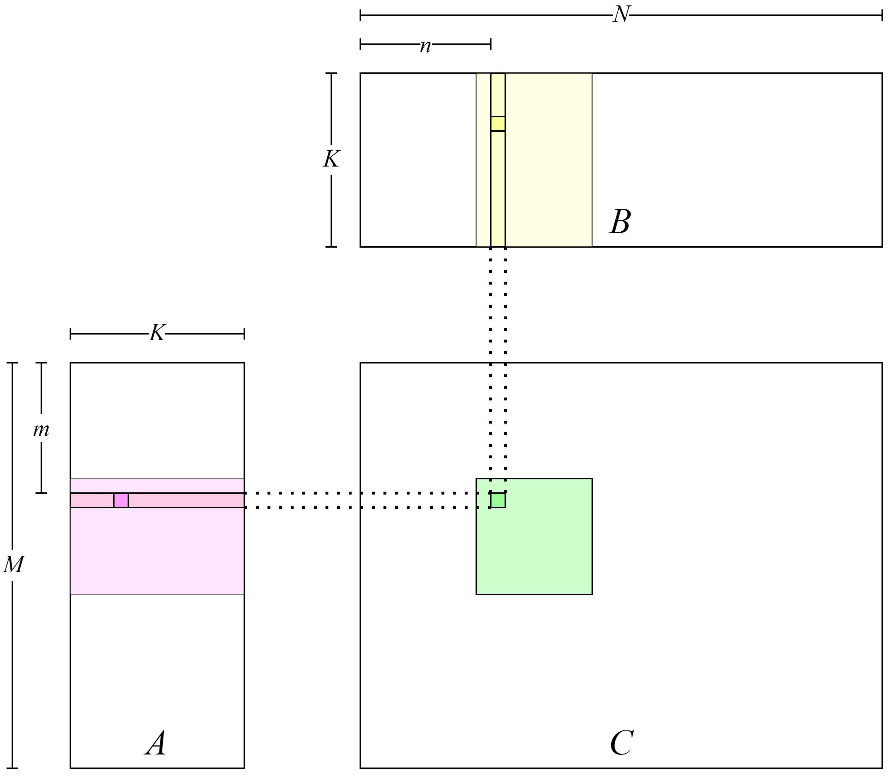
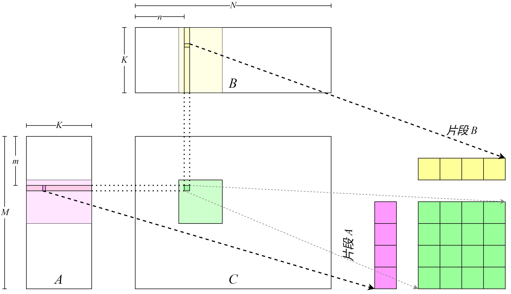
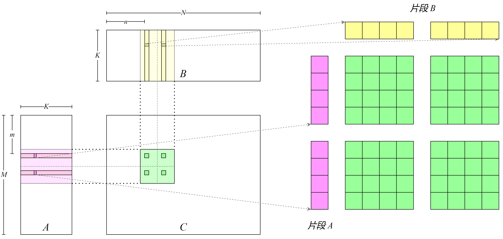
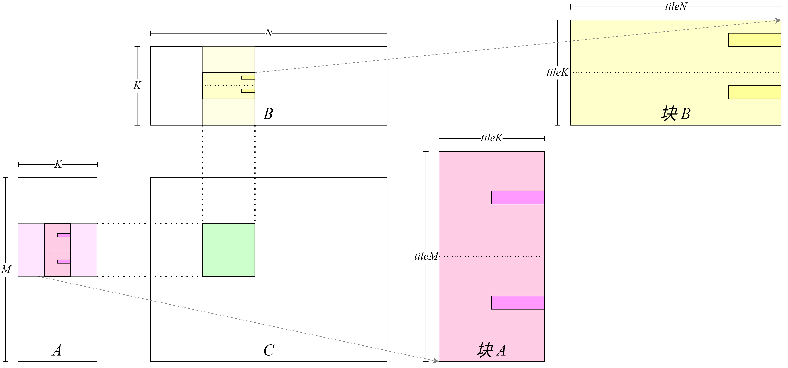
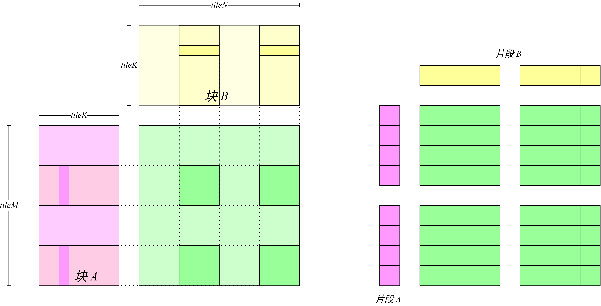
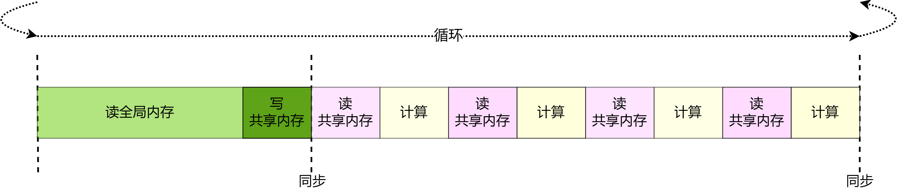
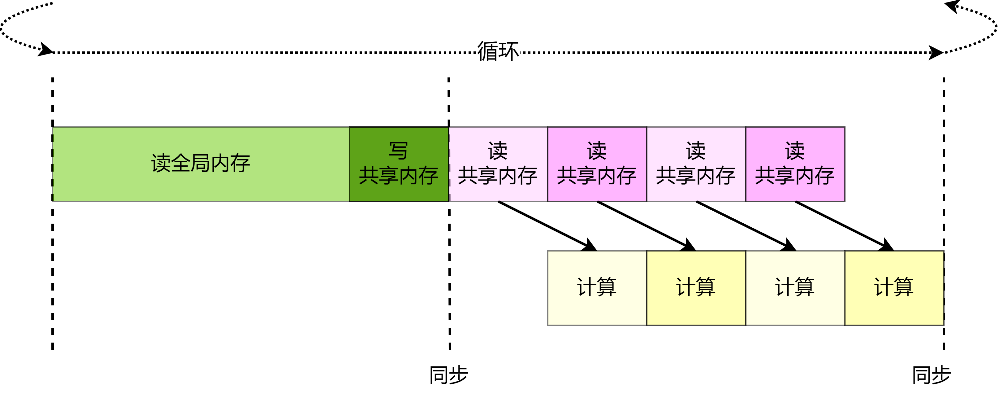
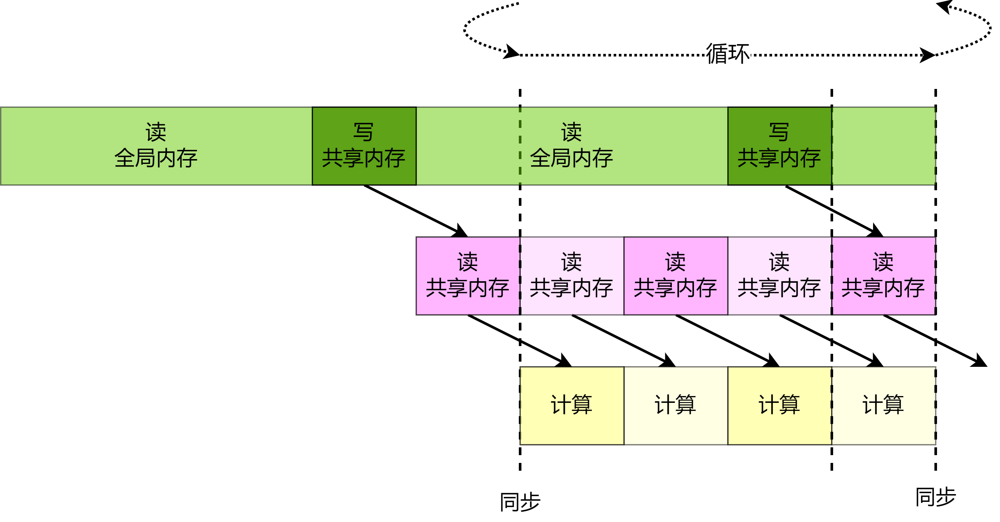

## 加速器实践

在本节中会通过具体的CUDA代码向读者介绍如何编写一个并行计算的广义矩阵乘法程序，通过提高计算强度、使用共享内存、优化内存读取流水线等方法最终取得接近硬件加速器性能峰值的实现。虽然在以上章节介绍了张量计算核心相关的内容，但由于篇幅限制，在本节中不使用此硬件结构。而是通过使用更为基本的CUDA代码实现FP32的广义矩阵乘法，来讲解若干实用优化策略。
### 环境

本节的实践有以下的软件环境依赖：

* Eigen：Eigen是一个线性代数C++模板库，用户可以只使用几条语句完成多线程线性代数运算。
* OpenMP（可选）：OpenMP是用于共享内存并行系统的多处理器程序设计的一套指导性编译处理方案，可以使用OpenMP对Eigen的计算进行加速。
* CUDA Toolkit：CUDA Toolkit是英伟达发布的CUDA工具包，其包含了CUDA编译器（NVCC），CUDA线性代数库（cuBLAS）等组件。
本节的实践都是在CPU Intex Xeon E5-2650 v3，GPU Nvidia Geforce RTX 3080；系统Ubuntu 18.04版本，CUDA Toolkit 11.1进行的。

安装相关依赖如下：

* Eigen：Eigen的安装可以通过使用包管理器安装（如使用指令`apt install libeigen3-dev`），也可以从[官网](https://eigen.tuxfamily.org/index.php?title=Main_Page)下载。
* OpenMP（可选）：通常会被大多数编译器默认支持，如果没有被支持的话可以使用包管理器安装（如使用指令`apt install libomp-dev`）。
* CUDA Toolkit：CUDA Toolkit的安装建议按照[官方的提示](https://developer.nvidia.com/cuda-downloads)安装，也可以通过使用包管理器安装（如使用指令`apt install cuda`）。

### 广义矩阵乘法的朴素实现

:label:`sec-accelerator-naive`

依照算法:label:`algo-accelerator-gemm`，编写CPU代码如下所示：
```c++
float A[M][K];
float B[K][N];
float C[M][N];
float alpha, beta;

for (unsigned m = 0; m < M; ++m) {
    for (unsigned n = 0; n < N; ++n) {
        float c = 0;
        for (unsigned k = 0; k < K; ++k) {
            c += A[m][k] * B[k][n];
        }
        C[m][n] = alpha * c + beta * C[m][n];
    }
}
```

可以看到，矩阵$C$ 中各个元素的计算是独立的。可以利用GPU的大量线程去分别计算矩阵$C$ 中相应的元素，以达到并行计算的目的，GPU核函数将如下所示：

```c++
__global__ void gemmKernel(const float * A,
                           const float * B, float * C,
                           float alpha, float beta, unsigned M, unsigned N,
                           unsigned K) {
  unsigned int m = threadIdx.x + blockDim.x * blockIdx.x;
  unsigned int n = threadIdx.y + blockDim.y * blockIdx.y;
  if (m >= M || n >= N)
      return;
  float c = 0;
  for (unsigned k = 0; k < K; ++k) {
    c += A[m * K + k] * B[k * N + n];
  }
  c = c * alpha;
  float result = c;
  if (beta != 0) {
    result = result + C[m * N + n] * beta;
  }
  C[m * N + n] = result;
}
```

其可视化结构如 :numref:`cuda_naive_gemm`所示，矩阵$C$中每一个元素由一个线程计算，在GPU Kernel的第5和6行计算该线程对应矩阵$C$中的元素行号$m$及列号$n$，然后在第9到11行该线程利用行号与列号读取矩阵$A$和矩阵$B$中相应的行列向量元素并计算向量内积，最后在第17行将结果写回$C$矩阵。


:width:` 800px`
:label:`cuda_naive_gemm`

使用以下代码启动核函数：

```c++
void gemmNaive(const float *A, const float *B, float *C,
               float alpha, float beta, unsigned M,
               unsigned N, unsigned K) {
  dim3 block(16, 16);
  dim3 grid((M - 1) / block.x + 1, (N - 1) / block.y + 1);

  gemmKernel<<<grid, block>>>(A, B, C, alpha, beta, M, N, K);
}
```

在这里令每个线程块处理矩阵$C$中$16\times16$个元素，因此开启$(M - 1) / 16 + 1 \times (N - 1) / 16 + 1$个线程块用于计算整个矩阵$C$。


使用Eigen生成数据并计算得到CPU端的广义矩阵乘法结果，同时实现了GPU端计算结果的误差计算、时间测试的代码，详情见[first_attempt.cu](https://github.com/openmlsys/openmlsys-cuda/blob/main/first_attempt.cu)，编译及执行得到输出结果为：


```
Average Time: 48.961 ms
Max Error: 0.000092
```

可以使用以下公式粗略的计算GPU的峰值吞吐量：2$\times$频率$\times$单精度计算单元数量 ，其中单精度计算单元数量等于GPU中流多处理器（SM）数量乘每个流多处理器中单精度计算单元数量，计算可以得到以下结果：

```
FP32 peak throughput 29767.680 GFLOPS
Average Throughput: 185.313 GFLOPS
```
可以发现目前的代码距离设备峰值性能仍有较大的差距。在整个计算过程中计算密集最大的过程为矩阵乘法$A\times B$，其时间复杂度为$O(M*N*K)$，而整个计算过程时间复杂度为$O(M*N*K+2*M*N)$，因此对矩阵乘法的优化是提升性能的关键。


### 提高计算强度

计算强度（Compute Intensity）指计算指令数量与访存指令数量的比值，在现代GPU中往往有大量计算单元但只有有限的访存带宽，程序很容易出现计算单元等待数据读取的问题，因此提高计算强度是提升程序性能的一条切实有效的指导思路。对于之前实现的GPU核函数，可以粗略计算其计算强度：在$K$次循环的内积计算中，对矩阵$A$与矩阵$B$的每次读取会计算一次浮点乘法与浮点加法，因此计算强度为1——两次浮点运算除以两次数据读取。之前的版本是每个线程负责处理矩阵$C$的一个元素——计算矩阵$A$的一行与矩阵$B$的一列的内积，可以通过使每个线程计算$C$更多的元素——计算矩阵$A$的多行与矩阵$B$的多列的内积——从而提升计算强度。具体地，如果在$K$次循环的内积计算中一次读取矩阵$A$中的$m$个元素和矩阵$B$中的$n$个元素，那么访存指令为$m+n$条，而计算指令为$2mn$条，所以计算强度为$\frac{2mn}{m+n}$，因此可以很容易发现提高$m$和$n$会带来计算强度的提升。

在上一小节中对全局内存的访问与存储都是借助 `float` 指针完成的，具体到硬件指令集上实际是使用指令 `LDG.E` 与 `STG.E` 完成的。可以使用128位宽指令`LDG.E.128` 与 `STG.E.128`  一次读取多个 `float` 数。使用宽指令的好处是一方面简化了指令序列，使用一个宽指令代替四个标准指令可以节省十几个指令的发射周期，这可以为计算指令的发射争取到额外的时间；另一方面128比特正好等于一个cache line的长度，使用宽指令也有助于提高cache line的命中率。但并不提倡在一切代码中过度追求宽指令的使用，开发者应当将更多的时间关注并行性设计和局部数据复用等更直接的优化手段。

具体的实现如下，由于每个 `float` 类型大小为32个比特，可以将4个 `float` 堆叠在一起构成一个128比特的 `float4` 类，对 `float4` 的访存将会是使用宽指令完成。其具体代码实现见[util.cuh](https://github.com/openmlsys/openmlsys-cuda/blob/main/util.cuh)中。

在实现GPU核函数过程中要注意，每个线程需要从原本各读取矩阵$A$和矩阵$B$中一个 `float` 数据变为各读取4个 `float` 数据，这就要求现在每个线程负责处理矩阵$C$中$4\times 4$的矩阵块，称之为 `thread tile` 。如图:numref:`use_float4`所示，每个线程从左到右、从上到下分别读取矩阵$A$和矩阵$B$的数据并运算，最后写入到矩阵$C$中。



:width:` 800px`
:label:`use_float4`


完整代码见[gemm_use_128.cu](https://github.com/openmlsys/openmlsys-cuda/blob/main/gemm_use_128.cu)。我们可以进一步让每个线程处理更多的数据，从而进一步提升计算强度，如图:numref:`use_tile`所示。完整代码见[gemm_use_tile.cu](https://github.com/openmlsys/openmlsys-cuda/blob/main/gemm_use_tile.cu)。


:width:` 800px`
:label:`use_tile`

测试得到以下结果：

```
Max Error: 0.000092
Average Time: 6.232 ms, Average Throughput: 1378.317 GFLOPS
```

使用分析工具Nsight Compute分析取得性能提升的具体原因。Nsight Compute是英伟达发布的主要针对GPU核函数的性能分析工具，它通过劫持驱动的方式对GPU底层数据采样和输出。可以使用以下指令进行性能分析：

```bash
bash
ncu --set full -o <profile_output_file> <profile_process>
```
 `--set full` 代表采样所有数据， `-o` 代表以文件的形式输出结果； `<profile_output_file>` 填输出文件名但注意不要加后缀名， `<profile_process>` 填待分析的可执行文件及其参数。
比如需要分析 `first_attempt` ，将输出结果命名为 `first_attepmt_prof_result` 可以使用以下指令：

```c++
ncu --set full -o first_attepmt_prof_result ./first_attempt
```
如果提示权限不足可以使在指令前加`sudo` 。
在得到输出文件之后，可以使用 `nv-nsight-cu` 查看文件。对改动的GPU核函数与上一版本的GPU核函数进行对比分析，发现：

首先 `LDG` 指令数量下降了84%，且指标 `Stall LG Throttle` 下降33%，说明使用宽指令增加计算密度确实可以通过减少全局内存访问的指令数目而减少发射等待时间。最后指标 `Arithmetic Intensity` 的提升也和之前的关于计算强度的分析相吻合。

我们对`gemm_use_tile.cu`测试得到以下结果：

```
Max Error: 0.000092
Average Time: 3.188 ms, Average Throughput: 2694.440 GFLOPS
```

使用Nsight Compute分析发现：类似地，本次优化在 `Stall LG Throttle` 等指标上取得了进一步的提升。

### 使用共享内存缓存复用数据

:label:`sec-accelerator-use-smem`

虽然令一个线程一次读取更多的数据能取得计算强度的提升进而带来性能的提升，但是这种令单个线程处理数据增多的设计会导致开启总的线程数量减少，进而导致并行度下降，因此需要使用其他硬件特性在尽可能不影响并行度的前提下取得性能提升。在之前的代码中，开启若干个线程块，每个线程块处理矩阵$C$中的一个或多个矩阵块。在 :numref:`duplicated_data` 中，可以观察到，处理矩阵$C$同一行的线程$x, y$会读取矩阵$A$中相同的数据，可以借助共享内存让同一个线程块中不同的线程读取不重复的数据而提升程序吞吐量。


:width:` 800px`
:label:`duplicated_data`

具体地，需要对代码进行如下改造：首先此前代码在计算内积过程是进行$K$次循环读取数据并累加计算，在此设定下每次循环中处理矩阵$C$中相同行的线程会读取相同的矩阵$A$的数据，处理矩阵$C$中相同列的线程会读取相同的矩阵$B$的数据。可以通过将此$K$次循环拆解成两层循环，外层循环$\frac{K}{tileK}$次，每次外层循环的迭代读取一整块数据，内层循环$tileK$次进行累加数据。数据从全局内存向共享内存的搬运过程如图 :numref:`use_smem_store` 所示，每次内层循环开始前将矩阵$A$和矩阵$B$中一整个 `tile` 读取到共享内存中；数据从共享内存到寄存器的搬运如图 :numref:`use_smem_load` 所示，每次内层循环循环从共享内存读取数据并计算。这种设计带来的好处是，可以让每个线程不必独自从全局内存读取所有需要的数据，整个线程块将共同需要的数据从全局内存中读取并写入到共享内存中，此后每个线程在计算过程中只需要从共享内存中读取所需要的数据即可。



:width:` 800px`
:label:`use_smem_store`


:width:` 800px`
:label:`use_smem_load`

完整代码见[gemm_use_smem.cu](https://github.com/openmlsys/openmlsys-cuda/blob/main/gemm_use_smem.cu)。

测试得到以下结果：

```
Max Error: 0.000092
Average Time: 0.617 ms, Average Throughput: 13925.168 GFLOPS
```

通过使用Nsight Compute对核函数分析并与上一个核函数进行对比，可以观察到一些主要的变化：首先 `LDG` 指令数量下降了97%，与此前设计相吻合。同时观察到 `SM Utilization` 提升了218%也可以侧面证实使用共享内存减少了内存访问延迟从而提升了利用率，此外还可以观察到各项指标如 `Pipe Fma Cycles Active` 等都有显著提升，这都能充分解释了使用共享内存的改进是合理且有效的。

### 减少寄存器使用
可以注意到在向共享内存中存储矩阵$A$的数据块是按照行优先的数据排布进行的，而对此共享内存的读取是逐行读取的。可以将矩阵$A$的数据块在共享内存中数据按照列优先的形式排布，这样可以减少循环及循环变量从而带来寄存器使用数量减少进而带来性能提升。

完整代码见[gemm_transpose_smem.cu](https://github.com/openmlsys/openmlsys-cuda/blob/main/gemm_transpose_smem.cu)。

测试得到以下结果：

```
Max Error: 0.000092
Average Time: 0.610 ms, Average Throughput: 14083.116 GFLOPS
```
使用Nsight Compute分析有以下观察发现主要的变化：`Occupancy` 提升1.3%，而带来此提升的原因是寄存器使用111个，相比上一个GPU核函数使用128个寄存器减少了17个，从而带来了性能提升。但这个变化会因为GPU架构不同导致有不同的变化，同时可以观察到 `STS` 指令数量提升且带来一些 bank confilct ，因此在其他GPU架构上此改动可能不会带来正面影响。

### 隐藏共享内存读取延迟

在GPU中使用指令 `LDS` 读取共享内存中的数据，在这条指令发出后并不会等待数据读取到寄存器后再执行下一条语句，只有执行到依赖 `LDS` 指令读取的数据的指令时才会等待读取的完成。而在上一小节中，在内层$tileK$次循环中，每次发射完读取共享内存的指令之后就会立即执行依赖于读取数据的数学运算，这样就会导致计算单元等待数据从共享内存的读取，如 :numref:`use_smem_pipeline` 所示。事实上，对共享内存的访问周期能多达几十个时钟周期，而计算指令的执行往往只有几个时钟周期，因此通过一定方式隐藏对共享内存的访问会取得不小的收益。可以通过重新优化流水线隐藏一定的数据读取延迟。如图 :numref:`hide_smem_latency` 所示，可以在内层的$tileK$次循环中每次循环开始时读取发射下一次内层循环数据的读取指令。由于在执行本次运算时计算指令并不依赖于下一次循环的数据，因此计算过程不会等待之前发出的读取下一次内层循环数据的指令。


:width:` 800px`
:label:`use_smem_pipeline`


:width:` 800px`
:label:`hide_smem_latency`

完整代码见[gemm_hide_smem_latency.cu](https://github.com/openmlsys/openmlsys-cuda/blob/main/gemm_hide_smem_latency.cu)。

测试得到以下结果：

```
Max Error: 0.000092
Average Time: 0.585 ms, Average Throughput: 14686.179 GFLOPS
```

使用Nsight Compute观察发现：相比上一个GPU核函数，指标 `Stall Short Scoreboard` 减少了67%。而此前提过GPU内存读写指令发出后并不会等待数据读取到寄存器后再执行下一条语句，但是会在Scoreboard设置符号并在完成读取后置回符号，等到之后有数据依赖的指令执行前会等待Scoreboard中符号的置回。所以这里 `Stall Short Scoreboard` 的减少充分说明了内存延迟是有效的。

### 隐藏全局内存读取延迟

上一小节中介绍了对共享内存读取流水线优化的方法，事实上，GPU再读取全局内存中使用的指令 `LDG` 也有与共享内存读取指令 `LDS` 类似的行为特性。因此类似的在$\frac{K}{tileK}$次外层循环中每次循环开始时发出下一次外层循环需要的矩阵$A$中的数据块的读取指令，而本次外循环的整个内层循环过程中不依赖下一次外循环的数据，因此本次外循环的内循环过程中不会等待对下一次外层循环需要的矩阵$A$中的数据块的读取指令完成，从而实现隐藏全局内存读取延迟的目的。具体流水线可视化见 :numref:`hide_global_latency` 。

上一小节中介绍了对共享内存读取流水线优化的方法，事实上，GPU在读取全局内存中使用的指令 `LDG` 也有与共享内存读取指令 `LDS` 类似的行为特性。因此类似的在$\frac{K}{tileK}$次外层循环中每次循环开始时发出下一次外层循环需要的矩阵$A$中的数据块的读取指令，而本次外循环的整个内层循环过程中不依赖下一次外循环的数据，因此本次外循环的内循环过程中不会等待对下一次外层循环需要的矩阵$A$中的数据块的读取指令完成，从而实现隐藏全局内存读取延迟的目的。此外，可以让内层循环先执行$tileK - 1$次，在最后一次执行前将 `buffer` 中的数据写入 `tile` ，其后再执行内层循环的最后一次迭代，这样能更进一步隐藏向 `tile` 写入的内存延迟。具体流水线可视化见图 :numref:`hide_global_latency` 。


:width:` 800px`
:label:`hide_global_latency`

完整代码见[gemm_final.cu](https://github.com/openmlsys/openmlsys-cuda/blob/main/gemm_final.cu)。

测试得到以下结果：

```
Max Error: 0.000092
Average Time: 0.542 ms, Average Throughput: 15838.302 GFLOPS
```

使用Nsight Compute分析可以观察到指标 `Stall Long Scoreboard` 减少了67%，与上一小结的 `Stall Short Scoreboard` 概念相对应，`Stall Long Scoreboard` 主要是针对全局内存的指标。该指标的显著减少充分说明预取数据可以在一定程度上隐藏全局内存的读取。

### 与cuBLAS对比

按照节 :numref:`sec-accelerator-use-cublas` 中介绍的cuBLAS的接口使用方法，可以很容易地写出代码使用cuBLAS完成矩阵乘法，如代码 :numref:`practise-cublas` 所示。


```c++
void cublasGemm(const float *A, const float *B, float *C, float alf, float bet, int M, int N, int K) {
  int lda = N, ldb = K, ldc = N;
  const float *alpha = &alf;
  const float *beta = &bet;
  cublasHandle_t handle;
  cublasCreate(&handle);
  cublasSgemm(handle, CUBLAS_OP_N, CUBLAS_OP_N, N, M, K, alpha, B, lda, A, ldb, beta, C, ldc);
  cublasDestroy(handle);
}
```
:label:`practise-cublas`

需要注意的是cuBLAS默认矩阵在GPU中是按列优先存储的，而我们的矩阵是按行优先存储的，而两者可以通过转置相互转换，所以$A\times B = (B^T\times A^T)^T$，因此在输入时需要调整矩阵的顺序，即可保证输出结果仍是行优先矩阵。

测试得到以下结果：

```
Max Error: 0.000092
Average Time: 0.613 ms, Throughput: 14002.600 GFLOPS
```

使用Nsight Compute分析发现 `LDG` 和 `STS` 等指令使用较多，导致指令发射压力较大，具体体现在 `Stall Wait` 与 `Stall Dispatch Stall` 指标相比较差。但其他指标诸如 `Stall Long Scoreboard` 等cuBLAS更优，但总体上我们略胜一筹。
尽管我们的代码相比cuBLAS已经取得了一定的性能提升，但是需要强调的是cuBLAS内部为各种不同的矩阵尺寸以及不同的设备实现了若干不同的GPU核函数，我们实现的核函数在其他尺寸或其他设备设备上性能可能无法取得此加速比。


### 小结

要实现一个高性能算子需要依照硬件特性适应性进行若干优化。本节优化策略可总结为以下几点：

  - 并行资源映射——提高并行性：将多层级的并行资源（`block` 、`warp` 、`thread` ）与对应需要计算和搬移的数据建立映射关系，提高程序并行性。将可并行的计算和数据搬移操作映射到并行资源上，对于广义矩阵乘法实例，在节~\ref{sec-accelerator-naive`朴素实现的例子中，令每个`block` 与矩阵$C$中的一个矩阵块建立映射关系，每个`thread` 与矩阵块中的一个元素建立映射关系。
  
  - 优化内存结构——减小访存延迟：观察计算过程中同一个`block` 中数据复用的情况，将复用的数据被如共享内存、寄存器等高性能体系结构存储下来，以此提高吞吐量。如在节 :numref`sec-accelerator-naive` 中将矩阵$A$与矩阵$B$中会被同一个 `block` 内不同 `thread` 共同访问的数据缓存到共享内存中。
  
  - 优化指令执行——减小指令发射开销：使用 `#pragma unroll` 功能进行循环展开来提升指令级并行，减少逻辑判断；使用向量化加载指令以提高带宽等，对于Ampere架构，最大向量化加载指令为 `LDG.E.128` ，可以采用 `float4` 类型的数据进行读取。
  
  - 优化访存流水线——隐藏访存延迟：在进行内存结构变化（矩阵数据搬移）时，可以优化访存流水线，在数据搬移的间隔执行计算操作以隐藏数据搬移的延迟。
