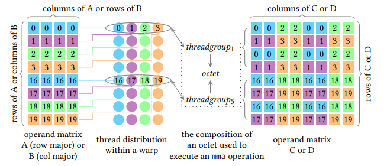
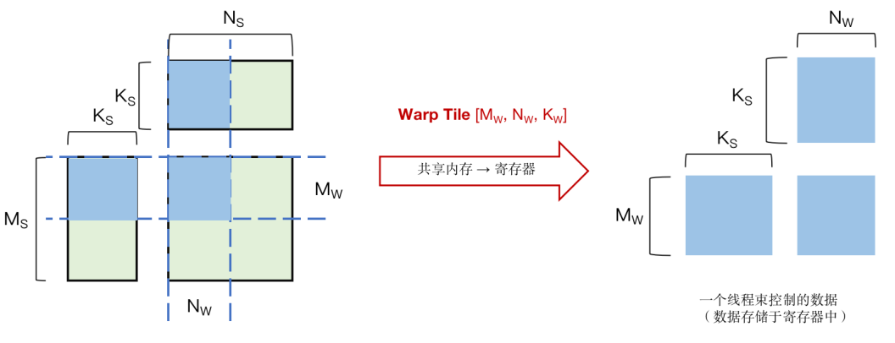

加速器基本编程原理
------------------
:label:`accelerator-program-title`

本章前两节主要介绍了这些硬件加速器设计的意义、思路以及基本组成原理。软硬件协同优化作为构建高效AI系统的一个重要指导思想，需要软件算法/软件栈和硬件架构在神经网络应用中互相影响、紧密耦合。为了最大限度地发挥加速器的优势，要求能够基于硬件系统架构设计出一套较为匹配的指令或编程（操纵）方法。因此，本节将以 :numref:`compute-unit-title`中介绍的Tensor Core为例，着重介绍加速器的可编程性，以及如何通过编程使能加速器，提升神经网络算子的计算效率。

### 硬件加速器的可编程性
:label:`accelerator-programable-title`

 :numref:`accelerator-design-title`节中列出的硬件加速器均具有一定的可编程性，程序员可以通过软件编程，有效的使能上述加速器进行计算加速。但出于计算效率和易用性等方面考虑，将编程使能方式分为不同等级，一般包括：算子库层级，编程原语层级，以及指令层级。为了更具象的解释上述层级的区别，仍以Volta架构的Tensor Core加速器为例，由高层至底层对比介绍这三种不同编程方式：

-   **算子库层级**：如cuBLAS基本矩阵与向量运算库，cuDNN深度学习加速库，均通过Host端调用算子库提供的核函数使能TensorCore；

-   **编程原语层级**：如基于CUDA的WMMA API编程接口。同算子库相比，需要用户显式调用计算各流程，如矩阵存取至TensorCore、TensorCore执行矩阵乘累加运算、TensorCore累加矩阵数据初始化操作等；

-   **指令层级**：如PTX ISA MMA指令集，提供更细粒度的mma指令，便于用户组成更多种形状的接口，通过CUDA Device端内联编程使能TensorCore。

矩阵乘法运算作为深度学习网络中占比最大的计算，对其进行优化是十分必要的。因此本节将统一以矩阵乘法$D[M, N] = C[M, N] + A[M, K] * B[K, N]$为实例，对比介绍如何通过不同编程方式使能加速器。

```
$A, B$矩阵 $D$矩阵  $C[i][j] \gets 0$ 
$C[i][j] \gets C[i][j] + A[i, k] \times B[k, j]$ 
$D[i][j] \gets C[i][j]$ 
```

### 硬件加速器的多样化编程方法
:label:`diversified-programming-title`

#### 算子库使能加速器

在上述三种层级的编程方式中，直接调用算子加速库使能加速器无疑是最快捷高效的方式。NVIDIA提供了cuBLAS/cuDNN两类算子计算库，cuBLAS提供了使能Tensor Core单元的接口，用以加速矩阵乘法(GEMM)运算，cuDNN提供了对应接口加速卷积(CONV)运算等。

以 :numref:`accelerator-programable-title`小节的GEMM运算为例，与常规CUDA调用cuBLAS算子库相似，通过cuBLAS加速库使能Tensor Core步骤包括：

1.  创建cuBLAS对象句柄且设置对应数学计算模式

```cpp
cublasHandle_t handle;
cublasStatus_t cublasStat = cublasCreate(&handle);
cublasStat = cublasSetMathMode(handle, CUBLAS_TENSOR_OP_MATH);
```

2.  分配和初始化矩阵内存空间及内容元素

```cpp
size_t matrixSizeA = (size_t)M * K;
cublasStat = cudaMalloc(&devPtrA[0], matrixSizeA * sizeof(devPtrA[0][0]));
cublasStat = cublasSetMatrix(M, K, sizeof(A[0]), A, M, devPtrA[i], M);
```

3.  调用对应计算函数接口

```cpp
cublasStat = cublasGemmEx(handle, transa, transb, m, n, k, alpha,
                          A, CUDA_R_16F, lda,
                          B, CUDA_R_16F, ldb,
                          beta, C, CUDA_R_16F, ldc, CUDA_R_32F, algo);
```

4.  传回结果数据

```cpp
cublasStat = cublasGetMatrix(M, N, sizeof(D[0]), devPtrD[i], M, D, M);
```

5.  释放内存和对象句柄

```cpp
cudaFree(devPtrA);
cudaDestroy(handle);
```

当然，由于加速器一般会有矩阵形状、数据类型、排布方式等限制，因此在调用句柄和函数接口时要多加注意。如本例中，cuBLAS计算模式必须设置为$CUBLAS\_TENSOR\_OP\_MATH$，步长必须设置为8的倍数，输入数据类型必须为$CUDA\_R\_16F$等。按照如上方式即可通过cuBLAS算子库对 :numref:`accelerator-programable-title`实例使能Tensor Core加速器，通过NVIDIA官方数据可知，该方式对于不同矩阵乘法计算规模，平均有4～10倍的提升，且矩阵规模越大，加速器提升效果越明显。

该方式由于能够隐藏体系结构细节，易用性较好，且一般官方提供的算子库吞吐量较高。但与此同时，这种算子颗粒度的库也存在一些问题，如不足以应对复杂多变的网络模型导致的算子长尾问题（虽然常规形式算子占据绝大多数样本，但仍有源源不断的新增算子，因其出现机会较少，算子库未对其进行有效优化。），以及错失了较多神经网络框架优化（如算子融合）的机会。

#### 编程原语使能加速器

第二种加速器编程方式为编程原语使能加速器，如通过在Device端调用CUDA WMMA (Warp Matrix Multiply Accumulate) API接口。以线程束（即Warp，是调度的基本单位）为操纵对象，使能多个Tensor Core单元。该方式在CUDA 9.0中被公开，程序员可通过添加API头文件的引用和命名空间定义来使用上述API接口。基于软硬件协同设计的基本思想，该层级编程API的设计多与架构绑定，如WMMA操纵的总是$16\times16$大小的矩阵块，并且操作一次跨两个TensorCore进行处理，本质是与TensorCore如何集成进SM中强相关的。针对Float16输入数据类型，NVIDIA官方提供了三种不同矩阵规模的WMMA乘累加计算接口，分别为$16\times16\times16$，$32\times8\times16$，$8\times32\times16$。

该API接口操纵的基本单位为Fragment，是一种指明了矩阵含义（乘法器/累加器）、矩阵形状（$WMMA\_M, WMMA\_N, WMMA\_K$）、数据类型（Half/ Float）、排布方式（$row\_major/ col\_major$）等信息的模板类型，包括如下：

```cpp
wmma::fragment<wmma::matrix_a, WMMA_M, WMMA_N, WMMA_K, half, wmma::row_major> a_frag;
wmma::fragment<wmma::matrix_b, WMMA_M, WMMA_N, WMMA_K, half, wmma::col_major> b_frag;
wmma::fragment<wmma::accumulator, WMMA_M, WMMA_N, WMMA_K, float> acc_frag;
wmma::fragment<wmma::accumulator, WMMA_M, WMMA_N, WMMA_K, float> c_frag;
```

使用时，我们需要将待执行乘法操作矩阵块的数据，作为Fragment，由寄存器加载至TensorCore，在将累加Fragment初始化/清零操作后，通过TensorCore单元执行乘累加运算，最后将运算结果的Fragment存回寄存器或其他内存区域。与上述操作对应的，NVIDIA提供了$wmma.load\_matrix\_sync(), wmma.store\_matrix\_sync()$接口用于将参与计算的子矩阵块写入/载出Fragment片段；$wmma.fill\_fragment()$接口用于初始化对应Fragment的数据；$wmma.mma\_sync()$接口用于对Fragment进行乘累加运算。

#### 指令集编程使能加速器

在NVIDIA PTX ISA (Instruction Set Architecture)中提供了另一个编程接口，如Volta架构中的$mma.sync.m8n8k4$指令，它使用$M=8, N=8, K=4$的形状配置执行乘累加操作。具体地，它由线程组（黑色椭圆表示）或octet执行，如 :numref:`PTX`显示了线程和数据的映射关系。每个线程组由四个连续的线程组成，使用不同颜色的圆圈表示。图中还指出了一个octet里面的线程在线程束内的分布，Float16乘法器A或B的四个连续元素（使用具有相同颜色的块表示），以及Float32累加器C或D的八个分散元素（同样使用相同颜色的块表示）。彩色块上的数字代表对应的线程ID。


:width:`800px`
:label:`PTX`

作为一个更细粒度的指令，mma可以组成更加多样化形状的Warp范围的WMMA API接口，可以控制线程束内线程与数据的映射关系，并允许AI编译器自动/手动显式地管理内存层次结构之间的矩阵分解，因此相比于直接应用NVCUDA::WMMA API具有更好的灵活性。

#### 算子编译器编程使能加速器

除了上述三种层级的编程方式，算子编译器也逐渐成为DSA加速器的关注热点。随着深度学习模型的迭代更新以及各类DSA加速器的层出不穷，手写算子或高性能算子库（如cuDNN/cuBLAS）等基于人工优化算子的方式给算子开发团队带来沉重的负担。因此，开发一种能够将High-level的算子表示编译成目标硬件可执行代码的算子编译器，成为了学术界、业界的共识。

近年来涌现出许多算子编译器/编译框架，如TVM，为不同的硬件后端提供了编译优化支持。在昇腾芯片上，基于TVM开发了TBE(Tensor Boost Engine)，不仅提供了一个优化过的神经网络标准算子库，同时还提供了算子开发能力及融合能力。通过TBE提供的API和自定义算子编程开发界面可以完成相应神经网络算子的开发，帮助用户较容易的去使能硬件加速器上的AI\_CORE相关指令，以实现高性能的神经网络计算。此外，为了更好的支持复杂算子融合场景，还提供了基于polyhedral多面体编译技术的AKG(Auto kernel generator)，提供算子的自动生成能力。

基于算子编译器使能加速器实现矩阵乘的流程则对用户更加友好，用户只需基于python定义矩阵乘的tensor信息（数据类型及形状等），调用对应TBE接口即可。如下所示：

```python
a_shape = (1024, 256)
b_shape = (256, 512)
bias_shape = (512, )
in_dtype = "float16"
dst_dtype = "float32"
tensor_a = tvm.placeholder(a_shape, name='tensor_a', dtype=in_dtype)
tensor_b = tvm.placeholder(b_shape, name='tensor_b', dtype=in_dtype)
tensor_bias = tvm.placeholder(bias_shape, name='tensor_bias', dtype=dst_dtype)
res = te.lang.cce.matmul(tensor_a, tensor_b, False, False, False, dst_dtype=dst_dtype, tensor_bias=tensor_bias)
```

### 硬件加速器高性能编程实例

本节 :numref:`accelerator-program-title`前几个小节主要介绍了硬件加速器的不同层级的多样化编程方法。调用计算库的方式留给程序员的优化空间较少，合理利用硬件加速器不同层级的编程，可以实现更好的性能优化。 为了更好的让读者理解硬件加速器的使用，本节会继续 :numref:`accelerator-programable-title`节中的GEMM运算，仍以WMMA API使能Tensor Core加速单元为例，介绍如何通过矩阵分块、资源映射等方式更高效的利用硬件加速器。

[\[alg:TensorCore\]]{#alg:TensorCore label="alg:TensorCore"}

```
$A, B$矩阵 $D$矩阵   Mapping to Block.Idx  Mapping to Block.Idy  Mapping
to Block.Idz
$A_{Shared}[i_o][k_o] \gets A[i_o][k_o]$ $B_{Shared}[k_o][j_o] \gets B[k_o][j_o]$ $Syncthreads()$ 
 Mapping to Warp.Idx  Mapping to Warp.Idy
$A_{Register}[i_i][k_i] \gets A_{Shared}[i_i][k_i]$ $B_{Register}[k_i][j_i] \gets B_{Shared}[k_i][j_i]$ $pragma\ unroll$ 
$wmma.load\_matrix\_sync(A_{Fragment}, A_{Register})$ $wmma.load\_matrix\_sync(B_{Fragment}, B_{Register})$ 
$wmma.fill\_fragment(C_{Fragment}, 0)$ 
$wmma.mma\_sync(D_{Fragment}, C_{Fragment}, A_{Fragment}, B_{Fragment})$ 
$Syncthreads()$  $wmma.store\_matrix\_sync(D, D_{Fragment})$ 
```

若要得到高性能CUDA程序，提高并行性、增大吞吐量、优化指令执行是至关重要的三个优化目标。针对该实例，具体地实现和优化方案列出如下，对应到具体实例伪代码如算法2所示：

1.  **优化内存结构------增大吞吐量**：将原始大规模矩阵根据不同阈值切分成不同层级的子矩阵块，使得子矩阵块能被如共享内存、寄存器等高性能体系结构存储下来，以此提高吞吐量。设置切分参数为$BlockTile[Ms, Ns, Ks]$和$WarpTile[Mw, Nw, Kw]$，对应的将BlockTile下的矩阵由全局内存搬移至共享内存，以提高全局内存合并访问和数据局部性，如 :numref:`GEMM-BlockTile`所示；再将内层WarpTile下的矩阵由共享内存搬移至寄存器中，如 :numref:`GEMM-WarpTile`所示，以备Tensor Core加速器数据存取。


:width:`800px`
:label:`GEMM-BlockTile`


:width:`800px`
:label:`GEMM-WarpTile`

2.  **并行资源映射------提高并行性**：将多层级的并行资源（Block、Warp、Thread）与对应需要计算/搬移的数据建立映射关系，提高程序并行性。将可并行的计算/数据搬移操作映射到并行资源上，对于GEMM实例，M/N轴即为可并行轴，将数据搬移操作中的循环指令映射分配到Block层级（即算法3中的2-4行$For$循环），将内层循环指令映射分配到Warp层级（即算法3中的8-10行$For$循环）。（前文介绍，线程束Warp作为调度的基本单位，且是WMMA API操纵的基本层级，因此对Warp层级进行数据映射比Thread层级映射更为合适）

3.  **Warp统一的Tensor Core数据交互------增大吞吐量**：根据 :numref:`diversified-programming-title`节中介绍的编程方法，除调用算子库外，均需要使用或将指令封装成WMMA接口形式统一进行Warp层级的数据存取和计算。如 :numref:`GEMM-TensorCore`所示，Tensor Core加速器需要从局部内存/寄存器中读取数据，存于虚拟Fragment数据结构中，对应使用$wmma.load\_matrix\_sync()$接口，将累加Fragment $C$ 通过$wmma.fill\_fragment()$接口进行初始化后，使用$wmma.mma\_sync()$使能加速器进行乘累加运算，后将结果Fragment $D$通过调用$wmma.store\_matrix\_sync()$接口拷贝至目标内存地址。


:width:`800px`
:label:`GEMM-TensorCore`

4.  **优化数据访存------提高并行性**：在进行内存结构变化（矩阵数据搬移）时，需要注意全局内存的合并访问、共享内存的存储体冲突等常见性能瓶颈点。

5.  **资源负载均衡------增大吞吐量**：调整平衡每个线程处理的数据量、共享内存使用量、寄存器使用量，以获得更高的SM占用率。一般在实际程序中BlockTile和WarpTile的选取至关重要。

6.  **优化指令执行**：使用\#unroll功能进行循环展开以避免分支冲突，如算法3中13行；使用向量化加载指令减少PTX指令执行次数以提高带宽等，对于GPU Volta架构，最大向量化加载指令为ldg128，即128比特带宽，对于算法3中5-6行数据由全局内存加载至共享内存时，即可采用Float4\*类型指针进行内存读取。

