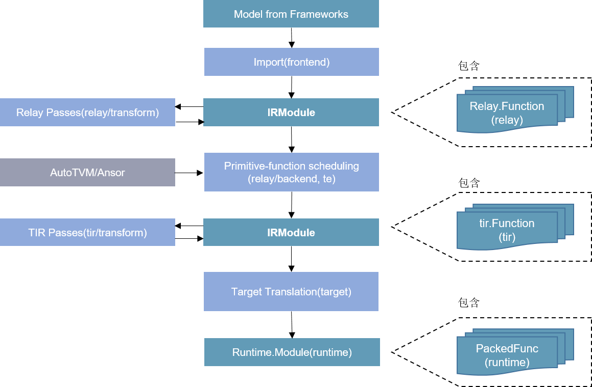
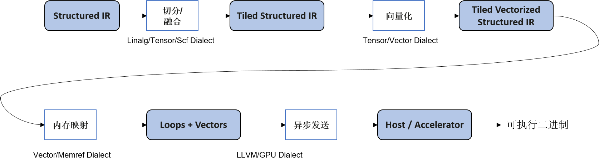
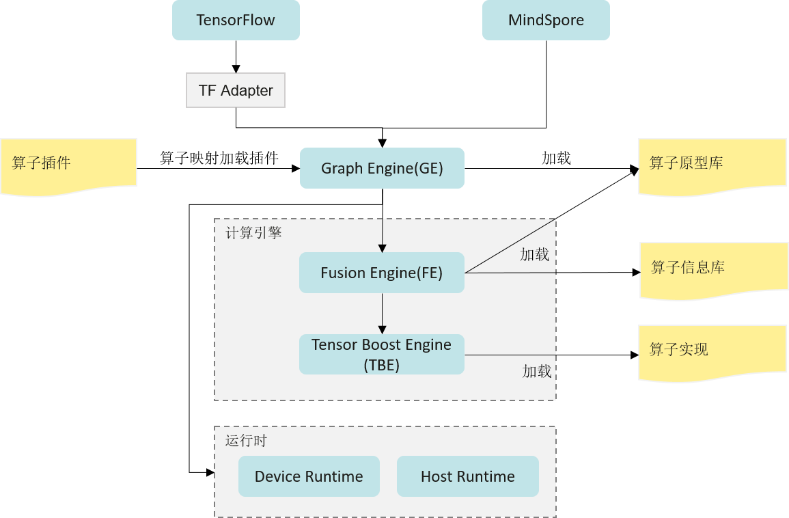
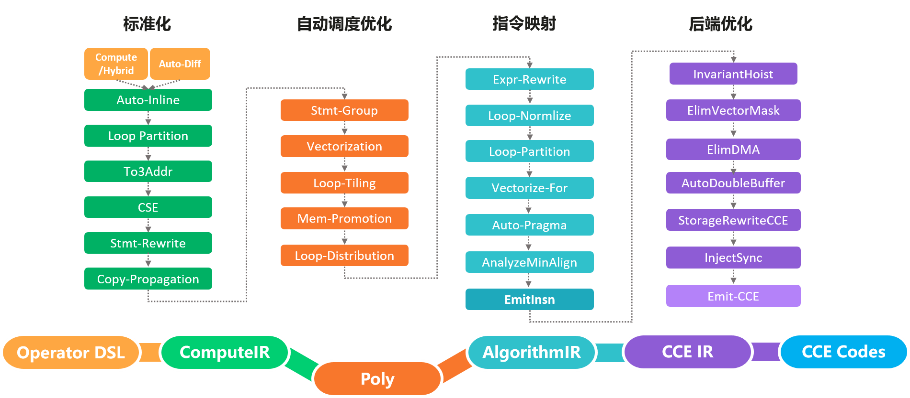

## 加速器基本编程原理
:label:`accelerator-program-title`

本章前两节主要介绍了这些硬件加速器设计的意义、思路以及基本组成原理。软硬件协同优化作为构建高效AI系统的一个重要指导思想，需要软件算法/软件栈和硬件架构在神经网络应用中互相影响、紧密耦合。为了最大限度地发挥加速器的优势，要求能够基于硬件系统架构设计出一套较为匹配的指令或编程方法。因此，本节将着重介绍加速器的可编程性，以及如何通过编程使能加速器，提升神经网络算子的计算效率。

### 硬件加速器的可编程性
:label:`accelerator-programable-title`

 :numref:`accelerator-design-title`中列出的硬件加速器均具有一定的可编程性，程序员可以通过软件编程，有效的使能上述加速器进行计算加速。现有硬件加速器常见的两类编程方式主要有编程接口调用以及算子编译器优化。

#### 编程接口使能加速器

硬件加速器出于计算效率和易用性等方面考虑，将编程使能方式分为不同等级，一般包括：算子库层级，编程原语层级，以及指令层级。为了更具象的解释上述层级的区别，仍以Volta架构的张量计算核心为例，由高层至底层对比介绍这三种不同编程方式：

-   **算子库层级**：如cuBLAS基本矩阵与向量运算库，cuDNN深度学习加速库，均通过Host端调用算子库提供的核函数使能张量计算核心；

-   **编程原语层级**：如基于CUDA的WMMA API编程接口。同算子库相比，需要用户显式调用计算各流程，如矩阵存取至寄存器、张量计算核心执行矩阵乘累加运算、张量计算核心累加矩阵数据初始化操作等；

-   **指令层级**：如PTX ISA MMA指令集，提供更细粒度的mma指令，便于用户组成更多种形状的接口，通过CUDA Device端内联编程使能张量计算核心。

#### 算子编译器使能加速器

DSA架构的多维度AI加速器通常提供了更多的指令选择（三维向量计算指令、二维向量计算指令、一维向量计算指令），以及更加复杂的数据流处理，通过提供接口调用的方式对程序开发人员带来较大的挑战。此外，由于调度、切分的复杂度增加，直接提供算子库的方式由于缺少根据目标形状（Shape）调优的能力，往往无法在所有形状下均得到最优的性能。因此，对于DSA加速器，业界通常采用算子编译器的解决方案。

 随着深度学习模型的迭代更新及各类AI芯片的层出不穷，基于人工优化算子的方式给算子开发团队带来沉重的负担。因此，开发一种能够将High-level的算子表示编译成目标硬件可执行代码的算子编译器，逐渐成为学术界及工业界的共识。算子编译器前端通常提供了特定领域描述语言（DSL），用于定义算子的计算范式；类似于传统编译器，算子编译器也会将算子计算表示转换为中间表示，如HalideIR :cite:`ragan2013halide`、TVM :cite:`chen2018tvm`的TIR、Schedule Tree :cite:`verdoolaege2010isl`等，基于模板（手动）、搜索算法或优化求解算法（自动）等方式完成循环变换、循环切分等调度相关优化，以及硬件指令映射、内存分配、指令流水等后端pass优化，最后通过代码生成模块将IR转换为DSA加速器可执行的设备端核函数。

 当前业界的算子编译器/编译框架主要有TVM/Ansor :cite:`zheng2020ansor`、MLIR :cite:`lattner2020mlir`、以及华为昇腾芯片上的TBE/AKG :cite:`zhao2021akg`等。

 -   **TVM/Ansor**
 
TVM是陈天奇博士等人开发的开源深度学习编译框架，提供了端到端的编译优化（图优化/算子优化）能力，在工业界应用较广。在架构上，主要包括Relay和TIR两层。通过Relay导入推理模型，进行算子融合等图层优化，通过TIR生成融合算子。在算子编译方面，TVM采用了计算和调度分离的技术，为不同的算子提供了不同的模板，同时支持自定义模板，优化特定算子类型调度。为了更进一步优化算子性能，TVM支持对算子进行自动调优，来生成较优的切分参数。此外，为了简化用户开发模板的工作，TVM在0.8版本后提供了自动调度能力Ansor，通过搜索的方式，为目标算子生成调度及切分参数。如 :numref:`tvm`所示：


:width:`800px`
:label:`tvm`


 -   **MLIR**

前面的章节介绍过，Google开发的MLIR并不是一个单一的算子编译器，而是一套编译器基础设施，提供了工具链的组合与复用能力。基于MLIR，DSA加速器厂商可以快速的搭建其定制化算子编译器。如Google论文 :cite:`vasilache2022composable`中所述，当前的算子编译器大多提供了一整套自顶向下的编译优化pass，包括调度优化、切分优化、窥孔优化、后端优化、指令生成等，彼此之间大多无法复用，导致新的场景中通常又得从头开发。而在MLIR中，将功能相近的IR优化pass封装为方言（Dialect），并且提供了多个代码生成相关的基础方言，如vector、memref、tensor、scf、affine、linalg等。硬件厂商可以基于这些方言，快速构建一整套lower优化及codegen流程。如 :numref:`MLIR_Lowing`所示，利用scf、affine、linalg等方言，对结构化的计算IR完成循环并行优化、切分、向量化等，最后基于LLVM完成指令映射。


:width:`800px`
:label:`MLIR_Lowing`


 -   **华为TBE/AKG**

张量加速引擎（Tensor Boost Engine，TBE）是华为的Ascend芯片及其CANN软件栈基于TVM 开发的一套算子编译优化工具，用于对Ascend芯片进行调度优化、指令映射、及后端pass优化等。如 :numref:`tbe`所示。不仅提供了一个优化过的神经网络标准算子库，同时还提供了算子开发能力及融合能力。通过TBE提供的API和自定义算子编程开发界面可以完成相应神经网络算子的开发，帮助用户较容易的去使能硬件加速器上的AI Core指令，以实现高性能的神经网络计算。为了简化算子开发流程，TBE还实现了一个Auto
Schedule工具，开放了自定义算子编程DSL，用于自动完成复杂算子的调度生成。此外，TBE还实现了端到端的动态形状算子编译能力。
 

:width:`800px`
:label:`tbe`

AKG则是MindSpore社区的开源算子编译工具。与上述介绍的算子编译器不同，AKG基于Polyhedral多面体编译技术 :cite:`bastoul2004code`，支持在CPU、GPU和Ascend多种硬件上自动生成满足并行性与数据局部性的调度。Polyhedral编译技术的核心思想是将程序中循环的迭代空间映射为高维空间多面体，通过分析语句读写依赖关系，将循环调度优化问题转换为整数规划求解问题。 AKG的编译流程如 :numref:`akg`所示，主要包含规范化、自动调度优化、指令映射、后端优化几个模块。AKG同样基于TVM实现，支持TVM compute/Hybrid DSL编写的算子表示，以及MindSpore图算融合模块优化后的融合子图。通过IR规范化，将DSL/子图IR转换为Polyhedral编译的调度树。在Poly模块中，利用其提供的调度算法，实现循环的自动融合、自动重排等变换，为融合算子自动生成满足并行性、数据局部性的初始调度。为了能够快速适配不同的硬件后端，在Poly模块内将优化pass识别为硬件无关的通用优化与硬件相关的特定优化，编译时按照硬件特征拼接组合，实现异构硬件后端的快速适配。


:width:`800px`
:label:`akg`

在Poly模块中，实现了算子的自动调度生成、自动切分以及自动数据搬移。为了进一步提升算子的性能，针对不同硬件后端开发了相应的优化pass，如Ascend后端中实现数据对齐、指令映射，GPU后端中实现向量化存取，插入同步指令等，最终生成相应平台代码。

### 硬件加速器的多样化编程方法
:label:`diversified-programming-title`

矩阵乘法运算作为深度学习网络中占比最大的计算，对其进行优化是十分必要的。因此本节将统一以广义矩阵乘法为实例，对比介绍如何通过不同编程方式使能加速器。广义矩阵乘法指GEMM（General Matrix Multiplication），即${C} = \alpha {A}\times {B} + \beta {C}$，其中${A}\in\mathbb{R}^{M\times K}, {B}\in\mathbb{R}^{K\times N}, {C}\in\mathbb{R}^{M\times N}$。


:width:`800px`
:label:`gemm-algorith`

#### 编程接口使能加速器

-   **算子库层级**

:label:`sec-accelerator-use-cublas`

在上述不同层级的编程方式中，直接调用算子加速库使能加速器无疑是最快捷高效的方式。NVIDIA提供了cuBLAS/cuDNN两类算子计算库，cuBLAS提供了使能张量计算核心的接口，用以加速矩阵乘法(GEMM)运算，cuDNN提供了对应接口加速卷积(CONV)运算等。
以 :numref:`accelerator-programable-title`的GEMM运算为例，与常规CUDA调用cuBLAS算子库相似，通过cuBLAS加速库使能张量计算核心步骤包括：

1.  创建cuBLAS对象句柄且设置对应数学计算模式

```cpp
cublasHandle_t handle;
cublasStatus_t cublasStat = cublasCreate(&handle);
cublasStat = cublasSetMathMode(handle, CUBLAS_TENSOR_OP_MATH);
```

2.  分配和初始化矩阵内存空间及内容元素

```cpp
size_t matrixSizeA = (size_t)M * K;
cublasStat = cudaMalloc(&devPtrA[0], matrixSizeA * sizeof(devPtrA[0][0]));
cublasStat = cublasSetMatrix(M, K, sizeof(A[0]), A, M, devPtrA[i], M);
```

3.  调用对应计算函数接口

```cpp
cublasStat = cublasGemmEx(handle, transa, transb, m, n, k, alpha,
                          A, CUDA_R_16F, lda,
                          B, CUDA_R_16F, ldb,
                          beta, C, CUDA_R_16F, ldc, CUDA_R_32F, algo);
```

4.  传回结果数据

```cpp
cublasStat = cublasGetMatrix(M, N, sizeof(D[0]), devPtrD[i], M, D, M);
```

5.  释放内存和对象句柄

```cpp
cudaFree(devPtrA);
cudaDestroy(handle);
```

当然，由于加速器一般会受到矩阵形状、数据类型、排布方式等限制，因此在调用句柄和函数接口时要多加注意。如本例中，cuBLAS计算模式必须设置为$CUBLAS\_TENSOR\_OP\_MATH$，步长必须设置为8的倍数，输入数据类型必须为$CUDA\_R\_16F$等。按照如上方式即可通过cuBLAS算子库对 :numref:`accelerator-programable-title`实例使能张量计算核心，通过NVIDIA官方数据可知，该方式对于不同矩阵乘法计算规模，平均有4～10倍的提升，且矩阵规模越大，加速器提升效果越明显。

该方式由于能够隐藏体系结构细节，易用性较好，且一般官方提供的算子库吞吐量较高。但与此同时，这种算子颗粒度的库也存在一些问题，如不足以应对复杂多变的网络模型导致的算子长尾问题（虽然常规形式算子占据绝大多数样本，但仍有源源不断的新增算子，因其出现机会较少，算子库未对其进行有效优化。），以及错失了较多神经网络框架优化（如算子融合）的机会。

-   **编程原语层级**

第二种加速器编程方式为编程原语使能加速器，如通过在Device端调用CUDA WMMA (Warp Matrix Multiply Accumulate) API接口。以线程束（即{Warp}，是调度的基本单位）为操纵对象，使能多个张量计算核心。该方式在CUDA 9.0中被公开，程序员可通过添加API头文件的引用和命名空间定义来使用上述API接口。基于软硬件协同设计的基本思想，该层级编程API的设计多与架构绑定，如在Volta架构中WMMA操纵的总是$16\times16$大小的矩阵块，并且操作一次跨两张量计算核心进行处理，本质是与张量计算核心如何集成进SM中强相关的。在Volta架构下，针对FP16输入数据类型，NVIDIA官方提供了三种不同矩阵规模的WMMA乘累加计算接口，分别为$16\times16\times16$，$32\times8\times16$，$8\times32\times16$。
该API接口操纵的基本单位为Fragment，是一种指明了矩阵含义（乘法器/累加器）、矩阵形状（$WMMA\_M, WMMA\_N, WMMA\_K$）、数据类型（FP16/FP32）、排布方式（$row\_major/ col\_major$）等信息的模板类型，包括如下：

```cpp
wmma::fragment<wmma::matrix_a, WMMA_M, WMMA_N, WMMA_K, half, wmma::row_major> a_frag;
wmma::fragment<wmma::matrix_b, WMMA_M, WMMA_N, WMMA_K, half, wmma::col_major> b_frag;
wmma::fragment<wmma::accumulator, WMMA_M, WMMA_N, WMMA_K, float> acc_frag;
wmma::fragment<wmma::accumulator, WMMA_M, WMMA_N, WMMA_K, float> c_frag;
```
使用时，需要将待执行乘法操作矩阵块的数据加载到寄存器，作为Fragment，在将累加Fragment初始化/清零操作后，通过张量计算核心执行乘累加运算，最后将运算结果的Fragment存回到内存。与上述操作对应的，NVIDIA提供了$wmma.load\_matrix\_sync(), wmma.store\_matrix\_sync()$接口用于将参与计算的子矩阵块写入/载出Fragment片段；$wmma.fill\_fragment()$接口用于初始化对应Fragment的数据；$wmma.mma\_sync()$接口用于对Fragment进行乘累加运算。

-   **指令层级**

在NVIDIA PTX ISA (Instruction Set Architecture)中提供了另一个编程接口，如Volta架构中的$mma.sync.m8n8k4$指令，它使用$M=8, N=8, K=4$的形状配置执行乘累加操作。该API接口操纵的基本单位为数据元素，除了需要指明矩阵尺寸（即修饰符$.m8n8k4$），还需要指明数据的排布类型（用修饰符$.row$或$.col$）以及输入累加器D、矩阵A、矩阵B及输出累加器C的数据格式（使用修饰符$.f32$或$.f16$等）。如要使用PTX指令集，还需要参考官方文档按照相应的语法规则编写，如代码所示。

```cpp
half_t *a, *b;
float *C, *D;
unsigned const* A = reinterpret_cast<unsigned const*>(a);
unsigned const* B = reinterpret_cast<unsigned const*>(b);

asm volatile(
        "mma.sync.aligned.m8n8k4.row.row.f32.f16.f16.f32 "
        "{%0,%1,%2,%3,%4,%5,%6,%7}, {%8,%9}, {%10,%11}, "
        "{%12,%13,%14,%15,%16,%17,%18,%19};\n"
        : "=f"(D[0]), "=f"(D[1]), "=f"(D[2]), "=f"(D[3]), "=f"(D[4]),
          "=f"(D[5]), "=f"(D[6]), "=f"(D[7])
        : "r"(A[0]), "r"(A[1]), "r"(B[0]), "r"(B[1]), "f"(C[0]),
          "f"(C[1]), "f"(C[2]), "f"(C[3]), "f"(C[4]), "f"(C[5]),
          "f"(C[6]), "f"(C[7]));
);
```

使用时，直接将数据元素作为输入传入（对于FP16的数据元素作为$unsigned$类型传入），与上述操作对应的，NVIDIA提供了$ldmatrix$指令用于从共享内存中加载数据到Fragment。

作为一个更细粒度的指令，mma指令可以组成更加多样化形状的Warp范围的WMMA API接口，可以控制线程束内线程与数据的映射关系，并允许AI编译器自动/手动显式地管理内存层次结构之间的矩阵分解，因此相比于直接应用NVCUDA::WMMA API具有更好的灵活性。

#### 算子编译器编程使能加速器

基于算子编译器使能加速器实现矩阵乘的流程则对用户更加友好。以在Ascend中使用TBE为例，用户只需基于python定义矩阵乘的tensor信息（数据类型及形状等），调用对应TBE接口即可。如代码所示：

```python
a_shape = (1024, 256)
b_shape = (256, 512)
bias_shape = (512, )
in_dtype = "float16"
dst_dtype = "float32"
tensor_a = tvm.placeholder(a_shape, name='tensor_a', dtype=in_dtype)
tensor_b = tvm.placeholder(b_shape, name='tensor_b', dtype=in_dtype)
tensor_bias = tvm.placeholder(bias_shape, name='tensor_bias', dtype=dst_dtype)
res = te.lang.cce.matmul(tensor_a, tensor_b, False, False, False, dst_dtype=dst_dtype, tensor_bias=tensor_bias)
```
