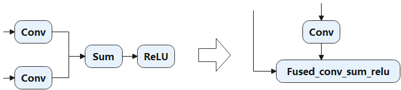
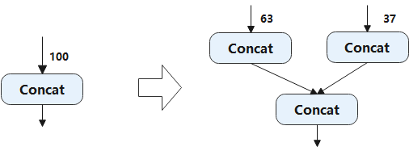
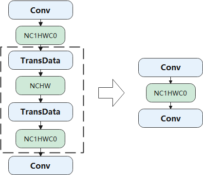

## 计算图优化

后端的计算图优化主要是针对硬件的优化，根据优化适用于所有硬件还是只适合特定硬件，可以分为通用硬件优化和特定硬件优化，例如为了适配硬件指令限制而做的子图变换和与特定硬件无关的算子内存IO优化。

### 通用硬件优化

通用硬件优化主要指与特定硬件类型无关系的计算图优化，优化的核心是子图的等价变换：在计算图中尝试匹配特定的子图结构，找到目标子图结构后，通过等价替换方式，将其替换成对硬件更友好的子图结构。

以优化内存IO为例。深度学习算子按其对资源的需求可以分为两类：
计算密集型算子，这些算子的时间绝大部分花在计算上，如卷积、全连接等；
访存密集型算子，这些算子的时间绝大部分花在访存上，他们大部分是Element-Wise算子，例如
ReLU、Element-Wise Sum等。
在典型的深度学习模型中，一般计算密集型和访存密集型算子是相伴出现的，最简单的例子是"Conv +
ReLU"。Conv卷积算子是计算密集型，ReLU算子是访存密集型算子，ReLU算子可以直接取Conv算子的计算结果进行计算，因此我们可以将二者融合成一个算子来进行计算，从而减少内存访问延时和带宽压力，提高执行效率。

例如："Conv + Conv + Sum +
ReLU"的融合，从 :numref:`conv_sum_relu`中我们可以看到融合后的算子减少了两个内存的读和写的操作，优化了Conv的输出和Sum的输出的读和写的操作。

:width:`800px`
:label:`conv_sum_relu`

除了上述针对特定算子类型结构的融合优化外，基于自动算子生成技术，还可以实现更灵活、更极致的通用优化。以
MindSpore
的图算融合技术为例，图算融合通过"算子拆解、算子聚合、算子重建"三个主要阶段（如图）让计算图中的计算更密集，并进一步减少低效的内存访问。

:width:`800px`
:label:`graph_kernel`

 :numref:`graph_kernel`中，算子拆解阶段（Expander）将计算图中一些复杂算子（composite
op，图中Op1、Op3、Op4）展开为计算等价的基本算子组合（
图中虚线正方形框包围着的部分）；在算子聚合阶段（Aggregation），将计算图中将基本算子（basic
op，如图中Op2）、拆解后的算子（expanded
op）组合融合，形成一个更大范围的算子组合；在算子重建阶段（Reconstruction）中，按照输入tensor到输出tensor的仿射关系将基本算子进行分类：elemwise、
broadcast、reduce、transform等，并在这基础上归纳出不同的通用计算规则（如
elemwise + reduce 规则：elemwise +
reduce在满足一定条件后可以高效执行），根据这些计算规则不断地从这个大的算子组合上进行分析、筛选，最终重新构建成新的算子（如图中虚线正方形包围的两个算子
New Op1 和 New
Op2）。图算融合通过对计算图结构的拆解和聚合，可以实现跨算子边界的联合优化；并在算子重建中，通过通用的计算规则，以必要的访存作为代价，生成对硬件更友好、执行更高效的新算子。

### 特定硬件优化

特定硬件优化是指该计算图的优化是在特定硬件上才能做的优化，常见的基于硬件的优化包括由于硬件指令的限制而做的优化，特定硬件存储格式导致的优化等。

1、硬件指令限制

在一些特定的硬件上，IR中计算节点没有直接对应的硬件算子，只能通过子图的变换来达到子图中所有算子在对应的硬件上的存在。例如在MindSpore中，昇腾芯片上的Concat算子，只支持有限的输入个数（63个），因此当前端IR上的输入个数大于限制输入的时候，需要将该计算节点拆分成等价的多个Concat节点，如 :numref:`concat`所示：
当Concat有100个输入时，单个算子只支持最多63个输入，此时会将该计算节点拆分成两个Concat节点，分别为63个输入和37个输入的两个算子。

:width:`800px`
:label:`concat`

2、数据排布格式的限制

针对不同特点的计算平台和不同的算子，为了追求最好的性能，一般都需要选择不同的数据排布格式（Format），而这些排布格式可能跟框架缺省的排布格式是不一样的。在这种情况下，一般的做法是算子在执行完成后对输出插入一个格式转换操作，把排布格式转换回框架的缺省排布格式，这就引入了额外的内存操作。以 :numref:`transdata`为例，在昇腾平台上Conv算子在输入和输出的内存排布为5HD时是性能最优的，所以可以看到Conv算子输出结果的格式是5HD，然后通过一个转换操作转回了框架缺省的NCHW，紧接着，后面又是一个Conv算子，它需要5HD的输入，所以又做了一个NCHW到5HD的转换。我们很容易看出，虚线框内的两个转换操作互为逆操作，可以相互抵消。通过对计算图的模式匹配，可以将该类型的操作消除。

:width:`800px`
:label:`transdata`
