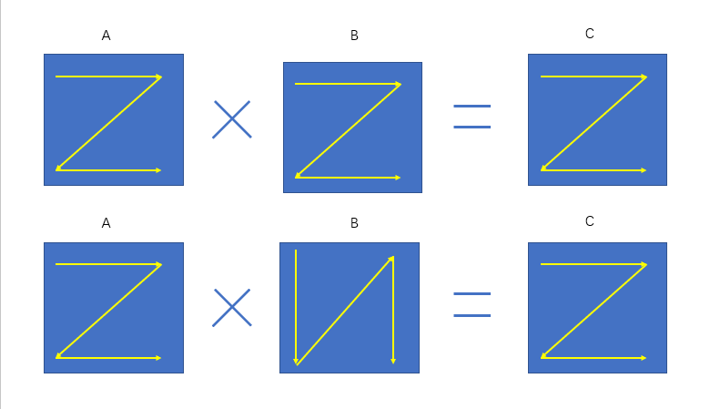
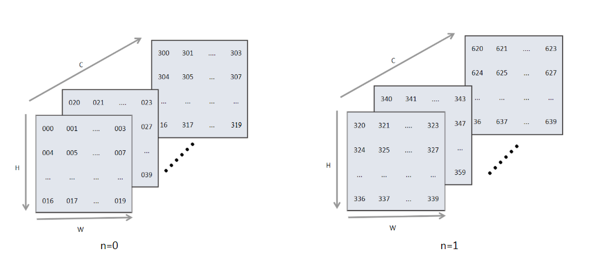
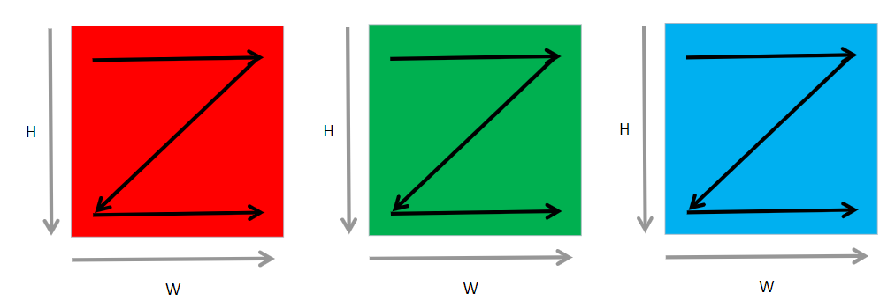
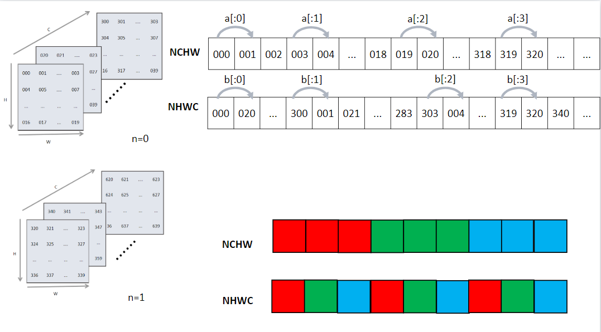
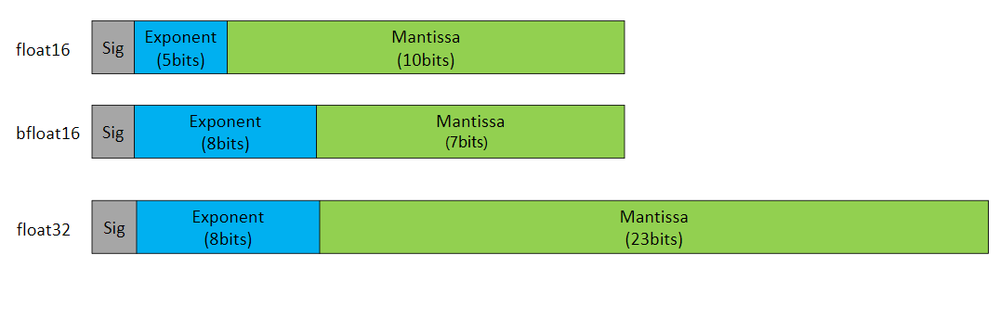

## 算子选择

经过计算图优化后，需要对IR图上的每个节点进行算子选择，才能生成真正在设备上执行的算子序列。由于IR图上的节点可能有后端的很多算子与其对应，不同规格的算子在不同的情况下执行效率各不相同，在算子选择阶段的主要任务就是如何根据IR图中的信息在众多算子中选择出最合适的一个算子去目标设备上执行。

### 算子选择的基础概念

经历了后端的图优化后，IR图中的每一个节点都有一组算子与之对应。此时的IR图中的每一个节点可以认为是用户可见的最小硬件执行单元。但是此时IR图中的一个节点代表了用户代码的一个操作，对于这个操作还没有具体生成有关设备信息的细节描述。这些信息是算子选择所选择的内容信息，我们称之为算子信息。算子信息主要包括以下内容：

1.  针对不同特点的计算平台和不同的算子，为了追求最好的性能，一般都需要选择不同的数据排布格式。机器学习系统常见的数据排布格式有NCHW和NHWC等。

2.  对于不同的硬件支持不同的计算精度，例如float32、float16和int32等。算子选择需要在所支持各种数据类型的算子中选择出用户所设定的数据类型最为相符的算子。

**数据排布格式**

机器学习系统中很多运算都会转换成为矩阵的乘法，例如卷积运算。我们知道矩阵乘法$A\times B = C$
是以A的一行乘以B的一列求和后得到C的一个元素。以 :numref:`matmuldatalayout`为例，在 :numref:`matmuldatalayout`的上方，矩阵数据的存储是按照行优先来进行存储，虽然B在存储时是按照行存储，但是读取数据时却按照列进行读取，假如我们能把B的格式进行转换转换为列存储，例如 :numref:`matmuldatalayout`下方所示，这样就可以通过访问连续内存的方式加快数据访问速度进而提升运算速度。由此可见不同的数据排布方式对性能有很大影响。

:width:`800px`
:label:`matmuldatalayout`

在机器学习系统中我们常见的数据格式一般有两种，分别为NCHW类型和NHWC类型。其中N代表了数据输入的BatchSize大小，C代表了图像的通道，H和W分别代表图像输入的长和宽。 :numref:`data_format`展示了BatchSize为2，通道数16和长度为5\*4大小的数据逻辑示意图。

:width:`800px`
:label:`data_format`

但是计算机的存储并不能够直接将这样的矩阵放到内存中，需要将其展平成1维后存储，这样就涉及我们逻辑上的索引如何映射成为内存中的索引，即我们如何根据逻辑数据索引来映射到内存中的1维数据索引。

对于NCHW的数据是先取W轴方向数据，再取H轴方向数据，再取C轴方向，最后取N轴方向。其中物理存储与逻辑存储的之间的映射关系为
$$offsetnchw(n,c,h,w) = n*CHW + c*HW + h*W +w$$
如 :numref:`nchw`所示，这种格式中，是按照最低维度W轴方向进行展开，W轴相邻的元素在内存排布中同样是相邻的。如果需要取下一个图片上的相同位置的元素，就必须跳过整个图像的尺寸（$C*H*W$）。比如我有8张32\*32的RGB图像，此时$N=8,C=3,H=32,W=32$。在内存中存储它们需要先按照W轴方向进行展开，然后按照H轴排列，这样之后便完成了一个通道的处理，之后按照同样的方式处理下一个通道。处理完全部通道后，处理下一张图片。PyTorch和MindSpore框架默认使用NCHW格式。

:width:`800px`
:label:`nchw`

类似的NHWC数据格式是先取C方向数据，再取W方向，然后是H方向，最后取N方向。NHWC是Tensorflow默认的数据格式。这种格式在PyTorch中称为Chanel-Last。
$$offsetnhwc(n,h,w,c) = n*HWC + h*WC + w*C +c$$
 :numref:`nchwandnhwc`展示了不同数据格式下逻辑排布到内存物理侧数据排布的映射。\[x:1\]代表从最内侧维度到最下一维度的索引变换。比如\[a:1\]表示当前行W轴结束后，下一个H轴排布。\[b:1\]表示最内侧C轴排布完成后进行按照W轴进行排列。

:width:`800px`
:label:`nchwandnhwc`

上述的数据存储格式具有很大的灵活性，很多框架都采用上述的两种格式作为默认的数据排布格式。但是在硬件上对数据操作时，此时的数据排布可能还不是最优的。在机器学习系统中，用户输入的数据往往会远远大于计算部件一次性计算所能容纳的最大范围，所以此时必须将输入的数据进行切片分批送到运算部件中进行运算。为了加速运算很多框架又引入了一些块布局格式来进行进一步的优化，这种优化可以使用一些硬件的加速指令，对数据进行搬移和运算。比如oneDNN上的nChw16c
和nChw8c
格式，以及Ascend芯片的5HD等格式。这种特殊的数据格式与硬件更为贴合，可以快速的将矩阵向量化，并且极大的利用片内缓存。

**数据精度**

通常深度学习的系统，一般使用的是单精度float（Single
Precision）浮点表示。这种数据类型占用32位内存。还有一种精度较低的数据类型float16，其内部占用了16位的内存。由于很多硬件会对float16数据类型进行优化，float16半精度的计算吞吐量可以是float32的$2\sim 8$倍，且float16可以占用的数据更小，这样可以输入更大的BatchSize，进而减少总体训练时间。接下来我们详细看一下半精度浮点数与单精度浮点数的区别。

:width:`800px`
:label:`floatdtype`

如 :numref:`floatdtype`其中sign代表符号位，占1位，表示了机器数的正负，exponent表示指数位，Mantissa为尾数位。其中float16类型的数据采用二进制的科学计数法转换为十进制的计算方式如下：
$$(-1)^{sign}\times 2^{exponent-15}\times (\frac{mantissa}{1024}+1)$$
其中如果指数位全为0时，且尾数位全为0时表示数字0。
如果指数位全为0，尾数位不全为0则表示一个非常小的数值。
当指数全为1，尾数位全为0表示根据符号位正无穷大，或者负无穷大。
若指数全为1，但是尾数位不为0，则表示NAN。
其中bfloat16并不属于一个通用的数据类型，是google提出的一种特殊的类型，现在一般只在一些TPU上训练使用，其指数位数与float32位数保持一致，可以较快的与float32进行数据转换。由于并不是一种通用类型。IEEE中也并没有提出该类型的标准。

**算子信息库**

前面我们讲述了数据格式和数据精度的概念，基于这两个概念，在不同硬件下会有不同的算子支持，此时需要有一个硬件上支持的所有算子的集合，该集合我们称之为算子信息库。算子选择过程就是从算子信息库中选择最合适的算子的过程。

### 算子选择的过程

前文介绍了算子选择主要是针对IR图中的每一个操作节点选择出最为合适的算子。其中算子信息主要包括了支持设备类型、数据类型和数据排布格式三个方面。经过编译器前端类型推导与静态分析的阶段后，IR图中已经推导出了用户代码侧的数据类型。下面介绍算子选择的基本过程。

首先，选择算子执行的硬件设备。不同的硬件设备上，算子的实现、支持数据类型、执行效率通常会有所差别。这一步往往是用户自己指定的，若用户未指定，则编译器后端会为用户匹配一个默认的设备。
然后，后端会根据IR图中推导出的数据类型和内存排布格式选择对应的算子。

:width:`800px`
:label:`select_kernel`

理想情况下算子选择所选择出的算子类型，应该与用户预期的类型保持一致。但是由于软硬件的限制，很可能算子的数据类型不能满足用户所期待的数据类型，此时需要对该节点进行升精度或者降精度处理才能匹配到合适的算子。比如在MindSpore
的Ascend后端由于硬件限制导致Conv2D算子只存在float16一种数据类型。如果用户设置的整网使用的数据类型为float32数据，那么只能对Conv2D算子的输入数据进行降精度处理，即将输入数据类型从float32转换成float16。

算子的数据排布格式转换是一个比较耗时的操作，为了避免频繁的格式转换所带来的内存搬运开销，数据应该尽可能地以同样的格式在算子之间传递，算子和算子的衔接要尽可能少的出现数据排布格式不一致的现象。另外，数据类型不同导致的降精度可能会使得误差变大，收敛速度变慢甚至不收敛，所以数据类型的选择也要结合具体算子分析。

总的来说，一个好的算子选择算法应该尽可能的保持数据类型与用户设置的数据类型一致，且尽可能少的出现数据格式转换。
