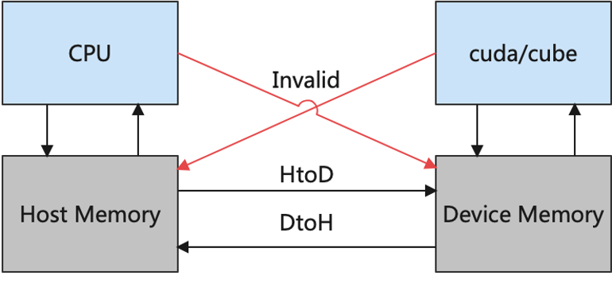
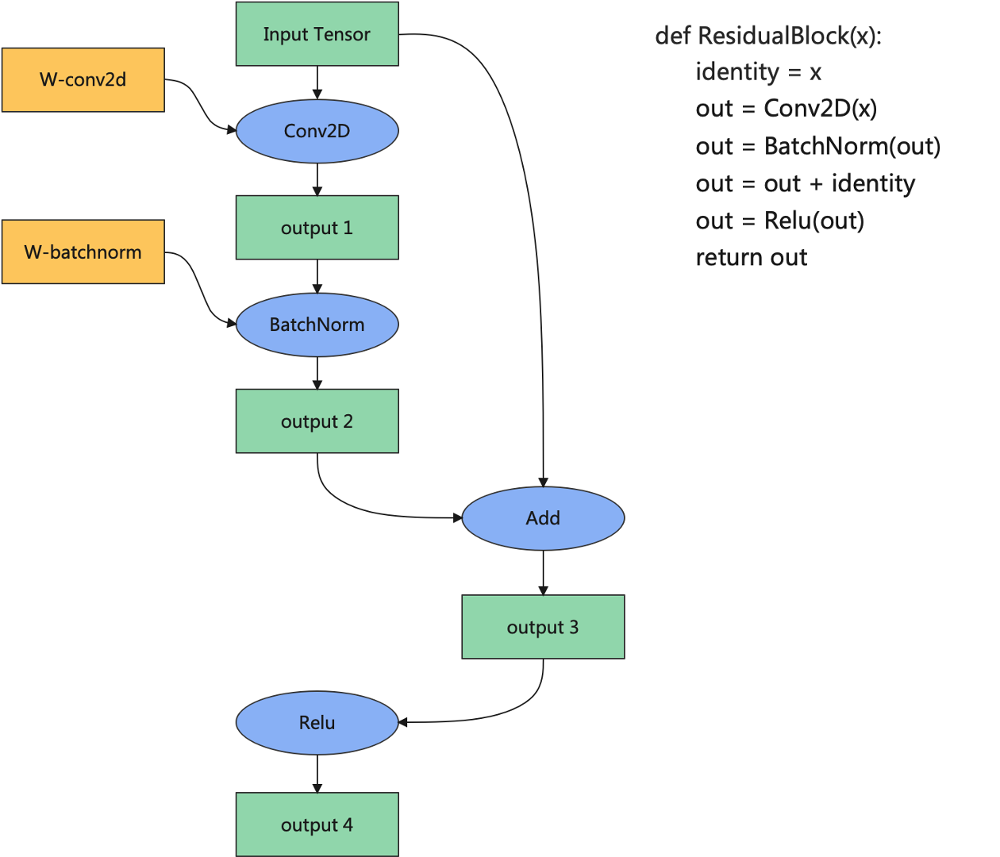
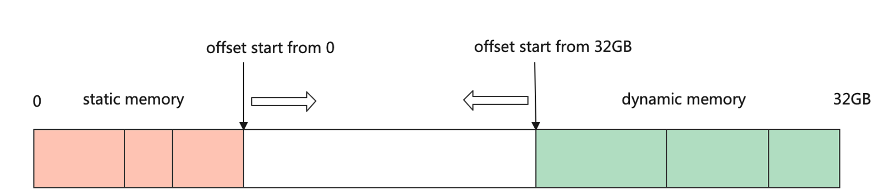
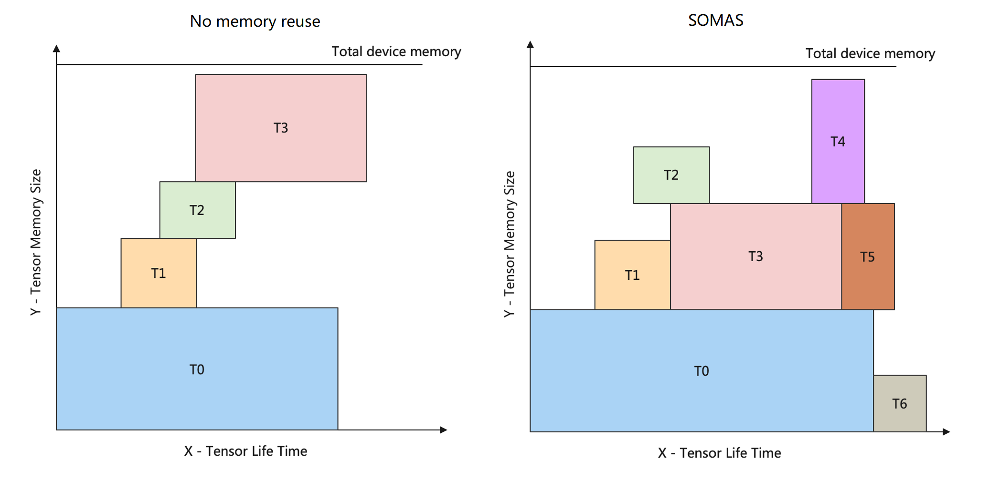
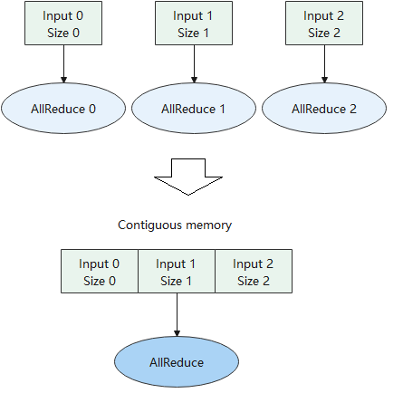
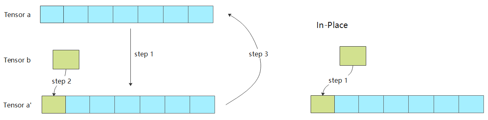

## 内存分配
:label:`ch05-sec-memory_pool`

内存在传统计算机存储器层次结构中有着重要的地位，它是连接高速缓存和磁盘之间的桥梁，有着比高速缓存更大的空间，比磁盘更快的访问速度。随着深度学习的发展，深度神经网络的模型越来越复杂，AI芯片上的内存很可能无法容纳一个大型网络模型。因此，对内存进行复用是一个重要的优化手段。此外，通过连续内存分配和
In-Place内存分配还可以提高某些算子的执行效率。

### Device内存概念

在深度学习体系结构中，我们通常将与硬件加速器（如GPU、AI芯片等）相邻的内存称之为设备（Device）内存，而与CPU相邻的内存称之为主机（Host）内存。如 :numref:`host-device-memory`所示，CPU可以合法地访问主机上的内存，而无法直接访问设备上的内存；同理，AI芯片可以访问设备上的内存，却无法访问主机上的内存。因此，在网络训练过程中，我们往往需要从磁盘加载数据到主机内存中，然后在主机内存中做数据处理，再从主机内存拷贝到设备内存中，最后设备才能合法地访问数据。算子全部计算完成后，用户要获取训练结果，又需要把数据从设备内存拷贝到主机内存中。

:width:`800px`
:label:`host-device-memory`

### 内存分配 {#内存分配-1}

内存分配模块主要负责给图中算子的输入、输出分配Device内存。用户的前端脚本经过编译器前端处理后得到中间表达，后端根据中间表达进行算子选择和相关优化，可以得到算子最终的输入输出Tensor的形状、数据类型（Data
Type）、格式（Format）等信息，根据这些信息我们可以计算出算子输入、输出Tensor的尺寸大小。基本的计算方法为：
$$size=\left (\prod_{i=0}^{dimension}shape_i\right ) * sizeof\left ( data type \right )$$
得到Tensor的尺寸大小后，往往还需要对内存大小进行对齐操作。内存通常以4字节、8字节或16字节为一组进行访问，如果被搬运的内存大小不是这些值的倍数，内存后面会填充相应数量的空数据以使得内存长度达到这些值的倍数。因此，访问非对齐的内存可能会更加耗时。

:width:`800px`
:label:`memory_allocate`

下面以 :numref:`memory_allocate`为例介绍内存分配的大致流程。首先我们会给Input
Tensor、Conv2D的权重和Conv2D的输出分配内存地址。然后为BatchNorm的输入分配地址时，我们发现BatchNorm的输入就是Conv2D算子的输出，而该Tensor的地址已经在之前分配过了，因此只需要将Conv2D算子的输出地址共享给BatchNorm的输入，就可以避免内存的重复申请以及内存的冗余拷贝。以此类推，可以发现整个过程中可以将待分配的内存分成三种类型：一是整张图的输入Tensor，二是算子的权重或者属性，三是算子的输出Tensor，三种类型在训练过程中的生命周期有所不同。

在CPU上我们常常使用malloc函数直接申请内存，这种方式申请内存好处是随时申请随时释放，简单易用。然而在许多对性能要求严苛的计算场景中，由于所申请内存块的大小不定，频繁申请释放会降低性能。通常我们会使用内存池的方式去管理内存，先申请一定数量的内存块留作备用，当程序有内存申请需求时，直接从内存池中的内存块中申请。当程序释放该内存块时，内存池会进行回收并用作后续程序内存申请时使用。
在深度学习框架中，Device内存的申请也是非常频繁的，往往也是通过内存池的方式去管理Device内存，并让Device内存的生命周期与Tensor的生命周期保持一致。不同的深度学习框架在内存池的设计上大同小异，我们以 :numref:`device_malloc`的MindSpore框架内存申请为例，进程会从Device上申请足够大的内存，然后通过双游标从两端偏移为Tensor分配内存。首先从申请的首地址开始进行偏移，为算子权重的Tensor分配内存，这部分Tensor生命周期较长，往往持续整个训练过程。然后从申请Device地址的末尾开始偏移，为算子的输出Tensor分配内存，这部分内存的生命周期较短，往往在该算子计算结束并且后续计算过程中无需再次使用该算子的输出的情况下，其生命周期就可以结束。通过这种方式，我们只需要从Device上申请一次足够大的内存，后续算子的内存分配都是通过指针偏移进行分配，减少了直接从设备申请内存的耗时。

:width:`800px`
:label:`device_malloc`

### 内存复用

在机器学习系统中，内存复用是指分析Tensor的生命周期，将生命周期结束的Tensor的Device内存释放回内存池并用于后续Tensor的内存分配。内存复用的目的是提高内存的利用率，让有限的设备内存容纳更大的模型。
以 :numref:`memory_allocate`为例，当BatchNorm算子计算结束后，output1不再被任何算子使用，则该Tensor的Device内存可以被回收，并且如果output1的内存尺寸大于等于output3的内存尺寸，则从output1回收的地址可以用于output3的内存分配，从而达到复用output1地址的目的。

:width:`800px`
:label:`combine_memory_reuse_and_no_reuse`

为了更好地描述内存复用问题，我们通过内存生命周期图来辅助理解。如 :numref:`combine_memory_reuse_and_no_reuse`所示，图中横坐标表示Tensor的生命周期，图中纵坐标表示内存大小。在生命周期内，某一个Tensor将一直占用某块Device内存，直至生命周期结束才会释放相应内存块。通过Tensor生命周期和内存大小可以构造出矩形块，而内存分配要求解的目标是在内存生命周期图中容纳更多的矩形块，问题的约束是矩形块之间无碰撞。 :numref:`combine_memory_reuse_and_no_reuse`左边是在未使用任何内存复用策略的情况下的内存生命周期图，此时内存同时只能容纳T0、T1、T2、T3四个Tensor。

内存复用策略的求解是一个NP完全的问题。许多深度学习框架通常采用贪心的策略去分配内存，例如采用BestFit算法，每次直接从内存池中选取可以满足条件的最小内存块，然而这种贪心的策略往往会陷入局部最优解，而无法求得全局最优解。为了更好地逼近内存分配策略全局最优解，MindSpore框架提出了一种新的内存分配算法
SOMAS（Safe Optimized Memory Allocation
Solver）。SOMAS将计算图并行流与数据依赖进行聚合分析，得到算子间祖先关系，构建张量全局生命周期互斥约束，使用多种启发式算法求解最优的内存静态规划，实现逼近理论极限的内存复用，从而提升支持的内存大小。

由 :numref:`combine_memory_reuse_and_no_reuse`右边所示，经过SOMAS求解之后，同样的内存大小，可支持的Tensor数量达到了7个。

### 常见的内存分配优化手段

#### 内存融合

上述内存分配的方式，都是以单个Tensor的维度去分配的，每个Tensor分配到的Device地址往往是离散的。但是对于某些特殊的算子，如AllReduce通信算子，我们需要为它们分配连续的内存。通信算子的执行包含通信等待、数据搬移、计算等步骤，而在大规模分布式集群的场景下，通信的耗时往往是性能瓶颈。针对这种场景，如 :numref:`memory_fusion`所示，我们可以将多个通信算子融合成一个，为通信算子的输入分配连续的内存，从而减少通信的次数。
又比如分布式训练中的神经网络权重初始化，通常将一个训练进程中的权重初始化，然后将该权重广播到其他进程中。当一个网络有较多权重的时候，需要多次进行广播。通常可以为所有权重分配连续的内存地址，然后广播一次，节省大量通信的耗时。

:width:`800px`
:label:`memory_fusion`

#### In-Place算子

在前面的内存分配流程中，我们会为每个算子的输入和输出都分配不同的内存。然而对很多算子而言，为其分配不同的输入和输出地址，会浪费内存并且影响计算性能。例如优化器算子，其计算的目的就是更新神经网络的权重；例如Python语法中的'+='和'\*='操作符，将计算结果更新到符号左边的变量中；例如'a\[0\]=b'语法，将'a\[0\]'的值更新为'b'。诸如此类计算有一个特点，都是为了更新输入的值。下面以Tensor的'a\[0\]=b'操作为例介绍In-Place的优点。
 :numref:`inplace-op`左边是非In-Place操作的实现，step1将Tensor
a拷贝到Tensor a'，step2将Tensor b赋值给Tensor a'，step3将Tensor
a'拷贝到Tensor
a。 :numref:`inplace-op`右边是算子In-Place操作的实现，仅用一个步骤将Tensor
b拷贝到Tensor
a对于的位置上。对比两种实现，可以发现In-Place操作节省了两次拷贝的耗时，并且省去了Tensor
a'内存的申请。

:width:`800px`
:label:`inplace-op`

这节我们简单介绍了Device内存的概念，内存分配的流程，和一些优化内存分配的方法。内存分配是编译器后端的最重要部分之一，内存的合理分配，不仅关系到相同芯片上能否支持更大的网络模型，也关系到模型在硬件上的执行效率。
