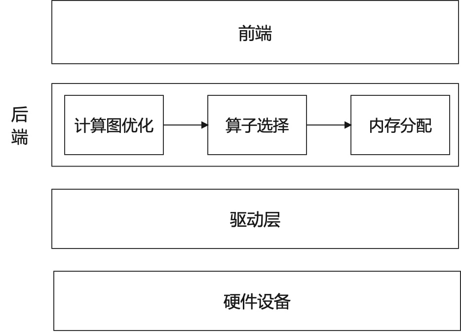

## 概述

编译器前端主要将用户代码进行解析翻译得到计算图IR并对其进行设备信息无关的优化，此时我们并不考虑程序执行的底层硬件信息。编译器后端的主要职责对前端下发的IR做进一步的计算图优化，让其更加贴合硬件，并为IR中的计算节点选择适合在硬件上执行的算子，然后为每个算子的输入输出分配硬件内存，最终生成一个可以在硬件上执行的任务序列。

如 :numref:`compiler-backend-architecture`所示，编译器后端处于前端和硬件驱动层中间，主要负责计算图优化、算子选择和内存分配的任务。首先，需要根据硬件设备的特性将IR图进行等价图变换，以便在硬件上能够找到对应的执行算子，该过程是计算图优化的重要步骤之一。前端IR生成是解析用户代码，属于一个较高的抽象层次，隐藏一些底层运行的细节信息，此时无法直接对应硬件上的算子（算子是设备上的基本计算序列，例如MatMul、Convolution和ReLU等），需要将细节信息进行展开后，才能映射到目标硬件上的算子。对于某些前端IR的子集来说，一个算子便能够执行对应的功能，此时可以将这些IR节点合并成为一个计算节点，该过程称之为算子融合；对于一些复杂计算，后端并没有直接与之对应的算子，但是可以通过几个基本运算的算子组合达到同样的计算效果，此时可以将前端IR节点拆分成多个小算子。然后，我们需要进行算子选择。算子选择是在得到优化的IR图后，需要选取最合适的目标设备算子。针对用户代码所产生的IR往往可以映射成多种不同的硬件算子，但是生成不同的算子执行效率往往有很大的差别，如何根据前端IR选择出最高效的算子，是算子选择的核心问题。算子选择本质上是一个模式匹配问题。其最简单的方法就是每一个IR节点对应一个目标硬件的算子，但是这种方法往往对目标硬件的资源利用比较差。目前来说对于现有的编译器一般都对每一个IR节点提供了多个候选的算子，算子选择目标就是从中选择最优的一个算子作为最终执行在设备上的算子。总的来说，在机器学习系统中，对前端生成的IR图上的各个节点进行拆分和融合，让前端所表示的高层次IR逐步转换为可以在硬件设备上执行的低层次IR。得到了这种更加贴合硬件的IR后，对于每个单节点的IR可能仍然有很多种不同的选择，例如可以选择不同的输入输出格式和数据类型，我们需要对IR图上每个节点选择出最为合适的算子，算子选择过程可以认为是针对IR图的细粒度优化过程，最终生成完整的算子序列。最后，遍历算子序列，为每个算子分配相应的输入输出内存，然后将算子加载到设备上执行计算。

:width:`800px`
:label:`compiler-backend-architecture`

### 计算图优化

计算图优化是在不影响模型的数值特性的基础上，通过图变换达到简化计算、减少资源开销、适配硬件的执行能力、提升执行性能的目的。

### 算子选择

算子选择是将IR图上的每个计算节点映射到设备上可执行算子的过程，一个IR图上的计算节点往往可以对应多个设备上的算子，这个过程中需要考虑算子的规格，算子的执行效率等问题，算子选择目标就是从中选择最优的一个算子。

### 内存分配

经过计算图优化和算子选择之后，我们可以得到IR图中每个算子的输入输出的形状（Shape）、数据类型、存储格式。根据这些信息，计算输入输出数据的大小，并为输入输出分配设备上的内存，然后将算子加载到设备上才能真正执行计算。此外，为了更充分地例用设备内存资源，可以对内存进行复用，提高内存利用率。

### 计算调度与执行

经过算子选择与内存分配之后，计算任务可以通过运行时完成计算的调度与在硬件上的执行。根据是否将算子编译为计算图，计算的调度可以分为单算子调度与计算图调度两种方式。而根据硬件提供的能力差异，计算图的执行方式又可以分为逐算子下发执行的交互式执行以及将整个计算图或者部分子图一次性下发到硬件的下沉式执行两种模式。
