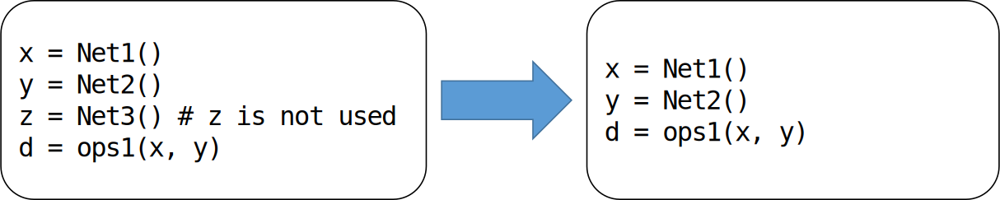
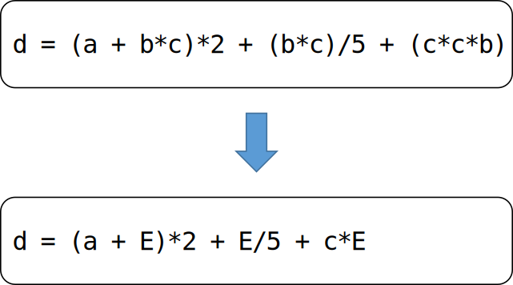

常见前端编译优化方法
--------------------

和传统编译器相同，机器学习编译器也会进行编译优化。编译优化意在解决编译生成的中间表示的低效性，使得代码的长度变短，编译与运行的时间减少，执行期间处理器的能耗变低。编译优化可以分为与硬件无关的优化和与硬件相关的编译优化。因为前端是不感知具体后端硬件的，因此前端执行的全部都是与硬件无关的编译优化。

### 前端编译优化简介

大多数编译优化器会由一系列的"趟"（Pass）来组成。每个"趟"以中间表示为输入，又以新生成的中间表示为输出。一个"趟"还可以由几个小的"趟"所组成。一个"趟"可以运行一次，也可以运行多次。

在编译优化中，优化操作的选择以及顺序对于编译的整体具有非常关键的作用。优化操作的选择决定了优化器能够感知中间表示中的哪些低效性，也决定了编译器将要如何去重写中间表示以消除这种低效性。优化操作的顺序决定了各趟操作的执行顺序。编译器可以根据具体需要运行不同的编译优化操作。也可以根据编译优化级别来调整优化的次数，种类以及顺序。

:width:`800px`
:label:`pass_structure`

### 常见编译优化方法介绍及实现

前端编译优化的方法有很多，机器学习框架也有很多不同于传统编译器的优化方式。在本小节当中，我们会介绍三种常见且通用的前端编译优化方法。

1\. 无用与不可达代码消除

如图:numref:`pass_useless_code_elimination`所示。无用代码是指输出结果没有被任何其他代码所使用的代码。不可达代码是指没有有效的控制流路径包含该代码。删除无用或不可达的代码可以使得中间表示更小，提高程序的编译与执行速度。无用与不可达代码一方面有可能来自于程序编写者的编写失误，也有可能是其他编译优化所产生的结果。

:width:`600px`
:label:`pass_useless_code_elimination`

2\. 常量传播、常量折叠

常量传播：如图:numref:`pass_constant_broadcast`所示，如果某些量为已知值的常量，那么可以在编译时刻将使用这些量的地方进行替换。

常量折叠：如图:numref:`pass_constant_broadcast`所示，多个量进行计算时，如果能够在编译时刻直接计算出其结果，那么变量将由常量替换。

:width:`600px`
:label:`pass_constant_broadcast`

3\. 公共子表达式消除

如图:numref:`pass_CSE`所示，如果一个表达式E已经计算过了，并且从先前的计算到现在E中所有变量的值都没有发生变化，那么E就成为了公共子表达式。对于这种表达式，没有必要花时间再对它进行计算，只需要直接用前面计算过的表达式结果代替E就可以了。

:width:`600px`
:label:`pass_CSE`
