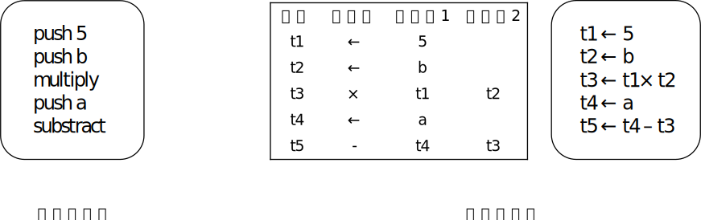
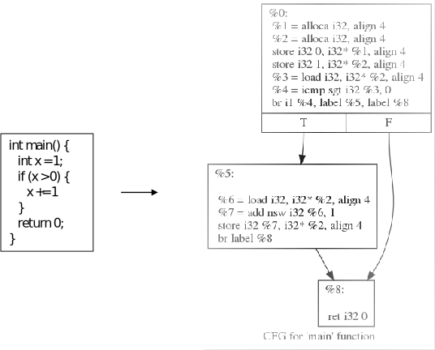
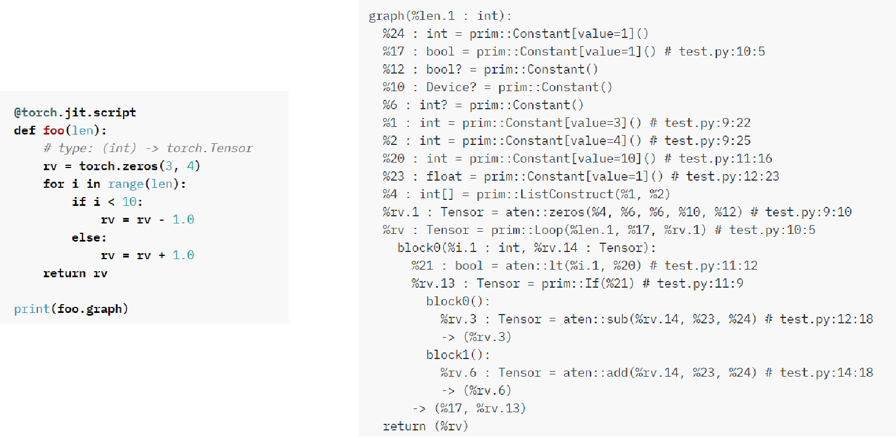
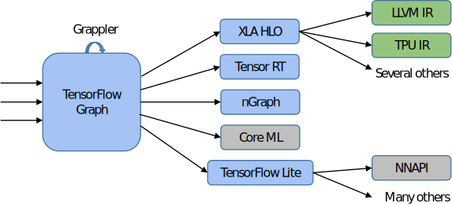
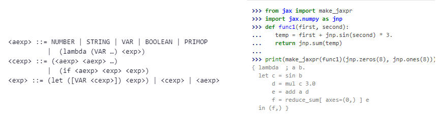
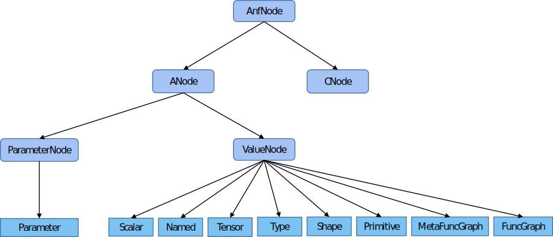
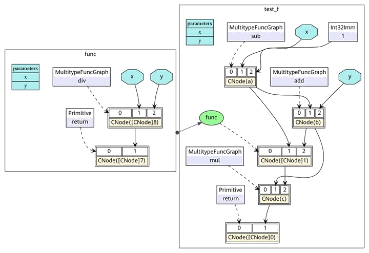

中间表示
--------

中间表示作为编译器的核心数据结构之一，无论是在传统编译器中，还是在机器学习框架中，
都有着极其重要的地位。本章节我们会先介绍中间表示的基本概念以及传统编译器的中间表示类型。在此基础上，我们会探讨针对机器学习框架，中间表示的设计所面临的新的需求和挑战。最后，我们会介绍现有机器学习框架的中间表示的种类及其实现。

### 中间表示的基本概念

中间表示(IR)，是编译器用于表示源代码的数据结构或代码，是程序编译过程中介于源语言和目标语言之间的程序表示。几乎所有的编译器都需要某种形式的中间表示，来对被分析、转换和优化的代码进行建模。在编译过程中，中间表示必须具备足够的表达力，在不丢失信息的情况下准确表达源代码，并且充分考虑从源代码到目标代码编译的完备性、编译优化的易用性和性能。

引入中间表示后，中间表示既能面向多个前端，表达多种源程序语言，又能对接多个后端，连接不同目标机器，如图:numref:`intermediate_representation`所示。在此基础上，编译流程就可以在前后端直接增加更多的优化流程，这些优化流程以现有IR为输入，又以新生成的IR为输出，被称为优化器。优化器负责分析并改进中间表示，极大程度的提高了编译流程的可拓展性，也降低了优化流程对前端和后端的破坏。

:width:`800px`
:label:`intermediate_representation`

随着编译器技术的不断演进，中间表示主要经历了三个发展阶段。在早期阶段，中间表示是封闭在编译器内部的，供编译器编写者使用。在中期阶段，随着编译器的开源，中间表示逐步开源公开，主要供编译器设计者、分析工具设计者使用。现阶段，中间表示朝着软件生态构建的方向发展，旨在构建统一的中间表示。

### 中间表示的种类

上一节介绍了中间表示的基本概念，初步阐述了中间表示的重要作用和发展历程。接下来从组织结构的角度出发，介绍通用编译器的中间表示的类型以及各自特点（[@2007Engineering]），如下表所示。中间表示组织结构的设计，对编译阶段的分析优化、代码生成等有着重要影响。编译器的设计需求不同，采用的中间表示组织结构也有所不同。

::: {#tab:ch04/ch04-categorize}
  组织结构       特点                   举例
  -------------- ---------------------- ----------------------------------
  Linear IR      基于线性代码           堆栈机代码、三地址代码
  Graphical IR   基于图                 抽象语法树、有向无环图、控制流图
  Hybrid IR      基于图与线性代码混合   LLVM IR

  : 中间表示的分类
:::

1\) 线性中间表示

线性中间表示类似抽象机的汇编代码，将被编译代码表示为操作的有序序列，对操作序列规定了一种清晰且实用的顺序。由于大多数处理器采用线性的汇编语言，线性中间表示广泛应用于编译器设计。

常用线性中间表示有堆栈机代码(Stack-Machine Code)和三地址代码(Three
Address Code) （[@2007Compilers]）
。堆栈机代码是一种单地址代码，提供了简单紧凑的表示。堆栈机代码的指令通常只有一个操作码，其操作数存在一个栈中。大多数操作指令从栈获得操作数，并将其结果推入栈中。三地址代码，简称为3AC，模拟了现代RISC机器的指令格式。它通过一组四元组实现，每个四元组包括一个运算符和三个地址(两个操作数、一个目标)。对于表达式a-b\*5，堆栈机代码和三地址代码如图:numref:`linear_ir`所示。

:width:`800px`
:label:`linear_ir`

2、图中间表示

图中间表示将编译过程的信息保存在图中，算法通过图中的对象如节点、边、列表、树等来表述。虽然所有的图中间表示都包含节点和边，但在抽象层次、图结构等方面各有不同。常见的图中间表示包括抽象语法树(Abstract
Syntax Tree，AST)、有向无环图(Directed Acyclic
Graph，DAG)、控制流图(Control-Flow Graph，CFG)等。

AST抽象语法树采用树型中间表示的形式，是一种接近源代码层次的表示。对于表达式$a*5+a*5*b$，其AST表示如图:numref:`AST_DAG`所示。可以看到，AST形式包含$a*5$的两个不同副本，存在冗余。在AST的基础上，DAG提供了简化的表达形式，一个节点可以有多个父节点，相同子树可以重用。如果编译器能够证明$a$的值没有改变，则DAG可以重用子树，降低求值过程的代价。

:width:`600px`
:label:`AST_DAG`

3、混合中间表示

混合中间表示是线性中间表示和图中间表示的结合，这里以LLVM IR
（[@2004LLVM]） 为例进行说明。LLVM(Low Level Virtual
Machine)是2000年提出的开源编译器框架项目，旨在为不同的前端后端提供统一的中间表示。LLVM
IR使用线性中间表示表示基本块，使用图中间表示表示这些块之间的控制流，如图:numref:`LLVM_IR`所示。基本块中，每条指令以静态单赋值(Static
Single Assignment， SSA) （[@Richard1995A]）
形式呈现，这些指令构成一个指令线性列表。SSA形式要求每个变量只赋值一次，并且每个变量在使用之前定义。控制流图中，每个节点为一个基本块，基本块之间通过边实现控制转移。

:width:`600px`
:label:`LLVM_IR`

### 机器学习框架的中间表示

上一节介绍了中间表示的类型，并举例说明了常见的中间表示形式。传统中间表示如LLVM
IR，能够很好地满足通用编译器的基本功能需求，包括类型系统、控制流和数据流分析等。然而，它们偏向机器语言，难以满足机器学习框架编译器的中间表示的需求。

在设计机器学习框架的中间表示时，需要充分考虑以下因素：

1\)
张量表达。机器学习框架主要处理张量数据，因此正确处理张量数据类型是机器学习框架中间表示的基本要求。

2\)
自动微分。自动微分是指对网络模型的自动求导，通过梯度指导对网络权重的优化。主流机器学习框架都提供了自动微分的功能，在设计中间表示时需要考虑自动微分实现的简洁性、性能以及高阶微分的扩展能力。

3\)
计算图模式。主流机器学习框架如TensorFlow、PyTorch、MindSpore等都提供了静态图和动态图两种计算图模式，静态计算图模式先创建定义计算图，再显式执行，有利于对计算图进行优化，高效但不灵活。动态计算图模式则是每使用一个算子后，该算子会在计算图中立即执行得到结果，使用灵活、便于调试，但运行速度较低。机器学习框架的中间表示设计同时支持静态图和动态图，可以针对待解决的任务需求，选择合适的模式构建算法模型。

4\)
支持高阶函数和闭包（[@2010C]）。高阶函数和闭包是函数式编程的重要特性，高阶函数是指使用其它函数作为参数、或者返回一个函数作为结果的函数，闭包是指代码块和作用域环境的结合，可以在另一个作用域中调用一个函数的内部函数，并访问到该函数作用域中的成员。支持高阶函数和闭包，可以抽象通用问题、减少重复代码、提升框架表达的灵活性和简洁性。

5\)
编译优化。机器学习框架的编译优化主要包括硬件无关的优化、硬件相关的优化、部署推理相关的优化等，这些优化都依赖于中间表示的实现。

6\) JIT(Just In
Time)能力。机器学习框架进行编译执行加速时，经常用到JIT即时编译。JIT编译优化将会对中间表示中的数据流图的可优化部分实施优化，包括循环展开、融合、内联等。中间表示设计是否合理，将会影响机器学习框架的JIT编译性能和程序的运行能力。

针对上述需求，机器学习框架的开发者在传统中间表示的设计基础上不断扩展，提出了很多适用于机器学习框架的中间表示。接下来介绍一些主流机器学习框架的中间表示。

1、PyTorch

PyTorch框架是一个基于动态计算图机制的机器学习框架，以Python优先，具有很强的易用性和灵活性，方便用户编写和调试网络代码。为了保存和加载网络模型，PyTorch框架提供了TorchScript方法，用于创建可序列化和可优化模型。TorchScript
IR作为PyTorch模型的中间表示，通过JIT即时编译的形式，将Python代码转换成目标模型文件。任何TorchScript程序都可以在Python进程中保存，并加载到没有Python依赖的进程中。

PyTorch框架采用命令式编程方式，其TorchScript
IR以基于SSA的线性IR为基本组成形式，并通过JIT即时编译的Tracing和Scripting两种方法将Python代码转换成TorchScript
IR。图:numref:`TorchScript_IR`给出了Python示例代码及其TorchScript
IR。

:width:`800px`
:label:`TorchScript_IR`

TorchScript是PyTorch的JIT实现，支持使用Python训练模型，然后通过JIT转换为语言无关的模块，从而提升模型部署能力，提高编译性能。同时，TorchScript
IR显著改善了Pytorch框架的模型可视化效果。

2、TensorFlow

与PyTorch框架的动态图机制不同，TensorFlow机器学习框架因为其静态图机制而被人熟知。关于静态图和动态图的介绍，请参考第3.3章节。

TensorFlow框架同时支持静态图和动态图，是一个基于数据流编程的机器学习框架，使用数据流图作为数据结构进行各种数值计算。为了适配不同的硬件平台，基于静态计算图，TensorFlow采用了多种IR设计，其编译生态系统如图:numref:`MLIR`所示。蓝色部分是基于图的中间表示，绿色部分是基于SSA的中间表示，各层级在结构和抽象层级上存在较大的差距，转换开销大，而且同一层级的中间表示优化是相互独立的，不利于协同优化。

:width:`600px`
:label:`MLIR`

针对这个问题，TensorFlow团队提出了MLIR(Multi-Level Intermediate
Represent，多级中间表示)
([@2020MLIR]），允许使用TensorFlow和其它机器学习库的项目编译更有效的代码，从而最大程度地利用基础硬件。MLIR是用于现代优化编译器的灵活基础架构，旨在定义一个通用的中间表示，在统一的基础架构中支持多种不同的需求。MLIR采用混合中间表示，允许在同一编译单元中结合多个层级的抽象来表示、分析和转换计算图，利用其模块化、可扩展的特点，解决了各种中间表示之间转换效率和可迁移性不高的问题，从而适配多种硬件平台。

3、Jax

Jax机器学习框架同时支持静态图和动态图，其中间表示采用Jaxpr(JAX Program
Representation) IR。Jaxpr
IR是一种强类型、纯函数的中间表示，其输入、输出都带有类型信息，函数输出只依赖输入，不依赖全局变量。

:width:`800px`
:label:`Jaxpr`

Jaxpr IR的表达采用ANF(A-norm
Form)函数式表达形式，如图:numref:`Jaxpr`所示。ANF形式将表达式划分为两类：原子表达式(aexp)和复合表达式(cexp)。原子表达式用于表示常数、变量、原语、匿名函数，复合表达式由多个原子表达式组成，可看作一个匿名函数或原语函数调用，组合的第一个输入是调用的函数，其余输入是调用的参数。

Jax框架结合了Autograd 和 JIT，基于Jaxpr
IR，支持循环、分支、递归、闭包函数求导以及三阶求导，并且支持自动微分的反向传播和前向传播。

4、MindSpore

与PyTorch、TensorFlow、Jax框架相同，MindSpore机器学习框架同时支持静态图和动态图。MindSpore框架采用的是一种基于图表示的函数式中间表示，即MindIR，全称MindSpore
IR。MindIR通过统一的中间表示，定义了网络的逻辑结构和算子的属性，能够消除不同后端的模型差异，连接不同的目标机器。

MindIR最核心的目的是服务于自动微分变换，而自动微分采用的是基于函数式编程框架的变换方法，因此MindIR采用了接近于ANF函数式的语义。MindIR具有以下特点：

（1）基于图的（Graph
based）。与TensorFlow类似，程序使用图来表示，使其容易去做优化。但跟TensorFlow不一样的是，在MindSpore中，函数是"一等公民"。函数可以被递归调用，也可以被当做参数传到其他的函数中，或者从其他函数中返回，使得MindSpore可以表达一系列的控制流结构。

（2）纯函数的（Purely functional）。

纯函数是指函数的结果只依赖函数的参数。若函数依赖或影响外部的状态，比如，函数会修改外部全局变量，或者函数的结果依赖全局变量的值，则称函数具有副作用（[@spuler1994compiler]）。若使用了带有副作用的函数，代码的执行顺序必须得到严格的保证，否则可能会得到错误的结果，比如对全局变量的先写后读变成了先读后写。同时，副作用的存在也会影响自动微分，因为反向部分需要从前向部分获取中间变量，需要确保该中间变量的正确。因此需要保证自动微分的函数是纯函数。

由于Python语言具有高度动态性的特点，纯函数式编程对用户使用上有一些编程限制。有些机器学习框架的自动微分功能只支持对纯函数求导，且要求用户自行保证这一点。如果用户代码中写了带有副作用的函数，那么求导的结果可能会不符合预期。MindIR支持副作用的表达，能够将副作用的表达转换为纯函数的表达，从而在保持ANF函数式语义不变的同时，确保执行顺序的正确性，从而实现自由度更高的自动微分。

（3）支持闭包表示的（Closure
representation）。反向模式的自动微分，需要存储基本操作的中间结果到闭包中，然后再去进行组合连接。所以有一个自然的闭包表示尤为重要。闭包是指代码块和作用域环境的结合，在MindIR中，代码块是以函数图呈现的，而作用域环境可以理解为该函数被调用时的上下文环境。

（4）强类型的（Strongly
typed）。每个节点需要有一个具体的类型，这个对于性能最大化很重要。在机器学习应用中，因为算子可能很耗费时间，所以越早捕获错误越好。因为需要支持函数调用和高阶函数，相比于TensorFlow的数据流图，MindIR的类型和形状推导更加复杂且强大。

在结合MindSpore框架的自身特点后，MindIR的定义如图:numref:`MindIR`所示。

:width:`800px`
:label:`MindIR`

接下来我们通过图:numref:`MindIR_example`中的一段程序作为示例，来进一步分析MindIR。

:width:`600px`
:label:`MindIR_example`

在ANF中，每个表达式都用let表达式绑定为一个变量，通过对变量的引用来表示对表达式输出的依赖，而在MindIR中，每个表达式都绑定为一个节点，通过节点与节点之间的有向边表示依赖关系。其函数图表示如图:numref:`MindIR_graph`所示。

:width:`800px`
:label:`MindIR_graph`

MindIR同时支持静态计算图和动态计算图的构建方式，更好地兼顾了灵活性与高性能。相比传统计算图，MindIR不仅可以表达算子之间的数据依赖，还可以表达丰富的函数式语义，具备更自然的自动微分实现方式。MindIR原生支持闭包，并且支持高阶函数的表达。在处理控制流时，MindIR将控制流转换为高阶函数的数据流，不仅支持数据流的自动微分，还支持条件跳转、循环和递归等控制流的自动微分，从而提升MindSpore的自动微分能力。

在JIT即时编译方面，MindIR采用了基于图表示的形式，将控制流和数据流合一，支持更高效的JIT优化。在编译优化方面，MindIR引入优化器对计算图进行优化，采用前端-优化器-后端的三段式表达形式，支持硬件无关的优化(如类型推导、表达式化简等)、硬件相关的优化（如自动并行、内存优化、图算融合、流水线执行等）以及部署推理相关的优化（如量化、剪枝等），显著提升了MindSpore的编译执行能力。
