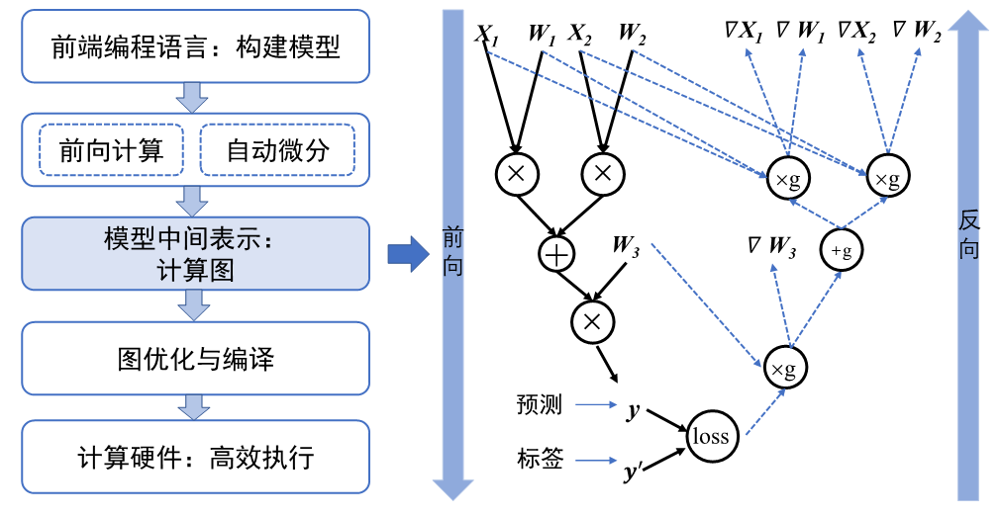

## 计算图的设计背景和作用

:width:`800px`
:label:`dag`

早期机器学习框架主要针对全连接和卷积神经网络设计，这些神经网络的拓扑结构简单，神经网络层之间通过串行连接。因此，它们的拓扑结构可以用简易的配置文件表达（例如Caffe基于Protocol Buffer格式的模型定义）。

现代机器学习模型的拓扑结构日益复杂，显著的例子包括混合专家模型、生成对抗网络、注意力模型等。复杂的模型结构（例如带有分支的循环结构等）需要机器学习框架能够对模型算子的执行依赖关系、梯度计算以及训练参数进行快速高效的分析，便于优化模型结构、制定调度执行策略以及实现自动化梯度计算，从而提高机器学习框架训练复杂模型的效率。因此，机器学习系统设计者需要一个通用的数据结构来理解、表达和执行机器学习模型。为了应对这个需求，如:numref:`dag`所示基于计算图的机器学习框架应运而生，框架延续前端语言与后端语言分离的设计。从高层次来看，计算图实现了以下关键功能：

-   **统一的计算过程表达。**
    在编写机器学习模型程序的过程中，用户希望使用高层次编程语言（如Python、Julia和C++）。然而，硬件加速器等设备往往只提供了C和C++编程接口，因此机器学习系统的实现通常需要基于C和C++。用不同的高层次语言编写的程序因此需要被表达为一个统一的数据结构，从而被底层共享的C和C++系统模块执行。这个数据结构（即计算图）可以表述用户的输入数据、模型中的计算逻辑（通常称为算子）以及算子之间的执行顺序。

-   **自动化计算梯度。**
    用户的模型训练程序接收训练数据集的数据样本，通过神经网络前向计算，最终计算出损失值。根据损失值，机器学习系统为每个模型参数计算出梯度来更新模型参数。考虑到用户可以写出任意的模型拓扑和损失值计算方法，计算梯度的方法必须通用并且能实现自动运行。计算图可以辅助机器学习系统快速分析参数之间的梯度传递关系，实现自动化计算梯度的目标。

-   **分析模型变量生命周期。**
     在用户训练模型的过程中，系统会通过计算产生临时的中间变量，如前向计算中的激活值和反向计算中的梯度。前向计算的中间变量可能与梯度共同参与到模型的参数更新过程中。通过计算图，系统可以准确分析出中间变量的生命周期（一个中间变量生成以及销毁时机），从而帮助框架优化内存管理。

-   **优化程序执行。**
    用户给定的模型程序具备不同的网络拓扑结构。机器学习框架利用计算图来分析模型结构和算子执行依赖关系，并自动寻找算子并行计算的策略，从而提高模型的执行效率。