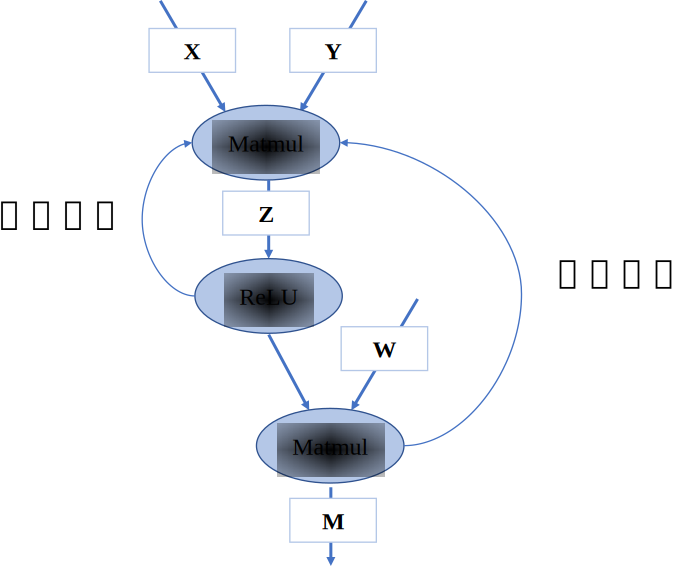
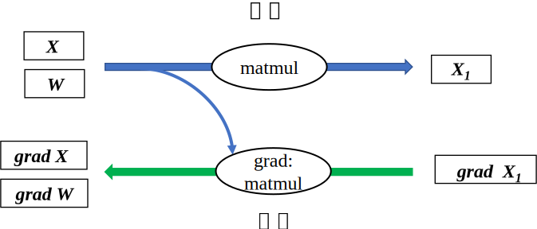

## 计算图的基本构成

计算图是用来表示深度学习网络模型在训练与推理过程中计算逻辑与状态的工具。计算框架在后端会将前端语言构建的神经网络模型前向计算与反向梯度计算以计算图的形式来进行表示。计算图由基本数据结构张量(Tensor)和基本运算单元算子(Operator)构成。在计算图中通常使用节点来表示算子，节点间的有向线段来表示张量状态，同时也描述了计算间的依赖关系。如 :numref:`simpledag`所示，将$\boldsymbol{Z}=relu(\boldsymbol{X}*\boldsymbol{Y})$转化为计算图表示，数据流将根据图中流向与算子进行前向计算和反向梯度计算来更新图中张量状态，以此达到训练模型的目的。


:width:`300px`
:label:`simpledag`
### 张量和算子

在计算框架中，基础组件包含张量和算子，张量是基础数据结构，算子是基本运算单元。在数学中定义张量是基于向量与矩阵的推广，涵盖标量、向量与矩阵的概念。可以将标量理解为零阶张量，向量为一阶张量，我们熟悉的RGB彩色图像即为三阶张量。在计算框架中张量不仅存储数据，还存储数据类型、数据形状、维度或秩以及梯度传递状态等多个属性，如表3.2.1所示，列举了主要的属性和功能。

:张量属性

 |张量属性|功能|
  |:-: |:-:|
 |  形状(shape)     |            存储张量的每个维度的长度，如[3,3,3] |
  |  维度或秩(dim)     |       表示张量维度的数量，标量为0，向量为1、矩阵为2|
  | 数据类型(dtype)    |表示存储的数据类型，如bool、int8、int16、float32、float64等|
  | 存储位置(device)    |     创建张量时可以指定存储的设备位置，如CPU、GPU等|
  |    名字(name)        |                     张量的标识符             |
:label:`tensor_attr`

张量的形状是一个重要的属性，它记录了每个轴的长度，也就是张量每个维度的元素数量。秩则代表张量的轴数或者阶数。张量中通常可以保存布尔类型、浮点数、整型数以及复数和字符串数据。每一个张量都具有唯一的数据类型，在计算过程中会对所有参与运算的张量进行类型检查，当发现类型不匹配时就会报错。部分特殊的计算则必须使用指定的数据类型，比如逻辑运算应为布尔类型。在部分计算框架中张量的属性中包含可以指明张量存储的设备位置，比如存储于CPU、GPU等。张量数据的存储状态可以分为可变和不可变两种，不可变张量一般用于用户初始化的数据或者网络模型输入的数据；而可变张量则存储网络权重参数，根据梯度信息更新自身数据。

如 :numref:`tensor`，标量就是一个零阶张量，包含单个数值但没有轴信息。向量即为一阶张量，具有一个轴。二阶张量具有两个轴即秩为二。


:width:`800px`
:label:`tensor`
通常我们使用的张量是"整齐"的，每个轴上的具有相同的元素个数，就像一个"矩形"或者"立方体"。在特定的环境中，也会使用特殊类型的张量，比如不规则张量和稀疏张量，如 :numref:`tensorclass`中所示。不规则张量在某个轴上可能具有不同的元素个数，它们支持存储和处理包含非均匀形状的数据，在自然语言处理领域，不规则张量可以存储不同长度文本的信息。稀疏张量则通常应用于图数据与图神经网络中，采用特殊的存储格式如坐标表格式（Coordinate
List， COO），可以高效存储稀疏数据，节省存储空间。


:width:`800px`
:label:`tensorclass`
算子是构成神经网络的基本计算单元。算子按照功能可以分为张量操作、神经网络操作、数据流操作和控制流操作等。

-   **张量操作**：包括张量的结构操作和张量的数学运算。张量结构操作有：张量创建、索引切片、维度变换和合并分割等。张量的数学运算包含标量运算、向量运算和矩阵运算。标量运算符的特点是对张量实施逐元素运算。向量运算符只在一个特定轴上运算，将一个向量映射到一个标量或者另外一个向量。矩阵运算包括矩阵乘法、矩阵范数、矩阵行列式、矩阵求特征值、矩阵分解等运算。

-   **神经网络操作**：包括特征提取、激活函数、损失函数、优化算法等。特征提取是机器学习中的常见操作，核心是提取比原输入更具代表性的张量，常见的卷积操作就是特征提取算子。激活函数(Activation
    Function)负责将神经网络层的输入映射到输出端。引入激活函数是为了增加神经网络模型的非线性，没有激活函数的每层都相当于矩阵相乘。常见的激活函数包括S型生长曲线(Sigmoid)、线性矫正单元(Rectified Linear Unit, ReLU)等。损失函数(Loss Function)是用来估量模型的预测值与真实值之间的不一致程度。优化算法基于梯度采用不同策略更新参数权值来最小化损失函数，常见的优化算法有随机梯度下降法(Stochastic Gradient Descent, SGD)、自适应矩估计(Adaptive Moment Estimation, Adam)等。

-   **数据流操作**：包含数据的预处理与数据载入相关算子，数据预处理算子主要是针对图像数据和文本数据的裁剪填充、归一化、数据增强等操作。数据载入通常会对数据集进行随机乱序(Shuffle)、分批次载入(Batch)以及预载入(Prefetch)等操作。数据流操作主要功能是对原始数据进行处理后，转换为计算框架本身支持的数据格式，并且按照迭代次数输入给网络进行训练或者推理，提升数据载入速度，减少内存占用空间，降低网络训练等待时间。

-   **控制流操作**：可以控制计算图中的数据流向，当表示灵活复杂的模型时需要控制流。使用频率比较高的控制流算子有条件运算符和循环运算符。控制流操作一般分为两类，计算框架本身提供的控制流操作符和前端语言控制流操作符。控制流操作不仅会影响神经网络模型前向运算的数据流向，也会影响反向梯度运算的数据流向。

### 计算依赖

在计算图中，算子之间存在依赖关系，而这种依赖关系影响了算子的执行顺序与并行情况。此外在深度学习算法模型中，计算图是一个有向无环图，也即在计算图中造成循环依赖的数据流向是不被允许的。为了理解计算依赖关系并且分析计算图中循环与循环依赖之间的区别，下面将对计算图中的计算节点依赖关系进行讲解。


:width:`400px`
:label:`dependence`

如 :numref:`dependence`中所示，在此简单的计算图中，若将$\mathbf{Matmul1}$算子移除则该节点无输出，导致后续的激活函数无法得到输入，从而计算图中的数据流动中断，这表明计算图中的算子间具有依赖关系并且存在传递性。我们对依赖关系进行区分如下：

-   **直接依赖**：节点$\mathbf{ReLU1}$直接依赖于节点$\mathbf{Matmul1}$，即如果节点$\mathbf{ReLU1}$要执行运算，必须接受直接来自节点$\mathbf{Matmul1}$的输出数据；

-   **间接依赖**：节点$\mathbf{Add}$间接依赖于节点$\mathbf{Matmul1}$，即节点$\mathbf{Matmul1}$的数据并未直接传输给节点$\mathbf{Add}$，而是经过了某个或者某些中间节点进行处理后再传输给节点$\mathbf{Add}$，而这些中间节点可能是节点$\mathbf{Add}$的直接依赖节点，也可能是间接依赖节点；

-   **相互独立**：在计算图中节点$\mathbf{Matmul1}$与节点$\mathbf{Matmul2}$之间并无数据输入输出依赖关系，所以这两个节点间相互独立。

掌握依赖关系后，分析 :numref:`recurrent`可以得出节点$\mathbf{Add}$间接依赖于节点$\mathbf{Matmul}$，而节点$\mathbf{Matmul}$直接依赖于节点$\mathbf{Add}$，此时两个节点互相等待对方计算完成输出数据，将无法执行计算任务。若我们手动同时给两个节点赋予输入，计算将持续不间断进行，模型训练将无法停止造成死循环。循环依赖产生正反馈数据流，被传递的数值可能在正方向上无限放大，导致数值上溢，或者负方向上放大导致数值下溢，也可能导致数值无限逼近于0，这些情况都会致使模型训练无法得到预期结果。在构建深度学习模型时，应避免算子间产生循环依赖。


:width:`300px`
:label:`recurrent`

在深度学习计算框架中，表示循环关系通常是以**展开**机制（Unrolling）来实现。当需要实现循环关系时，循环体的计算子图按照迭代次数进行复制，将代表相邻迭代轮次的子图进行串联，相邻迭代轮次的计算子图之间就是直接依赖关系。循环三次的计算图进行展开如 :numref:`unroll`。在计算图中，每一个张量和运算符都具有独特的标识符，即使是相同的操作运算，在参与不同计算任务时都具有不同的标识符。区分循环关系和循环依赖的关键在于，是否两个独特标识符之间的运算互相具有直接依赖和相互依赖。循环关系在展开复制计算子图的时候会给复制的所有张量和运算符赋予新的标识符，区分被复制的原始子图，以避免形成循环依赖。


:width:`800px`
:label:`unroll`

### 控制流

控制流能够设定特定的顺序执行计算任务。若计算图中无控制流，则每个节点只执行一次，当所有节点按照顺序执行完时，计算图即完成计算。加入控制流后可以让计算图中某些节点循环执行任意次数，也可以根据条件判断选择某些节点不执行，控制流使得我们可以构建更加灵活和复杂的模型。许多机器学习模型依赖控制流进行训练和推理，特别是基于递归神经网络和强化学习的模型就依赖于循环递归关系和依据数据的条件执行。

为了提高性能、可扩展性和表达能力，计算框架必须支持控制流。目前主流的计算框架中通常使用两种方式来提供控制流：

-   **计算框架控制原语**：计算框架在内部设计了低级别细粒度的控制原语运算符，通过原语运算符的结合使用来实现控制流，这种实现方式也被称为图内方法（In-graph approach）。此类方法的代表就是TensorFlow中的Switch、Merge、Enter、Exit、NextIteration五个原语。TensorFlow通过组合五个原语提供*tf.cond()*和*tf.while_loop()*来实现条件控制和循环控制。

-   **前端语言控制流**：通过高级语言Python、C++的控制流语句来进行计算图中的控制决策，这类实现方式也被称为图外方法（Out-of-graph approach）。计算框架PyTorch、MindSpore中就直接使用Python的控制流，将控制流和数据流之间保持了严格的分离。

图内方法控制流采用框架原语实现，在进行模型编译、优化与运行时都具备优势，并且可以准确的判定机器学习模型中计算梯度时需要缓存的变量，提高运行效率，同时由于不依赖外部语言便于部署到不同环境中去。但由于控制原语缺乏进一步的抽象，对于用户不友好，需要掌握控制原语的使用方法，结合前端语言使用才能描述复杂模型结构。

相对于图内方法，图外方法直接使用前端语言控制流则相对更加灵活易用，用户编写模型控制时更加便捷直观，其缺点在于若要将模型进行优化部署，则需要在编译阶段将前端语言的控制流转化为框架原语描述。

目前在主流的深度学习计算框架中，均提供图外方法和图内方法支持。为了便于理解控制流对前向计算与反向计算的影响，后续的讲解均使用**图外方法**实现控制流。常见的控制流包括条件分支与循环两种。当模型包含控制流操作时，梯度在反向传播经过控制流时，需要在反向梯度计算图中也构造生成相应的控制流，才能够正确计算参与运算的张量梯度。

下面这段代码描述了简单的条件控制，我们使用*matmul*表示矩阵乘法算子：
```python
def control(A, B, C, conditional = True):
    if conditional:     
        y = matmul(A, B)   
    else:     
        y = matmul(A, C)
    return y
```

:width:`600px`
:label:`if`

 :numref:`if`描述上述代码的前向计算图和反向计算图。对于具有if-条件的模型，梯度计算需要知道采用了条件的哪个分支，然后将梯度逻辑应用于该分支。在前向计算图中张量${C}$经过条件控制不参与计算，在反向计算时同样遵守控制流决策，不会计算关于张量$C$的梯度。

当模型中有循环控制时，循环中的操作可以执行零次或者多次。此时采用展开机制，对每一次操作都赋予独特的运算标识符，以此来区分相同运算操作的多次调用。每一次循环都直接依赖于前一次循环的计算结果，所以在循环控制中需要维护一个张量列表，将循环迭代的中间结果缓存起来，这些中间结果将参与前向计算和梯度计算。下面这段代码描述了简单的循环控制，将其展开得到等价代码后，可以清楚的理解需要维护张量$\boldsymbol{X_i}$和$\boldsymbol{W_i}$的列表。
```python
def recurrent_control(X : Tensor, W : Sequence[Tensor], cur_num = 3):
    for i in range(cur_num):    
        X = matmul(X, W[i]) 
    return X
#利用展开机制将上述代码展开，可得到等价表示
def recurrent_control(X : Tensor, W : Sequence[Tensor]):
    X1 = matmul(X, W)   #为便于表示与后续说明，此处W = W[0], W1 = W[1], W2 = W[2]
    X2 = matmul(X1, W1)
    Y = matmul(X2, W2) 
    return Y
```
如 :numref:`while`描述了上述代码的前向计算图和反向计算图，循环控制的梯度同样也是一个循环，它与前向循环相迭代次数相同，执行循环体的梯度计算。循环体输出的梯度值作为下一次梯度计算的初始值，直至循环结束。


:width:`600px`
:label:`while`

### 基于链式法则计算梯度

在上一小节循环展开的例子中，当神经网络接收输入张量$\boldsymbol{Y}$后，输入数据根据计算图逐层进行计算并保存中间结果变量，直至经过多层的计算后最终产生输出$\boldsymbol{Y_3}$，这个过程我们称之为**前向传播**（Forward
propagation）。在深度神经网络模型训练过程中，前向传播的输出结果与标签值可以产生一个损失函数结果。模型将来自损失函数的数据信息通过计算图反向流动，执行梯度计算来进行更新训练参数，这个过程我们称之为**反向传播**（Back
propagation）。在神经网络模型中，反向传播通常使用损失函数关于参数的梯度来进行更新，也可以使用其他信息进行反向传播，在这里我们仅讨论一般情况。

在这里我们简单回忆一下复合函数的链式法则公式。链式法则是微积分中的求导法则，用于求解复合函数中的导数。复合函数的导数是构成复合有限个函数在相应点的导数乘积。假设*f*和*g*是关于实数*x*的映射函数，设$y=g(x)$并且$z=f(y)=f(g(x))$，则*z*对*x*的导数即为：

$$
\frac{dz}{dx}=\frac{dz}{dy}\frac{dy}{dx}$$

神经网络的反向传播是根据反向计算图的特定运算顺序来执行链式法则的算法。由于神经网络的输入通常为三维张量，输出为一维向量。因此将上述复合函数关于标量的梯度法则进行推广和扩展。假设$\boldsymbol{X}$是*m*维张量，$\boldsymbol{Y}$为*n*维张量，$\boldsymbol{z}$为一维向量，$\boldsymbol{Y}=g(\boldsymbol{X})$并且$\boldsymbol{z}=f(\boldsymbol{Y})$，则$\boldsymbol{z}$关于$\boldsymbol{X}$每一个元素的偏导数即为：

$$
\frac{\partial z}{\partial x_i}=\sum_j\frac{\partial z}{\partial y_j}\frac{\partial y_j}{\partial x_i}$$

上述公式可以等价的表示为：

$$
\nabla_{\boldsymbol{X}}\boldsymbol{z} = (\frac{\partial \boldsymbol{Y}}{\partial \boldsymbol{X}})^{\top}\nabla_{\boldsymbol{Y}}\boldsymbol{z}$$

其中$\nabla_{\boldsymbol{X}}\boldsymbol{z}$表示$\boldsymbol{z}$关于$\boldsymbol{X}$的梯度矩阵。

上一小节中简单的循环控制模型前向传播可以表示为$\boldsymbol{Y}=\boldsymbol{W_2}(\boldsymbol{W_1}(\boldsymbol{W}(\boldsymbol{X})))$。在反向传播的过程中可以将前向计算等价为$\boldsymbol{Y}=\boldsymbol{W_2}\boldsymbol{X_2}$，首先得到参数$\boldsymbol{W_2}$的梯度表示。再接着根据$\boldsymbol{X_2}=\boldsymbol{W_1}\boldsymbol{X_1}$得到$\boldsymbol{W_1}$的梯度表示，按照层级即可推导得出$\boldsymbol{W}$的梯度表示。

$$
\begin{aligned}
\nabla\boldsymbol{X_2} &= \nabla\boldsymbol{Y}\boldsymbol{W_2}^\top  \\
\nabla\boldsymbol{W_2} &= \boldsymbol{X_2}^\top\nabla\boldsymbol{Y}   \\
\nabla\boldsymbol{X_1} &= \nabla\boldsymbol{X_2}\boldsymbol{W_1}^\top = (\nabla\boldsymbol{Y}\boldsymbol{W_2}^\top)\boldsymbol{W_1}^\top   \\
\nabla\boldsymbol{W_1} &= \boldsymbol{X_1}^\top\nabla\boldsymbol{X_2} = \boldsymbol{X_1}^\top(\nabla\boldsymbol{Y}\boldsymbol{W_2}^\top)  \\
\nabla\boldsymbol{X} &= \nabla\boldsymbol{X_1}\boldsymbol{W}^\top = ((\nabla\boldsymbol{Y}\boldsymbol{W_2}^\top)\boldsymbol{W_1}^\top)\boldsymbol{W}^\top   \\
\nabla\boldsymbol{W} &= \boldsymbol{X}^\top\nabla\boldsymbol{X_1} = \boldsymbol{X}^\top((\nabla\boldsymbol{Y}\boldsymbol{W_2}^\top)\boldsymbol{W_1}^\top)
\end{aligned}
$$

根据链式法则，相应位置的导数乘积即可将网络得到的损失函数梯度信息传播到每一个权重参数，应用优化器的参数权重更新规则，即可达到神经网络模型参数训练迭代的目的。

根据上述公式我们可以得出循环控制的反向梯度计算过程如下，在下面代码中伪变量的前缀*grad*代表变量梯度变量，*transpose*代表矩阵转置算子。
```python
grad_X2 = matmul(grad_Y, transpose(W2))
grad_W2 = matmul(transpose(X2), grad_Y)
grad_X1 = matmul(grad_X2, transpose(W1))
grad_W1 = matmul(transpose(X1), grad_X2)
grad_X = matmul(grad_X1, transpose(W))
grad_W = matmul(transpose(X), grad_X1)
```
结合公式、代码以及 :numref:`chain`我们可以看出，在反向传播过程中使用到前向传播的中间变量。因此保存网络中间层输出状态和中间变量，尽管占用了部分内存但能够复用计算结果，达到了提高反向传播计算效率的目的。


:width:`600px`
:label:`chain`

在深度学习计算框架中，控制流可以进行嵌套，比如多重循环和循环条件控制，计算图会对复杂控制流进行准确的描述，以便于执行正确的计算调度与执行任务。