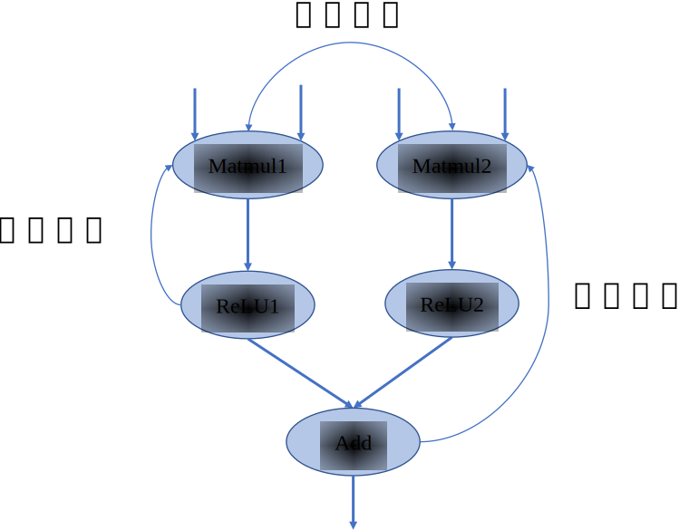

## 计算图的基本构成

计算图由基本数据结构张量（Tensor）和基本运算单元算子构成。在计算图中通常使用节点来表示算子，节点间的有向边（Directed Edge）来表示张量状态，同时也描述了计算间的依赖关系。如 :numref:`simpledag`所示，将$\boldsymbol{Z}=ReLU(\boldsymbol{X}\times\boldsymbol{Y})$转化为计算图表示。


:width:`300px`
:label:`simpledag`
### 张量和算子

在数学中定义张量是基于标量与向量的推广。在机器学习领域内将多维数据称为张量，使用秩来表示张量的轴数或维度。如:numref:`tensor`所示，标量为零秩张量，包含单个数值，没有轴；向量为一秩张量，拥有一个轴；拥有RGB三个通道的彩色图像即为三秩张量，包含三个轴。


:width:`800px`
:label:`tensor`

在机器学习框架中张量不仅存储数据，还需要存储张量的数据类型、数据形状、秩以及梯度传递状态等多个属性，如:numref:`tensor_attr`所示，列举了主要的属性和功能。

:张量属性

| 张量属性        | 功能   | 
| -------------- | -------|
| 形状(shape)     | 存储张量的每个维度的长度，如[3,3,3]                            |
| 秩或维数（dim）    | 表示张量的轴数或者维数，标量为0，向量为1。                 |
| 数据类型(dtype)  | 表示存储的数据类型，如bool、uint8、int16、float32、float64等   |
| 存储位置(device) | 创建张量时可以指定存储的设备位置，如CPU、GPU等                 |
| 名字(name)       | 张量的标识符                                                 |
:label:`tensor_attr`

以图像数据为例来具体说明张量属性的作用。当机器学习框架读取一张高为96像素、宽为96像素的RGB三通道图像，并将图像数据转换为张量存储时。该张量的形状属性则为[96,96,3]分别代表高、宽、通道的数量，秩即为3。原始RGB图像每个像素上的数据以0-255的无符号整数来表示色彩，因此图像张量存储时会将数据类型属性设置为uint8格式。将图像数据传输给卷积网络模型进行网络训练前，会对图像数据进行归一化处理，此时数据类型属性会重新设置为float32格式，因为通常机器学习框架在训练模型时默认采用float32格式。

机器学习框架在训练时需要确定在CPU、GPU或其他硬件上执行计算，数据和权重参数也应当存放在对应的硬件内存中才能正确被调用，张量存储位置属性则用来指明存储的设备位置。存储位置属性通常由机器学习框架根据硬件环境自动赋予张量。在模型训练过程中，张量数据的存储状态可以分为可变和不可变两种，可变张量存储神经网络模型权重参数，根据梯度信息更新自身数据，如参与卷积运算的卷积核张量；不可变张量用于用户初始化的数据或者输入模型的数据，如上文提到的图像数据张量。

那么在机器学习场景下的张量一般长什么样子呢？上文提到的图像数据张量以及卷积核张量，形状一般是“整齐”的。即每个轴上的具有相同的元素个数，就像一个“矩形”或者“立方体”。在特定的环境中，也会使用特殊类型的张量，比如不规则张量和稀疏张量。如 :numref:`tensorclass`中所示，不规则张量在某个轴上可能具有不同的元素个数，它们支持存储和处理包含非均匀形状的数据，如在自然语言处理领域中不同长度文本的信息；稀疏张量则通常应用于图数据与图神经网络中，采用特殊的存储格式如坐标表格式（Coordinate List，COO），可以高效存储稀疏数据节省存储空间。


:width:`800px`
:label:`tensorclass`

算子是构成神经网络的基本计算单元，对张量数据进行加工处理，实现了多种机器学习中常用的计算逻辑，包括数据转换、条件控制、数学运算等。为了便于梳理算子类别，按照功能将算子分类为张量操作算子、神经网络算子、数据流算子和控制流算子等。

-   **张量操作算子**：包括张量的结构操作和数学运算。张量的结构操作通常用于张量的形状、维度调整以及张量合并等，比如在卷积神经网络中可以选择图像数据以通道在前或者通道在后的格式来进行计算，调整图像张量的通道顺序就需要结构操作。张量相关的数学运算算子，例如矩阵乘法、计算范数、行列式和特征值计算，在机器学习模型的梯度计算中经常被使用到。

-   **神经网络算子**：包括特征提取、激活函数、损失函数、优化算法等，是构建神经网络模型频繁使用的核心算子。常见的卷积操作就是特征提取算子，用来提取比原输入更具代表性的特征张量。激活函数能够增加神经网络模型非线性能力，帮助模型表达更加复杂的数据特征关系。损失函数和优化算法则与模型参数训练更新息息相关。

-   **数据流算子**：包含数据的预处理与数据载入相关算子，数据预处理算子主要是针对图像数据和文本数据的裁剪填充、归一化、数据增强等操作。数据载入算子通常会对数据集进行随机乱序(Shuffle)、分批次载入(Batch)以及预载入(Pre-fetch)等操作。数据流操作主要功能是对原始数据进行处理后，转换为机器学习框架本身支持的数据格式，并且按照迭代次数输入给网络进行训练或者推理，提升数据载入速度，减少内存占用空间，降低网络训练数据等待时间。

-   **控制流算子**：可以控制计算图中的数据流向，当表示灵活复杂的模型时需要控制流。使用频率比较高的控制流算子有条件运算符和循环运算符。控制流操作一般分为两类，机器学习框架本身提供的控制流操作符和前端语言控制流操作符。控制流操作不仅会影响神经网络模型前向运算的数据流向，也会影响反向梯度运算的数据流向。

### 计算依赖

在计算图中，算子之间存在依赖关系，而这种依赖关系影响了算子的执行顺序与并行情况。机器学习算法模型中，计算图是一个有向无环图，即在计算图中造成循环依赖（Circular Dependency）的数据流向是不被允许的。循环依赖会形成计算逻辑上的死循环，模型的训练程序将无法正常结束，而流动在循环依赖闭环上的数据将会趋向于无穷大或者零成为无效数据。为了分析计算执行顺序和模型拓扑设计思路，下面将对计算图中的计算节点依赖关系进行讲解。

如 :numref:`dependence`中所示，在此计算图中，若将Matmul1算子移除则该节点无输出，导致后续的激活函数无法得到输入，从而计算图中的数据流动中断，这表明计算图中的算子间具有依赖关系并且存在传递性。


:width:`400px`
:label:`dependence`

将依赖关系进行区分如下：

-   **直接依赖**：节点ReLU1直接依赖于节点Matmul1，即如果节点ReLU1要执行运算，必须接受直接来自节点Matmul1的输出数据；

-   **间接依赖**：节点Add间接依赖于节点Matmul1，即节点Matmul1的数据并未直接传输给节点Add，而是经过了某个或者某些中间节点进行处理后再传输给节点Add，而这些中间节点可能是节点Add的直接依赖节点，也可能是间接依赖节点；

-   **相互独立**：在计算图中节点Matmul1与节点Matmul2之间并无数据输入输出依赖关系，所以这两个节点间相互独立。

掌握依赖关系后，分析 :numref:`recurrent`可以得出节点Add间接依赖于节点Matmul，而节点Matmul直接依赖于节点Add，此时两个节点互相等待对方计算完成输出数据，将无法执行计算任务。若我们手动同时给两个节点赋予输入，计算将持续不间断进行，模型训练将无法停止造成死循环。循环依赖产生正反馈数据流，被传递的数值可能在正方向上无限放大，导致数值上溢，或者负方向上放大导致数值下溢，也可能导致数值无限逼近于0，这些情况都会致使模型训练无法得到预期结果。在构建深度学习模型时，应避免算子间产生循环依赖。


:width:`300px`
:label:`recurrent`

在机器学习框架中，表示循环关系（Loop Iteration）通常是以**展开**机制（Unrolling）来实现。循环三次的计算图进行展开如 :numref:`unroll`，循环体的计算子图按照迭代次数进行复制3次，将代表相邻迭代轮次的子图进行串联，相邻迭代轮次的计算子图之间是直接依赖关系。在计算图中，每一个张量和运算符都具有独特的标识符，即使是相同的操作运算，在参与循环不同迭代中的计算任务时具有不同的标识符。区分循环关系和循环依赖的关键在于，具有两个独特标识符的计算节点之间是否存在相互依赖关系。循环关系在展开复制计算子图的时候会给复制的所有张量和运算符赋予新的标识符，区分被复制的原始子图，以避免形成循环依赖。


:width:`800px`
:label:`unroll`

### 控制流

控制流能够设定特定的顺序执行计算任务，帮助构建更加灵活和复杂的模型。在模型中引入控制流后可以让计算图中某些节点循环执行任意次数，也可以根据条件判断选择某些节点不执行。许多深度学习模型依赖控制流进行训练和推理，基于递归神经网络和强化学习的模型就依赖于循环递归关系和依据输入数据状态条件执行计算。

目前主流的机器学习框架中通常使用两种方式来提供控制流：

-   **前端语言控制流**：通过Python语言控制流语句来进行计算图中的控制决策。使用前端语言控制流构建模型结构简便快捷，但是由于机器学习框架的数据计算运行在后端硬件，造成控制流和数据流之间的分离，计算图不能完整运行在后端计算硬件上。因此这类实现方式也被称为图外方法（Out-of-Graph Approach）

-   **机器学习框架控制原语**：机器学习框架在内部设计了低级别细粒度的控制原语运算符。低级别控制原语运算符能够执行在计算硬件上，与模型结构结合使用可将整体计算图在后端运算，这种实现方式也被称为图内方法（In-Graph Approach）。

为什么机器学习框架会采用两种不同的原理来实现控制流呢？为了解决这个疑问，首先了解两种方法在实现上的区别。

使用Python语言编程的用户对于图外方法较为熟悉。图外方法允许用户直接使用if-else、while和for这些Python命令来构建控制流。该方法使用时灵活易用便捷直观。

而图内方法相比于图外方法则较为烦琐。TensorFlow中可以使用图内方法控制流算子（如tf.cond条件控制、tf.while\_loop循环控制和tf.case分支控制等）来构建模型控制流，这些算子是使用更加低级别的原语运算符组合而成。图内方法的控制流表达与用户常用的编程习惯并不一致，牺牲部分易用性换取的是计算性能提升。

图外方法虽然易用，但后端计算硬件可能无法支持前端语言的运行环境，导致无法直接执行前端语言控制流。而图内方法虽然编写烦琐，但可以不依赖前端语言环境直接在计算硬件上执行。在进行模型编译、优化与运行时都具备优势，提高运行效率。

因此两种控制流的实现方式其实对应着不同的使用场景。当需要在计算硬件上脱离前端语言环境执行模型训练、推理和部署等任务，需要采用图内方法来构建控制流。用户使用图外方法方便快速将算法转化为模型代码，方便验证模型构造的合理性。

目前在主流的机器学习框架中，均提供图外方法和图内方法支持。鉴于前端语言控制流使用频繁为人熟知，为了便于理解控制流对前向计算与反向计算的影响，后续的讲解均使用图外方法实现控制流。常见的控制流包括条件分支与循环两种。当模型包含控制流操作时，梯度在反向传播经过控制流时，需要在反向梯度计算图中也构造生成相应的控制流，才能够正确计算参与运算的张量梯度。

下面这段代码描述了简单的条件控制，matmul表示矩阵乘法算子：
```python
def control(A, B, C, conditional = True):
    if conditional:     
        y = matmul(A, B)   
    else:     
        y = matmul(A, C)
    return y
```

 :numref:`if`描述上述代码的前向计算图和反向计算图。对于具有if条件的模型，梯度计算需要知道采用了条件的哪个分支，然后将梯度计算逻辑应用于该分支。在前向计算图中张量$\boldsymbol{C}$经过条件控制不参与计算，在反向计算时同样遵守控制流决策，不会计算关于张量$\boldsymbol{C}$的梯度。


:width:`600px`
:label:`if`


当模型中有循环控制时，循环中的操作可以执行零次或者多次。此时采用展开机制，对每一次操作都赋予独特的运算标识符，以此来区分相同运算操作的多次调用。每一次循环都直接依赖于前一次循环的计算结果，所以在循环控制中需要维护一个张量列表，将循环迭代的中间结果缓存起来，这些中间结果将参与前向计算和梯度计算。下面这段代码描述了简单的循环控制，将其展开得到等价代码后，可以清楚的理解需要维护张量$\boldsymbol{X_i}$和$\boldsymbol{W_i}$的列表。
```python
def recurrent_control(X : Tensor, W : Sequence[Tensor], cur_num = 3):
    for i in range(cur_num):    
        X = matmul(X, W[i]) 
    return X
#利用展开机制将上述代码展开，可得到等价表示
def recurrent_control(X : Tensor, W : Sequence[Tensor]):
    X1 = matmul(X, W)   #为便于表示与后续说明，此处W = W[0], W1 = W[1], W2 = W[2]
    X2 = matmul(X1, W1)
    Y = matmul(X2, W2) 
    return Y
```
如 :numref:`while`描述了上述代码的前向计算图和反向计算图，循环控制的梯度同样也是一个循环，它与前向循环的迭代次数相同。执行循环体的梯度计算中，循环体当前迭代计算输出的梯度值作为下一次迭代中梯度计算的输入值，直至循环结束。


:width:`600px`
:label:`while`

### 基于链式法则计算梯度

在上一小节循环展开的例子中，当神经网络接收输入张量$\boldsymbol{Y}$后，输入数据根据计算图逐层进行计算并保存中间结果变量，直至经过多层的计算后最终产生输出$\boldsymbol{Y_3}$，这个过程我们称之为**前向传播**（Forward
propagation）。在深度神经网络模型训练过程中，前向传播的输出结果与标签值通过计算产生一个损失函数结果。模型将来自损失函数的数据信息通过计算图反向传播，执行梯度计算来更新训练参数。在神经网络模型中，反向传播通常使用损失函数关于参数的梯度来进行更新，也可以使用其他信息进行反向传播，在这里仅讨论一般情况。

反向传播过程中，使用链式法则来计算参数的梯度信息。链式法则是微积分中的求导法则，用于求解复合函数中的导数。复合函数的导数是构成复合有限个函数在相应点的导数乘积。假设*f*和*g*是关于实数*x*的映射函数，设$y=g(x)$并且$z=f(y)=f(g(x))$，则*z*对*x*的导数即为：

$$
\frac{dz}{dx}=\frac{dz}{dy}\frac{dy}{dx}~~~~~~~~~~~(3.1)$$

神经网络的反向传播是根据反向计算图的特定运算顺序来执行链式法则的算法。由于神经网络的输入通常为三维张量，输出为一维向量。因此将上述复合函数关于标量的梯度法则进行推广和扩展。假设$\boldsymbol{X}$是*m*维张量，$\boldsymbol{Y}$为*n*维张量，$\boldsymbol{z}$为一维向量，$\boldsymbol{Y}=g(\boldsymbol{X})$并且$\boldsymbol{z}=f(\boldsymbol{Y})$，则$\boldsymbol{z}$关于$\boldsymbol{X}$每一个元素的偏导数即为：

$$
\frac{\partial z}{\partial x_i}=\sum_j\frac{\partial z}{\partial y_j}\frac{\partial y_j}{\partial x_i}~~~~~~~~~~~(3.2)$$

上述公式可以等价的表示为：

$$
\nabla_{\boldsymbol{X}}\boldsymbol{z} = (\frac{\partial \boldsymbol{Y}}{\partial \boldsymbol{X}})^{\top}\nabla_{\boldsymbol{Y}}\boldsymbol{z}~~~~~~~~~~~(3.3)$$

其中$\nabla_{\boldsymbol{X}}\boldsymbol{z}$表示$\boldsymbol{z}$关于$\boldsymbol{X}$的梯度矩阵。


为了便于理解链式法则在神经网络模型中的运用，给出如:numref:`chain`所示前向和反向结合的简单计算图。这个神经网络模型经过两次矩阵相乘得到预测值$\boldsymbol{Y}$，然后根据输出与标签值之间的误差值进行反向梯度传播，以最小化误差值的目的来更新参数权重，模型中需要更新的参数权重包含$\boldsymbol{W}$和$\boldsymbol{W_1}$。


:width:`600px`
:label:`chain`

假设选取均方误差为损失函数，那么损失值是怎样通过链式法则将梯度信息传递给图中的$\boldsymbol{W}$和$\boldsymbol{W_1}$呢？又为什么要计算非参数数据$\boldsymbol{X}$和$\boldsymbol{X_1}$的梯度呢？为了解决上述两个疑问，要详细思考前向传播和反向传播的计算过程。首先通过前向传播来计算损失值三个步骤：（1）$\boldsymbol{X_1}=\boldsymbol{XW}$；(2)$\boldsymbol{Y}=\boldsymbol{X_1W_1}$；（3）Loss=$\frac{1}{2}$($\boldsymbol{Y}$-Label)$^2$, 此处Label即为标签值。

得到损失函数之后，目的是最小化预测值和标签值间的差异。为此根据链式法则利用公式3.4和公式3.5来进行反向传播，来求解损失函数关于参数$\boldsymbol{W}$和$\boldsymbol{W_1}$的梯度值：

$$
\frac{\partial {\rm Loss}}{\partial \boldsymbol{W_1}}=\frac{\partial \boldsymbol{Y}}{\partial \boldsymbol{W_1}}\frac{\partial {\rm Loss}}{\partial \boldsymbol{Y}}  ~~~~~~~~~~~(3.4)
$$

$$
\frac{\partial {\rm Loss}}{\partial \boldsymbol{W}}=\frac{\partial \boldsymbol{X_1}}{\partial \boldsymbol{W}}\frac{\partial {\rm Loss}}{\partial \boldsymbol{Y}}\frac{\partial \boldsymbol{Y}}{\partial \boldsymbol{X_1}}  ~~~~~~~~~~~(3.5)
$$

可以看出公式3.4和公式3.5都计算了$\frac{\partial {\rm Loss}}{\partial \boldsymbol{Y}}$对应图3.10中的grad $\boldsymbol{Y}$。公式3.5中的$\frac{\partial {\rm Loss}}{\partial \boldsymbol{Y}}\frac{\partial \boldsymbol{Y}}{\partial \boldsymbol{X_1}}$对应:numref:`chain`中的grad $\boldsymbol{X_1}$，为了便于计算模型参数$\boldsymbol{W}$的梯度信息，需要计算中间结果$\boldsymbol{X_1}$的梯度信息。这也就解决了前面提出的第二个疑问，计算非参数的中间结果梯度是为了便于计算前序参数的梯度值。

接着将$\boldsymbol{X_1}=\boldsymbol{XW}$、$\boldsymbol{Y}=\boldsymbol{X_1W_1}$和Loss=$\frac{1}{2}$($\boldsymbol{Y}$-Label)$^2$代入公式3.4和公式3.5展开为公
式3.6和公式3.7，可以分析机器学习框架在利用链式法则构建反向计算图时，变量是如何具体参与到梯度计算中的。

$$
\frac{\partial {\rm Loss}}{\partial \boldsymbol{W_1}}=\frac{\partial \boldsymbol{Y}}{\partial \boldsymbol{W_1}}\frac{\partial {\rm Loss}}{\partial \boldsymbol{Y}}=\boldsymbol{X_1}^\top(\boldsymbol{Y}-{\rm Label})     ~~~~~~~~~~~(3.6)
$$

$$
\frac{\partial {\rm Loss}}{\partial \boldsymbol{W}}=\frac{\partial \boldsymbol{X_1}}{\partial \boldsymbol{W}}\frac{\partial {\rm Loss}}{\partial \boldsymbol{Y}}\frac{\partial \boldsymbol{Y}}{\partial \boldsymbol{X_1}}=\boldsymbol{X}^\top(\boldsymbol{Y}-{\rm Label})\boldsymbol{W_1}^\top    ~~~~~~~~~~~(3.7)
$$

公式3.6在计算$\boldsymbol{W_1}$的梯度值时使用到了前向图中的中间结果$\boldsymbol{X_1}$。公式3.7中不仅使用输入数据$\boldsymbol{X}$来进行梯度计算，参数$\boldsymbol{W_1}$也参与了参数$\boldsymbol{W}$的梯度值计算。因此可以回答第一个疑问，参与计算图中参数的梯度信息计算过程的不仅有后序网络层传递而来的梯度信息，还包含有前向计算中的中间结果和参数数值。

通过分析:numref:`chain`和公式3.4、3.5、3.6、3.7解决了两个疑问后，可以发现计算图在利用链式法则构建反向计算图时，会对计算过程进行分析保存模型中的中间结果和梯度传递状态，通过占用部分内存复用计算结果达到提高反向传播计算效率的目的。

将上述的链式法则推导推广到更加一般的情况，结合控制流的灵活构造，机器学习框架均可以利用计算图快速分析出前向数据流和反向梯度流的计算过程，正确的管理中间结果内存周期，更加高效的完成计算任务。


<!-- 上一小节中简单的循环控制模型前向传播可以表示为$\boldsymbol{Y}=\boldsymbol{W_2}(\boldsymbol{W_1}(\boldsymbol{W}(\boldsymbol{X})))$。在反向传播的过程中可以将前向计算等价为$\boldsymbol{Y}=\boldsymbol{W_2}\boldsymbol{X_2}$，首先得到参数$\boldsymbol{W_2}$的梯度表示。再接着根据$\boldsymbol{X_2}=\boldsymbol{W_1}\boldsymbol{X_1}$得到$\boldsymbol{W_1}$的梯度表示，按照层级即可推导得出$\boldsymbol{W}$的梯度表示：

$$
\begin{aligned}
\nabla\boldsymbol{X_2} &= \nabla\boldsymbol{Y}\boldsymbol{W_2}^\top  \\
\nabla\boldsymbol{W_2} &= \boldsymbol{X_2}^\top\nabla\boldsymbol{Y}   \\
\nabla\boldsymbol{X_1} &= \nabla\boldsymbol{X_2}\boldsymbol{W_1}^\top = (\nabla\boldsymbol{Y}\boldsymbol{W_2}^\top)\boldsymbol{W_1}^\top   \\
\nabla\boldsymbol{W_1} &= \boldsymbol{X_1}^\top\nabla\boldsymbol{X_2} = \boldsymbol{X_1}^\top(\nabla\boldsymbol{Y}\boldsymbol{W_2}^\top)  \\
\nabla\boldsymbol{X} &= \nabla\boldsymbol{X_1}\boldsymbol{W}^\top = ((\nabla\boldsymbol{Y}\boldsymbol{W_2}^\top)\boldsymbol{W_1}^\top)\boldsymbol{W}^\top   \\
\nabla\boldsymbol{W} &= \boldsymbol{X}^\top\nabla\boldsymbol{X_1} = \boldsymbol{X}^\top((\nabla\boldsymbol{Y}\boldsymbol{W_2}^\top)\boldsymbol{W_1}^\top)
\end{aligned}
$$

根据链式法则，相应位置的导数乘积即可将网络得到的损失函数梯度信息传播到每一个权重参数，应用优化器的参数权重更新规则，即可达到神经网络模型参数训练迭代的目的。

根据上述公式我们可以得出循环控制的反向梯度计算过程如下，在下面代码中变量的前缀*grad*代表变量梯度变量，*transpose*代表矩阵转置算子。
```python
grad_X2 = matmul(grad_Y, transpose(W2))
grad_W2 = matmul(transpose(X2), grad_Y)
grad_X1 = matmul(grad_X2, transpose(W1))
grad_W1 = matmul(transpose(X1), grad_X2)
grad_X = matmul(grad_X1, transpose(W))
grad_W = matmul(transpose(X), grad_X1)
```
结合公式、代码以及 :numref:`chain`我们可以看出，在反向传播过程中使用到前向传播的中间变量。因此保存网络中间层输出状态和中间变量，尽管占用了部分内存但能够复用计算结果，达到了提高反向传播计算效率的目的。


:width:`600px`
:label:`chain`

在深度学习计算框架中，控制流可以进行嵌套，比如多重循环和循环条件控制，计算图会对复杂控制流进行准确的描述，以便于执行正确的计算调度与执行任务。可以通过[代码示例](https://github.com/openmlsys/openmlsys-pytorch/blob/master/chapter_computational_graph/control_flow.py)查看在条件控制和循环控制下，前向和反向计算的数据流。 -->
