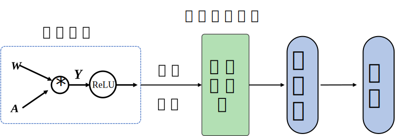
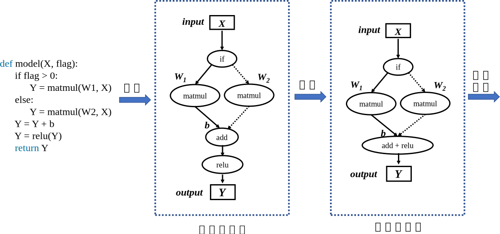
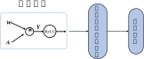
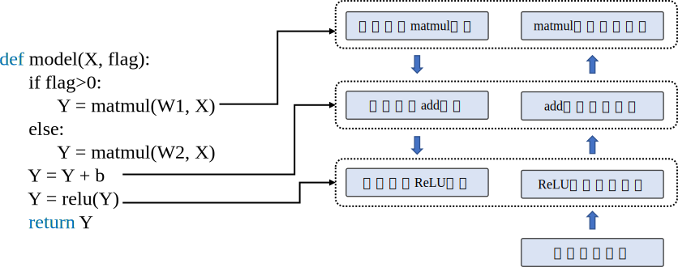

## 计算图的生成
计算框架执行深度学习模型训练时，会根据模型结构生成计算图，通过调度计算图完成模型计算。在计算框架中可以生成静态图和动态图两种计算图。静态图对应声明式编程范式，动态图对应命令式编程范式。静态生成可以根据前端语言描述的神经网络拓扑结构以及参数变量等信息构建一份固定的计算图，因此静态图在执行期间可以不依赖前端语言描述，常用于神经网络模型的部署，比如移动端人脸识别场景中的应用等。动态图则需要在每一次执行神经网络模型依据前端语言描述动态生成一份临时的计算图，这意味着计算图的动态生成过程灵活可变，该特性有助于我们在神经网络结构调整阶段提高效率。主流计算框架TensorFlow、MindSpore均支持动态图和静态图模式；PyTorch则可以通过工具将构建的动态图神经网络模型转化为静态结构，以获得高效的计算执行效率。了解两种计算图生成方式的优缺点及构建执行特点，可以针对待解决的任务需求，选择合适的生成方式调用执行神经网络模型。

### 静态生成

静态图的生成与执行原理如 :numref:`static`所示，采用先编译后执行的方式，该模式将计算图的定义和执行进行分离。在静态图模式下使用前端语言定义模型形成完整的程序表达后，并不使用前端语言解释器进行执行，而是将前端描述的完整模型交给计算框架。框架在执行模型计算之前会首先对神经网络模型进行分析，获取网络层之间的连接拓扑关系以及参数变量设置、损失函数等信息，接着用一种特殊的静态数据结构来描述拓扑结构及其他神经网络模型组件，这种特殊的静态数据结构通常被称为静态计算图。静态计算图可以通过优化策略转换成等价的更加高效的结构。当进行模型训练或者推理过程时，静态计算图接收数据并通过相应硬件调度执行图中的算子来完成任务。


:width:`800px`
:label:`static`

以构建并执行下列伪代码，来详细讲解静态图的生成与执行，*matmul*表示矩阵乘法算子，*relu*表示线性矫正单元算子。在部分计算框架中如TensorFlow进行前端定义时，需要声明并编写包含数据占位符、损失函数、优化函数、网络编译、执行环境以及网络执行器等在内的预定义配置项，此外还需要使用图内控制流算子编写控制语句，代码较为繁琐并缺乏可读性。随着计算框架设计的改进与发展，框架提供的编程接口和模型构建模式呈现出更加统一和友好的趋势，比如MindSpore提供动静态统一的前端编程表达。因此为了便于理解静态生成的过程与原理，此处使用更加简洁的语言逻辑描述模型。
```python
def model(X, flag):
    if flag>0:     
        Y = matmul(W1, X)   
    else:     
        Y = matmul(W2, X)
    Y = Y + b
    Y = relu(Y)
    return Y
```
完成前端语言的模型完整构建表达后，执行模型运算时不会直接接收输入数据进行计算，而是使用计算框架的编译器对模型进行编译。由于在进行静态生成编译时并不读取输入数据，此时需要一种特殊的张量来表示输入数据辅助构建完整的计算图，这种特殊张量就被称之为"数据占位符"。在上述的伪代码中输入数据**X**需要使用占位符在静态图中表示。构造伪代码中的条件控制时，由于在静态图模式下构建网络并没有执行任何计算，对于条件控制在编译阶段并不会进行逻辑运算完成判断，因此需要将条件控制算子以及所有的分支计算子图加入计算图中。在执行阶段网络接受数据流入，调度条件控制算子时进行逻辑判断，控制数据流入不同的分支计算子图中进行后续计算。由于控制流和静态生成的特殊性，在部分计算框架中前端语言Python的控制流不能够被正确编译为等价的静态图结构，因此需要使用复杂的图内方法实现控制流。

在后续的章节中我们会继续深入了解计算框架静态生成图结构的过程。静态生成的过程是采用计算框架编译器将代码编译为中间表示。计算框架编译器受传统编译器方案启发，设计体系结构包含两部分编译器前端和编译器后端。中间表示承上启下贯穿前端和后端，是前端源代码和目标硬件代码之间的中间数据格式。在计算框架编译器中中间表示以计算图形式存在，编译器会根据前端神经网络模型自动构建完整的前向计算图和反向计算图。


:width:`800px`
:label:`staticgen`

经过编译后获取完整的计算图，能够根据全局信息完成图优化策略，进行编译优化形成与模型完全等价的静态图。编译器前端负责完成计算图与硬件无关的转换和优化，比如算子融合将网络中的两个或多个细粒度的算子融合为一个粗粒度算子，比如 :numref:`staticgen`中将*add*算子与*relu*合并为一个操作，可节省中间计算结果的存储、读取等过程，降低框架底层算子调度的开销，从而提升执行性能和效率。编译器后端负责与硬件相关的计算图优化、代码指令生成和编译，优化手段包括硬件算子选择、内存分配、内存复用等，提高算子执行效率和内存利用效率，降低内存开销。编译器后端因此使用静态图模型运行往往能够获取更好的性能和更少的内存占用。在后续章节中将详细介绍更多编译器前端和编译器后端的优化策略。

优化完成的计算图通过编译器后端根据计算硬件来生成适配的执行代码。在执行阶段，调用执行器接受输入数据，依据计算图调度算子执行训练或者推理任务。在训练任务调度算子执行时，由于在执行阶段已经编译获取模型整体结构，计算框架可以利用自动并行算法制定合理的模型切分与并行策略，进一步提高计算效率。

使用静态图构建模型，编译构建完整的计算图后，计算图可以进行序列化保存，并且再次执行时允许使用序列化模型直接进行训练或推理，不需要再次编译前端语言源代码。得益于编译器前端、中间表示、编译器后端多级的计算框架编译器体系结构，编译器后端可以将神经网络模型中间表示转换为不同硬件代码。结合计算图序列化和计算图可转换多种部署硬件代码两种特性，使得静态图模型可以直接部署在不同的硬件上面，提供高效的推理服务。

尽管静态图具备强大的执行计算性能与直接部署能力，但是在部分计算框架中静态图模式下，使用前端语言编写神经网络模型以及定义模型训练过程代码较为繁琐，尤其掌握图内控制流方法具备一定的学习难度，因此熟练掌握并使用静态图模式对于初学者并不友好。其次，静态生成采用先编译后执行的方式，编译阶段和执行阶段分离，前端语言构建的神经网络模型经过编译后，计算图结构便固定执行阶段不再改变，并且经过优化用于执行的计算图结构与原始代码有较大的差距，导致代码中的错误难以定位到准确位置，增加了代码调试难度。此外在神经网络模型开发迭代环节，不能即时打印中间结果。若在源码中添加输出中间结果的代码，则需要将源码重新编译后，再调用执行器才能获取相关信息，降低了代码调试效率。而动态图模式则拥有更加灵活的特性，接下来讲解动态生成机制。

### 动态生成

动态图原理如 :numref:`dynamic`所示，采用解析式的执行方式，其核心特点是编译与执行同时发生。动态图采用前端语言自身的解释器对代码进行解析，利用计算框架本身的算子分发功能，算子会即刻执行并输出结果。动态图模式采用用户友好的命令式编程范式，使用前端语言构建神经网络模型更加简洁。


:width:`600px`
:label:`dynamic`

由于动态图模式的编程友好性，动态图被广大深度学习研究者青睐使用。接下来使用上一小节的伪代码来讲解动态生成和静态生成的区别。

尽管静态图和动态图在前端语言表达上略有差异，但本质的区别在于静态生成和动态生成的编译执行过程不同。使用前端语言构建完成模型表达后，动态生成并不采用计算框架编译器生成完整的静态计算图，而是采用前端语言的解释器Python API调用计算框架，框架利用自身的算子分发功能，将Python调用的算子在相应的硬件如CPU、GPU、NPU等上进行加速计算，然后再将计算结果返回给前端。该过程并不产生静态的计算图，而是按照前端语言描述模型结构，按照计算依赖关系进行调度执行，动态生成临时的图拓扑结构。


:width:`700px`
:label:`dynamicgen`

如 :numref:`dynamicgen`中所示，神经网络前向计算按照模型声明定义的顺序进行执行。当模型接收输入数据$\boldsymbol{X}$后，计算框架开始动态生成图拓扑结构，添加输入节点并准备将数据传输给后续节点。模型中存在条件控制时，动态图模式下会即刻得到逻辑判断结果并确定数据流向，因此在图中假设判断结果为真的情况下，图结构中仅会添加关于张量$\boldsymbol{W1}$的*matmul*算子节点。按照代码制定的模型计算顺序与算子依赖关系，计算框架会依次添加*add*算子节点和*ReLU*算子节点。计算框架会在添加节点的同时完成算子分发计算并返回计算结果，同时做好准备向后续添加的节点传输数据。当模型再次进行前向计算时，动态生成的图结构则失效，并再次根据输入和控制条件生成新的图结构。相比于静态生成，可以发现动态生成的图结构并不能完整表示前端语言描述的模型结构，需要即时根据控制条件和数据流向产生图结构。由于计算框架无法通过动态生成获取完整的图结构，因此动态图模式下难以进行图结构优化以提高计算效率。

在静态生成环节，由于已经获取完整的神经网络模型定义，因此可以同时构建出完整的前向计算图和反向计算图。而在动态生成中，由于边解析边执行的特性，反向梯度计算的构建随着前向计算调用而进行。在执行前向过程中，计算框架根据前向算子的调用信息，记录对应的反向算子信息以及参与梯度计算的张量信息。前向计算完毕之后，反向算子与张量信息随之完成记录，计算框架会根据前向动态图拓扑结构，将所有反向过程串联起来形成整体反向计算图。最终，将反向图在计算硬件上执行计算得到梯度用于参数更新。

对应于 :numref:`dynamicgen`中，当调用到关于张量$\boldsymbol{W1}$的*matmul*算子节点时，框架会执行两个操作：调用*matmul*算子，计算关于输入$\boldsymbol{X}$和$\boldsymbol{W1}$的乘积结果，同时根据反向计算过程$\boldsymbol{Grad\_W1}=\boldsymbol{Grad\_Y}*\boldsymbol{X}$，记录下需要参与反向计算的算子和张量$\boldsymbol{X}$。计算框架依照算子调度顺序记录参与反向计算的算子和张量。当前向计算执行完毕，计算框架根据动态生成的前向计算图结构拓扑关系，利用记录的反向计算算子和张量动态生成反向计算图，最终完成神经网络模型的梯度计算和参数更新。

尽管动态生成中完整的网络结构在执行前是未知的，不能使用静态图中的图优化技术来提高计算执行性能。但其即刻算子调用与计算的能力，使得模型代码在运行的时候，每执行一句就会立即进行运算并会返回具体的值，方便开发者在模型构建优化过程中进行错误分析、结果查看等调试工作，为研究和实验提供了高效的助力。

此外得益于动态图模式灵活的执行计算特性，动态生成可以使用前端语言的原生控制流，充分发挥前端语言的编程友好性特性。解决了静态图中代码难调试、代码编写繁琐以及控制流复杂等问题，对于初学者更加友好，提高了算法开发迭代效率和神经网络模型改进速率。

### 动态和静态生成的比较

静态生成和动态生成的过程各有利弊。从使用者的角度可以直观的感受到静态图不能实时获取中间结果、代码调试困难以及控制流编写复杂，而动态图可以实时获取结果、调试简单、控制流符合编程习惯。虽然静态图的编写、生成过程复杂，但是相应的执行性能却超过动态图，我们用一个简单的例子来说明在性能和内存占用方面静态图的优势。
```python
def model(X1, X2):
    Y1 = matmul(X1, W1)
    Y2 = matmul(X2, W2)
    Y = Y1 + Y2
    output = relu(Y)
    return output
```
在静态生成过程中，计算框架获取完整的计算图可以分析出计算$\boldsymbol{Y_1}$和$\boldsymbol{Y_2}$的过程相对独立，可以将其进行自动并行计算，加快计算效率。而动态生成的过程中，若无手动配置并行策略，计算框架无法获取图结构不能分析出算子之间的独立性，则只能按照代码顺序执行。模型在输出结果之前执行了*add*和*relu*算子操作，在静态生成过程中利用计算图优化策略中的算子融合方法，可以将这两个算子融合为一个算子执行，这样减少了中间变量$\boldsymbol{Y}$的存储与读取过程，加快了计算效率，减少了内存占用。而动态生成过程则需要按照顺序执行*add*和*relu*两步操作，需要存储变量$\boldsymbol{Y}$。除此之外，由于静态生成能够同时分析重构出前向计算图和反向计算图，可以提前确定反向计算中需要保存的前向中间变量信息。而动态生成则在完成前向计算后才能构建出反向计算图，为了保证反向计算效率需要保存更多的前向计算中间变量信息，相比之下静态生成的过程更加节省内存占用。

为了方便读者对比，将静态图和动态图特性总结见 :numref:`cmp_dynamic_static`。

:静态图和动态图对比

 |特性|静态图|动态图|
 |:---:|  :---:  | :---: |
 |    即时获取中间结果    |     否       |     是      |
 |      代码调试难易      |     难      |     简单      |
 |     控制流实现方式     | 特定的语法  | 前端语言语法    |
 |          性能          |       优化策略多，性能更佳   |      图优化受限，性能较差  |            
 |        内存占用        |     内存占用少       | 内存占用相对较多  |
 |        部署能力         |可直接部署  | 不可直接部署|
:label:`cmp_dynamic_static`

针对两种模式的特性，结合任务需求选择合适的模式可以事半功倍，学术科研以及模型开发调试阶段，为了快速验证思想和迭代更新模型结构可以选择动态图模式进行构建算法；网络模型确定，为了加速训练过程或者为硬件部署模型，可以选择静态图模式。

### 动态图与静态图的转换和融合

动态图模式下拥有简洁的接口和编程体验，具备友好的调试交互机制。代码按照编写顺序即时执行，符合我们在编写模型的直观感受和习惯。可以快速将算法思想转化为实际代码。静态图模式下可以分离前后端语言，编译解析前端语言构建的整体网络结构，并进行优化后以高效后端语言执行，可以直接用于部署。为了兼顾动态图易用性和静态图部署性能两方面优势，目前TensorFlow、MindSpore、PyTorch、PaddlePaddle等主流计算框架均具备动态图转静态图的功能，支持使用动态图编写代码，框架自动转换为静态图网络结构。

动态图转换为静态图的实现方式有两种：

-   **基于追踪转换**：以动态图模式执行并记录调度的算子，构建和保存为静态图模型。

-   **基于源码转换**：分析前端代码来将动态图代码自动转写为静态图代码，并在底层自动帮用户使用静态图执行器运行。

**基于追踪转换**的原理相对简单，当使用动态图模式构建好网络后，使用追踪（Tracing）进行转换将分为两个阶段。第一个阶段计算框架会创建一个新的计算图，此时以动态图模式执行代码，计算框架会自动追踪数据流的流动以及算子的调度，将所有的操作捕获并根据调度顺序构建静态图模型。第二个阶段，当执行完一次动态图后，计算框架已生成静态图，当再次调用相同的模型时，计算框架会自动指向静态图模型，以高效的性能执行计算。追踪技术只是记录第一次执行动态图时调度的算子，但若是模型中存在依赖于中间结果的条件分支控制流，只能追踪到根据第一次执行时触发的分支。此时构建的静态图模型并不是完整的，缺失了数据未流向的其他分支。在后续的调用中，因为静态模型已无法再改变，若计算过程中数据流向缺失分支会导致模型运行错误。同样的，依赖于中间数据结果的循环控制也无法追踪到全部的迭代状态。

动态图基于前端语言自身的解释器进行模型代码的解析执行。比如当Python作为前端语言，采取原生Python边运行边解释的特性，配合框架提供的数据处理/算子分发的功能计算，即可实现动态图的即时执行特性。而且静态图则采用计算框架自带的图编译器，对神经网络模型进行建图后，再调用图结构进行计算。动态图代码与静态图代码之间存在差异，不能直接使用静态图编译器，因此基于源码转换的方法需要将动态图代码转换为静态图代码描述。

**基于源码转换**的方式则能够改善基于追踪转换的缺陷。如 :numref:`ast`中所示，基于源码转换的流程经历两个阶段。第一个阶段，对动态图模式下的代码扫描进行词法分析，通过词法分析器分析源代码中的所有字符，对代码进行分割并移除空白符、注释等，将所有的单词或字符都转化成符合规范的语法单元列表。接着进行语法分析即解析器，将得到的语法单元列表转换成树形式，并对语法进行检查避免错误。第二阶段，动态图转静态图的核心部分就是对抽象语法树进行转写，计算框架中对每一个需要转换的语法都预设有转换器，每一个转换器对语法树进行扫描改写，将动态图代码语法映射为静态图代码语法。其中最为重要的前端语言控制流，会在这一阶段分析转换为静态图接口进行实现。转写完毕之后，将新的语法树再还原回静态图代码，就可以使用静态生成执行。使用该方式可以避免基于追踪转换中控制流表达缺失的情况。


:width:`800px`
:label:`ast`

在使用上述功能的过程中，可以将整体模型动态图代码全部转换为静态图代码，提高计算效率并用于硬件部署。同时也可以将整体模型中的部分函数转化为局部静态子图，静态子图会被计算框架视为一个完整的算子并嵌入动态图中。执行整体动态图时，当计算到对应的函数会自动调用静态子图。使用该方式在一定程度上既保留代码调试改进的灵活性，又提高了计算效率。
```python
@ms_function #mindspore中基于源码转换的函数装饰器，可以将该函数转换为静态图
def add_and_relu(Y, b):
    Y = Y + b
    Y = relu(Y)
    return Y

def model(X, flag):
    if flag>0:     
        Y = matmul(W1, X)   
    else:     
        Y = matmul(W2, X)
        Y = add_and_relu(Y, b)
    return Y
```
代码中模型整体可以采用动态生成，而\@ms\_function可以使用基于源码转换的技术将模块*add_and_relu*的转化为静态图结构。与动态生成中代码执行相同，模型接受输入按照模型定义的计算顺序进行调度执行，并生成临时图结构，当执行语句*Y=add_and_relu(Y,b)* 时，计算框架会自动调用该模块静态生成的图结构执行计算。模块*add_and_relu* 可以利用静态图中的优化技术来提高计算性能，实现动态图和静态图的混合执行。此外，动静态转换的技术常用于模型部署阶段，动态图预测部署时除了需要已经训练完成的参数文件，还须提供最初的模型组网前端代码，这使得动态图部署受到局限性，部署硬件中往往难以提供支持前端语言执行环境。因此当使用动态图模式训练完成模型参数后，可以将整体网络结构转换为静态图格式，将神经网络模型和参数文件进行序列化保存，与前端代码完全解耦，扩大模型部署的硬件支持范围。

主流的计算框架TensorFlow、MindSpore等均提供动静态相互转换与融合执行的技术，我们将各框架中支持源码转换和追踪转换技术的接口梳理如 :numref:`dynamic_static_switch`所示。

:主流框架动态图转换静态图支持

|框架|动态图转静态图|
| :-:| :---: |
|        TensorFlow    |@tf_function追踪算子调度构建静态图，<br>其中AutoGraph机制可以自动转换控制流为静态表达 |
|         MindSpore    |   context.set_context(mode=context.PYNATIVE_MODE) 动态图模式  <br> context.set_context(mode=context.GRAPH_MODE) 静态图模式 <br>\@ms_function支持基于源码转换    |
|         PyTorch      |  torch.jit.script()支持基于源码转换，<br>torch.jit.trace()支持基于追踪转换  |
|      PaddlePaddle     | paddle.jit.to_static()支持基于源码转换，<br>paddle.jit.TracedLayer.trace()支持基于追踪转换 |
:label:`dynamic_static_switch`              
                                                           
