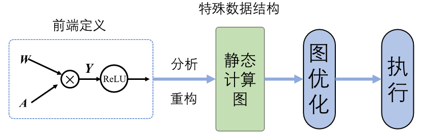
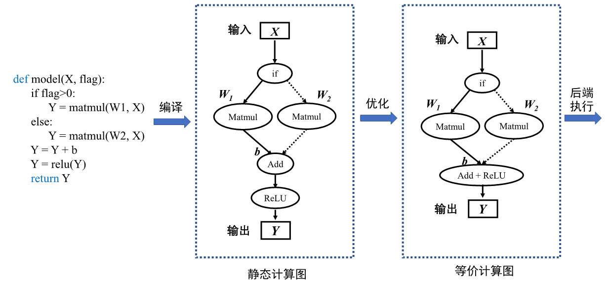
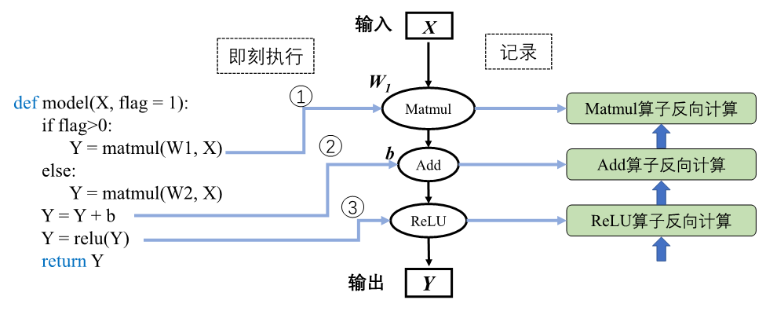

## 计算图的生成
在了解计算图的基本构成后，那么下一个问题就是：计算图要如何自动化生成呢？在机器学习框架中可以生成静态图和动态图两种计算图。静态生成可以根据前端语言描述的神经网络拓扑结构以及参数变量等信息构建一份固定的计算图。因此静态图在执行期间可以不依赖前端语言描述，常用于神经网络模型的部署，比如移动端人脸识别场景中的应用等。

动态图则需要在每一次执行神经网络模型依据前端语言描述动态生成一份临时的计算图，这意味着计算图的动态生成过程灵活可变，该特性有助于在神经网络结构调整阶段提高效率。主流机器学习框架TensorFlow、MindSpore均支持动态图和静态图模式；PyTorch则可以通过工具将构建的动态图神经网络模型转化为静态结构，以获得高效的计算执行效率。了解两种计算图生成方式的优缺点及构建执行特点，可以针对待解决的任务需求，选择合适的生成方式调用执行神经网络模型。

### 静态生成

静态图的生成与执行原理如 :numref:`static`所示，采用先编译后执行的方式，该模式将计算图的定义和执行进行分离。


:width:`800px`
:label:`static`


使用前端语言定义模型形成完整的程序表达后，机器学习框架首先对神经网络模型进行分析，获取网络层之间的连接拓扑关系以及参数变量设置、损失函数等信息。然后机器学习框架会将完整的模型描述编译为可被后端计算硬件调用执行的固定代码文本，这种固定代码文本通常被称为静态计算图。当使用静态计算图进行模型训练或者推理过程时，无需编译前端语言模型。静态计算图直接接收数据并通过相应硬件调度执行图中的算子来完成任务。静态计算图可以通过优化策略转换成等价的更加高效的结构，提高后端硬件的计算效率。

以构建并执行下列伪代码，来详细讲解静态图的生成与执行。在部分机器学习框架中进行前端定义时，需要声明并编写包含数据占位符、损失函数、优化函数、网络编译和执行环境以及网络执行器等在内的预定义配置项，此外还需要使用图内控制流算子编写控制语句。随着机器学习框架设计的改进与发展，框架趋向于提供的友好的编程接口和统一的模型构建模式，比如MindSpore提供动静态统一的前端编程表达。因此为了便于理解静态生成的过程与原理，此处使用更加简洁的语言逻辑描述模型。

```python
def model(X, flag):
    if flag>0:     
        Y = matmul(W1, X)   
    else:     
        Y = matmul(W2, X)
    Y = Y + b
    Y = relu(Y)
    return Y
```
机器学习框架在进行静态生成编译时并不读取输入数据，此时需要一种特殊的张量来表示输入数据辅助构建完整的计算图，这种特殊张量就被称为：数据占位符（Placeholder ）。在代码第1行中输入数据$\boldsymbol{X}$需要使用占位符在静态图中表示。由于静态生成时模型无数据输入，因此代码第2行中的条件控制，也无法进行逻辑计算，条件控制在编译阶段并不会完成判断，因此需要将条件控制算子以及所有的分支计算子图加入计算图中。在静态计算图执行计算阶段网络接收数据流入，调度条件控制算子根据输入数据进行逻辑判断，控制数据流入不同的分支计算子图中进行后续计算。在部分机器学习框架中前端语言Python的控制流不能够被正确编译为等价的静态图结构，因此需要机器学习框架的控制原语来实现控制流。


:width:`800px`
:label:`staticgen`

静态计算图具有两大优势：计算性能与直接部署。静态图经过机器学习框架编译时能够获取模型完整的图拓扑关系。机器学习框架掌控全局信息便更容易制定计算图的优化策略，比如算子融合将网络中的两个或多个细粒度的算子融合为一个粗粒度算子，比如 :numref:`staticgen`中将Add算子与ReLU合并为一个操作，可节省中间计算结果的存储、读取等过程，降低框架底层算子调度的开销，从而提升执行性能和效率，降低内存开销。因此使用静态图模型运行往往能够获取更好的性能和更少的内存占用。在后续章节中将详细介绍更多关于机器学习框架在编译方面的优化策略。

在部署模型进行应用时，可以将静态计算图序列化保存。在模型推理阶段，执行序列化的模型即可，无需重新编译前端语言源代码。机器学习框架可以将静态计算图转换为支持不同计算硬件直接调用的代码。结合计算图序列化和计算图转硬件代码两种特性，静态图模型可以直接部署在不同的硬件上面，提供高效的推理服务。

尽管静态图具备强大的执行计算性能与直接部署能力，但是在部分机器学习框架中静态图模式下，编写神经网络模型以及定义模型训练过程代码较为烦琐。如下面代码所示，将本小节前面的代码改写为以TensorFlow机器学习框架静态图模式要求的代码， 代码第10行使用图内控制流算子来实现条件控制。静态图模式下的代码编写和阅读对于机器学习入门者都有一定门槛。

```python
import tensorflow as tf
import numpy as np

x = tf.placeholder(dtype=tf.float32, shape=(5,5)) #数据占位符
w1 = tf.Variable(tf.ones([5,5]),name='w1') 
w2 = tf.Variable(tf.zeros([5,5]),name='w2')
b = tf.Variable(tf.zeros([5,]),name='b')
def f1(): return tf.matmul(w1,x)
def f2(): return tf.matmul(w2,x)
y1 = tf.cond(flag > 0, f1, f2) #图内条件控制算子
y2 = tf.add(y1, b)
output = tf.relu(y2)
with tf.Session() as sess:
    sess.run(tf.global_variables_initializer()) #静态图变量初始化
    random_array = np.random.rand(5,5)
    sess.run(output, feed_dict = {x:random_array, flag: [1.0]}) #静态图执行
```

前端语言构建的神经网络模型经过编译后，计算图结构便固定执行阶段不再改变，并且经过优化用于执行的静态图代码与原始代码有较大的差距。代码执行过程中发生错误时，机器学习框架会返回错误在优化后的静态图代码位置。用户难以直接查看优化后的代码，因此无法定位原始代码错误位置，增加了代码调试难度。比如在代码中，若add算子和relu算子经给优化合并为一个算子，执行时合并算子报错，用户可能并不知道错误指向的是add算子错误 还是relu算子错误。

此外在神经网络模型开发迭代环节，不能即时打印中间结果。若在源码中添加输出中间结果的代码，则需要将源码重新编译后，再调用执行器才能获取相关信息，降低了代码调试效率。对比之下，动态图模式则相比较灵活，接下来讲解动态生成机制。


### 动态生成

动态图原理如 :numref:`dynamic`所示，采用解析式的执行方式，其核心特点是编译与执行同时发生。动态图采用前端语言自身的解释器对代码进行解析，利用机器学习框架本身的算子分发功能，算子会即刻执行并输出结果。动态图模式采用用户友好的命令式编程范式，使用前端语言构建神经网络模型更加简洁，深受广大深度学习研究者青睐。


:width:`600px`
:label:`dynamic`

接下来使用上一小节的伪代码来讲解动态生成和静态生成的区别。

静态图和动态图除了在前端语言表达上略有差异，本质的区别在于编译执行过程。使用前端语言构建完成模型表达后，动态生成并不采用机器学习框架编译器生成完整的静态计算图，而是采用前端语言的解释器Python API调用机器学习框架，框架利用自身的算子分发功能，将Python调用的算子在相应的硬件如CPU、GPU、NPU等上进行加速计算，然后再将计算结果返回给前端。该过程并不产生静态的计算图，而是按照前端语言描述模型结构，按照计算依赖关系进行调度执行，动态生成临时的图拓扑结构。


如 :numref:`dynamicgen`中所示动态生成流程。


:width:`700px`
:label:`dynamicgen`

神经网络前向计算按照模型声明定义的顺序进行执行。当模型接收输入数据$\boldsymbol{X}$后，机器学习框架开始动态生成图拓扑结构，添加输入节点并准备将数据传输给后续节点。模型中存在条件控制时，动态图模式下会即刻得到逻辑判断结果并确定数据流向，因此在图中假设判断结果为真的情况下，图结构中仅会添加关于张量$\boldsymbol{W1}$的Matmul算子节点。按照代码制定的模型计算顺序与算子依赖关系，机器学习框架会依次添加Add算子节点和ReLU算子节点。机器学习框架会在添加节点的同时完成算子分发计算并返回计算结果，同时做好准备向后续添加的节点传输数据。当模型再次进行前向计算时，动态生成的图结构则失效，并再次根据输入和控制条件生成新的图结构。相比于静态生成，可以发现动态生成的图结构并不能完整表示前端语言描述的模型结构，需要即时根据控制条件和数据流向产生图结构。由于机器学习框架无法通过动态生成获取完整的模型结构，因此动态图模式下难以进行模型优化以提高计算效率。

在静态生成方式下，由于已经获取完整的神经网络模型定义，因此可以同时构建出完整的前向计算图和反向计算图。而在动态生成中，由于边解析边执行的特性，反向梯度计算的构建随着前向计算调用而进行。在执行前向过程中，机器学习框架根据前向算子的调用信息，记录对应的反向算子信息以及参与梯度计算的张量信息。前向计算完毕之后，反向算子与张量信息随之完成记录，机器学习框架会根据前向动态图拓扑结构，将所有反向过程串联起来形成整体反向计算图。最终，将反向图在计算硬件上执行计算得到梯度用于参数更新。

对应于 :numref:`dynamicgen`中，当调用到关于张量$\boldsymbol{W1}$的Matmul算子节点时，框架会执行两个操作：调用Matmul算子，计算关于输入$\boldsymbol{X}$和$\boldsymbol{W1}$的乘积结果，同时根据反向计算过程Grad\_$\boldsymbol{W1}$=Grad\_$\boldsymbol{Y}*\boldsymbol{X}$，记录下需要参与反向计算的算子和张量$\boldsymbol{X}$，机器学习框架依据收集的信息完成前向计算和反向图构建。

尽管动态生成中完整的网络结构在执行前是未知的，不能使用静态图中的图优化技术来提高计算执行性能。但其即刻算子调用与计算的能力，使得模型代码在运行的时候，每执行一句就会立即进行运算并会返回具体的值，方便开发者在模型构建优化过程中进行错误分析、结果查看等调试工作，为研究和实验提供了高效的助力。

此外得益于动态图模式灵活的计算执行特性，动态生成可以使用前端语言的原生控制流，充分发挥前端语言的编程友好性特性。解决了静态图中代码难调试、代码编写烦琐以及控制流复杂等问题，对于初学者更加友好，提高了算法开发迭代效率和神经网络模型改进速率。

### 动态和静态生成的比较

静态生成和动态生成的过程各有利弊。为了方便读者对比，将静态图和动态图特性总结见  :numref:`cmp_dynamic_static`。

:静态图和动态图对比

| 特性| 静态图   | 动态图    |
| --- | ------- | ------- |
| 即时获取中间结果| 否                 | 是                 |
| 代码调试难易    | 难                  | 易                 |
| 控制流实现方式  | 特定的语法          | 前端语言语法        |
| 性能           | 优化策略多，性能更佳 | 图优化受限，性能较差 |
| 内存占用       | 内存占用少           | 内存占用相对较多     |
| 是否可直接部署  | 可直接部署           | 不可直接部署        |
:label:`cmp_dynamic_static`


从使用者的角度可以直观的感受到静态图不能实时获取中间结果、代码调试困难以及控制流编写复杂，而动态图可以实时获取结果、调试简单、控制流符合编程习惯。虽然静态图的编写、生成过程复杂，但是相应的执行性能却超过动态图，下面用一个简单的代码来说明在性能和内存占用方面静态图的优势。
```python
def model(X1, X2):
    Y1 = matmul(X1, W1)
    Y2 = matmul(X2, W2)
    Y = Y1 + Y2
    output = relu(Y)
    return output
```
若对代码进行静态生成，机器学习框架可以构建完整的计算图。分析可知，计算$\boldsymbol{Y_1}$和$\boldsymbol{Y_2}$的过程相对独立，可以将其进行自动并行计算，加快计算效率。在静态生成过程中还可以利用计算图优化策略中的算子融合方法，将Add和ReLU两个算子融合为一个算子执行，这样减少了中间变量$\boldsymbol{Y}$的存储与读取过程，加快了计算效率，减少了内存占用。而动态生成的过程中，若无手动配置并行策略，机器学习框架无法获取图结构不能分析出算子之间的独立性，则只能按照代码顺序执行Add和ReLU两步操作，且需要存储变量$\boldsymbol{Y}$。除此之外，由于静态生成能够同时分析重构出前向计算图和反向计算图，可以提前确定反向计算中需要保存的前向中间变量信息。而动态生成则在完成前向计算后才能构建出反向计算图，为了保证反向计算效率需要保存更多的前向计算中间变量信息，相比之下静态生成的过程更加节省内存占用。


针对两种模式的特性，结合任务需求选择合适的模式可以事半功倍，学术科研以及模型开发调试阶段，为了快速验证思想和迭代更新模型结构可以选择动态图模式进行构建算法；网络模型确定，为了加速训练过程或者为硬件部署模型，可以选择静态图模式。

### 动态图与静态图的转换和融合

动态图便于调试，适用于模型构建实验阶段；静态图执行高效，节省模型训练时间，那么有没有办法可以让机器学习框架结合两种模式的优势呢？事实上，目前TensorFlow、MindSpore、PyTorch、PaddlePaddle等主流机器学习框架为了兼顾动态图易用性和静态图执行性能高效两方面优势，均具备动态图转静态图的功能，支持使用动态图编写代码，框架自动转换为静态图网络结构执行计算。

将各框架中支持源码转换和追踪转换技术的接口梳理如 :numref:`dynamic_static_switch`所示。

:主流框架动态图转换静态图支持

|       框架          |                 动态图转静态图                       |
| :-----------------:| :--------------------------------------------------: |
|        TensorFlow   |@tf_function追踪算子调度构建静态图，<br>其中AutoGraph机制可以自动转换控制流为静态表达 |
|         MindSpore    |   context.set_context(mode=context.PYNATIVE_MODE)动态图模式，<br>context.set_context(mode=context.GRAPH_MODE) 静态图模式，<br>@ms_function支持基于源码转换    |
|         PyTorch      |  torch.jit.script()支持基于源码转换，<br>torch.jit.trace()支持基于追踪转换  |
|      PaddlePaddle    | paddle.jit.to_static()支持基于源码转换，<br>paddle.jit.TracedLayer.trace()支持基于追踪转换 |

:label:`dynamic_static_switch`              
                                  

动态图转换为静态图的实现方式有两种：

-   **基于追踪转换**：以动态图模式执行并记录调度的算子，构建和保存为静态图模型。

-   **基于源码转换**：分析前端代码来将动态图代码自动转写为静态图代码，并在底层自动帮用户使用静态图执行器运行。

**基于追踪转换**的原理相对简单，当使用动态图模式构建好网络后，使用追踪进行转换将分为两个阶段。第一个阶段与动态生成原理相同，机器学习框架创建并运行动态图代码，自动追踪数据流的流动以及算子的调度，将所有的算子捕获并根据调度顺序构建静态图模型。与动态生成不同的地方在于机器学习框架并不会销毁构建好的图，而是将其保存为静态图留待后续执行计算。第二个阶段，当执行完一次动态图后，机器学习框架已生成静态图，当再次调用相同的模型时，机器学习框架会自动指向静态图模型执行计算。追踪技术只是记录第一次执行动态图时调度的算子，但若是模型中存在依赖于中间结果的条件分支控制流，只能追踪到根据第一次执行时触发的分支。此时构建的静态图模型并不是完整的，缺失了数据未流向的其他分支。在后续的调用中，因为静态模型已无法再改变，若计算过程中数据流向缺失分支会导致模型运行错误。同样的，依赖于中间数据结果的循环控制也无法追踪到全部的迭代状态。

动态图基于前端语言的解释器进行模型代码的解析执行，而静态图模式下需要经过机器学习框架自带的图编译器对模型进行建图后，再执行静态计算图。由于图编译器所支持编译的静态图代码与动态图代码之间存在差异，因此需要基于源码转换的方法将动态图代码转换为静态图代码描述，然后经过图编译器生成静态计算图。

**基于源码转换**的方式则能够改善基于追踪转换的缺陷。如 :numref:`ast`中所示，基于源码转换的流程经历两个阶段。第一个阶段，对动态图模式下的代码扫描进行词法分析，通过词法分析器分析源代码中的所有字符，对代码进行分割并移除空白符、注释等，将所有的单词或字符都转化成符合规范的词法单元列表。接着进行语法分析即解析器，将得到的词法单元列表转换成树形式，并对语法进行检查避免错误。第二阶段，动态图转静态图的核心部分就是对抽象语法树进行转写，机器学习框架中对每一个需要转换的语法都预设有转换器，每一个转换器对语法树进行扫描改写，将动态图代码语法映射为静态图代码语法。其中最为重要的前端语言控制流，会在这一阶段分析转换为静态图接口进行实现，也就避免了基于追踪转换中控制流缺失的情况。转写完毕之后，即可从新的语法树还原出可执行的静态图代码。


:width:`800px`
:label:`ast`

在使用上述功能的过程中，可以将整体模型动态图代码全部转换为静态图代码，提高计算效率并用于硬件部署。同时也可以将整体模型中的部分函数转化为局部静态子图，静态子图会被机器学习框架视为一个完整的算子并嵌入动态图中。执行整体动态图时，当计算到对应的函数会自动调用静态子图。使用该方式既提高了计算效率，又在一定程度上保留代码调试改进的灵活性。

下面代码中模型整体可以采用动态生成，而@ms\_function可以使用基于源码转换的技术将模块add\_and\_relu的转化为静态图结构。与动态生成中代码执行相同，模型接收输入按照模型定义的计算顺序进行调度执行，并生成临时动态图结构，当执行语句Y=add\_and\_relu(Y,b)时，机器学习框架会自动调用该模块静态生成的图结构执行计算，通过动态图和静态图的混合执行提高计算能力。此外，动静态转换的技术常用于模型部署阶段。部署动态图模型时除了需要训练完成的参数文件，还须根据前端语言编写的模型代码构建拓扑关系。这使得动态图部署受到局限性，部署硬件中往往难以提供支持前端语言运行的执行环境。因此当使用动态图模式训练完模型参数后，可以将整体网络结构转换为静态图格式，将神经网络模型和参数文件进行序列化保存，与前端代码完全解耦，扩大模型部署的硬件支持范围。


```python
@ms_function #mindspore中基于源码转换的函数装饰器，可以将该函数转换为静态图
def add_and_relu(Y, b):
    Y = Y + b
    Y = relu(Y)
    return Y

def model(X, flag):
    if flag>0:     
        Y = matmul(W1, X)   
    else:     
        Y = matmul(W2, X)
        Y = add_and_relu(Y, b)
    return Y
```


