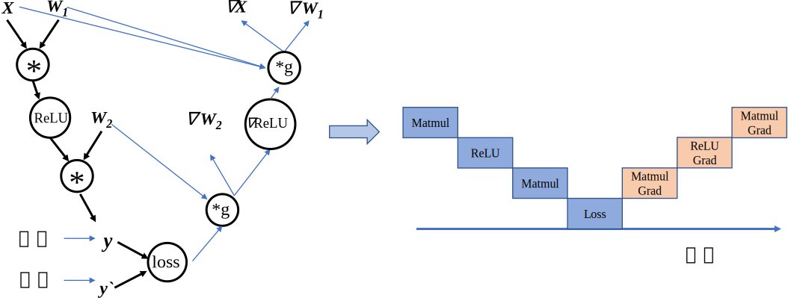
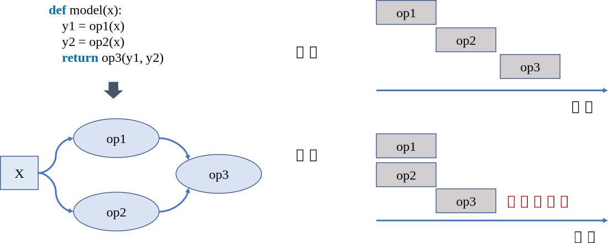
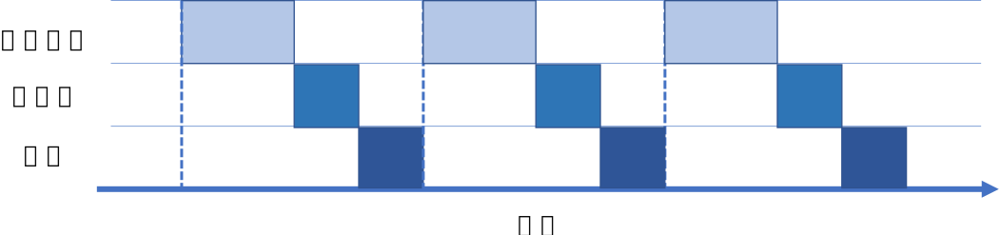
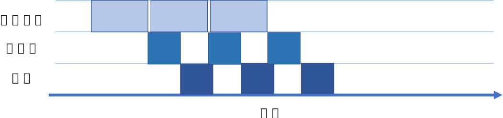
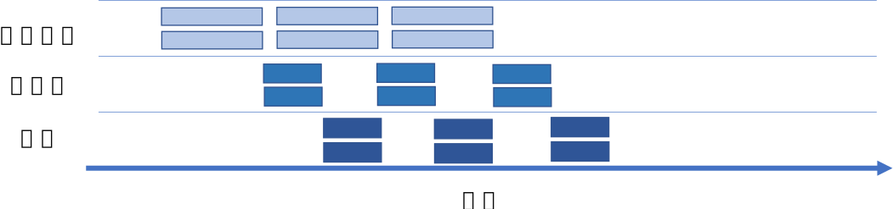

## 计算图的调度

模型训练就是计算图调度图中算子的执行过程。宏观来看训练任务是由设定好的训练迭代次数来循环执行计算图，此时我们需要优化迭代训练计算图过程中数据流载入和模型训练（推理）等多个任务之间的调度执行。微观上单次迭代需要考虑计算图内部的调度执行问题，根据计算图、计算依赖关系、计算控制分析算子的任务调度队列。优化计算图的调度和执行性能，目的是为了尽可能充分利用计算资源，提高计算效率，缩短模型训练和推理时间。接下来会详细介绍计算图的调度和执行。

### 算子调度执行

算子的执行调度包含两个步骤，第一个，根据拓扑排序算法，将计算图进行拓扑排序得到线性的算子调度序列；第二步，将序列中的算子分配到执行流进行运算。算子调度执行的目标是根据计算图中算子依赖关系，确定算子调度序列，尽可能将序列中的算子并行执行，提高计算资源的利用率。

计算图中依赖边和算子构成了一张有向无环图(Directed Acyclic Graph)，计算框架后端需要将包含这种依赖关系的算子准确地发送到计算资源，比如GPU、NPU上执行。因此，就要求算子需要按照一定的顺序排列好再发送给GPU/NPU执行。针对有向无环图，我们通常使用拓扑排序来得到一串线性的序列。

如 :numref:`schedule`所示，左边是一张有向无环图。图中包含了a,b,c,d,e五个节点和a-\>d,b-\>c,c-\>d,d-\>e四条边(a-\>d表示d依赖于a，称之为依赖边)。将图的依赖边表达成节点的入度(图论中通常指有向图中某点作为图中边的终点的次数之和)，可以得到各个节点的入度信息(a:0, b:0, c:1, d:2, e:1)。拓扑排序就是不断循环将入度为0的节点取出放入队列中，直至所有有向无环图中的节点都加入到队列中，循环结束。例如，第一步将入度为0的a,b节点放入到队列中，此时有向无环图中c,d的入度需要减1，得到新的入度信息(c:0, d:1, e:1)。以此类推，将所有的将所有的节点都放入到队列中并结束排序。

:width:`700px`
:label:`schedule`

生成调度序列之后，需要将序列中的算子与数据分发到指定的GPU/NPU上执行运算。根据算子依赖关系和计算设备数量，可以将无相互依赖关系的算子分发到不同的计算设备，同时执行运算，这一过程称之为并行计算，与之相对应的按照序贯顺序在同一设备执行运算被称之为串行计算。在深度学习中，当数据集和参数量的规模越来越大，我们在分发数据与算子时通信消耗会随之而增加，计算设备会在数据传输的过程中处于闲置状态，此时采用同步与异步的任务调度机制可以更好的协调通信与训练任务，提高通信模块与计算设备的使用率，在后续的小节中将详细介绍串行与并行、同步与异步的概念。

### 串行与并行

根据任务队列的执行顺序，我们可以将计算图的任务调度队列分为一下两种：

-   **串行**：队列中的任务必须按照顺序进行调度执行直至队列结束；

-   **并行**：队列中的任务可以同时进行调度执行，加快执行效率。

首先我们从微观上来分析计算图内部的串行调度。计算图中大多数算子之间存在直接依赖或者间接依赖关系，具有依赖关系的算子间任务调度则必定存在执行前后的时间顺序。如 :numref:`order`，计算图接受输入数据进行前向计算得到预测值，计算损失函数进行反向梯度计算，整体代码流程后序算子的计算有赖于前序算子的输出。此时算子的执行队列只能以串行的方式进行调度，保证算子都能正确接受到输入数据，才能完成计算图的一次完整执行。

:width:`800px`
:label:`order`

宏观上来看迭代训练之间，每一轮迭代中计算图必须读取训练数据，执行完整的前向计算和反向梯度计算，将图中所有参数值更新完毕后，才能开始下一轮的计算图迭代计算更新。所以"数据载入-数据处理-模型训练"的计算图整体任务调度是以串行方式进行的。

在分析计算图内部算子依赖关系时，除了直接依赖和间接依赖之外，存在算子间相互独立的情况。如 :numref:`para`中op1和op2之间相互独立，此时可以将两个算子分配到两个硬件上进行并行计算。对比串行执行，并行计算可以同时利用更多的计算资源来缩短执行时间。

:width:`800px`
:label:`para`

并行包括算子并行、模型并行以及数据并行。算子并行不仅可以在相互独立的算子间执行，同时也可以将单个算子合理的切分为相互独立的两个子操作，进一步提高并行性。模型并行就是将整体计算图进行合理的切分，分配到不同设备上进行并行计算，缩短单次计算图迭代训练时间。数据并行则同时以不同的数据训练多个相同结构的计算图，缩短训练迭代次数，加快训练效率。这三种并行方式将在后续章节中进行详细讲解。

### 数据载入同步与异步机制

一次完整计算图的训练执行过程包含：数据载入、数据预处理、网络训练三个环节。三个环节之间的任务调度是以串行方式进行，每一个环节都有赖于前一个环节的输出。但计算图的训练是多轮迭代的过程，多轮训练之间的三个环节可以用同步与异步两种机制来进行调度执行。

-   **同步**：顺序执行任务，当前任务执行完后会等待后续任务执行情况，任务之间需要等待、协调运行；

-   **异步**：当前任务完成后，不需要等待后续任务的执行情况，可继续执行当前任务下一轮迭代。

以同步机制来执行计算图训练时，如 :numref:`synchronization`所示，每一轮迭代中，数据读取后进行数据预处理操作，然后传输给计算图进行训练。每一个环节执行完当前迭代中的任务后，会一直等待后续环节的处理，直至计算图完成一次迭代训练更新参数值后，才会进行下一轮迭代的数据读取、数据处理以及网络训练。当进行数据载入时，数据处理、模型训练处于等待的状态，相反模型处于训练时，数据载入的I/O通道处于空闲，同步机制造成计算资源和通信资源的浪费。

:width:`800px`
:label:`synchronization`

以异步机制来执行计算图训练时，如 :numref:`asynchronous`所示，在迭代训练中，当数据通道将数据读取后交给后续的数据与处理环节后，不需要等待计算图训练迭代完成，直接读取下一批次的数据。对比同步机制，异步机制的引入减少了数据载入、数据预处理、网络训练三个环节的空闲等待时间，能够大幅度缩短循环训练的整体时间，提高任务执行效率。

:width:`800px`
:label:`asynchronous`
当我们将异步机制与并行计算结合在一起，如 :numref:`asyn_para`所示，利用丰富的计算资源可以进一步提高计算图训练效率，缩短训练时间。

:width:`800px`
:label:`asyn_para`
