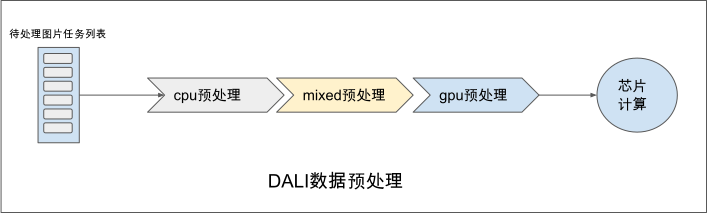
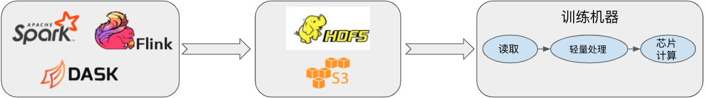

## 单机数据处理性能的扩展

上文我们介绍了通过并行架构发挥多核CPU算力来加速数据预处理，以满足芯片上模型计算对于数据消费的吞吐率需求，这在大部分情况下都能解决用户的问题。然而数据消费性能随着AI芯片的发展在逐年快速增长（即模型计算速率在变快），而主要借助CPU算力的数据模块却由于摩尔定律的逐渐终结无法享受到芯片性能提升带来的硬件红利，使得数据生产的性能很难像模型计算性能一样逐年突破。不仅如此，近几年AI服务器上AI芯片数量的增长速度远超CPU数量的增长速度，进一步加剧了芯片的数据消费需求与数据模块的数据生产性能之间的矛盾。我们以英伟达(NVIDIA)公司生产的NVIDIA DGX系列服务器为例子，DGX-1服务器中配置有40个CPU核和8个GPU芯片，而到了下一代的NVIDIA DGX-2服务器时，GPU芯片的数目增长了到了16个，而CPU核的数目仅从40个增加到了48个。由于所有的GPU芯片在训练时共享CPU的算力，故平均而言每个GPU芯片(数据消费者)能够使用的算力从NVIDIA DGX-1时的5CPU核/GPU下降到了 NVIDIA DGX-2的3CPU核/GPU，CPU的算力瓶颈会导致用户使用多卡训练时无法达到预期的扩展性能。针对单机上的CPU算力不足的问题，我们给出两种目前常见的两种解决方案，即基于CPU+AI芯片的异构数据处理的加速方案和基于分布式数据预处理的扩展方案。

### 基于异构计算的数据预处理

由于AI芯片相比于CPU拥有更丰富的算力资源，故在CPU算力成为数据预处理瓶颈时通过借助AI加速芯片来做数据预处理是一个行之有效的方案。虽然AI芯片不具备通用的数据预处理能力，但是由于大部分高耗时的数据预处理都是Tensor相关的计算，如语音中的快速傅立叶变换(Fast Fourier Transform, FFT)，图像中的去噪等，使得部分操作可以被卸载到AI芯片上来加速。如华为昇腾Ascend310芯片上的Dvpp模块为芯片内置的硬件解码器，相较于CPU拥有对图形处理更强劲的性能，Dvpp支持JPEG图片的解码缩放等图像处理基础操作，用户实际数据预处理中可以指定部分图像处理在昇腾Ascend310芯片上完成以提升数据模块性能。

```python
namespace ms = mindspore;
namespace ds = mindspore::dataset;

// 初始化操作
//...

// 构建数据处理算子

// 1. 解码
std::shared_ptr<ds::TensorTransform> decode(new ds::vision::Decode());
// 2. 缩放
std::shared_ptr<ds::TensorTransform> resize(new ds::vision::Resize({256}));
// 3. 归一化
std::shared_ptr<ds::TensorTransform> normalize(new ds::vision::Normalize(
    {0.485 * 255, 0.456 * 255, 0.406 * 255}, {0.229 * 255, 0.224 * 255, 0.225 * 255}));
// 4. 剪裁
std::shared_ptr<ds::TensorTransform> center_crop(new ds::vision::CenterCrop({224, 224}));

// 构建流水并指定使用昇腾Ascend进行计算
ds::Execute preprocessor({decode, resize, center_crop, normalize}, MapTargetDevice::kAscend310, 0);

// 执行数据处理流水
ret = preprocessor(image, &image);
```

相比较Dvpp只支持图像的部分预处理操作，英伟达公司研发的DALI :cite:`nvidia_dali`是一个更加通用的基于GPU的数据预处理加速框架。DALI中包含如下三个核心概念：

-   DataNode:表示一组Tensor的集合

-   Operator:对DataNode进行变换处理的算子，一个Operator的输入和输出均为DataNode。比较特殊的是，DALI中的算子可以被设置为包括cpu，gpu，mixed三种不同执行模式，其中cpu模式下算子的输入输出均为cpu上的DataNode，gpu模式下算子的输入输出均为gpu上的DataNode，而mixed模式下的算子的输入为cpu的DataNode而输出为gpu的DataNode。

-   Pipeline:用户通过Operator描述DataNode的处理变换过程而构建的数据处理流水

实际使用中用户通过设置算子的运行模式(mode)来配置算子的计算是用CPU还是GPU完成计算，同时DALI中有如下限制：当一个算子为mixed模式或者gpu模式时，其所有的下游算子强制要求必须为gpu模式执行。



:width:`800px`
:label:`dali_overview`

下面展示一段使用DALI构建数据处理流水线的示例代码，我们从文件中读取图片数据经过混合模式的解码再经过运算在GPU上的旋转和缩放算子处理后返回给用户处理
结果。由于其展示出的优异性能，
DALI被广泛的用于高性能推理服务和多卡训练性能的优化上。


```python
import nvidia.dali as dali

pipe = dali.pipeline.Pipeline(batch_size = 3, num_threads = 2, device_id = 0)
with pipe:
    files, labels = dali.fn.readers.file(file_root = "./my_file_root")
    images = dali.fn.decoders.image(files, device = "mixed")
    images = dali.fn.rotate(images, angle = dali.fn.random.uniform(range=(-45,45)))
    images = dali.fn.resize(images, resize_x = 300, resize_y = 300)
    pipe.set_outputs(images, labels)

pipe.build()
outputs = pipe.run()
```

### 基于分布式的数据预处理

分布式数据预处理是另一种解决CPU算力性能不足的可选方案。一种常见的做法是借助Spark、Dask等现有大数据计算框架进行数据预处理并将结果写入分布式文件系统，而训练的机器只需要读取预处理的结果数据并进行训练即可。



:width:`800px`
:label:`distributed_data_preprocess_based_on_3rd_party_software`

该方案虽然在业内被广泛使用，却面临着三个问题：

-   由于数据处理和数据训练采用不同的框架，使得用户为此常常需要在两个不同的框架中编写不同语言的程序，增加了用户的使用负担。

-   由于数据处理系统和机器学习两个系统间无法做零拷贝的数据共享，使得数据的序列化和反序列化常常成为不可忽视的额外开销。

-   由于大数据计算框架并不是完全针对机器学习场景，使得某些分布式预处理操作如全局的数据混洗无法被高效的实现。

为了更适配机器学习场景的数据预处理，分布式机器学习框架Ray借助其自身的任务调度能力实现了简单的分布式的数据预处理------
Ray Dataset :cite:`moritz2018ray`，由于数据预处理和训练处在同一个框架内，在降低了用户的编程负担的同时也通过数据的零拷贝共享消除了序列化/反序列化带来的额外开销。Ray Dataset支持如map、batch、map、filter等简单并行数据集变换算子、以及如mean等一些基础的聚合操作算子。同时Ray
Dataset也支持排序、随机打乱、GroupBy等全局混洗操作，该方案目前处在研究开发中，还未被广泛的采用，感兴趣的读者可以翻阅相关资料进一步的了解。

```python
 ray.data.read_parquet("foo.parquet") \
    .filter(lambda x: x < 0) \
    .map(lambda x: x**2) \
    .random_shuffle() \
    .write_parquet("bar.parquet")
```
