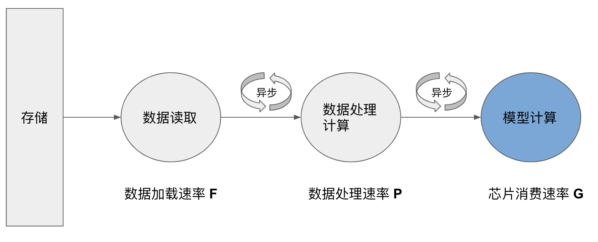
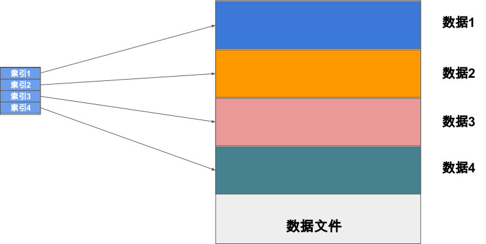
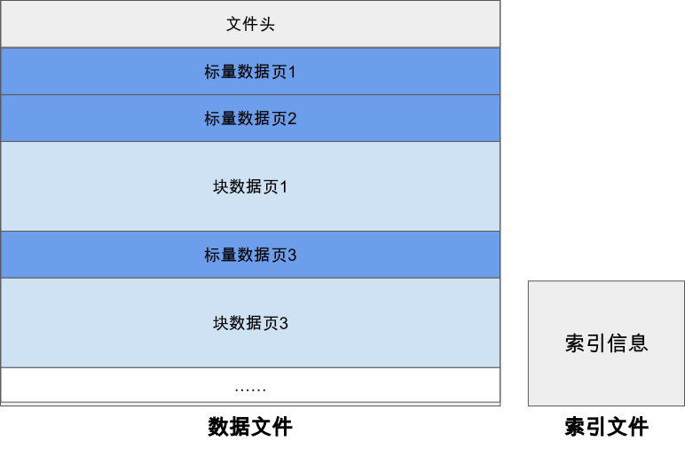
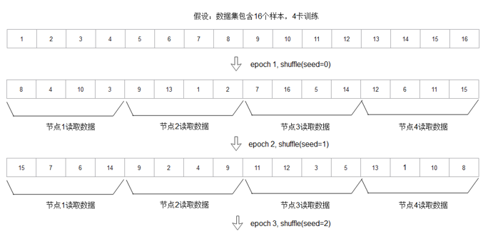
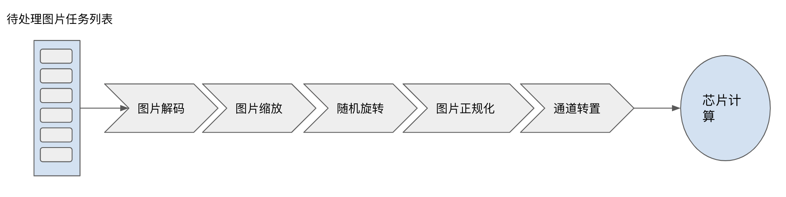
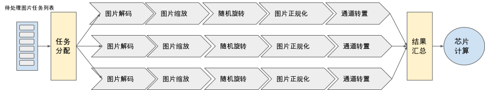
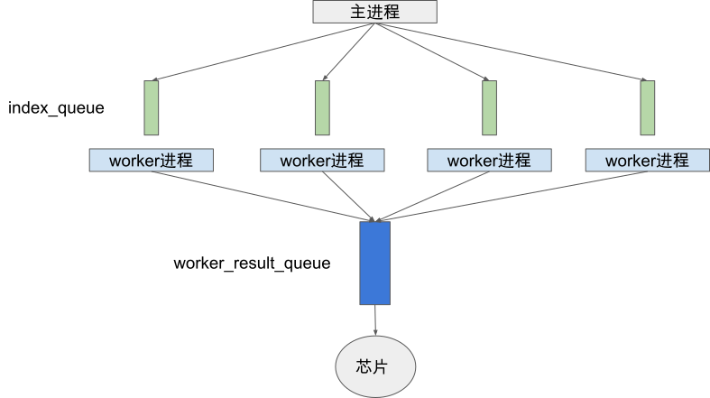
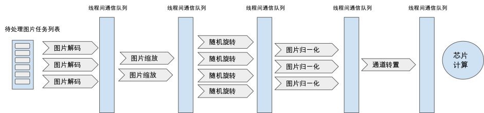

## 高效性设计

在上一节中我们重点介绍了数据模块的编程抽象以及编程接口设计，确保用户可以方便的基于我们提供的API描述数据处理流程而不需要过多关注实现和执行细节。那么本节我们将进一步探究数据加载以及流水线调度执行等数据模块关键部分设计细节以确保用户能够拥有最优的数据处理性能。同时在本节内容中，我们也会贯穿现有主要机器学习系统的实践经验以帮助读者加深对这些关键设计方案的理解。

如 :numref:`async_data_process` 所示，深度学习模型训练需要借助数据模块首先从存储设备中加载数据集，在内存中进行一系列的预处理变换，最终将处理好的数据集发送到加速器芯片上执行模型的计算，目前有大量的工作都着重于研究如何通过设计新的硬件或者应用算子编译等技术加速芯片上的模型计算，而在数据梳理流水的性能问题上鲜有涉及。但事实上很多情况下，数据预处理的执行时间往往在整个训练任务中占据着相当大的比例，导致GPU/华为昇腾Ascend等加速器无法被充分利用。研究数据表明，企业内数据中心的计算任务大约有30%的计算时间花费在数据预处理步骤 :cite:`murray2021tf`，也有研究发现在一些公开数据集上的模型训练任务有65%的时间都花费在了数据预处理上 :cite:`mohan2020analyzing`，由此可以看出数据模块的性能对于整体训练吞吐率有着决定性的影响。


:width:`800px`
:label:`async_data_process`

为了追求最高的训练吞吐率，现有系统一般选择将数据读取、数据预处理计算、以及芯片上的模型计算三个步骤异步并行执行。这三步构成了典型的数据生产者和数据消费者的上下游关系，我们将数据从存储设备中的读取速率用F表示，数据预处理速率用P表示，芯片上的数据消费速率用G表示。理想情况下我们希望G < min(F, P)，此时加速芯片不会因为等待数据而阻塞。然而现实情况下，我们常常要么因为数据加载速率F过低(称为I/O Bound)，要么因为数据预处理速率P过低(称为CPU Bound)导致G>min(F, P)而使得芯片无法被充分利用。针对上述关键性能问题，我们将在本节重点探究两个内容：

-   如何针对机器学习场景的特定I/O需求来设计相应文件格式及加载方式，以优化数据读取速率F。

-   如何设计并行架构来充分发挥现代多核CPU的计算能力，以提升数据处理速率P。

在本节的最后我们还会研究一个具有挑战性的问题，即如何利用我们在前几章学到的计算图的编译技术来优化用户的数据处理计算流图，以进一步达到最优的数据处理吞吐率性能。那么接下来，请读者和我们一起开启本节的头脑风暴旅程。

### 数据读取的高效性

首先我们来研究如何解决数据读取的性能挑战。我们面临的第一个问题是数据类型繁多，存储格式不统一带来的I/O差异，如文本数据可能存储成txt数据格式，图像数据可能存储成原始格式或者如JPEG等压缩格式。我们显然无法去针对每一种存储情况都设计其最优的数据读取方案。但是我们可以通过提出一种统一的存储格式(我们称之为Unirecord格式)以屏蔽不同数据类型的I/O差异，并基于这种数据格式进行数据加载方案的设计与优化，而实际使用中用户只需要将其原始数据集转换存储为我们的统一数据格式便可以享受到高效的读取效率。


:width:`800px`
:label:`unified_record_format`

那么我们的Unirecord除了统一用户存储格式之外还需要具备哪些特性呢？机器学习模型训练中对数据的访问具有如下特点：

-   每一个Epoch内以一种随机顺序遍历所有的数据且每个数据只被遍历一次

-   所有Epoch需要以不同的随机顺序遍历访问所有数据

上述的访问特性要求我们的Unirecord存储格式能够支持高效的随机读取。当我们的数据集能够全部存储在RAM中时，对Unirecord的随机读取并不会成为大的问题。但是当数据集大到必须存储在本地磁盘或者分布式文件系统中时，我们就需要设计特定的方案。一个直观的想法是将一个Unirecord文件分为索引块和数据块，索引块中记录每个数据在文件中的大小、偏移以及一些校验值等元信息，数据块存储每个数据的主体数据。当我们需要对一个Unirecord格式的文件进行随机读取时，我们首先在内存中加载该文件的索引块(通常远远小于整个文件大小)并在内存中建立文件内数据的索引表，接着当我们需要随机读取数据时，我们首先在索引表中查询该数据在文件中的偏移、大小等信息并基于该信息从磁盘上进行读取。这样的读取方式可以满足我们在磁盘上的随机读取需求。接下来我们以MindSpore提出的MindRecord的实践经验为例子介绍统一文件格式的设计，以帮助大家加深对这部分内容的理解


:width:`800px`
:label:`file_random_access`

#### MindRecord介绍

MindRecord是MindSpore推出的统一数据格式，目标是归一化用户的数据集，优化训练数据的读取过程。该文件格式具备如下特征：

-   实现多变的用户数据统一存储、访问，训练数据读取更加简便。

-   数据聚合存储，高效读取，且方便管理、移动。

-   高效的数据编解码操作，对用户透明、无感知。

-   可以灵活控制分区的大小，实现分布式训练。

和我们前文设计的Unirecord思路相似，一个MindRecord文件也由数据文件和索引文件组成，数据文件包含文件头、标量数据页、块数据页，用于存储用户归一化后的训练数据，索引文件包含基于标量数据（如图像Label、图像文件名等）生成的索引信息，用于方便的检索、统计数据集信息。为确保对一个MindRecord文件的随机读取性能，MindSpore建议单个MindRecord文件小于20G，若数据集超过20G，用户可在MindRecord数据集生成时指定相应参数将原始数据集分片存储为多个MindRecord文件。



:width:`800px`
:label:`mindrecord_format`

一个MindRecord文件中的数据文件部分具体的关键部分的详细信息如下：

-   **文件头**
    文件头主要用来存储文件头大小、标量数据页大小、块数据页大小、Schema信息、索引字段、统计信息、文件分区信息、标量数据与块数据对应关系等，是MindRecord文件的元信息。

-   **标量数据页**
    标量数据页主要用来存储整型、字符串、浮点型数据，如图像的Label、图像的文件名、图像的长宽等信息，即适合用标量来存储的信息会保存在这里。

-   **块数据页**
    块数据页主要用来存储二进制串、Numpy数组等数据，如二进制图像文件本身、文本转换成的字典等。

用户训练时，MindRecord的读取器能基于索引文件快速的定位找到数据所在的位置，并将其读取解码出来。另外MindRecord具备一定的检索能力，用户可以通过指定查询条件筛选获取符合期望的数据样本。

对于分布式训练场景，MindRecord会基于数据文件中Header及索引文件进行元数据的加载，得到所有样本的ID及样本在数据文件中的偏移信息，然后根据用户输入的num_shards（训练节点数）和shard_id（当前节点号）进行数据的partition，得到当前节点的num_shards分之一的数据，即：分布式训练时，多个节点只读取数据集的num_shards分之一，借由计算侧的AllReduce实现整个数据集训练的效果。进一步，如果用户开启shuffle操作，那么每epoch保证所有节点shuffle seed保持一致，那么对所有样本的ID shuffle结果是一致的，那么数据partition的结果就是正确的。



:width:`800px`
:label:`mindrecord_partition`

### 数据计算的高效性

解决了数据读取性能问题后，我们继续来研究数据计算的性能提升(即最大化上文中的数据处理速率P)。我们以上文提及的数据预处理流水为例子、来研究如何设计数据模块对用户计算图的调度执行以达到最优的性能。



:width:`800px`
:label:`serialized_data_process`

由于深度学习芯片如GPU/华为昇腾Ascend等并不具备通用数据处理的能力，
我们目前还是主要依赖CPU来完成预处理计算。主流的AI服务器大多具备多个多核CPU，数据模块需要设计合理的并行架构充分发挥多核算力，以提升数据预处理性能达到尽可能减少加速器由于等待数据而阻塞的目的。本节中我们将介绍流水线粒度并行以及算子粒度并行两种常见的并行架构。流水线并行的方式结构清晰，易于理解和实现，主要被Pytorch这样基于Python实现数据模块的机器学习系统所采用。受到经典数据并行系统调度执行架构设计的影响，其他如Google的TensorFlow以及华为的MindSpore等系统主要采用算子粒度并行做精细CPU算力分配以达到充分利用多核算力的目的。然而精细的分配意味着我们需要对所有数据处理流程中涉及的算子设置合理的并行参数，这对用户而言是一个较大的挑战。于是MindSpore等框架又提供数据流图中关键参数自动调优的功能，通过运行时的动态分析自动搜索得到最优的算子并行度等参数，极大的减少了用户的编程负担。接下来我们一一展开讨论。

#### 流水线并行

第一种常见的并行方案为流水线粒度的并行，即我们把用户构建的计算流水在一个线程/进程内顺序串行执行，同时启动多个线程/进程并行执行多个流水线。假设用户总共需要处理N个数据样本，那么当流水线并行度为M时，每个进程/线程只需要执行处理(N/M)个样本。流水线并行架构结构简单，易于实现。整个并行架构中各个执行进程/线程只需要在数据执行的开始和结束进行跨进程/线程的通信即可，数据模块将待处理的数据任务分配给各个流水线进程/线程，并在最终进行结果汇总发送到芯片上进行模型计算。从用户的角度而言使用也相对方便，只需要指定关键的并行度参数即可。接下来我们以Pytorch为例子进行详细展开。


:width:`800px`
:label:`pipeline_parallisim`

在Pytorch中，用户只需要实现一个Dataset的Python类编写数据处理过程，Dataloader通过用户指定的并行度参数num_workers来启动相应个数的Python进程调用用户自定义的Dataset类进行数据预处理。Dataloader中的进程有两类角色：worker进程以及主进程，以及两类进程间通信队列：index_queue以及worker_result_queue。训练过程中，主进程负责将待处理数据任务列表通过index_queue发送给各个worker进程，每个woker进程执行用户编写的Dataset类的数据预处理逻辑并将处理后的结果通过worker_result_queue返回给主进程。


:width:`800px`
:label:`pytorch_dataloader`

接下来我们展示一段用户使用Pytorch的Dataloader进行并行数据预处理的代码片段，可以发现我们只需要实现Dataset类描述数据预处理逻辑，并指定num_workers即可实现流水线粒度的并行数据预处理。


```python
# 描述数据预处理流程
class TensorDataset:
    def __init__(self, inps):
        sef.inps = inps
    
    def __getitem__(self, idx):
        data = self.inps[idx]
        data = data + 1
        return data
    
    def __len__(self):
        return self.inps.shape[0]

inps = torch.arange(10 * 5, dtype=torch.float32).view(10, 5)
dataset = TensorDataset(inps)

# 指定并行度为3
loader = DataLoader(dataset, batch_size=2, num_workers=3)

for batch_idx, sample in enumerate(loader):
    print(sample)
```

最后需要指出的是, Pytorch Dataloader的执行过程中涉及大量进程间通信，虽然为了加速这一步骤，Pytorch对Tensor类数据实现了基于共享内存的进程间通信机制。然而当通信数据量较大时，跨进程通信仍然会较大地影响端到端的数据预处理吞吐率性能。当然，这不是流水线并行自身的架构问题，而是由于CPython的全局解释器锁(Global Interpreter Lock, GIL)导致在Python层面实现流水线并行时只能采用进程并行。为了解决这个问题，目前Pytorch团队也在尝试通过移除CPython中的GIL来达到基于多线程实现流水线并行以提升通信效率的目的 :cite:`rmpygil`，感兴趣的读者可以选择继续深入了解。

#### 算子并行

流水线并行中算力(CPU核心)的分配以流水线为粒度，相对而言，以算子为计算资源分配粒度的算子并行是一种追求更精细算力分配的并行方案。我们期望对计算耗时高的算子分配更高的并行度，计算耗时低的算子分配更低的并行度，以达到更加高效合理的CPU算力使用。算子并行想法和经典的数据并行计算系统的并行方式一脉相承，我们以经典的MapReduce计算执行为例子，我们发现这也可以认为是一种算子并行(map算子和reduce算子),其中map算子的并行度和reduce算子的并行度根据各个算子阶段的计算耗时而决定。


:width:`800px`
:label:`mapreduce`

下图中我们给出本节开头数据预处理流程的算子并行架构示意图，我们根据各个算子的计算耗时设置图片解码算子并行度为3，图片缩放并行度为2，图片随机旋转算子并行度为4，图片归一化算子并行度为3，以及图像通道转置算子并行度为1。我们期望通过给不同耗时的算子精准的分配算力，以达到算力高效充分的利用。具体实现中算子并行一般采用线程级并行，所有的算子使用线程间队列等方法进行共享内存通信。


:width:`800px`
:label:`operator_parallisim`

现有机器学习系统的数据模块中，tf.data以及MindData均采用了算子并行的方案。由于对算力的利用更加充分、以及基于C++的高效数据流调度实现，算子并行的方案往往展示出更好的性能，tf.data的性能评测表明其相比较Pytorch的Dataloader有近两倍的性能优势 :cite:`murray2021tf`。
接下来我们以一段基于MindSpore实现本节开篇的数据预处理流程来展示如何在一个算子并行的数据流水线中设置各个算子的并行度。

```python
import mindspore.dataset as ds
import mindspore.dataset.transforms.c_transforms as c_transforms
import mindspore.dataset.transforms.vision.c_transforms as vision

# 读取数据
dataset_dir = "path/to/imagefolder_directory"
dataset = ds.ImageFolderDatasetV2(dataset_dir, num_parallel_workers=8)
transforms_list = [vision.Decode(),
                   vision.Resize((256, 256)),
                   vision.RandomRotation((0, 15)),
                   vision.Normalize((100,  115.0, 121.0), (71.0, 68.0, 70.0)),
                   vision.HWC2CHW()]
onehot_op = c_transforms.OneHot(num_classes)
# 解码算子并行度为3
dataset = dataset.map(input_columns="image", operations=vision.Decode(), num_parallel_workers=3)
# 缩放算子并行度为2
dataset = dataset.map(input_columns="image", operations=vision.Resize((256, 256)), num_parallel_workers=2)
# 随机旋转算子并行度为4
dataset = dataset.map(input_columns="image", operations=vision.RandomRotation((0, 15)), num_parallel_workers=4)
# 正规化算子并行度为3
dataset = dataset.map(input_columns="image", operations=vision.Normalize((100,  115.0, 121.0), (71.0, 68.0, 70.0)), num_parallel_workers=3)
# 通道转置算子并行度为1
dataset = dataset.map(input_columns="image", operations=vision.HWC2CHW(), num_parallel_workers=1)
dataset = dataset.map(input_columns="label", operations=onehot_op)
```

我们发现，虽然算子并行具备更高的性能潜力，但却需要我们对每一个算子设置合理并行参数。这不仅对用户提出了较高的要求，同时也增加了由于不合理的并行参数设置导致性能反而下降的风险。为了让用户更加轻松的使用算子并行，tf.data和MindData都增加了流水线关键参数动态调优功能，基于对流水线执行时的性能监控计算得到合理的参数以尽可能达到最优的数据预处理吞吐率 :cite:`murray2021tf`。

#### 数据处理计算图优化

在前文中，我们专注于通过并行架构来高效执行用户构建的数据预处理计算图。但我们可以思考如下问题：用户给定的计算图是否是一个高效的计算图?
如果不高效，我们是否能够在保证等价变换的前提下将用户的数据计算图进行优化重写得到执行性能预期更好的计算图？没错，这和我们在前几章中学习的模型计算图编译优化有着相同的思想，即通过分析变换计算图IR得到更优的IR表示来达到更好的执行性能。常用的数据图优化策略有算子融合以及map操作向量化两种。算子融合将map+map、map+batch、map+filter、filter+filter等算子组合融合成一个等价复合算子，将原先需要在两个线程组中执行的计算融合为在一个线程组中执行的复合计算，减少线程间的同步通信开销，达到了更优的性能。而map操作向量化则将常见的dataset.map(f).batch(b)操作组合变换调整为dataset.batch(b).map(parallel_for(f))，借助现代CPU的对并行操作更友好的SIMD指令集来加速数据预处理。

