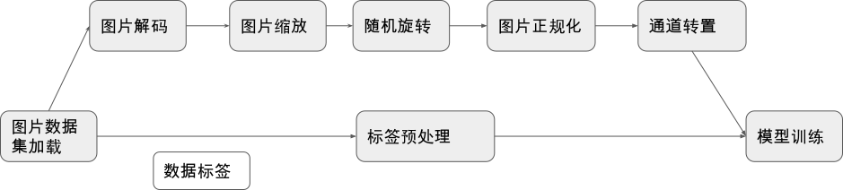
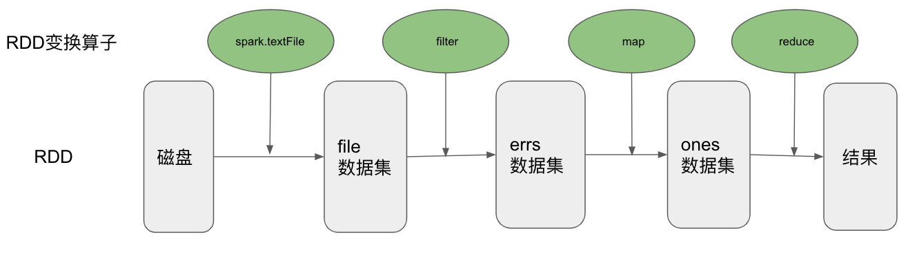
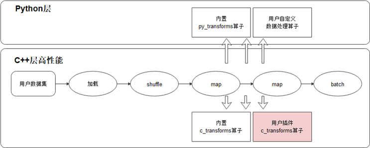

## 易用性设计

本节我们主要介绍如何设计一个易用的机器学习系统数据模块。正如前文所言，易用性既要求数据模块提供好的编程抽象和接口使得用户可以方便的构建一个数据处理流水，同时还要支持用户灵活地在数据流水中注册使用自定义算子以满足丰富多变的特殊需求，接下来我们将从编程接口抽象和自定义算子注册机制两个方面来展开探讨。

### 编程抽象与接口

 :numref:`image_process_pipeline` 我们展示的是一个训练图片分类模型的经典数据预处理流水线。我们从存储设备中加载数据集后，对数据集中的图片数据进行解码、缩放、旋转、正规化、通道变换等一系列操作，对数据集的标签也进行特定的预处理操作，最终将处理好的数据发送到芯片上进行模型的计算。我们希望数据模块提供的编程抽象具备足够高的层次，以使得用户可以通过短短几行代码就能描述清楚数据处理的逻辑，不需要陷入过度的、重复的数据处理实现细节当中。同时又要确保这一套高层次的抽象具备足够通用性，以满足多样的数据预处理需求。在我们得到一个好的编程抽象后，我们将会以基于MindSpore的数据模块提供的编程接口实现下图所描述的数据预处理流水线的代码片段为例子来展示一个优秀的编程抽象对用户编程负担的减轻是有多么大的作用。


:width:`800px`
:label:`image_process_pipeline`


事实上，面向数据计算的编程抽象早已在通用数据并行计算系统领域中被广泛的研究并取得了相对统一的共识------那就是提供类LINQ式 :cite:`meijer2006linq` 的编程抽象，其最大的特点是让用户专注于描述基于数据集的生成与变换，而将这些操作的高效实现与调度执行交由数据系统的运行时负责。一些优秀的系统如Naiad :cite:`murray2013naiad`,
Spark :cite:`zaharia2010spark`, DryadLINQ :cite:`fetterly2009dryadlinq`等都采用了这种编程模型。我们以Spark为例子进行简要介绍。

Spark向用户提供了基于弹性分布式数据集(Resilient Distributed Dataset, RDD)概念的编程模型。一个RDD是一个只读的分布式数据集合，用户通过Spark的编程接口来主要描述RDD的创建及变换过程，我们以一个Spark示例进行展开讨论。下面展示了一段在一个日志文件中统计包含ERROR字段的行数的Spark代码，我们首先通过文件读取创建一个分布式的数据集file（前文提到RDD表示数据的集合，这里的file实际上是日志行的数据集合）。
我们对这个file数据集进行filter(过滤)运算得到新的只保留包含ERROR字段的日志行的数据集errs，接着我们对errs中的每一个数据进行map(映射)操作得到数据集ones，最后我们对ones数据集进行reduce操作得到了我们最终想要的统计结果，即file数据集中包含ERROR字段的日志行数。

```java
val file = spark.textFile("hdfs://...")
val errs = file.filter(_.contains("ERROR"))
val ones = errs.map(_ => 1)
val count = ones.reduce(_+_)
```


我们发现用户只需要四行代码就完成了在这样一个分布式的数据集中统计特定字段行数的复杂任务，这得益于Spark核心的RDD编程抽象，从 :numref:`rdd_transformation_example`的计算流程可视化中我们也可以清晰的看到用户在创建数据集后，只需要描述在数据集上的作用算子即可，至于算子的执行和实现则由系统的运行时负责。



:width:`800px`
:label:`rdd_transformation_example`
主流机器学习系统中的数据模块同样也采用了类似的编程抽象，如TensorFlow的数据模块tf.data :cite:`murray2021tf`,
以及MindSpore的数据模块MindData等。接下来我们以MindData的接口设计为例子来介绍如何面向机器学习这个场景设计好的编程抽象来帮助用户方便的构建模型训练中多种多样的数据处理流水线。

MindData是机器学习系统MindSpore的数据模块，主要负责完成机器学习模型训练中的数据预处理任务，MindData向用户提供的核心编程抽象为基于Dataset（数据集）的变换处理。这里的Dataset是一个数据帧的概念(Data
Frame)，即一个Dataset为一个多行多列，且每一列都有列名的关系数据表。


:width:`800px`
:label:`mindspore dataset example`

基于这样一个编程模型，结合我们在第一节中介绍的机器学习数据流程中的关键处理流程，MindData为用户提供了对数据集进行shuffle、map、batch等变换操作的数据集操作算子，这些算子接收一个Dataset作为输入，并以一个新处理生成的Dataset作为结果输出，我们列举典型的数据集变换接口如下：

:MindSpore支持的数据集操作接口

| 数据集操作           | 含义解释                                                 |
| -------------------- | -------------------------------------------------------- |
| batch                | 将数据集中的多行数据项组成一个mini-batch                 |
| map                  | 对数据集中的每行数据进行变换操作                         |
| shuffle              | 随机打乱数据集中的数据行的顺序                           |
| filter               | 对数据集的数据行进行过滤操作，只保留通过过滤条件的数据行 |
| prefetch             | 从存储介质中预取数据集                                   |
| project              | 从Dataset数据表中选择一些列用于接下来的处理              |
| zip                  | 将多个数据集合并为一个数据集                             |
| repeat               | 多轮次训练中，重复整个数据流水多次                       |
| create_dict_iterator | 对数据集创建一个返回字典类型数据的迭代器                 |
| ...                  | ...                                                      |

上述描述了数据集的接口抽象，而对数据集的具体操作实际上是由具体的数据算子函数定义。为了方便用户使用，MindData对机器学习领域常见的数据类型及其常见数据处理需求都内置实现了丰富的数据算子库。针对视觉领域，MindData提供了常见的如Decode(解码)、Resize（缩放）、RandomRotation（随机旋转）、Normalize(正规化)以及HWC2CHW（通道转置）等算子；针对文本领域，MindData提供了Ngram、NormalizeUTF8、BertTokenizer等算子；针对语音领域，MindData提供了TimeMasking（时域掩盖）、LowpassBiquad（双二阶滤波器）、ComplexNorm（归一化）等算子；这些常用算子能覆盖用户的绝大部分需求。

除了支持灵活的Dataset变换，针对数据集种类繁多、格式与组织各异的难题，MindData还提供了灵活的Dataset创建，主要分为如下三类：

-   通过内置数据集直接创建：MindData内置丰富的经典数据集，如CelebADataset、Cifar10Dataset、CocoDataset、ImageFolderDataset、MnistDataset、VOCDataset等。如果用户需要使用这些常用数据集，可通过一行代码即可实现数据集的开箱使用。同时MindData对这些数据集的加载进行了高效的实现，以确保用户能够享受到最好的读取性能。

-   从MindRecord中加载创建：MindRecord为MindData设计的一种高性能通用数据存储文件格式，用户可将数据集转换为MindRecord后借助MindSpore的相关API进行高效的读取。

-   从Python类创建：如果用户已经有自己数据集的Python读取类，那么可以通过MindData的GeneratorDataset接口调用该Python类实现Dataset的创建，这给用户提供了极大的自由度。


最后我们以一个基于MindData实现我们本节开篇所描述的数据处理流水线为例子来展示以Dataset为核心概念的数据编程抽象是多么的用户友好。我们只需要短短10余行代码即可完成我们所期望的复杂数据处理，同时在整个过程中，我们只专注于逻辑的描述，而将算子的实现和算子执行流程交由数据模块负责，这极大的减轻了用户的编程负担。

```python
import mindspore.dataset as ds
import mindspore.dataset.transforms.c_transforms as c_transforms
import mindspore.dataset.transforms.vision.c_transforms as vision
dataset_dir = "path/to/imagefolder_directory"

# create a dataset that reads all files in dataset_dir with 8 threads
dataset = ds.ImageFolderDatasetV2(dataset_dir, num_parallel_workers=8)

#create a list of transformations to be applied to the image data
transforms_list = [vision.Decode(),
                    vision.Resize((256, 256)),
                    vision.RandomRotation((0, 15)),
                    vision.Normalize((100,  115.0, 121.0), (71.0, 68.0, 70.0)),
                    vision.HWC2CHW()]
onehot_op = c_transforms.OneHot(num_classes)

# apply the transform to the dataset through dataset.map()
dataset = dataset.map(input_columns="image", operations=transforms_list)
dataset = dataset.map(input_columns="label", operations=onehot_op)

```

### 自定义算子支持

有了基于数据集变换的编程抽象、以及针对机器学习各种数据类型的丰富变换算子支持，我们可以覆盖用户绝大部分的数据处理需求。然而由于机器学习领域本身进展快速，新的数据处理需求不断涌现，可能会有用户想要使用的数据变换算子没有被数据模块覆盖支持到的情况发生。为此我们需要设计良好的用户自定义算子注册机制，使得用户可以方便在构建数据处理流水线时使用自定义的算子。

机器学习场景中，用户的开发编程语言以Python为主，所以我们可以认为用户的自定义算子更多情况下实际上是一个Python函数或者Python类。数据模块支持自定义算子的难度主要与数据模块对计算的调度实现方式有关系，比如Pytorch的dataloader的计算调度主要在Python层面实现，得益于Python语言的灵活性，在dataloader的数据流水中插入自定义的算子相对来说比较容易；而像TensorFlow的tf.data以及MindSpore的MindData的计算调度主要在C++层面实现，这使得数据模块想要灵活的在数据流中插入用户定义的Python算子变得较为有挑战性。接下来我们以MindData中的自定义算子注册使用实现为例子展开讨论这部分内容。



:width:`800px`
:label:`mindspore operator example`

MindData中的数据预处理算子可以分为C层算子以及Python层算子，C层算子能提供较高的执行性能而Python层算子可以很方便借助丰富的第三方Python包进行开发。为了灵活地覆盖更多场景，MindData支持用户使用Python开发自定义算子，如果用户追求更高的性能，MindData也支持用户将开发的C层算子编译后以插件的形式注册到MindSpore的数据处理中进行调用。

对于用户传入map、filter等数据集变换算子中的自定义数据处理算子，MindData的Pipeline启动后会通过创建的Python运行时来执行。需要指出的是自定义的Python算子需要保证输入、输出均是numpy.ndarray类型。具体执行过程中，当MindData的Pipeline的数据集变换中执行用户自定义的PyFunc算子时，会将输入数据以numpy.ndarray的类型传递给用户的PyFunc，自定义算子执行完毕后再以numpy.ndarray返回给MindData，在此期间，正在执行的数据集变换算子（如map、filter等）负责该PyFunc的运行时生命周期及异常判断。如果用户追求更高的性能，MindData也支持用户自定义C算子。dataset-plugin仓（插件仓） :cite:`minddata` 为MindData的算子插件仓，囊括了为特定领域（遥感，医疗，气象等）量身制作的算子，该仓承载MindData的插件能力扩展，为用户编写MindData的新算子提供了便捷易用的入口，用户通过编写算子、编译、安装插件步骤，然后就可以在MindData
Pipeline的map操作中使用新开发的算子。


:width:`800px`
:label:`mindspore_user_defined_operator`
