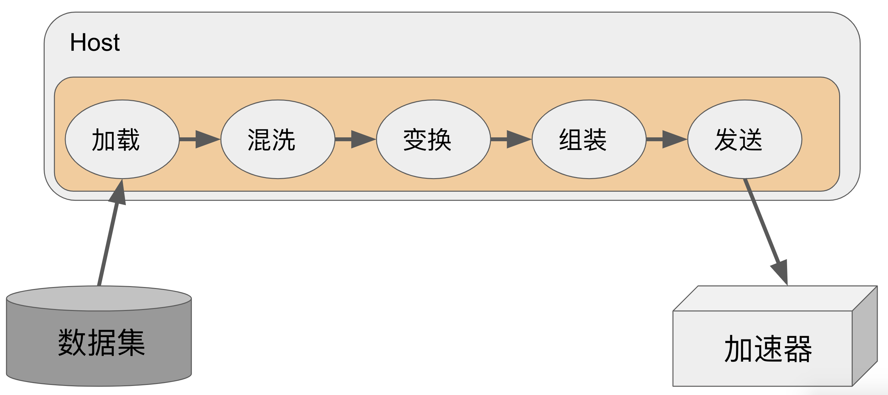

## 概述

机器学习场景中的数据处理是一个典型的提取-变换-加载（Extract-Transform-Load，ETL）过程，提取阶段从存储设备中完成数据集加载，变换阶段完成对数据集的变换处理。虽然不同的机器学习框架在构建数据处理模块时采用了不同的技术方案，但其核心都会包含数据加载、数据混洗、数据变换、数据下批次组装以及向加速器发送数据等关键组件（如图7.1所示）。其中每个组件的功能介绍如下：

-   **数据加载组件(Load)**：负责从存储设备中加载读取数据集，需要同时考虑存储设备的多样性（如本地磁盘/内存，远端磁盘和内存等）和数据集格式的多样性（如csv格式，txt格式等）。根据机器学习任务的特点，AI框架也提出了统一的数据存储格式（如谷歌TFRecord,
    华为MindRecord等）以提供更高性能的数据读取。

-   **数据混洗组件(Shuffle)**：负责将输入数据的顺序按照用户指定方式随机打乱，以提升模型的鲁棒性。

-   **数据变换组件(Map)**：负责完成数据的变换处理，内置面向各种数据类型的常见预处理算子，如图像中的尺寸缩放和翻转，音频中的随机加噪和变调、文本处理中的停词去除和随机遮盖(Mask)等。

-   **数据组装组件(Batch)**：负责组装构造一个批次(mini-batch)的数据发送给训练/推理。

-   **数据发送组件(Send)**：负责将处理后的数据发送到GPU/华为昇腾Ascend等加速器中以进行后续的模型计算和更新。高性能的数据模块往往选择将数据向设备的搬运与加速器中的计算异步执行，以提升整个训练的吞吐率。

:width:`800px`
:label:`pipeline`

实现上述的组件只是数据模块的基础，我们还要对如下方面进行重点设计：

#### 易用性

机器学习模型训练/推理过程中涉及到的数据处理非常灵活：一方面，不同的应用场景中数据集类型千差万别，特点各异。在加载数据集时，数据模块不仅要支持图像、文本、音频、视频 等多种类型存储格式，还要支持内存、本地磁盘、分布式文件系统以及对象存储系统等多种存储 类型。为减少用户学习成本，数据模块需要对上述复杂情况下数据加载进行抽象统一。另一方面， 不同类型的数据往往也有着不同的数据处理方式。常见机器学习任务中，图像任务常常需要进行 图像缩放、图像翻转、图像模糊化等处理，文本任务需要对文本进行切分、向量化等操作，而语 音任务又需要对语音进行快速傅立叶变换、混响增强、变频等预处理。为帮助用户解决绝大部分 场景下的数据处理需求，数据模块需要支持足够丰富的面向各种类型的数据预处理算子。然而新 的算法和数据处理需求在不断快速涌现，还需要支持用户在数据模块中方便的使用自定义处理算 子，以应对数据模块未覆盖到的场景，达到灵活性和高效性的平衡。

#### 高效性

由于GPU/华为昇腾Ascend等常见 AI 加速器主要面向 Tensor（向量）数据类型计算，现 有主流机器学习系统数据模块通常选择使用 CPU 进行数据处理流水线的执行。理想情况下，在 每个训练迭代步开始之前，数据模块都需要将数据准备好、以减少加速器因为等待数据而阻塞 的时间消耗。然而数据流水线中的数据加载和数据预处理常常面临着具有挑战性的 I/O 性能和 CPU 计算性能问题，数据模块需要设计具备支持随机读取且具备高读取吞吐率的文件格式来解 决数据读取瓶颈问题，同时还需要设计合理的并行架构来高效地执行数据流水线，以解决计算性 能问题。为达到高性能的数据吞吐率，主流机器学习系统均采用数据处理与模型计算进行异步执 行，以掩盖数据预处理的延迟。

#### 保序性

和常规的数据并行计算任务所不同的是，机器学习模型训练对数据输入顺序敏感。使用随机 梯度下降算法训练模型时，通常在每一轮需要按照一种伪随机顺序向模型输入数据，并且在多轮 训练 (Epoch) 中每一轮按照不同的随机顺序向模型输入数据。由于模型最终的参数对输入数据 的顺序敏感，为了帮助用户更好的调试和确保不同次实验的可复现性，数据模块需要在系统中设 计相应机制使得数据最终送入模型的顺序由数据混洗组件的数据输出顺序唯一确定，不会由于并 行数据变换处理导致最终数据模块的数据输出顺序不确定。后文中对于保序性的要求和具体实现 细节会展开探讨。
