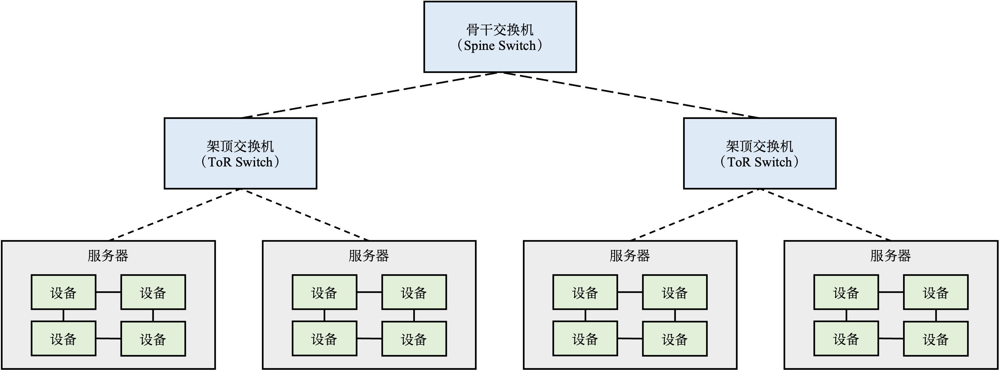
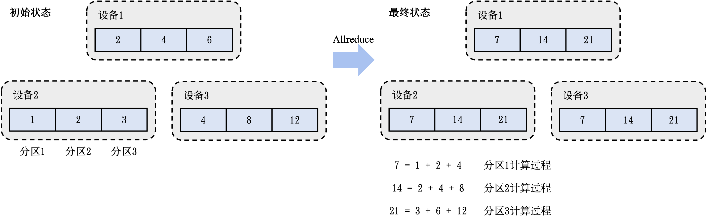

## 集合通讯

接下来，我们会讲解集合通讯 (Collective Communication) 在大型深度学习系统中的应用。作为并行计算中的一个重要概念，集合通信算子经常会被用来构建单程序流/多数据流编程环境（SPMD）中的许多交互模式。近年来，该领域无论是在对不同硬件架构的支持还是算法性能的发展上都成果颇丰，而因SPMD在大型深度学习系统中与数据并行的深厚联系，这些框架也在其中受益匪浅。因此，相比点对点 (Point-to-Point, p2p) 通信，我们有更大的兴趣去探讨如何高效地在数据中心（Data Centers）中实现这些集合通讯范式。首先，我们会介绍一些集合通讯中常见的算子，一个经典的利用Allreduce算法解决分布式训练系统中网络瓶颈的示例，探讨该算法在不同网络拓扑结构下的差异性以及一些重要指标（算法带宽，总线带宽）的计算方法，最后简略介绍现有机器学习系统对不同集合通讯算法的支持。

### 常见算子

主流的并行计算库一般会针对

#### Broadcast
#### Reduce
#### AllGather
#### ReduceScatter
#### Allreduce

### 在数据中心的梯度计算

接下来，我们将用一个示例来阐释集合通讯在机器学习系统中发挥的重要作用。

:width:`800px`
:label:`ch10-datacentre`

 :numref:`ch10-datacentre` 描述了一个典型的用于深度学习模型训练的数据中心。数据中心中的训练服务器一般会有多个设备。如需增加服务器，我们会将多个训练服务器放置在一个机柜（Rack）上，同时接入一个架顶交换机（Top of Rack Switch）将其连接。在现有机柜满载的情况下，可以通过在架顶交换机间增加骨干交换机（Spine Switch）来接入新的机柜。通过这种方式，可以在数据中心内不断增加服务器，从而为神经网络的训练提供海量的算力和内存。目前的商用数据中心可拥有近百万台服务器。

在数据中心中训练大型神经网络的首要挑战是如何高效计算大量的平均梯度。假设给定一个千亿级别参数的神经网络（比如OpenAI 发布的大型语言模型GPT-3 :cite:`https://doi.org/10.48550/arxiv.2005.14165` 有将近1750亿参数），如果用32位浮点数来表达每一个参数，那么每一步训练中，一个数据并行模式下的模型副本（Model Replica）则需要生成700GB的本地梯度数据（即 175G $\times$ 4 bytes = 700GB）。假如有3个模型副本，那么至少需要传输1.4TB（即，700GB $\times$ $(3-1)$）的本地梯度数据（因为对于$N$个副本，只需传送其中的$N-1$个副本来完成计算）。当平均梯度计算完成后，需要进一步将其广播（Broadcast）到全部的模型副本（即1.4TB的数据）并更新其中的本地参数，从而确保模型副本不会偏离（Diverge）主模型中的参数。

当前的数据中心一般使用以太网（Ethernet）构建不同机柜之间的网络。主流的商用以太网链路带宽一般在10Gbps到25Gbps之间。利用以太网传输海量梯度会产生严重的传输延迟，从而降低模型训练的速度。新型深度学习训练集群（如英伟达的DGX系列机器）往往配置有更快的Inifiband。单个InfiniBand链路可以提供100Gbps或200Gbps的带宽。即使拥有这种高速网络，传输TB级别的本地梯度依然需要大量延迟（即使忽略网络延迟，1TB的数据在200Gbps的链路上传输也需要至少40秒）。

为了避免通过机间网络传输数据，现代深度学习服务器一般都会配备多个加速器（例如说，英伟达的DGX-3服务器会配备8个A100 GPU），而在一个服务器内的多个设备可以通过高速机内网络互联（如NVLink）。这种高速机内网络可以提供高达400GBps的带宽，从而让传输TB级别的数据成为可能。然而，受限于单个服务器的散热，成本和硬件等限制，通常无法在一个服务器内无限制的持续增加设备。因此，大型深度学习模型的训练仍需要多个服务器共同完成。在计算平均梯度时，服务器需要同时借助机间网络通信接口（以太网或InfiniBand）和机内通信接口（NVLink）。

### 基于Allreduce的梯度平均算法

我们将讨论如何利用Allreduce算子来实现数据中心中的高效梯度平均。首先，可以考虑一种简单的计算平均梯度的方法：在集群中分配一个设备来收集本地梯度，并在计算平均梯度后再将其广播到全部的设备。这种做法易于实现，但是其引入了两个问题。首先，多台设备同时给该聚合设备发送数据时，聚合设备会因严重的带宽不足产生网络拥塞。其次，单台设备需要负担大量的梯度平均计算，而受限于单台设备上的有限算力，这种计算往往会受限于算力瓶颈。

:width:`800px`
:label:`ch10-allreduce-state`

为了解决上述问题，可以引入Allreduce算子来实现一个更优的算法。该算法的核心设计思路是：通过让全部的节点参与到梯度的网络通信和平均计算中，将巨大的网络和算力开销均摊给全部节点。这种做法可以解决先前单个梯度聚合节点的问题。假设有$M$个设备，每个设备存有一个模型副本，该模型由$N$个参数/梯度构成。那么按照Allreduce算子的要求，需要先将全部的参数按照设备数量切分成$M$个分区（Partition），使得每个分区具有$N/M$个参数。我们首先给出这个算法的初始和终止状态。如 :numref:`ch10-allreduce-state` 所示，该例子含有3个设备。在每个设备有一个模型副本的情况下，这个副本有3个参数。那么按照Allreduce的分区方法，参数会被划分成3个分区（3个设备），而每一个分区则有1个参数（$N/M$，N代表3个参数，M代表3个设备）。在这个例子中，假定设备1拥有参数2,4,6，设备2拥有参数1,2,3，设备3拥有参数4,8,12，那么在使用Allreduce算子进行计算过后，全部的设备都将拥有梯度相加后的结果7,14,21，其中分区1的结果7是由3个设备中分区1的初始结果相加而成（7 = 1 + 2 + 4）。为了计算平均梯度，每个设备只需要在最后将梯度之和除以设备数量即可（分区1的最终结果为7除以3）。

:width:`800px`
:label:`ch10-allreduce-process`

Allreduce算子会把梯度的计算拆分成$M-1$个Reduce算子和$M-1$个Broadcast算子（其中$M$是节点的数量）。其中，Reduce算子用于计算出梯度的和（Summation），Broadcast算子用于把梯度之和广播给全部的节点。为了说明这些算子的执行过程，可以参照 :numref:`ch10-allreduce-process` 。Allreduce算子由Reduce算子开始，在第一个Reduce算子中，Allreduce算子会对全部节点进行配对（Pairing），让他们共同完成梯度相加的操作。在 :numref:`ch10-allreduce-process` 的第一个Reduce算子中，设备1和设备2进行了配对共同对分区1的数据相加。其中，设备2把本地的梯度数据1发送给设备1，设备将接收到1和本地的分区1内的梯度数据：2进行相加，计算出中间（intermediate）梯度相加的结果：3。于此同时，设备1和设备3进行配对，共同完成对分区3的数据相加。而设备3和设备2进行配对，共同完成对于分区2的数据相加。

在上述Reduce的算子中，梯度的计算实现了以下几个特性:

-   **网络优化：**
    全部设备都同时在接收和发送数据，利用起了每个设备的入口（Ingress）和出口（Egress）带宽。因此Allreduce过程中可利用的带宽是$M \times B$，其中$M$是节点数量，$B$是节点带宽，从而让系统实现网络带宽上的可扩展性。

-   **算力优化：**
    全部设备的处理器都参与了梯度相加的计算。因此Allreduce过程中可利用的处理器是$M \times P$，其中$M$是节点数量，$P$是处理器数量，从而让系统实现计算上的可扩展性。

-   **负载均衡：**
    由于数据分区是平均划分的，因此每次设备分摊到的通讯和计算开销是相等的。

在接下来的Reduce算子中，Allreduce算法会对不同数据分区选择另外的配对方法。例如说，在 :numref:`ch10-allreduce-process`  的第二个Reduce算子中，Allreduce算法会将：设备1和设备3进行配对，负责分区1的数据相加。将设备1和设备2进行配对，负责分区2。将设备2和设备3进行配对，负责分区3。在一个3个节点的Allreduce集群里，在2个Reduce算子完成后，我们就计算出了每个分区的数据相加结果（分区1的结果7此时在设备3上，分区2的结果14此时在设备1上，分区3的结果21此时在设备2上）。

接下来，Allreduce算法将进入Broadcast阶段。这一阶段的过程和Reduce算子类似，核心区别是节点进行配对后，他们不再进行数据相加，而是将Reduce的计算结果进行广播。在 :numref:`ch10-allreduce-process`  中的第一个Broadcast算子中，设备1会将分区2的结果14直接写入设备3的分区2中。设备2会讲分区3的结果21直接写入设备1中。设备3会将分区1的结果直接写入设备2中。在一个3个节点的Allreduce集群中，我们会重复2次Broadcast算子来将每个分区的Reduce结果告知全部的节点。

:cite:`nvidia-nccl`

:cite:`10.1007/978-3-030-50743-5_3`

### Allreduce 与网络拓扑

从上文中可知，Allreduce算子在计算中需要一种方法把不同的节点进行配对。在网络拓扑结构（Network Topology）不同的情况下，配对方法的选择会对实际计算效率产生较大的影响。在大型深度学习系统中，基于英伟达GPU的集合通信库NCCL (:cite:`nvidia-nccl`) 针对多变的网络拓扑设定了三种Allreduce的算法变种，分别为树形（Tree), 环形（Ring）以及CollNet。在实际运行该库时，系统会默认对当前环境进行校准，并选择在测试样例上速度最快的算法变种。

#### 树形结构
#### 环形结构
#### CollNet 算法

### 带宽计算

在讨论集合通讯算子的性能时，人们经常会使用一些数值化指标去量化不同的算法实现，其中一个重要概念为带宽（Bandwidth）。在文献中，通常有两种主流的对带宽的计算方法，分别为算法带宽（Algorithm Bandwidth）与总线带宽（Bus Bandwidth）。

#### 算法带宽
#### 总线带宽

### 使用方法

### 集合通信与机器学习系统

不同的集合通信算子已经被常见的分布式训练框架（包括Horovod, KungFu, TensorFlow distributed, PyTorch distributed）等支持。当用户选择使用数据并行模式的过程，其底层会默认触发。

#### 集合通信的实现
#### 支持集合通信的深度学习框架与调用方法

