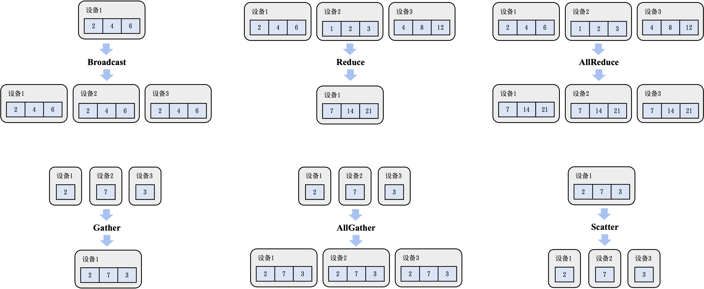
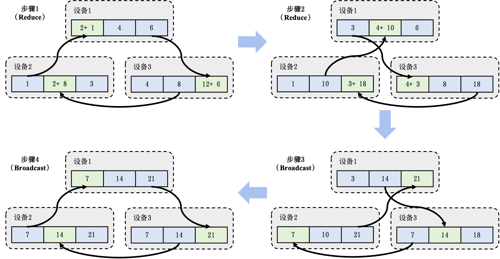
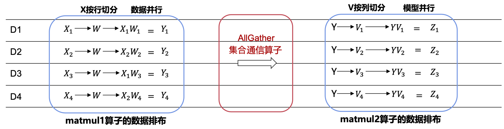

## 集合通信

下面讨论如何利用集合通信在机器学习集群中实现分布式训练系统。作为并行计算的一个重要概念，集合通信经常被用来构建高性能的单程序流/多数据流（Single Program-Multiple Data, SPMD）程序。接下来，首先会介绍集合通信中的常见算子。然后描述如何使用AllReduce算法解决分布式训练系统中网络瓶颈，并且讨论AllReduce算法在不同网络拓扑结构下的差异性以及重要性能指标的计算方法。最后介绍现有机器学习系统对不同集合通信算法的支持

### 常见集合通信算子

下面首先定义一个简化的集合通信模型，然后引入常见的集合通信算子：Broadcast、Reduce、AllGather、Scatter和 AllReduce。需要指出的是，在分布式机器学习的实际场景下，人们还会使用许多其他的集合通信算子，如ReduceScatter、Prefix Sum、Barrier、All-to-All等，但由于篇幅限制，便不再赘述。

#### 通信模型

假定在一个分布式机器学习集群中，存在$p$个计算设备，并由一个网络来连接所有的设备。每个设备有自己的独立内存，并且所有设备间的通信都通过该网络传输。同时，每个设备都有一个编号$i$，其中$i$的范围从$1$到$p$。
设备之间的点对点（Point-to-Point, P2P）通信由全双工传输（Full-Duplex Transmission)实现。该通信模型的基本行为可以定义如下：

* 每次通信有且仅有一个发送者（Sender）和一个接收者（Receiver）。在某个特定时刻，每个设备仅能至多发送或接收一个消息（Message）。每个设备可以同时发送一个消息和接收一个消息。一个网络中可以同时传输多个来自于不同设备的消息。
* 传输一个长度为$l$个字节（Byte）的消息会花费$a+b \times l$的时间，其中$a$代表延迟（Latency），即一个字节通过网络从一个设备出发到达另一个设备所需的时间；$b$代表传输延迟（Transmission Delay），即传输一个具有$l$个字节的消息所需的全部时间。前者取决于两个设备间的物理距离（如跨设备、跨机器、跨集群等），后者取决于通信网络的带宽。需要注意的是，这里简化了传输延迟的定义，其并不考虑在真实网络传输中会出现的丢失的消息（Dropped Message）和损坏的消息（Corrupted Message）的情况。

根据上述通信模型，我们可以定义集合通信算子，并且分析算子的通信性能。下面介绍一些常见的集合通信算子。

#### Broadcast


:width:`800px`
:label:`ch10-collective-operators`

一个分布式机器学习系统经常需要将一个设备$i$上的模型参数或者配置文件广播（Broadcast）给其余全部设备。因此，可以把Broadcast算子定义为从编号为$i$的设备发送长度为$l$字节的消息给剩余的$p-1$个设备。 :numref:`ch10-collective-operators`展示了设备1（在三个设备的集群里）调用Broadcast的初始和结束状态。

一种简单实现Broadcast的算法是在设备$i$上实现一个循环，该循环使用$p-1$次Send/Receive操作来将数据传输给相应设备。然而，该算法不能达到并行通信的目的（该算法只有$(a+b \times l) \times (p-1)$的线性时间复杂度）。为此，可以利用分治思想对上述简单实现的Broadcast算法进行优化。假设所有的设备可以重新对编号进行排列，使得Broadcast的发送者为编号为$1$的设备。同时，为了简化计算过程，假设对某个自然数$n$，$p = 2^n$。 现在，可以通过从1 向 $p/2$ 发送一次信息把问题转换为两个大小为$p/2$的子问题：编号为1的设备对编号1到编号$p/2-1$ 的Broadcast，以及编号为$p/2$的设备对编号$p/2$到编号$p$的Broadcast。我们便可以通过在这两个子问题上进行递归来完成这个算法，并把临界条件定义为编号为$i$的设备在$[i,i]$这个区间中的Broadcast。此时，由于$i$本身已经拥有该信息，不需要做任何操作便可直接完成Broadcast。这个优化后的算法为$(a+b \times l) \times \log p$ 时间复杂度，因为在算法的每一阶段（编号为$t$），有$2^t$个设备在并行运行Broadcast算子。同时，算法一定会在$\log p$ 步之内结束。

#### Reduce

在分布式机器学习系统中，另一个常见的操作是将不同设备上的计算结果进行聚合（Aggregation）。例如，将每个设备计算的本地梯度进行聚合，计算梯度之和（Summation）。这些聚合函数（表达为$f$）往往符合结合律（Associative Law）和交换律（Commutative Law）。这些函数由全部设备共同发起，最终聚合结果存在编号为$i$的设备上。常见聚合函数有加和、乘积、最大值和最小值。集合通信将这些函数表达为Reduce算子。
:numref:`ch10-collective-operators`展示了设备1调用Reduce来进行加和的初始和结束状态。

一个简易的Reduce的优化实现同样可以用分治思想来实现，即把$1$到$p/2-1$的Reduce结果存到编号为$1$的设备中，然后把$p/2$到$p$的Reduce结果存到$p/2$上。最后，可以把$p/2$的结果发送至$1$，执行$f$，并把最后的结果存至$i$。假设$f$的运行时间复杂度为常数并且其输出信息的长度$l$不改变，Reduce的时间复杂度仍然为$(a+b \times l) \times \log p$。

#### AllReduce

集合通信通过引入AllReduce算子，从而将Reduce函数$f$的结果存至所有设备上。:numref:`ch10-collective-operators`展示了设备1，设备2和设备3共同调用AllReduce来进行加和的初始和结束状态。

一种简单的AllReduce实现方法是首先调用Reduce算法并将聚合结果存到编号为$1$的设备上。然后，再调用Broadcast算子将聚合结果广播到所有的设备。这种简单的AllReduce实现的时间复杂度为$(a+b \times l) \times \log p$。

#### Gather
Gather算子可以将全部设备的数据全部收集（Gather）到编号为$i$的设备上。 :numref:`ch10-collective-operators`展示了设备1调用Gather来收集全部设备的数据的初始和结束状态。

在收集函数（Gather Function）符合结合律和交换律的情况下，可以通过将其设为Reduce算子中的$f$来实现Gather算子。但是，在这种情况下，无论是基于链表还是数组的实现，在每一步的Reduce操作中$f$的时间复杂度和输出长度$l$都发生了改变。因此，Gather的时间复杂度是$a \times \log p + (p-1) \times b \times l$。这是因为在算法的每一阶段$t$，传输的信息长度为$2^{t} \times l$。

#### AllGather
AllGather算子会把收集的结果分发到全部的设备上。 :numref:`ch10-collective-operators`展示了设备1，设备2和设备3共同调用AllGather的初始和结束状态。

在这里，一个简单的方法是使用Gather和Broadcast算子把聚合结果先存到编号为1的设备中，再将其广播到剩余的设备上。这会产生一个$a \times \log p + (p-1) \times b \times l + (a+p \times l \times b) \times \log p$的时间复杂度，因为在广播时，如果忽略链表/数组实现所带来的额外空间开销，每次通信的长度为$pl$而不是$l$。简化后，得到了一个$a \times  \log p + p \times l \times b \times \log p$ 的时间复杂度。在一个基于[超立方体](https://link.springer.com/book/10.1007/978-3-030-25209-0)的算法下，可以将其进一步优化到和Gather算子一样的时间复杂度$a \times \log p + (p-1) \times b \times l$，由于篇幅问题此处便不再赘述。

#### Scatter

Scatter算子可以被视作Gather算子的逆运算：把一个存在于编号为$i$的设备上，长度为$p$（信息长度为$p \times  l$）的链式数据结构$L$中的值分散到每个设备上，使得编号为$i$的设备会得到$L[i]$的结果。 :numref:`ch10-collective-operators`展示了设备1调用Scatter的初始和结束状态。

可以通过模仿Gather算法设计一个简易的Scatter实现：每一步的运算中，我们把现在的子链继续对半切分，并把前半段和后半段作为子问题进行递归。这时候，在算法的每一阶段$t$，传输的信息长度为$l \times  2^{(m-t)}$，其中$m$是算法总共运行的步骤，不会超过$\log p$ （见Broadcast算子的介绍）。最终，Scatter算子的简易实现和Gather算子一样都有$a \times \log p + (p-1)  \times b \times l$ 的时间复杂度。在机器学习系统中，Scatter算子经常同时被用于链式数据结构和可切分的数据结构，例如张量在一个维度上的$p$等分等。

### 基于AllReduce的梯度平均算法

下面讨论如何利用AllReduce算子实现大型集群中的高效梯度平均。首先，参照前面的分析，可以考虑一种简单的计算平均梯度的方法：在集群中分配一个设备收集本地梯度，并在计算平均梯度后再将其广播到全部的设备。这种做法易于实现，但是引入了两个问题。首先，多台设备同时给该聚合设备发送数据时，聚合设备会因严重的带宽不足产生网络拥塞。其次，单台设备需要负担大量的梯度平均计算，而受限于单台设备上的有限算力，这种计算往往会受限于算力瓶颈。

为了解决上述问题，可以引入AllReduce算子的Reduce-Broadcast实现来优化算法，其设计思路是：通过让全部的节点参与到梯度的网络通信和平均计算中，将巨大的网络和算力开销均摊给全部节点。这种做法可以解决先前单个梯度聚合节点的问题。假设有$M$个设备，每个设备存有一个模型副本，该模型由$N$个参数/梯度构成。那么按照AllReduce算子的要求，需要先将全部的参数按照设备数量切分成$M$个分区（Partition），使得每个分区具有$N/M$个参数。首先给出这个算法的初始和结束状态。如 :numref:`ch10-collective-operators`的AllReduce的例子所示，该例子含有3个设备。在每个设备有一个模型副本的情况下，这个副本有3个参数。那么按照AllReduce的分区方法，参数会被划分成3个分区（3个设备），而每一个分区则有1个参数（$N/M$，$N$代表3个参数，$M$代表3个设备）。在这个例子中，假定设备1拥有参数2,4,6，设备2拥有参数1,2,3，设备3拥有参数4,8,12，那么在使用一个AllReduce算子进行计算过后，全部的设备都将拥有梯度相加后的结果7,14,21，其中分区1的结果7是由3个设备中分区1的初始结果相加而成（7 = 1 + 2 + 4）。为了计算平均梯度，每个设备只需要在最后将梯度之和除以设备数量即可（分区1的最终结果为7除以3）。


:width:`800px`
:label:`ch10-allreduce-process`

AllReduce算子会把梯度的计算拆分成$M-1$个Reduce算子和$M-1$个Broadcast算子（其中$M$是节点的数量）。其中，Reduce算子用于计算出梯度的加和，Broadcast算子用于把梯度之和广播给全部的节点。 :numref:`ch10-allreduce-process`展示了一个AllReduce算子的执行过程。AllReduce算子由Reduce算子开始，在第一个Reduce算子中，AllReduce算子会对全部节点进行配对（Pairing），让它们共同完成梯度相加的操作。在 :numref:`ch10-allreduce-process`的第一个Reduce算子中，设备1和设备2进行了配对共同对分区1的数据相加。其中，设备2把本地的梯度数据1发送给设备1，设备1将接收到的梯度数据1和本地的分区1内的梯度数据2进行相加，计算出中间梯度相加的结果3。与此同时，设备1和设备3进行配对，共同完成对分区3的数据相加。而设备3和设备2进行配对，共同完成对于分区2的数据相加。

上述的Reduce算子对梯度的分布式计算实现了以下的性能优化:

* **网络优化：** 全部设备都同时在接收和发送数据，利用起了每个设备的入口（Ingress）和出口（Egress）带宽。因此在AllReduce算法的过程中，可利用的带宽是$M * B$，其中$M$是节点数量，$B$是节点带宽，从而让系统实现网络带宽上的可扩展性。
* **算力优化：** 全部设备的处理器都参与了梯度相加的计算。因此在AllReduce算法的过程中，可利用的处理器是$M * P$，其中$M$是节点数量，$P$是单个设备的处理器数量，从而让系统实现计算上的可扩展性。
* **负载均衡：** 由于数据分区是平均划分的，因此每次设备分摊到的通信和计算开销是相等的。

在接下来的Reduce算子中，AllReduce算法会对不同数据分区选择另外的配对方法。例如，在 :numref:`ch10-allreduce-process` 的第二个Reduce算子中，AllReduce算法会将设备1和设备3进行配对，负责分区1的数据相加。将设备1和设备2进行配对，负责分区2。将设备2和设备3进行配对，负责分区3。在一个3个节点的AllReduce集群里，在2个Reduce算子完成后，就计算出了每个分区的数据相加结果（分区1的数据相加结果7此时在设备3上，分区2的数据相加结果14此时在设备1上，分区3的数据相加结果21此时在设备2上）。

接下来，AllReduce算法将进入Broadcast阶段。这一阶段的过程和Reduce算子类似，核心区别是节点进行配对后，它们不再进行数据相加，而是将Reduce的计算结果进行广播。在 :numref:`ch10-allreduce-process` 中的第一个Broadcast算子中，设备1会将分区2的结果14直接写入设备3的分区2中。设备2会将分区3的结果21直接写入设备1中。设备3会将分区1的结果直接写入设备2中。在一个3个节点的AllReduce集群中，我们会重复2次Broadcast算子将每个分区的Reduce结果告知全部的节点。

在本节中，我们讨论了AllReduce的其中一种常用实现方法。根据集群网络拓扑的不同，人们也会用以下的方法来实现AllReduce：[树形结构](https://developer.nvidia.com/blog/massively-scale-deep-learning-training-nccl-2-4)，[环形结构](https://github.com/baidu-research/baidu-allreduce)，[二维环面结构](https://arxiv.org/abs/1811.05233})以及[CollNet](https://github.com/NVIDIA/nccl/issues/320)。在此我们不展开讨论。

### 集合通信算法性能分析

在讨论集合通信算子的性能时，人们经常会使用一些数值化指标量化不同的算法实现。在计算点对点通信所需的时间时，会在信息长度上乘以一个系数$b$。这个数值化指标就是算法带宽（Algorithm Bandwidth），泛指单位时间内执行操作（通信和计算等）的数量。一般计算公式为$b = s/t$，其中$s$代指操作的大小，$t$指操作指定的两个端点之间所经过的时间。以P2P通信举例，可以通过衡量一个大小已知的信息$m$在执行Send函数时所花的时间来确定两个设备之间网络的带宽。

前文提到，在计算点对点通信所需的时间是，会在信息长度之上乘以一个系数b。这个系数就是算法带宽，泛指单位时间内执行操作（通信，计算等）的数量。一般计算公式为$b = s/t$，其中$s$代指操作的大小，$t$指操作指定的两个端点之间所经过的时间。以点到点通信举例，我们可以通过衡量一个大小已知的信息$m$在执行send函数时所花的时间来确定两个处理单元之间网络的带宽。

虽然算法带宽的计算方法既简单又高效，但很难将其拓展至对于集合通信算子的带宽计算。这是因为，取决于具体算子和算法实现的不同，一个集合通信算子在执行过程中测得的算法带宽往往会远小于硬件本身的最高带宽。在实际运行相应的测试中，经常能观测到随着设备增加，算法带宽呈下降趋势。为了解决这一问题，NCCL提出了总线带宽（Bus Bandwidth）这一数值化指标，将根据每个集合通信算子的分析所测得的算法带宽乘以一个校正系数（Correction Factor），从而给出贴近实际硬件表现的带宽值。下面给出常见算子的校正系数：

* AllReduce：对于在设备$n_1, n_2, \cdots, n_p$ 上的值 $v_1, v_2, \cdots, v_p$ 计算 $v_1 o v_2 o \cdots o v_p$（其中$o$为符合结合律的算子），再存回每个设备中。在不考虑实际实现算法和网络拓扑的情况下，这个操作在理论上只需要$2 \times  (p-1)$次数据传输，其中包含在每个设备上分开进行的$p-1$次 $o$的运算，以及最后 $p$ 次最终数据值的广播，再减去第一个设备的运算和最后一个设备的广播对运行时间的影响。假设每个设备对于外界所有信息处理的带宽为$B$，可以得出对于$S$个在不同设备上的数据运行AllReduce算子能得到最优情况下的运行时间：$t = (2 \times S \times  (p-1)) / (p*B)$，进行简化后可得 $B = (S/t) \times  (2 \times  (p-1)/p) = b (2 \times  (p-1)/p)$。这里的 $2(p-1)/p$便是校正系数。
* ReduceScatter：对于每个设备来说，可以把ReduceScatter理解为只执行AllReduce中的聚合部分。对此，只需要考虑上面分析中的$n-1$次$op$的运算，整理后可得$B = (S/t) \times  ((p-1)/p) = b \times  ((p-1)/p)$。即校正系数为$b \times  ((p-1)/p)$。
* AllGather：对于每个设备来说，可以把AllGather理解为只执行AllReduce中的广播部分，同理可得$B = (S/t) \times  ((p-1)/p) = b \times  ((p-1)/p)$。即校正系数为$b \times  ((p-1)/p)$。
* Broadcast：与AllReduce不同的是，Broadcast中所有数据需要从算子本身的发送者发出。即使在上面分治的情况下，也需要等待所有子问题运行结束才能确保Broadcast算子本身的正确性。因此，在计算带宽时，瓶颈仍为发送者对于外界所有信息处理的带宽，所以 $B = S/t$，即校正系数为$1$。
* Reduce：Reduce需要将所有数据送往算子的接收者，因此校正系数为$1$。

由于Gather和Scatter的带宽计算与实际聚合/分散时的数据结构相关性更高，故不给出特定的校正系数。

### 利用集合通信优化模型训练的实践

针对不同的集群，机器学习系统往往会灵活组合不同集合通信算子来最大化通信效率。下面提供两个案例分析：ZeRO和DALL-E。

#### ZeRO

ZeRO是微软提出的神经网络优化器，在实践中成功训练了2020年世界上最大的语言模型（高达1700亿参数）。在训练这个级别的神经网络时优化器本身的参数，反向计算时的梯度，以及模型参数本身都会对加速器内存空间产生极大的压力。通过简易的计算不难得出，1700亿参数的模型在32位浮点表示情况下会占用至少680GB的内存，远超于现在内存最高的加速器A100 （最高内存80GB）。于是，需要考虑如何高效地把模型切成数份存储在不同的加速器上，以及如何高效地通过使用集合通信算子来进行模型训练和推理。这里，介绍三个主要的关于集合通信的优化技术：

* **单一节点上的参数存储：** 现代集群中节点内部加速器的带宽远大于节点之间的带宽。为此，需要尽量减少节点间的通信，并且保证大部分通信仅存在于节点内部的加速器之间。在观察模型切片时，又可得模型本身前向和反向计算时需要在不同切片之间进行的通信远小于不同模型副本梯度平均的通信量。针对这一特性，ZeRO选择了将单一模型的全部切片存储到同一节点内部，从而大大提高了训练效率。
* **基于AllGather算子的前向计算：** 假设模型中的参数在层级上呈线性，便可按照参数在网络上的顺序从前到后将其分别存储到不同加速器中。在前向时，可以注意到某一层的计算仅依赖于其相邻层的参数。对此，可以对所有包含模型参数的加速器进行一次AllGather计算，用来提取每一层的后一层的参数，以及计算该层本身的激活值。为了节约内存，在AllGather操作结束后需要立即丢弃除了该层以外其他层的参数。
* **基于ReduceScatter算子的梯度平均：** 在反向计算时我们只需要前一层的参数来计算本层的激活值和梯度，因此只需要再次使用AllGather来完成每个加速器上的梯度计算。同时，在聚集梯度后，对于每个加速器仅需要和加速器的编号相同的层数对应的梯度。对此，可以使用ReduceScatter算子直接把相应的梯度存到编号为$i$的加速器上，而不是通常情况下使用AllReduce算子。

#### DALL-E

DALL-E是OpenAI提出的一个基于文字的图片生成模型，模型同样拥有高达120亿的参数。在训练时，除了运用到ZeRO所使用的AllGather + ReduceScatter 技巧，OpenAI团队在其他细节上做了进一步的优化。这里，介绍两个主要的关于集合通信的优化技术：

* **矩阵分解：** 集合通信算子的运行速度和信息本身的长度正相关。在模型训练中，这代表了模型参数本身的大小。对此，DALL-E 选择用矩阵分解（Matrix Factorization）的方法先把高维张量调整为一个二维矩阵，通过分解后分开用集合通信算子进行传输，从而大大减少了通信量。
* **自定义数据类型：** 一种减少通信量的方法在于修改数据类型本身。显然地，可以使用16位的半精度浮点数，相比正常的32位参数表示可以节省近一倍的通信量。但是，在实践中发现低精度的数据类型会使得模型收敛不稳定，导致最终训练效果大打折扣。为此，OpenAI分析了DALL--E的模型结构，并把其中的参数根据对数据类型精度的敏感性分为了三类。其中对精度最敏感的一类照常使用32位浮点表示并只通过AllReduce算子来同步，而最不敏感的参数则照常通过矩阵分解进行压缩和传输。对于比较敏感的一类，例如Adam优化器其中的动能（Moments）和方差（Variance）参数，OpenAI 基于 IEEE 754 标准实现了两个全新的数据类型：1-6-9和0-6-10（其中第一表示正负所需的位数，第二表示指数所需的位数，第三表示有效数字所需的位数），在节省空间的同时保证了训练的收敛。

### 集合通信在数据并行的实践

数据并行作为最广泛使用的分布式训练方法，是集合通信首先需要支持的范式。
对于数据并行的支持，机器学习系统通常提供了两个级别的抽象：在第一种级别的抽象里，机器学习系统更与硬件耦合，可以直接调用集合通信算子的库；在另一种级别的抽象里，机器学习系统更偏向神经网络实现，通过内部调用集合通信算子实现分布式训练和推理的机器学习框架。作为算法工程师，通常会接触到后者的抽象（包括Horovod、KungFu、TensorFlow Distributed等），而作为集群的维护者，往往需要深入了解前者的运行原理和具体的调试方法。以 PyTorch 举例，在torch.distributed 命名空间（Namespace）下实现了一系列方便开发者使用的分布式模型训练和推理函数。在其内部，会根据实际运行的集群调用更底层的集合通信算子库，例如MPI，NCCL（前面已有介绍，适用于GPU分布式训练），Gloo（适用于CPU分布式训练）等。下面具体对比PyTorch Distributed和NCCL在AllReduce应用方面的差异：
以下代码通过PyTorch自带的分布式数据并行（Distributed Data Parallel，DDP）方法完成了一次简易的机器学习模型计算。

```python
# 基于PyTorch DDP高层次封装实现AllReduce算法

def ddp_allreduce(rank, world_size):
    setup(rank, world_size)

    model = ToyModel().to(rank)
    # 通过调用DDP（分布式数据并行）方法将模型在每个处理器上完成初始化
    ddp_model = torch.nn.parallel.DistributedDataParallel(model, device_ids=[rank])

    loss_fn = nn.MSELoss()
    optimizer = optim.SGD(ddp_model.parameters(), lr=0.001)

    optimizer.zero_grad()
    outputs = ddp_model(torch.randn(20, 10))
    labels = torch.randn(20, 5).to(rank)

    # 在反向计算时，框架内部会执行AllReduce算法
    loss_fn(outputs, labels).backward()
    optimizer.step()
```

下面代码通过Gloo的Python 接口pygloo和Ray完成了一个二维张量的AllReduce计算。

```python
# 基于pygloo底层接口实现AllReduce算法

@ray.remote(num_cpus=1)
def gloo_allreduce(rank, world_size):
    context = pygloo.rendezvous.Context(rank, world_size)
    ...

    Sendbuf = np.array([[1,2,3],[1,2,3]], dtype=np.float32)
    recvbuf = np.zeros_like(Sendbuf, dtype=np.float32)
    Sendptr = Sendbuf.ctypes.data
    recvptr = recvbuf.ctypes.data

    # 标明发送者和接收者并直接调用AllReduce算法
    pygloo.allreduce(context, Sendptr, recvptr,
                    Sendbuf.size, pygloo.glooDataType_t.glooFloat32,
                    pygloo.ReduceOp.SUM, pygloo.allreduceAlgorithm.RING)
```

可以注意到，PyTorch Distributed并没有显式地调用集合通信算子，而是通过DistributedDataParallel方法将分布式训练和非分布式训练之间的不同隐藏了起来。如果需要在不同集群上运行这段代码，只需要在setup 函数内对应地更改PyTorch使用的底层集合通信库即可。在backward函数被调用时，才会真正地使用AllReduce算法。相比，如果想要直接使用Gloo，不仅需要一步一步地创建通信所需要的数据结构，同时也很难和现有的模型训练框架无缝连接。

### 集合通信在混合并行的实践

随着深度学习的发展，模型和训练数据集的规模呈爆发式增长，单机的算力和存储能力已无法满足需求，因此，分布式训练技术成为行业发展趋势。

本章前几节已总结当前常用的分布式并行训练技术方案，如数据并行、模型并行和流水线并行，在复杂场景下，往往需要不同技术点组合使用，才能达到训练大模型的高性能。华为MindSpore开源框架提供混合并行的能力，来支撑大模型分布式训练，用户可以根据自己的需要进行灵活组合。以下通过简单代码示例来说明如何在MindSpore中组合使用数据并行、模型并行和流水线并行训练技术，其他大模型训练技术的使用方法请参照官网教程。

以下代码利用set\_auto\_parallel\_context接口设置并行模式和可用于训练的卡数，同时利用该接口设置流水线并行中的stage数量。通过扩展nn.Cell, 定义了简单的神经网络模型，其中self.matmul1和self.matmul2的两个矩阵乘操作，调用shard接口来配置切分策略，如matmul1将第一个输入按照行切成4份，实则是在数据维度上切分，是数据并行的样例，而matmul2对第二个输入进行列切，采用了模型并行的方式。为了实现流水线并行，以下代码调用nn.PipelineCell接口来包装net\_with\_loss，并指定流水线并行所需的微批次大小。最后，通过model.train接口来对神经网络进行混合并行训练。

MindSpore提供了shard接口来允许用户配置切分策略。在这种切分的场景下，需要在必要的时候插入集合通信算子来保证计算逻辑的正确性：第一种是切分了单一算子的情况，将算子切分到多卡进行计算，为了保证计算结果和单卡计算结果一致，需要集合通信算子来将多卡计算的部分结果同步聚合到每张卡上；第二种是多算子情况下，相邻算子的切分方式不同，前继算子的计算结果排布在不同的卡上，后续算子的计算需要用到非当前卡上的数据才能进行，此时需要一个集合通信算子来重新排布前继算子的计算结果。


```python
# 基于MindSpore对模型进行混合并行分布式训练

import mindspore.nn as nn
from mindspore import ops
import mindspore as ms

# 设置并行模式为半自动并行，同时设置训练的卡数
ms.set_auto_parallel_context(parallel_mode="semi_auto_parallel", device_num=4)
# 设置流水线并行的stage数量
ms.set_auto_parallel_context(pipeline_stages=stages)

class DenseMatMulNet(nn.Cell):
    def __init__(self):
        super(DenseMutMulNet, self).__init__()
        # 通过shard定义算子切分的方式：matmul1是数据并行的样例，matmul2是模型并行的样例
        self.matmul1 = ops.MatMul.shard(((4, 1), (1, 1)))
        self.matmul2 = ops.MatMul.shard(((1, 1), (1, 4)))
    def construct(self, x, w, v):
        y = self.matmul1(x, w)
        z = self.matmul2(y, v)
        return z

# 定义训练数据集
data_path = os.getenv('DATA_PATH')
dataset = create_dataset(data_path)
net = DenseMatMulNet()
loss = SoftmaxCrossEntropyExpand(sparse=True)
net_with_loss = nn.WithLossCell(net, loss)
# 用PipelineCell接口包装神经网络，第二个参数指定MicroBatch Size
net_pipeline = nn.PipelineCell(net_with_loss, micro_size)
opt = Momentum(net.trainable_params(), 0.01, 0.9)
model = ms.Model(net_pipeline, optimizer=opt)
# 对模型进行迭代训练
model.train(epoch_size, dataset, dataset_sink_mode=True)
```

 :numref:`ch10-redistribution` 展示了上述代码中matmul1和matmul2在调用shard函数后的数据排布情况。matmul1算子将输入$X$按照行切成4份后，分别放置在4个计算设备上（D1-D4），$W$不切分，则以复制的形式放置在4个计算设备上，此时matmul1算子计算的结果$Y$，以行切的形式被放置在不同设备上，而matmul2算子在做计算时，需要$Y$的全量数据，因此两个计算算子之间需要插入AllGather集合通信算子，来从4个不同的设备上收集到$Y$的全量数据。MindSpore能够自动识别不同切分方式的算子之间应该插入哪种集合通信算子，并且将该逻辑对用户隐藏，只暴露出shard接口供用户配置，开发者可以通过合理的策略配置，来减少算子间重排布通信算子在神经网络计算图中的占比，以提升混合并行分布式训练的端到端速率。


:width:`800px`
:label:`ch10-redistribution`

