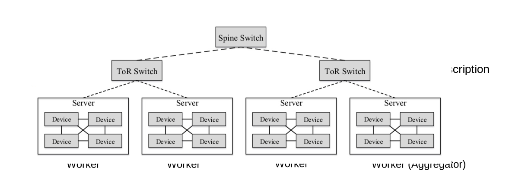
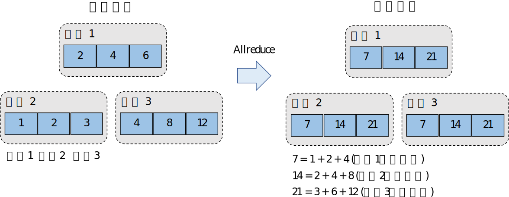
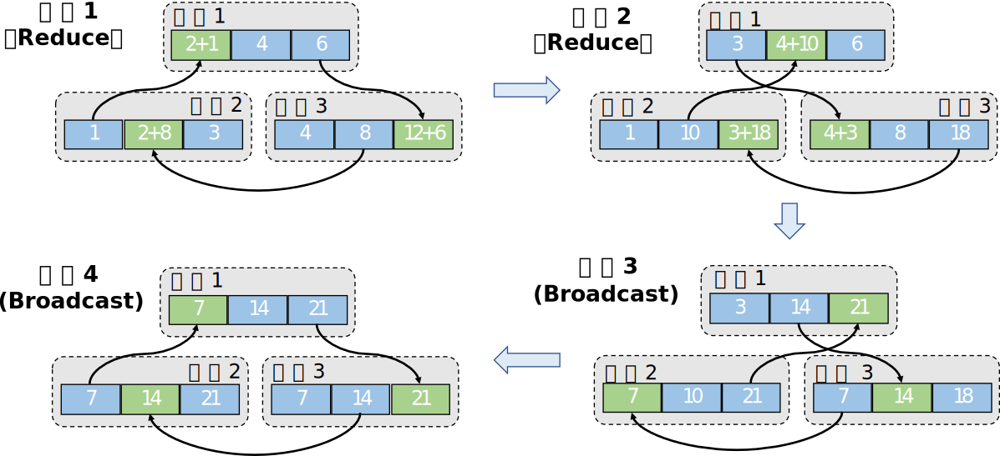

## 集合通讯

接下来，我们会讲解常见的大型深度模型训练的系统实现。
这一类系统往往部署在商用的数据中心（Data
Centers），以及如何在数据中心中高效实现集合通讯，从而让分布式训练系统免于网络瓶颈。

### 在数据中心的梯度计算

:width:`800px`
:label:`ch10-datacentre`

 :numref:`ch10-datacentre` 描述了一个典型的用于深度学习模型训练的数据中心。数据中心中的训练服务器一般会有多个设备。如需增加服务器，我们会将多个训练服务器放置在一个机柜（Rack）上，同时接入一个架顶交换机（Top
of Rack
Switch）来连接多个服务器。当一个机柜满的时候，我们可以通过在架顶交换机之间增加骨干交换机（Spine
Switch），接入新的机柜。通过这种方式，我们可以在数据中心内不断增加服务器，从而为神经网络的训练提供海量的算力和内存。目前的商用数据中心可能拥有超过一百万台服务器。

在数据中心中训练大型神经网络的首要挑战是：如何高效计算大量的平均梯度。假设给定一个千亿级别参数的神经网络（GPT-3模型含有1750亿参数），如果用32位浮点数来表达每一个参数，那么每一步训练中，一个数据并行模式下的模型副本（Model
replica）就需要生成700GB的本地梯度数据（即 175G $\times$ 4 bytes =
700GB）。假如我们有3个模型副本，那么至少需要传输1.4TB（即，700GB
$\times$
$(3-1)$）的本地梯度（这是因为$N$个副本中，我们只需要传送$N-1$梯度来完成平均梯度计算）。当平均梯度计算完成后，我们需要进一步将平均梯度广播到全部的模型副本（即1.4TB的数据），更新本地参数，从而确保模型副本不会偏离（Diverge）。

当前的数据中心往往使用以太网（Ethernet）构建网络。主流的商用以太网链路带宽一般是10Gbps和25Gbps。利用以太网传输海量梯度会产生严重的传输延迟，从而降低模型训练的速度。新型深度学习训练集群（如英伟达的DGX系列机器）往往配置有更快的Inifiband。单个InfiniBand链路可以提供100Gbps和200Gbps的带宽。即使拥有这种高速网络，传输TB级别的本地梯度依然需要大量延迟（1TB的数据需要在200Gbps的链路上传输25秒）。

为了避免通过网络传输数据，现代深度学习服务器一般都会配备多个计算设备（例如说，DGX-3机器会被配备8个A100
GPU），而在一个服务器内的多个设备可以通过高速机内网络互联（如NVLink）。这种高速机内网络可以提供高达400GB/s的带宽，从而让传输TB级别数成为可能。然而，受限于单个服务器的散热，成本和硬件故障等需求，在一个服务器内我们无法无限制的持续增加设备，大型深度学习模型的训练最终还是需要多个服务器共同完成。因此，计算平均梯度需要同时借助以太网或者是InfiniBand，以及服务器内部的NVLink等机内网络。

### Allreduce算法

为了在数据中心中高效完成梯度平均的操作，我们往往会实现
Allreduce算法。这个算法诞生的背景是：传统计算平均梯度的方法往往是在集群中找出一个设备来收集本地梯度，计算平均梯度，然后再将平均梯度广播到全部的设备。这种做法易于实现，但是其引入了两个问题。首先，多设备共同给这个聚合设备发送数据的时候，在聚合设备上往往会产生严重的带宽不足和网络拥塞。其次，单设备需要负担大量的梯度平均的计算，而受限于单设备上的有限算力，这种平均计算会受限于算力瓶颈。

:width:`800px`
:label:`ch10-allreduce-state`

为了解决上述问题，人们设计了Allreduce算法。该算法的核心设计思路是：让全部的节点参与进来平均梯度的网络通信和平均计算中，从而将巨大的网络和算力开销均摊给全部节点，从而解决使用单个梯度聚合节点的问题。假设我们有$M$个设备，每个设备有一个模型副本，该模型由$N$个参数构成。那么按照Allreduce算法要求，我们需要首先将全部的参数按照设备数量切分成$M$个分区（Partition），每个分区具有$N/M$个参数。
为了讲解Allreduce的过程，我们首先给出这个算法的初始和终止状态。如 :numref:`ch10-allreduce-state` 
所示，该例子含有3个设备，每个设备有一个模型副本，这个副本有3个参数。那么按照Allreduce的分区方法，参数会被划分成3个分区（3个设备），而每一个分区有1个参数（$N/M$，N代表3个参数，M代表3个设备）。在这个例子中，假定设备1拥有参数2,4,6，设备2拥有参数1,2,3，设备3拥有参数4,8,12，那么Allreduce结束后，全部的设备都拥有梯度相加后的结果7,14,21，其中分区1的结果7是由3个设备中分区1的初始结果相加而成（7
= 1 + 2 +
4）。为了计算平均梯度，每个设备只需要在最后将梯度之和除以设备数量即可（分区1的最终结果为7除以3）。

:width:`800px`
:label:`ch10-allreduce-process`

Allreduce算法会把梯度的加和计算拆分成$M-1$个Reduce步骤和$M-1$个Broadcast步骤（其中$M$是节点的数量）。Reduce步骤是为了计算出梯度的和（Summation），Broadcast步骤是为了把梯度之和广播给全部的节点。为了说明这些步骤的执行过程，我们利用
 :numref:`ch10-allreduce-process` 。Allreduce算法由Reduce步骤开始，在第一个Reduce步骤中，Allreduce算法会对全部节点进行配对（Pairing），让他们共同完成梯度相加的操作。在 :numref:`ch10-allreduce-process` 的第一个Reduce步骤中，设备1和设备2进行了配对共同对分区1的数据相加。其中，设备2把本地的梯度数据1发送给设备1，设备将接收到1和本地的分区1内的梯度数据：2进行相加，计算出中间（intermediate）梯度相加的结果：3。于此同时，设备1和设备3进行配对，共同完成对分区3的数据相加。而设备3和设备2进行配对，共同完成对于分区2的数据相加。

在上述Reduce的步骤中，梯度的计算实现了以下几个特性:

-   **网络优化：**
    全部设备都同时在接收和发送数据，利用起了每个设备的入口（Ingress）和出口（Egress）带宽。因此Allreduce过程中可利用的带宽是$M \times B$，其中$M$是节点数量,
    $B$是节点带宽，从而让系统实现网络带宽上的可扩展性。

-   **算力优化：**
    全部设备的处理器都参与了梯度相加的计算。。因此Allreduce过程中可利用的处理器是$M \times P$，其中$M$是节点数量,
    $P$是处理器数量，从而让系统实现计算上的可扩展性。

-   **负载均衡：**
    由于数据分区是平均划分的，因此每次设备分摊到的通讯和计算开销是相等的。

在接下来的Reduce步骤中，Allreduce算法会对不同数据分区选择另外的配对方法。例如说，在 :numref:`ch10-allreduce-process`  的第二个Reduce步骤中，Allreduce算法会将：设备1和设备3进行配对，负责分区1的数据相加。将设备1和设备2进行配对，负责分区2。将设备2和设备3进行配对，负责分区3。在一个3个节点的Allreduce集群里，在2个Reduce步骤完成后，我们就计算出了每个分区的数据相加结果（分区1的结果7此时在设备3上，分区2的结果14此时在设备1上，分区3的结果21此时在设备2上）。

接下来，Allreduce算法将进入Broadcast阶段。这一阶段的过程和Reduce步骤类似，核心区别是节点进行配对后，他们不再进行数据相加，而是将Reduce的计算结果进行广播。在 :numref:`ch10-allreduce-process`  中的第一个Broadcast步骤中，设备1会将分区2的结果14直接写入设备3的分区2中。设备2会讲分区3的结果21直接写入设备1中。设备3会将分区1的结果直接写入设备2中。在一个3个节点的Allreduce集群中，我们会重复2次Broadcast步骤来将每个分区的Reduce结果告知全部的节点。

Allreduce算法已经被常见的分布式训练框架（包括Horovod, KungFu, TensorFlow
distributed, PyTorch
distributed）等支持。当用户选择使用数据并行模式的过程，其底层会默认触发。

:cite:`nvidia-nccl`

:cite:`10.1007/978-3-030-50743-5_3`

### Allreduce 算法与网络拓扑
#### 树形结构
#### 环形结构
#### CollNet 算法

### 带宽计算

#### 算法带宽
#### 总线带宽

### 其他常见的集合通信的算子

#### Broadcast
#### Reduce
#### AllGather
#### ReduceScatter

#### 使用方法

### 集合通信与机器学习系统

#### 集合通信的实现
#### 支持集合通信的深度学习框架与调用方法