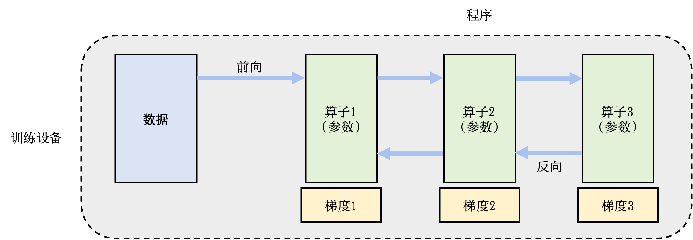
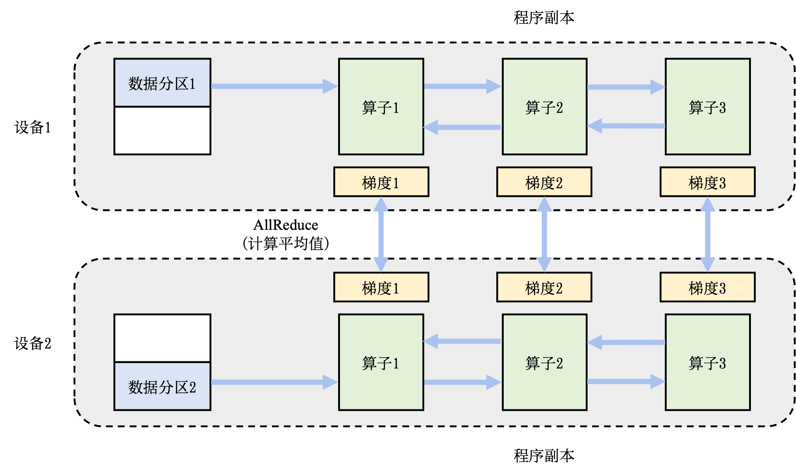
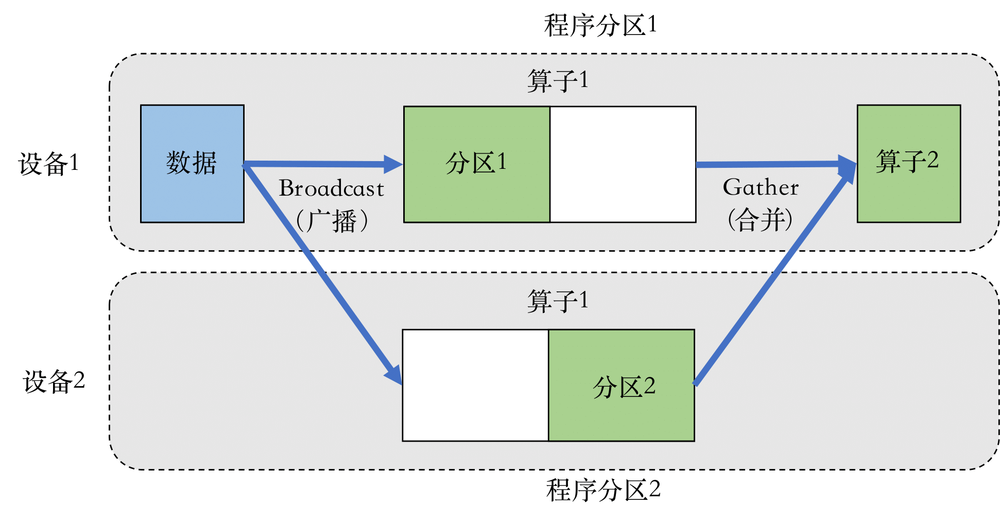
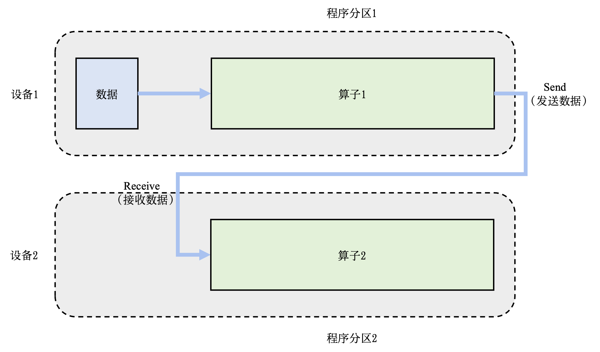
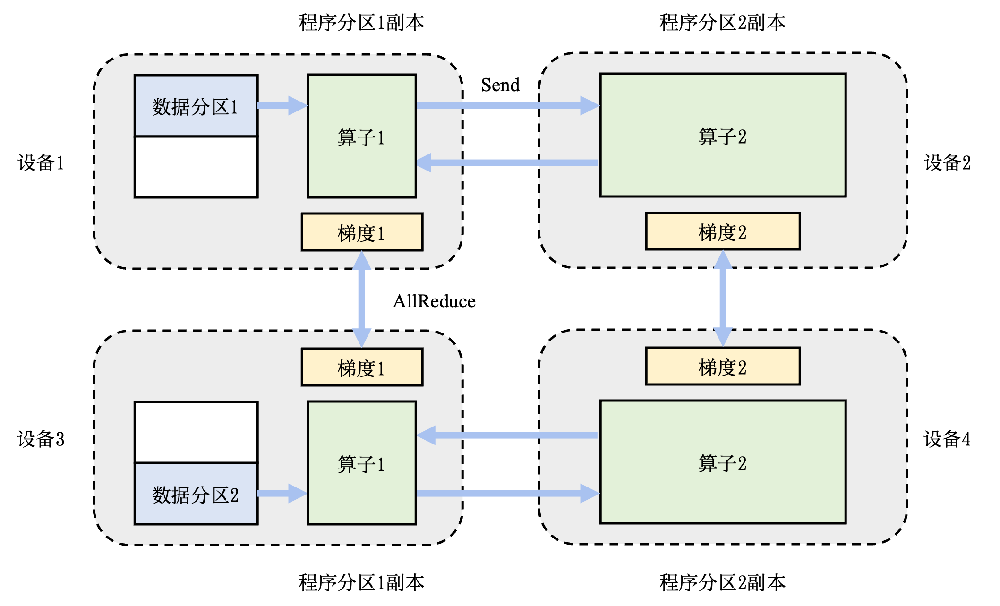
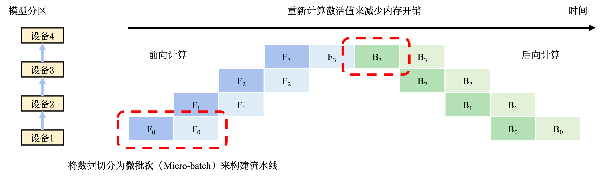

## 实现方法

下面讨论分布式训练系统实现的常用并行方法。首先给出并行方法的设计目标以及分类。然后详细描述各个并行方法。

### 概述

分布式训练系统的设计目标是：将单节点训练系统转换成**等价的**并行训练系统，从而在不影响模型精度的条件下完成训练过程的加速。一个单节点训练系统往往如 :numref:`ch10-single-node`所示。一个训练过程会由多个数据小批次（mini-batch）完成。在图中，一个数据小批次被标示为**数据**。训练系统会利用数据小批次生成梯度，提升模型精度。这个过程由一个训练**程序**实现。在实际中，这个程序往往实现了一个多层神经网络的执行过程。该神经网络的执行由一个计算图（Computational Graph）表示。这个图有多个相互连接的算子（Operator），每个算子会拥有计算参数。每个算子往往会实现一个神经网络层（Neural Network Layer），而参数则代表了这个层在训练中所更新的的权重（Weights）。

:width:`800px`
:label:`ch10-single-node`

为了更新参数，计算图的执行分为前向计算和反向计算两个阶段。前向计算的第一步会将数据读入第一个算子，该算子会根据当前的参数，计算出计算给下一个算子的数据。算子依次重复这个前向计算的过程（执行顺序：算子1，算子2，算子3），直到最后一个算子结束。最后的算子随之马上开始反向计算。反向计算中，每个算子依次计算出梯度（执行顺序：梯度3，梯度2，梯度1），并利用梯度更新本地的参数。反向计算最终在第一个算子结束。反向计算的结束也标志本次数据小批次的结束，系统随之读取下一个数据小批次，继续更新模型。

给定一个模型训练任务，人们会对**数据**和**程序**切分（Partition），从而完成并行加速。 :numref:`ch10-parallel-methods`总结了不同的切分方法。单节点训练系统可以被归类于单程序单数据模式。而假如用户希望使用更多的设备实现并行计算，首先可以选择对数据进行分区，并将同一个程序复制到多个设备上并行执行。这种方式是单程序多数据模式，常被称为数据并行（Data Parallelism）。另一种并行方式是对程序进行分区（模型中的算子会被分发给多个设备分别完成）。这种模式是多程序单数据模式，常被称为模型并行（Model Parallelism）。当训练超大型智能模型时，开发人员往往要同时对数据和程序进行切分，从而实现最高程度的并行。这种模式是多程序多数据模式，常被称为混合并行（Hybrid Parallelism）。

:分布式训练方法分类

| 分类 | 单数据 | 多数据 |
|:---:|:---:|:---:|
| 单程序 | 单程序单数据：单点执行 | 单程序多数据：数据并行 |
| 多程序 | 多程序单数据：模型并行 | 多程序多数据：混合并行 |
:label:`ch10-parallel-methods`

接下来详细讲解各种并行方法的执行过程。

### 数据并行

数据并行往往可以解决单节点算力不足的问题。这种并行方式在人工智能框架中最为常见，具体实现包括：TensorFlow DistributedStrategy、PyTorch Distributed、Horovod DistributedOptimizer等。在一个数据并行系统中，假设用户给定一个训练批大小为$N$，并且希望使用$M$个并行设备来加速训练。那么，该训练批大小会被分为$M$个分区，每个设备会分配到$N/M$个训练样本。这些设备共享一个训练程序的副本，在不同数据分区上独立执行、计算梯度。不同的设备（假设设备编号为$i$）会根据本地的训练样本计算出梯度$G_i$。为了确保训练程序参数的一致性，本地梯度$G_i$需要聚合，计算出平均梯度$(\sum_{i=1}^{N} G_i) / N$。最终，训练程序利用平均梯度修正模型参数，完成小批次的训练。

:numref:`ch10-data-parallel`展示了两个设备构成的数据并行训练系统（Data Parallel Training System）的例子。假设用户给定的数据批大小是64，那么每个设备会分配到32个训练样本，并且具有相同的神经网络参数（程序副本）。本地的训练样本会依次通过这个程序副本中的算子，完成前向计算和反向计算。在反向计算的过程中，程序副本会生成局部梯度。不同设备上对应的局部梯度（如设备1和设备2上各自的梯度1）会进行聚合，从而计算平均梯度。这个聚合的过程往往由集合通信的AllReduce操作完成。

:width:`800px`
:label:`ch10-data-parallel`

### 模型并行

模型并行往往用于解决单节点内存不足的问题。一个常见的内存不足场景是模型中含有大型算子，例如深度神经网络中需要计算大量分类的全连接层。完成这种大型算子计算所需的内存可能超过单设备的内存容量。那么需要对这个大型算子进行切分。假设这个算子具有$P$个参数，而系统拥有$N$个设备，那么可以将$P$个参数平均分配给$N$个设备（每个设备分配$P/N$个参数），从而让每个设备负责更少的计算量，能够在内存容量的限制下完成前向计算和反向计算。这种切分方式是模型并行训练系统（Model Parallelism Training System）的一种应用，也被称为**算子内并行**（Intra-operator Parallelism）。

:width:`800px`
:label:`ch10-model-parallel-intra-op`

:numref:`ch10-model-parallel-intra-op`给出了一个由两个设备实现的算子内并行的例子。在这个例子中，假设一个神经网络具有两个算子，算子1的计算（包含正向和反向计算）需要预留16GB的内存，算子2的计算需要预留1GB的内存。而本例中的设备最多可以提供10GB的内存。为了完成这个神经网络的训练，需要对算子1实现并行。具体做法是，将算子1的参数平均分区，设备1和设备2各负责其中部分算子1的参数。由于设备1和设备2的参数不同，因此它们各自负责程序分区1和程序分区2。在训练这个神经网络的过程中，训练数据（按照一个小批次的数量）会首先传给算子1。由于算子1的参数分别由两个设备负责，因此数据会被广播（Broadcast）给这两个设备。不同设备根据本地的参数分区完成前向计算，生成的本地计算结果需要进一步合并，发送给下游的算子2。在反向计算中，算子2的数据会被广播给设备1和设备2，这些设备根据本地的算子1分区各自完成局部的反向计算。计算结果进一步合并计算回数据，最终完成反向计算。

另一种内存不足的场景是：模型的总内存需求超过了单设备的内存容量。在这种场景下，假设总共有$N$个算子和$M$个设备，可以将算子平摊给这$M$个设备，让每个设备仅需负责$N/M$个算子的前向和反向计算，降低设备的内存开销。这种并行方式是模型并行的另一种应用，被称为**算子间并行**（Inter-operator Parallelism）。

:width:`800px`
:label:`ch10-model-parallel-inter-op`

 :numref:`ch10-model-parallel-inter-op`给出了一个由两个设备实现的算子间并行的例子。在这个例子中，假设一个神经网络具有两个算子，算子1和算子2各自需要10GB的内存完成计算，则模型总共需要20GB的内存。而每个设备仅能提供10GB内存。在这个例子中，用户可以把算子1放置在设备1上，算子2放置在设备2上。在前向计算中，算子1的输出会被发送（Send）给下游的设备2。设备2接收（Receive）来自上游的数据，完成算子2的前向计算。在反向计算中，设备2将算子2的反向计算结果发送给设备1。设备1完成算子1的反向计算，完成本次小批次（Mini-Batch）的训练。

### 混合并行

:width:`800px`
:label:`ch10-hybrid-parallel`

在训练大型人工智能模型中，往往会同时面对算力不足和内存不足的问题。因此，需要混合使用数据并行和模型并行，这种方法被称为混合并行。 :numref:`ch10-hybrid-parallel`提供了一个由4个设备实现的混合并行的例子。在这个例子中，首先实现算子间并行解决训练程序内存开销过大的问题：该训练程序的算子1和算子2被分摊到了设备1和设备2上。进一步，通过数据并行添加设备3和设备4，提升系统算力。为了达到这一点，对训练数据进行分区（数据分区1和数据分区2），并将模型（算子1和算子2）分别复制到设备3和设备4。在前向计算的过程中，设备1和设备3上的算子1副本同时开始，计算结果分别发送（Send）给设备2和设备4完成算子2副本的计算。在反向计算中，设备2和设备4同时开始计算梯度，本地梯度通过AllReduce操作进行平均。反向计算传递到设备1和设备3上的算子1副本结束。

## 流水线并行

除了数据并行和模型并行以外，流水线并行是另一种常用的实现分布式训练的方法。流水线并行往往被应用在大型模型并行系统中。这种系统通过算子内并行和算子间并行解决单设备内存不足的问题。然而，这类系统的运行中，计算图中的下游设备（Downstream Device）需要长期持续处于空闲状态，等待上游设备（Upstream Device）的计算完成，才可以开始计算，这极大降低了设备的平均使用率。这种现象称为模型并行气泡（Model Parallelism Bubble）。

为了减少气泡，通常可以在训练系统中构建流水线。这种做法是将训练数据中的每一个小批次划分为多个微批次（Micro-Batch）。假设一个小批次有$D$个训练样本，将其划分为$M$个微批次，那么一个微批次就有$D/M$个数据样本。每个微批次依次进入训练系统，完成前向计算和反向计算，计算出梯度。每个微批次对应的梯度将会缓存，等到全部微批次完成，缓存的梯度会被加和，算出平均梯度（等同于整个小批次的梯度），完成模型参数的更新。

:width:`800px`
:label:`ch10-pipeline-parallel`

 :numref:`ch10-pipeline-parallel` 给出了一个流水线训练系统的执行例子。在本例中，模型参数需要切分给4个设备存储。为了充分利用这4个设备，将小批次切分为两个微批次。假设$F_{i,j}$表示第$j$个微批次的第$i$个前向计算任务，$B_{i,j}$表示第$j$个微批次的第$i$个反向计算任务。当设备1完成第一个微批次的前向计算后（表示为$F_{0,0}$），会将中间结果发送给设备2，触发相应的前向计算任务（表示为$F_{1,0}$）。与此同时，设备1也可以开始第二个微批次的前向计算任务（表示为$F_{0,1}$）。前向计算会在流水线的最后一个设备，即设备3，完成。

系统于是开始反向计算。设备4开始第1个微批次的反向计算任务（表示为$B_{3,0}$）。该任务完成后的中间结果会被发送给设备3，触发相应的反向计算任务（表示为$B_{2,0}$）。与此同时，设备4会缓存对应第1个微批次的梯度，接下来开始第2个微批次计算（表示为$B_{3,1}$）。当设备4完成了全部的反向计算后，会将本地缓存的梯度进行相加，并且除以微批次数量，计算出平均梯度，该梯度用于更新模型参数。

需要注意的是，计算梯度往往需要前向计算中产生的激活值。经典模型并行系统中会将激活值缓存在内存中，反向计算时就可以直接使用，避免重复计算。而在流水线训练系统中，由于内存资源紧张，前向计算中的激活值往往不会缓存，而是在反向计算中重新计算（Recomputation）。

在使用流水线训练系统中，时常需要调试微批次的大小，从而达到最优的系统性能。当设备完成前向计算后，必须等到全部反向计算开始，在此期间设备会处于空闲状态。在 :numref:`ch10-pipeline-parallel`中，可以看到设备1在完成两个前向计算任务后，要等很长时间才能开始两个反向计算任务。这其中的等待时间即被称为流水线气泡（Pipeline Bubble）。为了减少设备的等待时间，一种常见的做法是尽可能地增加微批次的数量，从而让反向计算尽可能早开始。然而，使用非常小的微批次，可能会造成微批次中的训练样本不足，从而无法充分的利用起来硬件加速器中的海量计算核心。因此最优的微批次数量由多种因素（如流水线深度、微批次大小和加速器计算核心数量等）共同决定。
