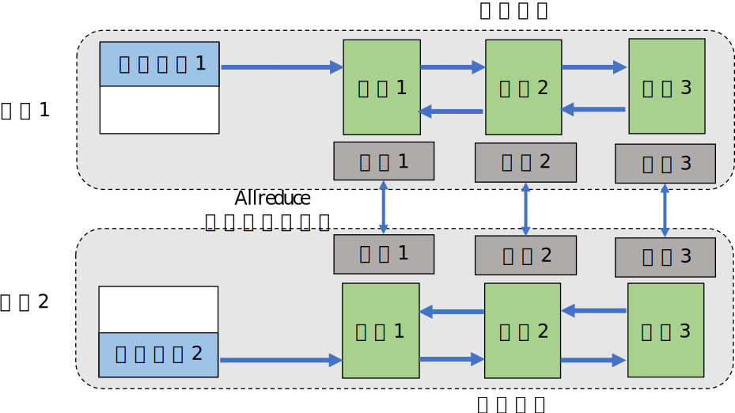

## 分布式方法

我们会讨论分布式训练系统实现的常用并行方法。我们首先给出并行方法的设计目标以及分类。然后，我们会详细描述各个并行方法。

### 概述

:width:`800px`
:label:`ch10-single-node`

分布式训练系统的设计目标是：将单节点训练系统转化成**等价的**并行训练系统，从而在不影响模型精度的条件下完成训练过程的加速。一个单节点训练系统往往如 :numref:`ch10-single-node`所示。一个训练过程会由多个数据小批次（mini-batch）完成。在图中，一个数据小批次被标示为**数据**。训练系统会利用数据小批次来生成梯度，提升模型精度。这个过程由一个训练**程序**实现。在实际中，这个程序往往实现了一个多层神经网络的执行过程。
该神经网络的执行由一个计算图（Computational
Graph）表达。这个图有多个相互连接的算子（Operator），每个算子会拥有计算参数。每个算子往往会实现一个神经网络层（Neural
Network Layer），而参数则代表了这个层在训练中所更新的的权重（Weights）。

为了更新参数，计算图的执行会分为**前向**传播和**反向**传播两个阶段。前向传播的第一步会将数据读入第一个算子，该算子会根据当前的参数，计算出传播给下一个算子的数据。算子依次重复这个前向传播的过程（算子1
-\> 算子2 -\>
算子3），直到最后一个算子结束。最后的算子随之马上开始反向传播。反向传播中，每个算子依次计算出梯度（梯度3
-\> 梯度2 -\>
梯度1），并利用梯度更新本地的参数。反向传播最终在第一个算子结束。反向传播的结束也标志本次数据小批次的结束，系统随之读取下一个小批次，继续更新模型。

:分布式训练方法分类

|  | 单数据 | 多数据 |
|:---:|:---:|:---:|
| 单程序 | 单程序单数据：单点执行 | 单程序多数据：数据并行 |
| 多程序 | 多程序单数据：模型并行 | 多程序多数据：混合并行 |
:label:`ch10-parallel-methods`

给定一个单节点训练系统，人们会对**数据**和**程序**分区（Partition），从而完成并行加速。 :numref:`ch10-parallel-methods`总结了不同的切分方法。单节点训练系统可以被归类于
单程序单数据模式。而假如用户希望使用更多的设备来实现并行计算，他们首先可以选择对数据进行分区，并将同一个程序复制到多个设备上并行执行。这种方式是单程序多数据模式，常被称为**数据并行**（Data
Parallelism）。另一种并行方式是对程序进行分区：程序的算子会被分发给多个设备按照依次完成。这种模式是
多程序单数据模式，常被称为**模型并行**（Model
Parallelism）。当训练超大型智能模型时，开发人们往往要同时对数据和程序进行切分，从而实现最高程度的并行。这种模式是多程序多数据模式，常被称为**混合并行**（Hybrid
Parallelism）。

接下来，我们详细讲解各种并行方法的执行过程。

### 数据并行

:width:`800px`
:label:`ch10-data-parallel`

数据并行往往可以解决单节点的算力不足。这种并行方式在人工智能框架中最为常见，具体实现包括：TensorFlow
DistributedStrategy，PyTorch Distributed，Horovod DistributedOptimizer等。在一个数据并行系统中，假设用户给定一个训练批大小$N$，并且希望使用$M$个并行设备来加速训练。那么，该训练批大小会被分为$M$个分区，每个设备会分配到$N/M$个训练样本。这些设备共享一个训练程序的副本，在不同数据分区上独立执行，计算梯度。不同的设备（假设设备编号为$i$）会根据本地的训练样本估计出梯度$G_i$。为了确保训练程序参数的一致性，本地梯度$G_i$需要聚合，计算出平均梯度$(\sum_{i=1}^{N} G_i) / N$。最终，训练程序利用平均梯度修正模型参数，完成小批量的训练。

:numref:`ch10-data-parallel`展示了2个设备构成的数据并行例子。假设用户给定的批大小（Batch
Size）是64，那么每个设备会分配到32个训练样本，并且具有相同的神经网络参数（程序副本）。本地的训练样本会依次通过这个程序副本中的算子，完成前向传播和反向传播。在反向传播的过程中，程序副本会生成局部梯度。不同设备上对应的局部梯度（如设备1和设备2上各自的梯度1）会进行聚合，从而计算平均梯度。这个聚合的过程往往由集合通讯库（Collective
Communication）的Allreduce操作来完成。

### 模型并行

:width:`800px`
:label:`ch10-model-parallel-intra-op`

模型并行往往用于解决单节点的内存不足问题。一个常见的内存不足场景是模型中含有大型算子，例如说深度神经网络中需要计算大量分类的全连接层（Fully
Connected
Layer）。完成这种大型算子计算所需的内存可能超过单设备的内存容量。那么我们需要对这个大型算子进行切分。假设这个算子具有$P$个参数，而我们拥有$N$个设备，那么我们可以将$P$个参数平均分配给$N$个设备（每个设备分配$P/N$个参数），从而让每个设备负责更少的计算量，能够在内存容量的限制下完成前向传播和反向传播中所需的计算。这种切分方式是模型并行的应用，被称为**算子内并行**（Intra-operator
Parallelism）。

:numref:`ch10-model-parallel-intra-op`给出了一个由2个设备实现的算子内并行的例子。在这个例子中，假设一个神经网络具有2个算子，算子1的计算（包含正向和反向传播）需要预留16G的内存，算子2的计算需要预留1G的内存。而本例中的设备最多可以提供10G的内存。为了完成这个神经网络的训练，我们需要对算子1实现并行。具体做法是，将算子1的参数平均分区，设备1和设备2各负责其中部分算子1的参数。由于设备1和设备2的参数不同，因此它们各自负责程序分区1和程序分区2。在训练这个神经网络的过程中，数据（小批量）会首先传给算子1。由于算子1的参数分别由2个设备负责，因此数据会被广播给这2个设备。不同设备根据本地的参数分区完成前向计算，生成的本地计算结果需要进一步合并（Combine），发送给下游的算子2。在反向传播中，算子2的数据会被广播给设备1和设备2，这些设备根据本地的算子1分区各自完成局部的反向计算。计算结果进一步合并传播回数据，最终完成反向传播。

另一种内存不足的场景是：模型的总内存需求超过了单设备的内存容量。在这种场景下，假如我们总共有$N$个算子和$M$个设备，我们可以将算子平摊给这$M$个设备，让每个设备仅需负责$N/M$个算子的前向和反向计算，降低设备的内存开销。这种并行方式是模型并行的另一种应用，被称为**算子间并行**（Inter-operator
Parallelism）。

:width:`800px`
:label:`ch10-model-parallel-inter-op`

:numref:`ch10-model-parallel-inter-op`给出了一个由2个设备实现的算子间并行的例子。在这个例子中，假设一个神经网络具有2个算子，算子1和算子2各自需要10G的内存完成计算，则模型总共需要20G的内存。而每个设备仅能提供10G内存。在这个例子中，用户可以把算子1放置在设备1上，算子2放置在设备2上。在前向传播中，算子1的输出会被发送（Send）给下游的设备2。设备2接收（Receive）来自上游的数据，完成算子2的前向计算。在反向传播中，设备2将算子2的反向计算结果发送给设备1。设备1完成算子1的反向计算，完成本次训练。

### 混合并行

:width:`800px`
:label:`ch10-hybrid-parallel`

在训练大型人工智能模型中，我们往往会同时面对算力不足和内存不足。因此，我们需要混合使用数据并行和模型并行，这种方法被称为混合并行。 :numref:`ch10-hybrid-parallel`提供了一个由4个设备实现的混合并行的例子。在这个例子中，我们首先实现算子间并行来解决训练程序内存开销过大的问题：该训练程序的算子1和算子2被分摊到了设备1和设备2上。进一步，我们通过数据并行来添加3和设备4，提升系统算力。为了达到这一点，我们对训练数据进行分区（数据分区1和数据分区2），并将模型（算子1和算子2）分配复制到设备3和设备4上生成可以并行执行的程序副本。在前向计算的过程中，设备1和设备3上的算子1副本同时开始，计算结果分别发送（Send）给设备2和设备4完成算子2副本的计算。在反向计算中，设备2和设备4同时开始计算梯度，本地梯度通过Allreduce进行平均。反向计算传递到设备1和设备3上的算子1副本结束。