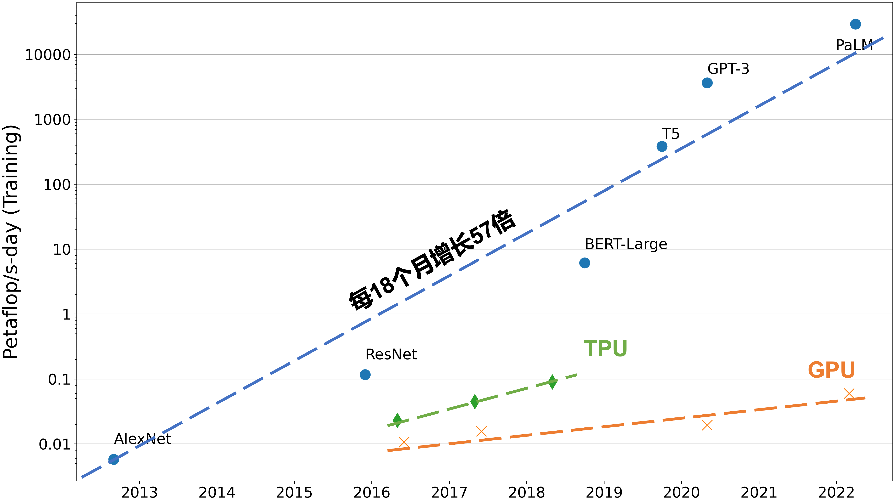
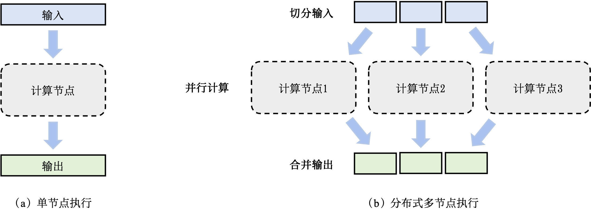

## 系统概述

### 设计动机

分布式训练系统主要为了解决单节点的算力和内存不足的问题。

:width:`800px`
:label:`ch10-computation-increase`

#### 算力不足

单处理器的算力不足是促使人们设计分布式训练系统的一个主要原因。一个处理器的算力可以用**每秒钟浮点数操作**（Floating Point Operations Per Second，FLOPS）来衡量。:numref:`ch10-computation-increase`分析了机器学习模型对于算力的需求以及同期处理器所提供算力在过去数年中变化。其中，用千万亿运算次数/秒—天（Petaflop/s—day ）这一指标来衡量算力。这个指标等价于每秒$10^{15}$次神经网络操作执行一天，也就是总共大约$10^{20}$次计算操作。如图所示，根据摩尔定律（Moore's Law），中央处理器的算力每18个月增长2倍。虽然计算加速卡(如GPU和TPU)针对机器学习计算提供了大量的算力。这些加速卡的发展最终也受限于摩尔定律，增长速度停留在每18个月2倍。而与此同时，机器学习模型正在快速发展。短短数年，机器学习模型从仅能识别有限物体的AlexNet，一路发展到在复杂任务中打败人类的AlphaStar。这期间，模型对于算力需求每18个月增长了56倍。解决处理器性能和算力需求之间鸿沟的关键就在于利用分布式计算。通过大型数据中心和云计算设施，可以快速获取大量的处理器。通过分布式训练系统有效管理这些处理器，可以实现算力的快速增长，从而持续满足模型的需求。

#### 内存不足

训练机器学习模型需要大量内存。假设一个大型神经网络模型具有1000亿的参数，每个参数都由一个32位浮点数（4个字节）表达，存储模型参数就需要400GB的内存。在实际中，我们需要更多内存来存储激活值和梯度。假设激活值和梯度也用32位浮点数表达，那么其各自至少需要400GB内存，总的内存需求就会超过1200GB（即1.2TB）。而如今的硬件加速卡（如NVIDIA A100）仅能提供最高80GB的内存。单卡内存空间的增长受到硬件规格、散热和成本等诸多因素的影响，难以进一步快速增长。因此，我们需要分布式训练系统来同时使用数百个训练加速卡，从而为千亿级别的模型提供所需的TB级别的内存。

### 系统架构

为了方便获得大量用于分布式训练的服务器，人们往往依靠云计算数据中心。一个数据中心管理着数百个集群，每个集群可能有几百到数千个服务器。通过申请其中的数十台服务器，这些服务器进一步通过分布式训练系统进行管理，并行完成机器学习模型的训练任务。

:width:`800px`
:label:`ch10-single-vs-multi`

为了确保分布式训练系统的高效运行，需要首先估计系统计算任务的计算和内存用量。假如某个任务成为了瓶颈，系统会切分输入数据，从而将一个任务拆分成多个子任务。子任务进一步分发给多个计算节点并行完成。:numref:`ch10-single-vs-multi`描述了这一过程。一个模型训练任务（Model Training Job）往往会有一组数据（如训练样本）或者任务（如算子）作为输入，利用一个计算节点（如GPU）生成一组输出（如梯度）。分布式执行一般具有三个步骤：第一步将输入进行切分；第二步将每个输入部分会分发给不同的计算节点，实现并行计算；第三步将每个计算节点的输出进行合并，最终得到和单节点等价的计算结果。这种首先切分，然后并行，最后合并的模式，本质上实现了分而治之（Divide-and-Conquer）的方法：由于每个计算节点只需要负责更小的子任务，因此其可以更快速地完成计算，最终实现对整个计算过程的加速。

### 用户益处

通过使用分布式训练系统可以获得以下几个优点：

-   **提升系统性能**：使用分布式训练，往往可以带来训练性能的巨大提升。一个分布式训练系统一般用“到达目标精度所需的时间”（Time-to-Accuracy）这个指标来衡量系统性能。这个指标由两个参数决定: （1）完成一个数据周期的时间，和（2）完成一个数据周期后模型所提升的精度。通过持续增加并行处理节点，可以将数据周期的完成时间不断变短，最终显著减少到达目标精度所需的时间。

-   **减少成本，体现经济性**：使用分布式训练也可以进一步减少模型训练的成本。受限于单节点散热的上限，单节点的算力越高，其所需的散热硬件成本也更高。因此，在提供同等算力的条件下，组合多个计算节点是一个更加经济高效的方式。这促使云服务商（如亚马逊和微软等）更加注重给用户提供成本高效的分布式机器学习系统。

-   **防范硬件故障**：分布式训练系统同时能有效提升防范硬件故障的能力。机器学习训练集群往往由商用硬件（Commodity Hardware）组成，这类硬件（例如磁盘和网卡）运行一定时间就会产生故障。而仅使用单个机器进行训练，一个机器的故障就会造成模型训练任务的失败。通过将该模型训练任务交由多个机器共同完成，即使一个机器出故障，也可以通过将该机器上相应的计算子任务转移给其余机器，继续完成训练，从而避免训练任务的失败。