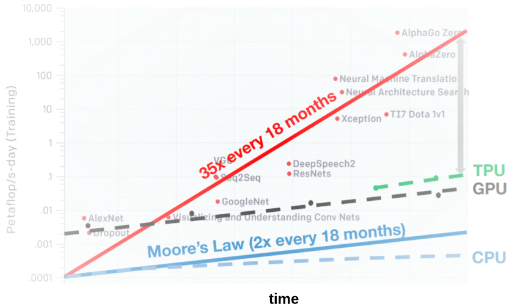

## 系统概述

### 设计动机

接下来，我们详细讨论分布式训练系统的设计动机

:width:`800px`
:label:`ch10-computation-increase`

##### 算力不足

单处理器的算力不足是促使人们设计分布式训练系统的一个主要原因。一个处理器的算力可以用**每秒钟浮点数操作**（Floating
Point Operations Per Second，FLOPS）来衡量。
如 :numref:`ch10-computation-increase`所示，根据摩尔定律（Moore's
Law），中央处理器的算力每18个月增长2倍。虽然计算加速卡，如GPU和Tensor
Processing
Unit（TPU），针对机器学习计算（如矩阵相乘）提供了大量的算力。这些加速卡的发展最终也受限于摩尔定律，增长速度也停留在每18个月2倍。而与此同时，机器学习模型正在快速发展。短短数年，我们从仅能识别有限物体的AlexNet模型，一路发展到在复杂任务中打败人类的AlphaStar。这期间，模型对于算力需求每18个月增长了35倍。解决处理器性能和算力需求之间的鸿沟
的关键就在于利用分布式计算。通过大型数据中心和云计算设施，我们可以快速获取大量的处理器。通过分布式训练系统有效管理这些处理器，我们可以实现算力的快速增长，从而持续满足模型的需求。

##### 内存不足

在训练机器学习模型的过程中，训练系统需要在内存中存储大量数据。这些数据包括：模型参数（Parameters）以及训练和更新这些参数所产生的中间数据，如特征图（Feature
Map）和梯度（Gradients）。假设一个深度神经网络模型具有10亿的参数，所有特征图共有20亿参数，每个参数都由一个32位浮点数表达，而更新这些参数至少还需要产生与特征图和参数等量的梯度。由于一个32位浮点数需要4个字节（Byte）的内存来存储，那么训练这个10亿规模的模型就需要至少24GB（$24 \times 10^9$
Byte）的内存。现在，随着大型预训练模型的崛起，一个深度神经网络（如GPT-3）会拥有超过千亿的参数。假设我们依然使用32位浮点数来存储参数，激活值和梯度，那么训练这个模型就至少需要1.2TB的内存。而如今的训练加速卡（如NVIDIA
A100）仅能提供最高80GB的内存。单卡内存空间的增长受到硬件规格，散热和成本等诸多因素，难以进一步快速增长。因此，我们需要分布式训练系统来同时使用数百个训练加速卡，从而为千亿级别的模型提供所需的TB级别的内存。

### 分布式训练架构

受限于单节点的有限算力，内存和存储资源，人们把关注投向了日益成熟的云计算数据中心。一个数据中心管理着数十万个计算服务器。随着数据中心的全球部署，人们可以很方便地获得数百个服务器。这些服务器可以通过分布式训练系统来协调和管理，解决训练大型机器学习模型过程遇到的算力，内存和存储不足，从而完成训练过程的加速。

:width:`800px`
:label:`ch10-single-vs-multi`

在设计分布式训练系统的过程中，我们需要找出有资源瓶颈的计算任务，根据计算任务的特点，将其拆分成多个子任务，然后将子任务分发给多个节点（可以是服务器，机器，或者是加速卡）并行完成。
 :numref:`ch10-single-vs-multi`描述了如何将单节点执行转换为分布式执行的一般过程。在机器学习系统中，一个计算任务往往会有一组数据（例如训练样本）或者任务（例如算子）作为输入，利用一个计算节点（例如GPU）生成一组输出（例如梯度）。假如单节点成为瓶颈，我们可以利用分布式计算进行加速。分布式执行一般具有三个步骤：第一步，我们需要将输入进行**切分**。第二步，每个输入部分会分发给不同的计算节点，实现**并行**计算。第三步，每个计算节点的输出，进一步**合并**，最终得到和单节点等价的计算结果。这种切分-并行-合并的模式，本质上实现了分而治之算法（Divide-and-Conquer
Algorithm）的设计思想：由于每个计算节点只需要负责更小的子任务，因此其可以更快速的完成计算，最终形成对整个计算过程的加速。

### 用户益处

通过使用分布式训练系统，我们往往可以获得以下几个关键好处：

-   **提升系统性能**：使用分布式训练，往往可以带来训练性能的巨大提升。一个分布式训练系统往往用以下这个指标来衡量性能：到达目标精度所需的时间（time-to-accuracy）。这个指标由两个参数决定:
    一个数据周期所需的完成时间，以及一个数据周期模型所提升的精度。通过持续增加并行处理节点，我们可以将数据周期的完成时间不断变短，最终显著减少到达目标精度所需的时间。

-   **经济性（Economy）**：使用分布式训练，我们也可以进一步减少训练及其模型所需的成本。受限于单节点散热的上限，单节点的算力越高，其所需的散热硬件成本也更高。因此，在提供同等的算力的条件下，组合多个计算节点是一个更加经济高效的方式。这促使云服务商（如亚马逊和微软等）需要更加注重给用户提供成本高效的分布式机器学习系统。

-   **抵御硬件故障**：分布式训练系统同时能有效提升抵御硬件故障的能力。机器学习训练集群往往由商用硬件（Commodity
    Hardware）组成，这类硬件（例如说，磁盘和网卡）运行一定周期就会产生故障。而仅使用单个硬件进行训练的话，那么一个硬件的故障就会造成整个训练的任务的失败。通过将这个训练任务由多个硬件共同完成，即使一个硬件故障了，我们也可以通过将这个硬件上相应的计算子任务转移给其余硬件，继续完成训练，从而避免训练任务的失败。