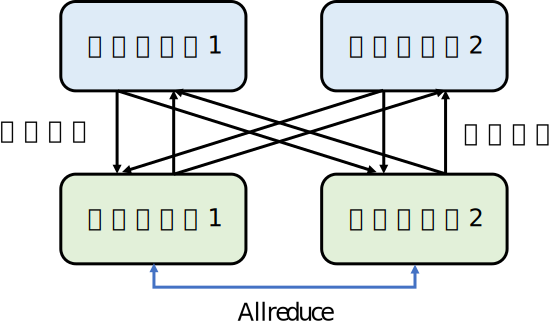

## 参数服务器

接下来，我们介绍另一种常见的分布式训练系统实现：参数服务器。常见的深度学习框架以不同方式提供了参数服务器。TensorFlow和MindSpore原生提供了参数服务器的实现；PyTorch需要用户使用框架提供的Rpc接口自行实现；还有一些框架则需要用户使用第三方的参数服务器实现，例如PS-Lite。

### 计算和存储分离

利用参数服务器的其中一个核心需求是实现：计算和存储的分离。在训练模型中，计算可以被理解为计算更新模型参数所需要的计算（例如说，计算本地梯度和计算平均梯度），而存储可以被理解为将模型参数存储在内存设备中（例如说，主机内存，加速卡内存和SSD设备）。传统的神经网络训练中，计算往往是核心瓶颈，因此我们只需要配置有合适数量的带有加速卡的服务器，常被称为训练服务器（Training
servers）。

随着机器学习的发展，新型的稀疏模型被开发出来。相比于传统的神经网络训练，稀疏模型的训练往往不需要大量昂贵的计算加速卡（GPU），而需要海量的内存来存储嵌入表（Embedding
table）。例如说，一个大型深度学习推荐系统中，它们往往使用小型的深度神经网络（如Multi-layer
Perception），训练这种神经网络只需要几个GPU即可。而另一方面，推荐系统中往往需要存储PB级别的嵌入表。嵌入表往往由推荐系统的用户特征（User
feature）和产品特征（Item
feature）构成。这些特征往往是大型向量（Vector）。现代推荐系统需要服务数亿的用户，推荐数以千万的商品。假设用户的特征是1MB，而系统需要服务10亿的用户，那么用户的嵌入表就会有1PB的大小。而这个大小远远超过了一个深度学习服务器所具有的内存。假如我们部署大量的昂贵的深度学习服务器来存储海量嵌入表，那么这些服务器上的加速卡的使用率将会极低，无法实现对于硬件的高效利用。

:width:`800px`
:label:`ch10-parameter-servers`

为了解决上述问题，人们往往会在稀疏模型集群中混合部署：训练服务器和参数服务器，从而实现对于计算需求和内存需求分别满足。 :numref:`ch10-parameter-servers` 描述了带有参数服务器的机器学习集群。这个集群中含有2个训练服务器和2个参数服务器，训练服务器一般是拥有加速卡的计算优化服务器（Compute-optimised
server）。而参数服务器一般是内存优化服务器（Memory-optimised
server），其的内存大小一般远远大于计算优化服务器。在一个稀疏模型中往往拥有神经网络参数和嵌入表参数。神经网络较小，其可以存储在训练服务器内存中。而嵌入表很大，因此需要存储在额外的参数服务器中。参数服务器一般会按照键-值对（Key-value
pairs）的方式来存储参数。常用的键包括用户名（User ID），产品名（Item
ID）或者是参数名（Parameter
Key）。常用的值是以多维度向量（Multi-dimensional
tensors）表达的模型参数。假如存在多个参数服务器，参数服务器会用数据分区函数（例如，哈希函数和区域划分）将健-值映射到不同参数服务器上。

为了完成对于模型的训练，在每一步训练中，训练服务器会根据当前的小批量训练数据，找到本批量中需要用到的参数。例如说，本小批量数据只会训练部分用户的特征，那么这些用户的特征才会需要。根据参数服务器的数据分区函数，训练服务器可以知道参数当前在哪个参数服务器上，它们因此会用参数的键（Key）向对应的参数服务器发起拉取请求（Pull
request）。参数服务器响应，并返回对应的值（Value）。训练服务器将拉取的参数（往往是嵌入表）和本地内存中的模型参数（往往是神经网络）进行合并，从而对合并的模型进行训练，计算梯度。假如训练服务器实现了数据并行，那么训练服务器计算出的本地梯度需要利用Allreduce计算出平均梯度。对于训练服务器本地内存中的参数，训练服务器可以马上利用平均梯度进行修改。对于在参数服务器中存储的参数，训练服务器发起推送请求（Push
request）将平均梯度发送到参数服务器，参数服务器更新本地存储的参数。

在以上的参数服务器架构中，机器学习集群拥有者可以灵活的根据梯度计算所需要算力配置合理数量的训练服务器。他们也可以根据参数的数量配置大部分的稀疏参数（Sparse
parameters）在参数服务器中，仅留下小部分的密集参数（Dense
parameters）在训练服务器中。密集参数和稀疏参数的核心区别是：稀疏参数在每一步训练不一定都会被用到，他们需要根据当前训练小批量来决定。而密集参数每一步训练都需要用到。因此为了避免频繁从参数服务器中拉取，密集参数往往会存储在训练服务器中。

### 数据副本

在参数服务器的实际部署中，人们往往需要解决数据热点问题。互联网数据往往符合幂律概率（Power-law
distribution），这会导致部分稀疏参数在训练过程中被访问的次数会显著高于其他参数。例如说，热门商品的特征向量被训练服务器拉取的次数就会远远高于非热门商品。因此，存储了热门数据的参数服务器所承受的数据拉取和推送请求会远远高于其他参数服务器，因此形成数据热点，伤害了系统的可扩展性。

解决数据热点问题的关键是利用在没有副本的情况下，通用的做法是每隔一段时间将所有参数在外存中保存一份检查点（checkpoint）。当出现机器故障时，首先所有的训练必须停止，等待故障的机器恢复上线，然后从外存中重新加载检查点。这就会导致从上一次保存检查点到故障发生时的数据全部丢失。保存一次检查点的开销随模型大小而增加，训练大模型时通常每隔1-2小时保存一次。因此无副本的参数服务器如果发生故障，会丢失最多1-2小时的数据。

解决参数服务器故障和数据热点问题的常用技术是构建模型主从副本（Master-slave
replication）。一份参数在多个机器上拥有副本，并指定其中一个副本作为主副本。训练服务器的所有更新操作都向主副本写入并同步至从副本上。如何取得共识确定哪一个副本是主副本是分布式系统领域一个经典问题，已经有了相当多的成熟的算法，例如Paxos和Raft。此外，主副本上的更新如何复制到从副本上也同样是分布式系统领域的经典共识问题。通常系统设计者需要在可用性（Availability）和一致性（Consistency）之间做出取舍。如果参数服务器副本间采用强一致性的复制协议（例如，链式副本(Chain replication)）则可能导致训练服务器的推送请求失败，即参数服务器不可用。反之，如果参数服务器采用弱一致性的复制协议，则可能导致副本间存储的参数不一致。

### 掉队者问题

参数服务器的另一大核心作用是可以让用户方便解决掉队者问题。在之前的讨论中，在每一步训练结束后，训练服务器都需要计算平均梯度来对每一个模型副本进行更新，从而保证下一步训练开始前，全部模型副本的参数的一致性，这种对于参数一致性的确保一般被称为同步训练（Synchronous
training）。同步训练一般会有助于训练系统达到更好的模型精度，但是当系统规模变大，我们往往会在系统中引入掉队者（Straggler）。掉队者出现的原因很多。常见的原因包括：掉队者设备可能和其他设备不在同一个机柜中，因此掉队者的通讯带宽显著小于其他设备。另外，掉队者设备也可能和其他进程共享本地的服务器计算和通讯资源，形成资源竞争，从而降低了性能。

掉队者对于基于Allreduce的同步训练系统的性能有显著影响，这是因为Allreduce让全部节点参与到平均梯度的计算和通讯中，而每个节点负责等量的数据。因此任何一个掉队者的出现，都会让整个Allreduce操作延迟完成。为了解决这个问题，人们也会使用参数服务器来计算平均梯度。一种常见的设计是：训练服务器训练出本地梯度后，会把本地梯度全部推送到参数服务器。参数服务器在等到一定数据训练服务器（例如说90%的训练服务器）的本地梯度后，就开始计算平均梯度。这样可以确保平均梯度的计算不会被落后者的出现延误。计算好的平均梯度马上推送给全部训练服务器，开始下一轮训练。

解决掉队者的另外一种常见做法是利用参数服务器实现**异步训练**(Asynchronous
training)。在一个异步训练系统中，每个训练服务器在训练开始时，有相同的模型参数副本。在训练中，他们计算出本地梯度后会马上将本地梯度推送到参数服务器，参数服务器将推送的梯度立刻用于更新参数，并把更新好的参数马上推送回对应的训练服务器。在这个过程中，不同的训练服务器很可能会使用不同版本的模型参数进行本地梯度的计算，这种做法有可能会伤害模型的精度，但它同时让不同训练服务器可以按照各自的运算速度来推送和拉取参数，而无需等待同伴，因此避免了掉队者对于整个集群性能的影响。