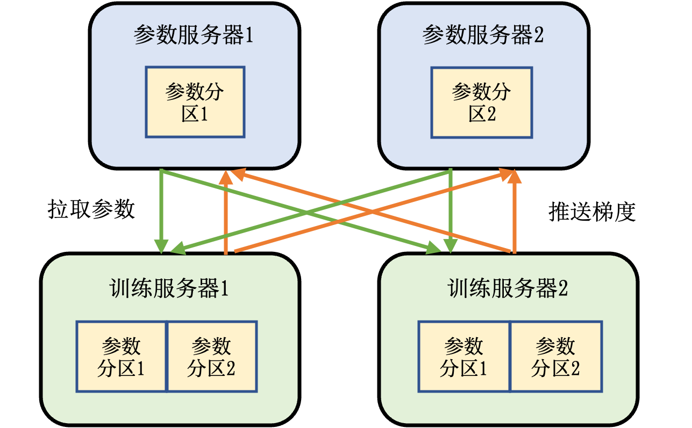

## 参数服务器

下面介绍另一种常见的分布式训练系统：参数服务器。不同的机器学习框架以不同方式提供参数服务器的实现。TensorFlow和MindSpore内置了参数服务器的实现。PyTorch需要用户使用RPC接口自行实现。同时，我们也有参数服务器的第三方实现，如PS-Lite。

### 系统架构

不同于基于集合通信实现的机器学习系统，参数服务器系统中的服务器会被分配两种角色：训练服务器和参数服务器。其中参数服务器需要提供充足内存资源和通信资源，训练服务器需要提供大量的计算资源（如硬件加速器）。 :numref:`ch10-parameter-servers`  描述了带有参数服务器的机器学习集群。这个集群中含有两个训练服务器和两个参数服务器。
假设我们有一个模型，可以切分为两个参数分区。每个分区被分配给一个参数服务器负责参数同步。
在训练的过程中，每个训练服务器都会有完整的模型，根据本地的训练数据集切片（Dataset Shard）训练出梯度。这个梯度会被推送（Push）到各自参数服务器。参数服务器等到两个训练服务器都完成梯度推送，开始计算平均梯度，更新参数。它们然后通知训练服务器来拉取（Pull）最新的参数，开始下一轮训练迭代。

:width:`800px`
:label:`ch10-parameter-servers`

### 异步训练

参数服务器的一个核心作用是可以处理分布式训练服务器中出现的落后者（Straggler）。在之前的讨论中，在每一轮训练结束后，训练服务器都需要计算平均梯度对每一个模型副本进行更新，从而保证下一轮训练开始前，全部模型副本参数的一致性，这种对于参数一致性的确保一般被称为同步训练（Synchronous Training）。同步训练一般有助于训练系统达到更好的模型精度，但是当系统规模变大，往往会观察到落后者服务器的出现。落后者出现的原因很多。常见的原因包括：落后者设备可能和其他设备不在同一个机柜中，因此落后者的通信带宽显著小于其他设备。另外，落后者设备也可能和其他进程共享本地的服务器计算和通信资源，形成资源竞争，从而降低了性能。

落后者对于基于AllReduce的同步训练系统的性能有显著影响，这是因为AllReduce让全部节点参与到平均梯度的计算和通信中，而每个节点负责等量的数据。因此一个落后者的出现，都会让整个AllReduce操作延迟完成。为了解决这个问题，人们常使用参数服务器同步梯度。一种常见的设计是：训练服务器训练出梯度后，会把本地梯度全部推送到参数服务器。参数服务器在等到一定训练服务器（例如90\%的训练服务器）的梯度后，就开始计算平均梯度。这样可以确保平均梯度的计算不会被落后者的出现延误。计算好的平均梯度马上推送给全部训练服务器，开始下一轮训练。

解决落后者的另一种常见做法是利用参数服务器实现异步训练(Asynchronous Training)。在一个异步训练系统中，每个训练服务器在训练开始时，有相同的模型参数副本。在训练中，它们计算出梯度后会马上将梯度推送到参数服务器，参数服务器将推送的梯度立刻用于更新参数，并通知训练服务器立刻来拉取最新的参数。在这个过程中，不同的训练服务器很可能会使用不同版本的模型参数进行梯度计算，这种做法可能会伤害模型的精度，但它同时让不同训练服务器可以按照各自的运算速度推送和拉取参数，而无须等待同伴，因此避免了落后者对于整个集群性能的影响。

### 数据副本

在参数服务器的实际部署中，人们往往需要解决数据热点问题。互联网数据往往符合幂律概率（Power-Law Distribution），这会导致部分参数在训练过程中被访问的次数会显著高于其他参数。例如，热门商品的嵌入项（Embedding Item）被训练服务器拉取的次数就会远远高于非热门商品。因此，存储了热门数据的参数服务器所承受的数据拉取和推送请求会远远高于其他参数服务器，因此形成数据热点，伤害了系统的可扩展性。

利用数据副本的另一个作用是增加系统的鲁棒性。当一个参数服务器出现故障，其所负责的参数将不可用，从而影响了整体系统的可用性。通过维护多个参数副本，当一个参数服务器故障时，系统可以将参数请求导向其他副本，同时在后台恢复故障的参数服务器，确保系统的可用性不受影响。

解决参数服务器故障和数据热点问题的常用技术是构建模型主从复制（Leader-Follower Replication）。一份参数在多个机器上拥有副本，并指定其中一个副本作为主副本（Leader Replica）。训练服务器的所有更新操作都向主副本写入，并同步至全部从副本（Follower Replica）。如何取得共识并确定哪一个副本是主副本是分布式系统领域一个经典问题，对该问题已经有了相当多的成熟算法，例如Paxos和Raft。此外，主副本上的更新如何复制到从副本上也是分布式系统领域的经典共识问题。通常系统设计者需要在可用性（Availability）和一致性（Consistency）之间做出取舍。如果参数服务器副本间采用强一致性（Strong Consistency）的复制协议（Replication Protocol），例如链式复制(Chain Replication)，则可能导致训练服务器的推送请求失败，即参数服务器不可用。反之，如果参数服务器采用弱一致性（Weak Consistency）的复制协议，则可能导致副本间存储的参数不一致。