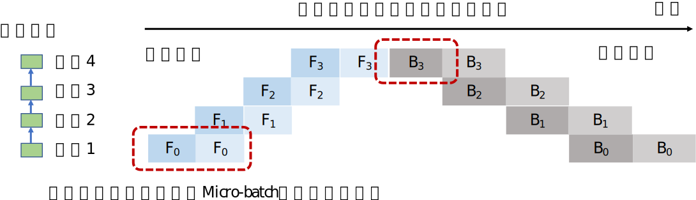

## 流水线并行

在数据并行和模型并行以外，流水线并行是另一种常用的并行加速方法。流水线并行往往被应用在大型模型并行系统中。这种系统通过算子内并行和算子间并行解决单设备内存不足的问题。然而，当这类系统的运行中，计算图中的下游设备需要长期持续处于空闲状态，等待上游设备的计算完成，才可以开始计算，这极大降低了设备的平均使用率。这种现象被称为模型并行空洞（Model Parallelism Bubble）。

:width:`800px`
:label:`ch10-pipeline-parallel`

为了减少空洞，提升设备使用率，我们可以在模型并行系统中构建流水线。这种做法的核心想法是将一个数据小批量（Data Mini-batch）划分为多个微批量（Micro-batch）。假设一个数据小批量有$D$个训练数据，这个小批量可以被划分为$M$个微批量，那么微批量的大小就是$D/M$。每个微批量相应进入训练系统，完成前向传播（Forwards propagation）和反向传播（Backwards propagation），计算出梯度。每个微批量对应的梯度将会缓存，等到全部微批量完成，缓存的梯度会被加和，算出平均梯度，更新模型参数。

 :numref:`ch10-pipeline-parallel` 进一步给出了一个流水线并行的执行例子。在本例中，模型参数需要切分给4个设备存储。为了充分利用起来这4个设备，我们将小批量切分为2个微批量。当设备1完成第一个微批量的前向传播后（表示为$F_{0,0}$）后，他会将中间结果发送给设备2，触发响应的前向传播任务（表示为$F_{1,0}$）。与此同时，设备1也可以开始第二个微批量的前向传播任务（表示为$F_{0,1}$）。前向传播会在流水线的最后一个设备--设备3--完成。系统于是开始反向传播。设备4开始第1个微批量的反向传播任务（表示为$B_{3,0}$）。该任务完成后的中间结果会被发送给设备3，触发响应的反向传播任务（表示为$B_{2,0}$）。与此同时，设备4会缓存好对应第1个微批量的梯度，接下来开始第2个微批量计算（表示为$B_{3,1}$）。当设备4完成了全部的反向传播计算后，他会将本地缓存的梯度进行相加，并且除以微批量数量，计算出平均梯度，该梯度用于更新模型参数。

流水线并行的关键因素是流水线泡沫（Bubble）。当设备完成前向传播后，必须等到全部反向传播开发，在此期间设备会处于空闲状态。在 :numref:`ch10-pipeline-parallel` 中，我们可以看到设备1在完成2个前向传播任务后，要等很多时间才能开始2个传向传播任务。这其中的等待时间即被称为泡沫。为了减少设备的等待时间，一种常见的做法是尽可能的增加微批量的数量，从而让反向传播尽可能早的开始。然而，使用非常小的微批量大小，可能会造成加速器无法被充分利用。因此最优的微批量大小是多种因素的折中。其中最核心的因素是流水线泡沫的大小和加速器的计算能力。

