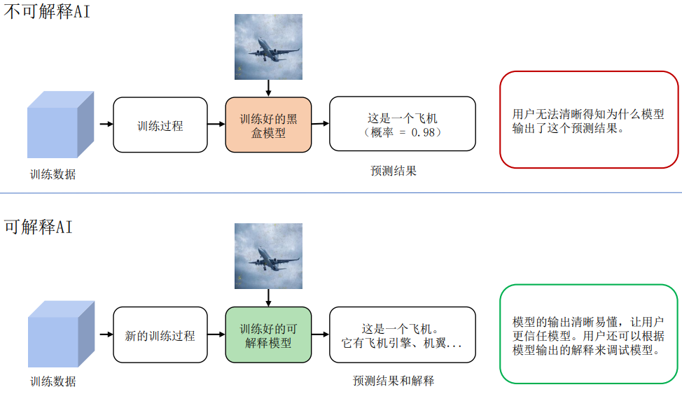
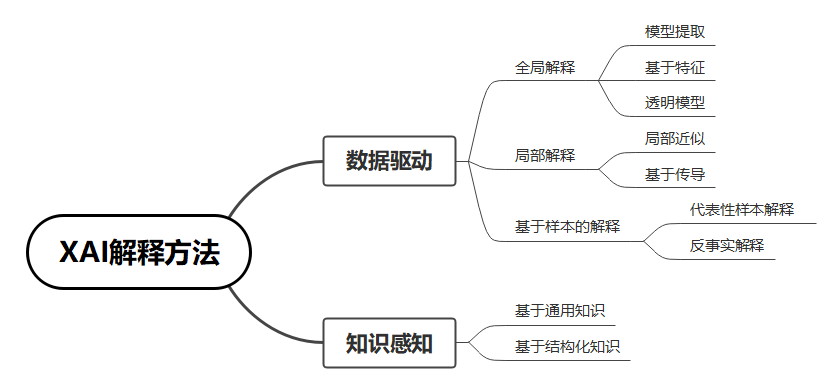
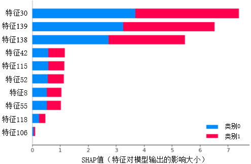
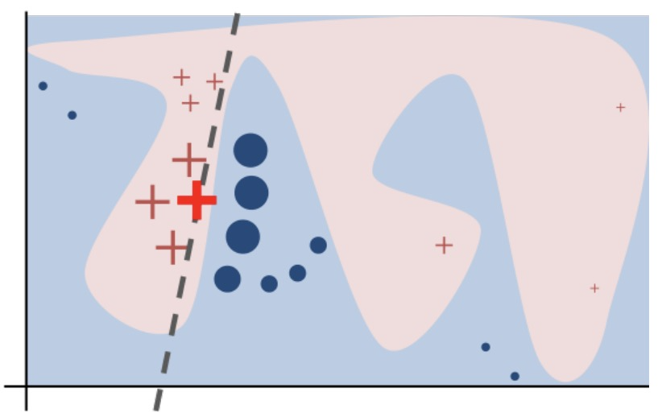
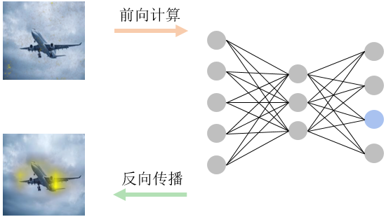
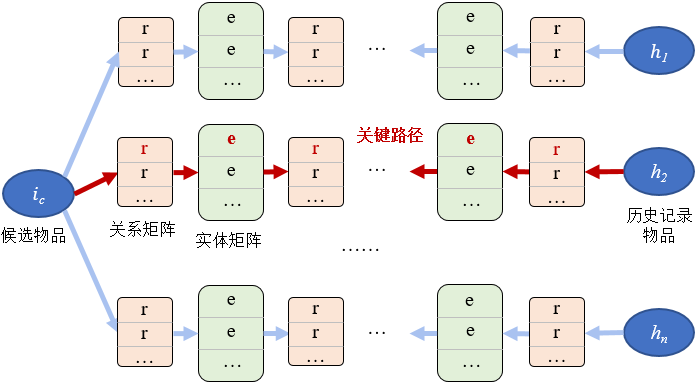

## 背景

在人类历史上，技术进步、生产关系逻辑和伦理法规的发展是动态演进的。当一种新的技术在实验室获得突破后，其引发的价值产生方式的变化会依次对商品形态、生产关系等带来冲击。而同时当新技术带来的价值提升得到认可后，商业逻辑的组织形态在自发的调整过程中，也会对技术发展的路径、内容甚至速度提出诉求，并当诉求得到满足时适配以新型的伦理法规。在这样的相互作用中，技术系统与社会体系会共振完成演进，是谓技术革命。

近10年来，籍由算力与数据规模的性价比突破临界点，以深度神经网络为代表的联结主义模型架构及统计学习范式（以后简称深度学习）在特征表征能力上取得了跨越级别的突破，大大推动了人工智能的发展，在很多场景中达到令人难以置信的效果。比如：人脸识别准确率达到97%以上；谷歌智能语音助手回答正确率，在2019年的测试中达到92.9%。在这些典型场景下，深度学习在智能表现上的性能已经超过了普通人类（甚至专家），从而到了撬动技术更替的临界点。在过去几年间，在某些商业逻辑对技术友好，或者伦理法规暂时稀缺的领域，如安防、实时调度、流程优化、竞技博弈、信息流分发等，人工智能和深度学习取得了技术和商业上快速突破。

食髓知味，技术发展的甜头自然每个领域都不愿放过。而当对深度学习商业化运用来到某些对技术敏感、与人的生存或安全关系紧密的领域，如自动驾驶、金融、医疗和司法等高风险应用场景时，原有的商业逻辑在进行技术更替的过程中就会遇到阻力，从而导致商业化变现速度的减缓甚至失败。究其原因，以上场景的商业逻辑及背后伦理法规的中枢之一是稳定的、可追踪的责任明晰与责任分发；而深度学习得到的模型是个黑盒，我们无法从模型的结构或权重中获取模型行为的任何信息，从而使这些场景下责任追踪和分发的中枢无法复用，导致人工智能在业务应用中遇到技术上和结构上的困难。

举2个具体的例子：例1，在金融风控场景，通过深度学习模型识别出来小部分用户有欺诈嫌疑，但是业务部门不敢直接使用这个结果进行处理。因为人们难以理解结果是如何得到的，从而无法判断结果是否准确。而且该结果缺乏明确的依据，如果处理了，也无法向监管机构交代；
例2，在医疗领域，深度学习模型根据患者的检测数据，判断患者有肺结核，但是医生不知道诊断结果是怎么来的，不敢直接采用，而是根据自己的经验，仔细查看相关检测数据，然后给出自己的判断。从这2个例子可以看出，黑盒模型严重影响模型在实际场景的应用和推广。

此外，模型的可解释性问题也引起了国家层面的关注，相关机构对此推出了相关的政策和法规。

-   2017年7月，国务院印发《新一代人工智能发展规划》，首次涵盖可解释AI。

-   2021年3月，中国人民银行发布金融行业标准《人工智能算法金融应用评价规范》，对金融行业AI模型可解释性提出了明确要求。

-   2021年8月，网信办《互联网信息服务算法推荐管理规定》,
    提出对互联网行业算法推荐可解释性的要求。

-   2021年9月，科技部发布《新一代人工智能伦理规范》。

因此，从商业推广层面以及从法规层面，我们都需要打开黑盒模型，对模型进行解释，可解释AI正是解决该类问题的技术。

## 可解释AI定义

按DARPA（美国国防部先进研究项目局）的描述，如图 :numref:`xai_concept`所示，
可解释AI的概念在于：区别于现有的AI系统，可解释AI系统可以解决用户面对黑盒模型时遇到的问题，使得用户知其然并知其所以然。

:width:`800px`
:label:`xai_concept`

然而，不论是学术界还是工业界，对于可解释AI (eXplainable AI(XAI))都没有一个统一的定义。这里列举3种典型定义，供大家参考讨论：

-   可解释性就是希望寻求对模型工作机理的直接理解，打破人工智能的黑盒子。

-   可解释AI是为AI算法所做出的决策提供人类可读的以及可理解的解释。

-   可解释AI是确保人类可以轻松理解和信任人工智能代理做出的决策的一组方法。

可见，关注点在于对模型的理解、黑盒模型白盒化以及模型的可信任。

我们根据自身的实践经验和理解，将可解释AI定义为：一套面向机器学习（主要是深度神经网络）的技术合集，包括可视化、数据挖掘、逻辑推理、知识图谱等，目的是通过此技术合集，使深度神经网络呈现一定的可理解性，以满足相关使用者对模型及应用服务产生的信息诉求（如因果或背景信息），从而为使用者对人工智能服务建立认知层面的信任。

## 可解释AI算法现状介绍

随着可解释AI概念的提出，可解释AI越来越受到学术界及工业界的关注，下图展示了人工智能领域顶级学术会议中可解释AI关键字的趋势。为了让读者更好的对现有可解释AI算法有一个整体认知，我们这里参考 :cite:`2020tkde_li`总结归纳了可解释AI的算法类型，如图 :numref:`XAI_methods`所示。

:width:`800px`
:label:`XAI_methods`

对模型进行解释有多种多样的方法，这里依据解释过程是否引入数据集以外的外部知识，将其分为数据驱动的解释方法和知识感知的解释方法。

**数据驱动的解释**

数据驱动的解释是指纯粹从数据本身生成解释的方法，而不需要先验知识等外部信息。为了提供解释，数据驱动的方法通常从选择数据集（具有全局或局部分布）开始。然后，将选定的数据集或其变体输入到黑盒模型（在某些情况下，选取数据集不是所必需的。例如， :cite:`erhan2009visualizing`提出的最大激活值方法），通过对黑盒模型的相应预测进行一定的分析(例如，对预测w.r.t.输入特征进行求导）来生成解释。根据可解释性的范围，这些方法可以进一步分为全局方法或局部方法，即它们是解释所有数据点的全局模型行为还是预测子集行为。特别地，基于实例的方法提供了一种特殊类型的解释–它们直接返回数据实例作为解释。虽然从解释范围的分类来看，基于实例的方法也可以适合全局方法（代表性样本）或局部方法（反事实），但我们单独列出它们，以强调它们提供解释的特殊方式。

全局方法旨在提供对模型逻辑的理解以及所有预测的完整推理，基于对其特征、学习到的组件和结构的整体视图等等。有几个方向可以探索全局可解释性。为了便于理解，我们将它们分为以下三个子类：
(i)
模型提取——从原始黑盒模型中提取出一个可解释的模型，比如通过模型蒸馏的方式将原有黑盒模型蒸馏到可解释的决策树，从而使用决策树中的规则解释该原始模型；
(ii)
基于特征的方法——估计特征的重要性或相关性，如图 :numref:`xai_global_feature_importance`所示,
该类型解释可提供如“信用逾期记录是模型依赖的最重要特征”的解释，从而协助判定模型是否存在偏见
(iii) 透明模型设计——修改或重新设计黑盒模型以提高其可解释性。

:width:`800px`
:label:`xai_global_feature_importance`

全局解释可以提供黑盒模型的整体认知。但由于黑盒模型的高复杂性，在实践中往往很难通过模型提取/设计得到与原模型行为相近的简单透明模型，也往往很难对整个数据集抽象出统一的特征重要性。此外，在为单个观察生成解释时，全局解释也缺乏局部保真度，因为全局重要的特征可能无法准确解释单个样例的决定。因此，局部方法成为了近些年领域内重要的研究方向。局部方法尝试为单个实例或一组实例检验模型行为的合理性。当仅关注局部行为时，复杂模型也可以变得简单，因此即使是简单的函数也有可以为局部区域提供可信度高的解释。基于获得解释的过程，局部方法可以分为两类：局部近似和基于梯度传播的方法。

局部近似是通过在样本近邻区域模拟黑盒模型的行为生成可理解的子模型。相比于全局方法中的模型提取，局部近似仅需关注样本临近区域，因此更容易获得精确描述局部行为的子模型。如图 :numref:`xai_lime`所示，通过在关注数据点$x$附近生成$m$个数据点$(x_i^\prime, f(x_i^\prime)), for\  i=1,2, ...m$（这里$f$为黑盒模型决策函数）,用线性拟合这些数据点，可以得到一个线性模型$g=\sum_i^k w_ix^i$，这里$k$表示数据的特征维度。那么线性模型中的权重$w_i$即可用于表示数据$x$中第$i$个特征对于模型$f$的重要性。

:width:`800px`
:label:`xai_lime`

基于梯度传播的方法通常是用梯度传播直接定位相关特征，这些方法封装了基于反向传播的方法和基于前向传播的方法。基于反向传播的方法将输出的贡献归因于输入特征。如图 :numref:`xai_gradient_based`所示,通过梯度回传，计算模型输出对输入的梯度$\frac{d(f(x)}{dx}$ 作为模型解释。
而基于前向传播的方法通过扰动特征后的输出差异来量化输出与特征的相关性。

:width:`800px`
:label:`xai_gradient_based`

**知识感知的解释**

数据驱动的解释方法能够从数据集或输入和输出之间的关系提供全面的解释。在此基础上，还可以利用外部知识来丰富解释并使其更加人性化。没有机器学习背景知识的门外汉可能很难直接理解特征的重要性，以及特征和目标之间的联系。借助外部领域知识，我们不仅可以生成表明特征重要性的解释，还可以描述某些特征比其他特征更重要的原因。因此，在过去几年中，基于知识感知的可解释AI方法引起了越来越多的关注。与从多种情景中收集的原始数据集相比，知识通常被视为人类根据生活经验或严格的理论推理得出的实体或关系。一般来说，知识可以有多种形式。它可以保留在人的头脑中，也可以用自然语言、音频或规则记录，具有严格的逻辑。为了对这些方法进行系统回顾，我们在此根据知识来源将它们分为两类：通用知识方法和知识库（KB）方法。前者以非结构化数据为知识源来构建解释，后者以结构化知识库为基础来构建解释。

提供知识的一个相对直接的方法是通过人类的参与。事实上，随着人工智能研究和应用的爆炸式增长，人类在人工智能系统中的关键作用已经慢慢显现。这样的系统被称为以人为中心的人工智能系统。 :cite:`riedl2019human`认为，以人为中心的人工智能不仅能让人工智能系统从社会文化的角度更好地了解人类，还能让人工智能系统帮助人类了解自己。为了实现这些目标，人工智能需要满足可解释性和透明度等几个属性。

具体来说，人类能够通过提供相当多的人类定义的概念来在人工智能系统中发挥作用。 :cite:`kim2018interpretability`利用概念激活向量（CAV）来测试概念在分类任务中的重要性（TCAV）。CAV是与感兴趣目标概念的激活与否决策边界垂直的矢量，该矢量可以这样获取: 输入目标概念的正负样本, 进行线性回归, 得到决策边界, 从而得到CAV。以“斑马”的“条纹”概念为例，用户首先收集包含有“条纹”的数据样本及不含“条纹”的数据样本，输入到网络中，获取中间层的激活值，基于正负样本的标签（$1$代表含有概念，$0$代表不含概念）对中间层激活值进行拟合，获取决策边界，CAV即为该决策边界的垂直向量。

如 :numref:`xai_tcav`所示，为了计算TCAV评分，代表第$l$层概念对类$k$预测的重要性的“概念敏感度”可以首先计算为方向导数$S_{C,k,l}(\mathbf{x})$：
$$\begin{split}
S_{C,k,l}(\mathbf{x}) =  &\lim_{\epsilon\rightarrow 0}\frac{h_{l,k}(f_{l}(\mathbf{x})+\epsilon \mathbf{v}^{l}_{C})-h_{l,k}(f_{l}(\mathbf{x}))}{\epsilon} \\ = &\nabla h_{l,k}(f_{l}(\mathbf{x})) \cdot \mathbf{v}^{l}_{C}  
\end{split}
\label{eq:TCAV_score}$$ 
其中$f_{l}(\mathbf{x})$是在第$l$、$h_{l,k}(\cdot)$是类$k$的logit,$\nabla h_{l,k}(\cdot)$是$h_{l，k}$
w.r.t层$l$的激活的梯度。$\mathbf{v}^{l}_{C}$是用户旨在探索的概念$C$的CAV。正（或负）敏感性表明概念$C$对输入的激活有正（或负）影响。

基于$S_{C,k,l}$,
TCAV就可以通过计算类$k$的具有正$S_{C,k,l}$’s的样本的比率来获得：

$$\textbf{TCAV}_{Q_{C,k,l}}=\frac{\vert \{\mathbf{x}\in X_{k}:S_{C,k,l}(\mathbf{x})>0\}\vert}{\vert X_{k}\vert}
\label{eq:TCAV}$$
结合$t$-分布假设方法，如果$\textbf{TCAV}_{Q_{C,k,l}}$大于0.5，则表明概念$C$对类$k$有重大影响。

= \[rectangle, minimum height=2.5cm, text width=2.4cm, text centered,
draw=black, font=\] = \[thick,-&gt;,&gt;=stealth\]

(step1) \[startstop\] [收集一个概念的正负样本]{}; (step2) \[startstop,
right of=step1\] [输入正负样模型获取中间层的激活]{}; (step3)
\[startstop, right of=step2\] [通过线性回归获取 CAVs]{}; (step4)
\[startstop, right of=step3\] [计算TCAV分值]{};

(step1) – (step2); (step2) – (step3); (step3) – (step4);

:width:`800px`
:label:`xai_tcav`

人类的知识可以是主观的，而KB可以是客观的。在当前研究中，KB通常被建模为知识图谱(KG)。以下以MindSpore支持的可解释推荐模型TB-Net为例，讲解如何使用知识图谱构建可解释模型。知识图谱可以捕捉实体之间丰富的语义关系。TB-Net的目的之一就是确定哪一对实体（即，物品-物品）对用户产生最重大的影响，并通过什么关系和关键节点进行关联。不同于现有的基于KG嵌入的方法（RippleNet使用KG补全方法预测用户与物品之间的路径），TB-Net提取真实路径，以达到推荐结果的高准确性和和优越的可解释性。

:width:`800px`
:label:`tb_net`

TB-Net的框架如图 :numref:`tb_net`所示：其中，Step代表步骤，historical代表历史的记录在图谱中的节点。Path extraction代表路径抽取，embedding propagation代表图嵌入向量传导技术，R代表关系矩阵，e代表图谱中的实体节点，pair block代表物品配对块，user response代表用户兴趣反馈向量，update代表更新词向量，concat代表拼接计算。步骤1，TB-Net得到目标项$\tau$，用户$u$和该用户的子图。子图是通过历史点击项集合$I_u$（蓝色部分）来构建生成；步骤2，连接$\tau$和$I_u$之间的路径，提取路径作为双向嵌入传播网络TB-Net的输入。词向量的计算从路径的左侧和右侧传播到中间节点（图中的绿色节点）；步骤3，计算左右两个流向的词向量汇集到同一中间实体的概率。概率用于表示用户对中间实体的喜好程度，并作为解释的依据；步骤4，TB-Net同时输出推荐结果和具有语义级别的解释。

以游戏推荐为场景，随机对一个用户推荐新的游戏，如图 :numref:`xai_kg_recommendataion`所示，其中Half-Life, DOTA 2, Team Fortress 2等为游戏名称。关系属性中，game.year 代表游戏发行年份，game.genres代表游戏属性，game.developer代表游戏的开发商，game.categories代表游戏分类。属性节点中，MOBA代表多人在线战术竞技游戏，valve代表威尔乌游戏公司，action代表动作类，Multi-player代表多人游戏，Valve Anti-Cheat enabled代表威尔乌防作弊类，Free代表免费，Cross-Platform代表跨平台。左边的游戏是从训练数据中选取的评分项。而测试数据中正确推荐的游戏是“Team Fortress 2”。

:width:`800px`
:label:`xai_kg_recommendataion`

在图 :numref:`xai_kg_recommendataion`中，有两个突出显示的相关概率（38.6%, 21.1%），它们是在推荐过程中模型计算的路径被激活的概率。实线箭头突出显示从“Team Fortress 2”到历史项目“Half-Life”之间的路径。它表明TB-Net能够通过各种关系连接向用户推荐物品，并输出关键因素作为解释。因此，将“Team Fortress 2”推荐给用户的解释可以翻译成固定话术：“Team Fortress 2”是游戏公司“Valve”开发的一款动作类、多人在线、射击类“action”电子游戏。这与用户历史玩过的游戏“Half-Life”有高度关联。

## 未来可解释AI

为了进一步推动可解释AI的研究，我们在此总结了一些值得注意的研究方向。

首先，知识感知型XAI仍有很大的研究扩展空间。然而，要有效地利用外部知识，仍有许多悬而未决的问题。其中一个问题是如何在如此广阔的知识空间中获取或检索有用的知识。例如, 维基百科上记载了各式各样各领域相关的知识, 但如果要解决医学图像分类问题, 维基百科上大部分词条都是无关或存在噪音的, 这样便很难准确地寻找到合适的知识引入到XAI系统中。

此外，XAI系统的部署也非常需要一个更加标准和更加统一的评估框架。为了构建标准统一的评估框架，我们可能需要同时利用不同的指标，相互补充。不同的指标可能适用于不同的任务和用户。统一的评价框架应具有相应的灵活性。

最后，我们相信跨学科合作将是有益的。XAI的发展不仅需要计算机科学家来开发先进的算法，还需要物理学家、生物学家和认知科学家来揭开人类认知的奥秘，以及特定领域的专家来贡献他们的领域知识。

## 参考文献

:bibliography:`../references/explainable.bib`