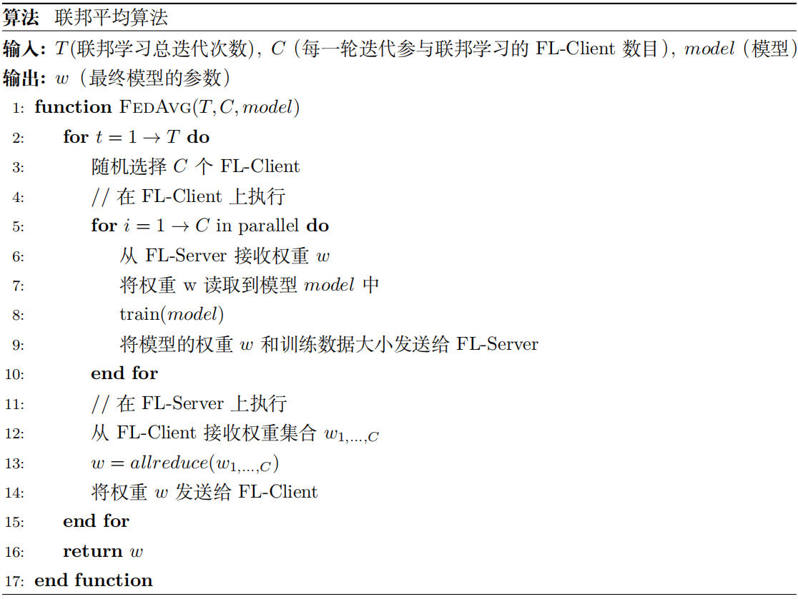
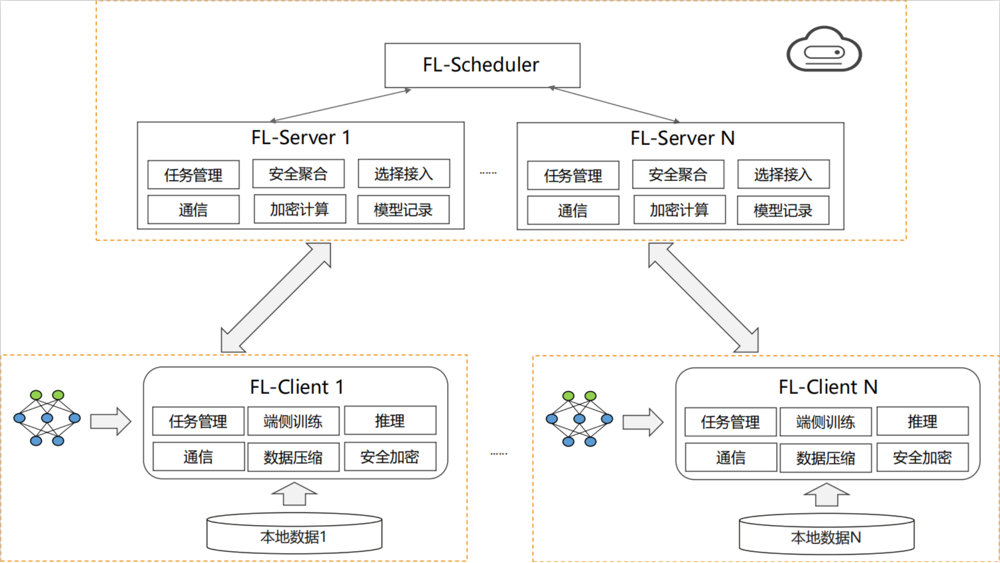

## 横向联邦学习

### 云云场景中的横向联邦

在横向联邦学习系统中，具有相同数据结构的多个参与者通过参数或云服务器协同建立机器学习模型。一个典型的假设是参与者是诚实的，而服务器是诚实但好奇的，因此不允许任何参与者向服务器泄漏信息。这种系统的训练过程通常包括以下四个步骤： 

①：参与者在本地计算训练梯度，使用加密、差异隐私或秘密共享技术掩饰所选梯度，并将掩码后的结果发送到服务器；

②：服务器执行安全聚合，不了解任何参与者的信息；

③：服务器将汇总后的结果发送给参与者；

④：参与者用解密的梯度更新他们各自的模型。

和传统分布式学习相比，联邦学习存在训练结点不稳定和通信代价大的难点。这些难点导致了联邦学习无法和传统分布式学习一样：在每次单步训练之后，同步不同训练结点上的权重。为了提高计算通信比并降低频繁通信带来的高能耗，谷歌公司在2017年 :cite:`fedavg`提出了联邦平均算法(Federated Averaging，FedAvg)。 :numfef:`ch10-federated-learning-fedavg`展示了FedAvg的整体流程。在每轮联邦训练过程中，端侧进行多次单步训练。然后云侧聚合多个端侧权重，并取加权平均。

:width:`800px`
:label:`ch10-federated-learning-fedavg`

随着研究和应用的深入，研究者们意识到了FedAvg不适用于某些场景。比如在数据异质性（端上数据不是I.I.D分布）、系统异质性（端设备时断时连）的情况下，对模型参数只进行简单的加权平均会在训练过程中引入大量偏差，从而影响模型的收敛速度、预测性能。针对此，研究人员提出了基于Momentum :cite:`FedAvg_Momentum`、Variation Control :cite:`scaffold`、Bayesian :cite:`FedBE`、Distillation :cite:`PATE`和Proximal Estimation :cite:`FedProx`等原理开发的算法和系统框架。

### 端云场景中的横向联邦

端云联邦的总体流程和云云联邦一样，但端云联邦学习面临的难点还包括以下三个方面：

1.高昂的通信代价。在联邦学习问题中，原始数据保存在远程客户端设备本地，必须与中央服务器不断交互才能完成全局模型的构建。通常的通信网络可能是WLAN或移动数据，网络通信速度可能比本地计算慢许多个数量级，这就造成高昂的通信代价成为了联邦学习的关键瓶颈。

2.系统异质性。由于客户端设备硬件条件（CPU、内存）、网络连接（3G、4G、5G、WIFI）和电源（电池电量）的变化，联邦学习网络中每个设备的存储、计算和通信能力都有可能不同。网络和设备本身的限制可能导致某一时间仅有一部分设备处于活动状态。此外，设备还会出现没电、网络无法接入等突发状况，导致瞬时无法连通。这种异质性的系统架构影响了联邦学习整体策略的制定。

3.隐私问题。联邦学习共享客户端设备中的模型参数更新（例如梯度信息）而不是原始数据，因此在数据隐私保护方面优于其他的分布式学习方法。然而，在训练过程中传递模型的更新信息仍然存在向第三方或中央服务器暴露敏感信息的风险。隐私保护成为联邦学习需要重点考虑的问题。

为了解决端云联邦学习带来的挑战，MindSpore Federated Learning设计了分布式FL-Server架构。系统由调度器模块、服务器模块和客户端模块三个部分组成，其系统架构如 :numref:`ch10-federated-learning-architecture`所示。其中：

- 联邦学习调度器：

  联邦学习调度器（FL-Scheduler）协助集群组网，并负责管理面任务的下发。

- 联邦学习服务器：

  联邦学习服务器（FL-Server）提供客户端选择、限时通信、分布式联邦聚合功能。FL-Server需要具备支持端云千万台设备的能力以及边缘服务器的接入和安全处理的逻辑。

- 联邦学习客户端：

  联邦学习客户端（FL-Client）负责本地数据训练，并在和FL-Server进行通信时，对上传权重进行安全加密。

:label:`ch10-federated-learning-architecture`

此外，MindSpore Federated针对端云联邦学习设计了出三大特性：

1.限时通信：在FL-Server和FL-Client建立连接后，启动全局的计时器和计数器。当预先设定的时间窗口内的FL-Server接收到FL-Client训练后的模型参数满足初始接入的所有FL-Client的一定比例后，就可以进行聚合。若时间窗内没有达到比例阈值，则进入下一轮迭代。保证即使有海量FL-Client接入的情况下，也不会由于个别FL-Client训练时间过长或掉线导致的整个联邦学习过程卡死。

2.松耦合组网：使用FL-Server集群。每个FL-Server接收和下发权重给部分FL-Client，减少单个FL-Server的带宽压力。此外，支持FL-Client以松散的方式接入。任意FL-Client的中途退出都不会影响全局任务，并且FL-Client在任意时刻访问任意FL-Server都能获得训练所需的全量数据。

3.加密模块：MindSpore Federated为了防止模型梯度的泄露，部署了多种加密算法：本地差分隐私（LDP）、基于多方安全计算（MPC）的安全聚合算法和华为自研的基于符号的维度选择差分隐私算法（SignDS）。
