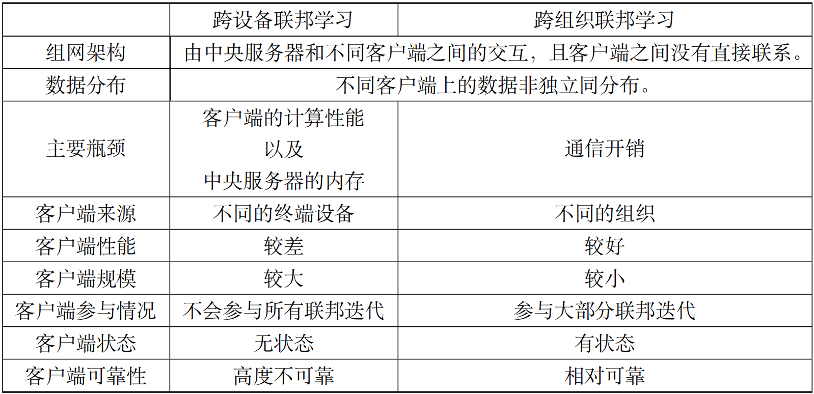

## 概述

随着人工智能的飞速发展，大规模和高质量的数据对模型的效果和用户的体验都变得越来越重要。与此同时，数据的利用率成为了制约了人工智能的进一步发展的瓶颈。隐私、监管和工程等问题造成了设备与设备之间的数据不能共享，进而导致了数据孤岛问题的出现。为了解决这一难题，联邦学习（Federated Learning，FL）应运而生。联邦学习的概念最早在2016年被提了出来。在满足用户隐私保护、数据安全和政府法规的要求下，联邦学习能有效地使用多方机构的数据进行机器学习建模。

### 定义

联邦学习的核心是数据不动，模型动。显然，若是将数据从各方集中在一起，无法保证对用户隐私的保护，且不符合相关法律法规。联邦学习让模型在各个数据方“移动”，这样就可以达到数据不出端即可建模的效果。在联邦学习中，各方数据都保留在本地，通过（在中心服务器上）交换加密的参数或其他信息来建立机器学习模型。

### 应用场景

在实际的应用场景中，根据样本和特征的重叠情况，联邦学习可以被分为横向联邦学习（样本不同，特征重叠），纵向联邦学习（特征不同，样本重叠）和联邦迁移学习（样本和特征都不重叠）。

**横向联邦学习**适用于不同参与方拥有的特征相同、但参与的个体不同的场景。比如，在广告推荐场景中，算法开发人员使用不同手机用户的相同特征（点击次数、停留时间或使用频次等）的数据来建立模型。因为这些特征数据不能出端，横向联邦学习被用来联合多用户的特征数据来构建模型。

**纵向联邦学习**适用于样本重叠多、特征重叠少的场景。比如，有两个不同机构，一家是保险公司，另一家是医院。它们的用户群体很有可能包含该地的大部分居民。它们两方的用户交集可能较大。由于保险公司记录的是用户的收支行为与信用评级，而医院则拥有用户的疾病与购药记录，因此它们的用户特征交集较小。纵向联邦学习就是将这些不同特征在加密的状态下加以聚合，以增强模型能力的方法。

**联邦迁移学习**的核心是找到源领域和目标领域之间的相似性。比如有两个不同机构，一家是位于中国的银行，另一家是位于美国的电商。由于受到地域限制，这两家机构的用户群体交集很小。同时，由于机构类型的不同，二者的数据特征也只有小部分重合。在这种情况下，要想进行有效的联邦学习，就必须引入迁移学习。联邦迁移学习可以解决单边数据规模小和标签样本少的问题，并提升模型的效果。

### 部署场景

联邦学习和参数服务器（数据中心分布式学习）架构非常相似，都是采用中心化的服务器和分散的客户端去构建同一个机器学习模型。此外，根据部署场景的不同，联邦学习还可以细分为跨组织（Cross-silo）与跨设备（Cross-device）联邦学习。一般而言，跨组织联邦学习的用户一般是企业、机构单位级别的，而跨设备联邦学习针对的则是便携式电子设备、移动端设备等。 :numref:`ch10-federated-learning-different-connection`展示了三者的区别和联系：

:width:`800px`
:label:`ch10-federated-learning-different-connection`

### 常用框架

随着用户和开发人员对联邦学习技术的需求不断增长，联邦学习工具和框架的数量也越来越多。下面将介绍一些主流的联邦学习框架。

[TFF](https://www.tensorflow.org/federated) (TensorFlow Federated)是谷歌牵头开发的联邦学习开源框架，用于在分散数据上进行机器学习和其他计算。TFF的开发是为了促进联邦学习的开放研究和实验。在许多参与的客户中训练共享的全局模型，这些客户将其训练数据保存在本地。例如，联邦学习已被用于训练移动键盘的预测模型，而无需将敏感的键入数据上载到服务器。

[PaddleFL](https://paddlefl.readthedocs.io/en/latest/index.html)是百度提出的一个基于PaddlePaddle的开源联邦学习框架。研究人员可以很轻松地用PaddleFL复制和比较不同的联邦学习算法，开发人员也比较容易在大规模分布式集群中部署PaddleFL联邦学习系统。PaddleFL提供很多种联邦学习策略（横向联邦学习、纵向联邦学习）及其在计算机视觉、自然语言处理、推荐算法等领域的应用。此外，PaddleFL还提供传统机器学习训练策略的应用，例如多任务学习、联邦学习环境下的迁移学习。依靠着PaddlePaddle的大规模分布式训练和Kubernetes对训练任务的弹性调度能力，PaddleFL可以基于全栈开源软件轻松地部署。 

[FATE](https://fate.fedai.org) (Federated AI Technology Enabler)由微众银行提出，是全球首个联邦学习工业级开源框架，可以让企业和机构在保证数据安全和数据隐私不泄露的前提下进行数据协作。 FATE项目使用多方安全计算 (Secure Multi-Party Computation，MPC) 以及同态加密 (Homomorphic Encryption，HE) 技术构建底层安全计算协议，以此支持不同种类的机器学习的安全计算，包括逻辑回归、基于树的算法、深度学习和迁移学习等。 FATE于2019年2月首次对外开源，并成立FATE社区。社区成员包含国内主要云计算和金融服务企业。 

[FedML](https://FedML.ai)是一个南加利福尼亚大学（University of Southern California，USC）牵头提出的联邦学习开源研究和基准库，它有助于开发新的联合学习算法和公平的性能比较。FedML支持三种计算范式（分布式训练、移动设备上训练和独立模拟），供用户在不同的系统环境中进行实验。FedML还通过灵活和通用的API设计和参考基线实现并促进了多样化的算法研究。为了使各联邦学习算法可以进行公平比较，FedML设置了全面的基准数据集，其中包括非独立同分布（Independent Identically Distribution，IID）数据集。

[PySyft](https://openmined.github.io/PySyft/index.html)是伦敦大学学院（University College London，UCL）、DeepMind和OpenMined发布的安全和隐私深度学习Python库，包括联邦学习、差分隐私和多方学习。PySyft使用差分隐私和加密计算（MPC和HE）将私有数据与模型训练解耦。

[Fedlearner](https://github.com/bytedance/fedlearner)是字节跳动提出的纵向联邦学习框架，它允许对分布在机构之间的数据进行联合建模。Fedlearner附带了用于集群管理、作业管理、作业监控和网络代理的周围基础架构。Fedlearner采用云原生部署方案，并将数据存放在HDFS中。Fedlearner通过Kubernetes管理和拉起任务。每个Fedlearner的参与双方需要同时通过Kubernetes拉起训练任务，并通过Master节点统一管理多个训练任务，以及通过Worker实现通信。

[OpenFL](https://openfl.readthedocs.io/en/latest/index.html)是英特尔提出的用于联邦学习的Python框架。OpenFL旨在成为数据科学家的灵活、可扩展和易于学习的工具。

[Flower](https://flower.dev)是剑桥大学发布的联邦学习开源系统，主要针对在大规模、异质化设备上部署联邦学习算法的应用场景进行优化。

[MindSpore Fedrated](https://www.mindspore.cn/en)是华为提出的一款开源联邦学习框架，支持千万级无状态终端设备商用化部署，在用户数据留存在本地的情况下，使能全场景智能应用。MindSpore Federated专注于大规模参与方的横向联邦学习的应用场景，使参与联邦学习的各用户在不共享本地数据的前提下共建AI模型。MindSpore Federated主要解决隐私安全、大规模联邦聚合、半监督联邦学习、通信压缩和跨平台部署等联邦学习在工业场景部署的难点。
