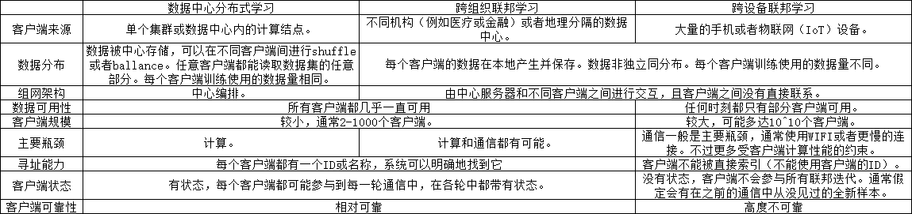

## 概述

随着人工智能的飞速发展，大规模和高质量的数据越来越重要，但也制约了其进一步的发展。隐私、监管和工程等问题造成了设备与设备之间的数据不能共享，进而导致了数据孤岛问题的出现。为了解决这一难题，联邦学习（Federated Learning，FL）应运而生。联邦学习的概念最早在2016年被提了出来，能有效帮助多个机构在满足用户隐私保护、数据安全和政府法规的要求下，进行数据使用和机器学习建模。

### 定义

联邦学习的核心即为数据不动，模型动。显然，若是将数据从各方集中在一起，不符合法律法规。联邦学习让模型在各个数据方“移动”，这样就可以达到数据不出端即可建模的效果。在联邦学习中，各方数据都保留在本地，通过交换加密的参数建立机器学习模型。

### 应用场景

在实际的应用场景中，根据样本和特征的重叠情况，联邦学习可以被分为横向联邦学习（样本不同，特征重叠），纵向联邦学习（特征不同，样本重叠）和联邦迁移学习（样本和特征都不重叠）。

**横向联邦学习**适用于不同参与方拥有的特征相同但参与的个体不同的场景。比如，在广告推荐场景中，有多个不同的手机用户。算法开发人员使用不同手机用户的相同特征（点击次数、停留时间或使用频次等特征）的数据来建立模型。由于这些特征数据不能出端，因此，横向联邦学习可以被联合多个用户的数据来构建模型。

**纵向联邦学习**适用于样本重叠多特征重叠少的场景。比如，有两个不同机构，一家是保险公司，另一家是医院。它们的用户群体很有可能包含该地的大部分居民，用户的交集可能较大。由于保险公司记录的都是用户的收支行为与信用评级，而医院则保有用户的疾病与购药记录，因此它们的用户特征交集较小。纵向联邦学习就是将这些不同特征在加密的状态下加以聚合，以增强模型能力的联邦学习。

**联邦迁移学习**的核心是找到源领域和目标领域之间的相似性。比如有两个不同机构，一家是位于中国的银行，另一家是位于美国的电商。由于受到地域限制，这两家机构的用户群体交集很小。同时，由于机构类型的不同，二者的数据特征也只有小部分重合。在这种情况下，要想进行有效的联邦学习，就必须引入迁移学习，来解决单边数据规模小和标签样本少的问题，从而提升模型的效果。

### 部署场景

联邦学习和参数服务器（数据中心分布式学习）架构非常相似，都是采用中心化的服务器和分散的客户端去构建同一个机器学习模型。此外，根据客户端来源和规模的不同，联邦学习还可以细分为跨设备（cross-device）与跨组织（cross-silo）联邦学习。一般而言，跨组织联邦学习的用户一般是企业、机构单位级别的，而跨设备联邦学习针对的则是便携式电子设备、移动端设备等。 :numref:`ch10-federated-learning-different-connection`展示了三者的区别和联系：

:label:`ch10-federated-learning-different-connection`

### 联邦学习框架

随着用户和开发人员对联邦学习技术的需求不断增长，联邦学习工具和框架的数量也越来越多。下面将介绍一些主流的联邦学习框架。

TensorFlow联邦（TFF）是谷歌公司牵头的联邦学习开源框架，用于在分散数据上进行机器学习和其他计算。TFF的开发是为了促进联邦学习（FL）的开放研究和实验，这是一种机器学习的方法，在许多参与的客户中训练共享的全局模型，这些客户将其训练数据保存在本地。例如，联邦学习已被用于训练移动键盘的预测模型，而无需将敏感的键入数据上载到服务器。

PaddleFL是百度提出的一个基于PaddlePaddle的开源联邦学习框架。研究人员可以很轻松地用PaddleFL复制和比较不同的联邦学习算法，开发人员也比较容易在大规模分布式集群中部署PaddleFL联邦学习系统。PaddleFL提供很多种联邦学习策略（横向联邦学习、纵向联邦学习）及其在计算机视觉、自然语言处理、推荐算法等领域的应用。此外，PaddleFL还将提供传统机器学习训练策略的应用，例如多任务学习、联邦学习环境下的迁移学习。依靠着PaddlePaddle的大规模分布式训练和Kubernetes对训练任务的弹性调度能力，PaddleFL可以基于全栈开源软件轻松地部署。 

FATE (Federated AI Technology Enabler) 由微众银行提出，是全球首个联邦学习工业级开源框架，可以让企业和机构在保护数据安全和数据隐私的前提下进行数据协作。 FATE项目使用多方安全计算 (MPC) 以及同态加密 (HE) 技术构建底层安全计算协议，以此支持不同种类的机器学习的安全计算，包括逻辑回归、基于树的算法、深度学习和迁移学习等。 FATE于2019年2月首次对外开源，并成立 [FATE TSC](https://github.com/FederatedAI/FATE-Community/blob/master/FATE_Project_Technical_Charter.pdf) 对FATE社区进行开源治理，成员包含国内主要云计算和金融服务企业。 

FedML是一个USC牵头提出的联邦学习开源研究和基准库，它有助于开发新的联合学习算法和公平的性能比较。FedML支持三种计算范式（分布式训练、移动设备上训练和独立模拟），供用户在不同的系统环境中进行实验。FedML还通过灵活和通用的API设计和参考基线实现促进多样化的算法研究。为非I.I.D设置精心策划的全面基准数据集旨在进行公平比较。FedML在https://FedML.ai上维护源代码、文档和用户社区。

PySyft是UCL、DeepMind和OpenMind发布的安全和隐私深度学习Python库，包括联邦学习、差分隐私和多方学习。PySyft使用差分隐私和加密计算（如多方计算(MPC）和同态加密（HE）)将私有数据与模型训练解耦流。

Fedlearner是字节跳动提出的协作机器学习框架，它允许对分布在机构之间的数据进行联合建模。Fedlearner附带了用于群集管理、作业管理、作业监控和网络代理的周围基础架构。Fedlearner采用云原生部署方案。数据存放在HDFS。通过Kubernetes管理和拉起任务。每个Fedlearner的训练任务需要参与双方同时拉起K8S任务，通过Master节点统一管理，Worker建实现通信。 

OpenFL是英特尔提出的用于联邦学习的Python框架。OpenFL旨在成为数据科学家的灵活、可扩展和易于学习的工具。OpenFL由英特尔物联网集团（IOTG）和英特尔实验室开发。

MindSpore Fedrated是华为提出的一款开源联邦学习框架，支持千万级无状态终端设备商用化部署，在用户数据留存在本地的情况下，使能全场景智能应用。 MindSpore Federated优先专注于大规模参与方的横向联邦的应用场景，使参与联邦学习的各用户在不共享本地数据的前提下共建AI模型。MindSpore Fedrated主要解决隐私安全、大规模联邦聚合、易用性和跨平台部署等联邦学习在工业场景部署的难点。 