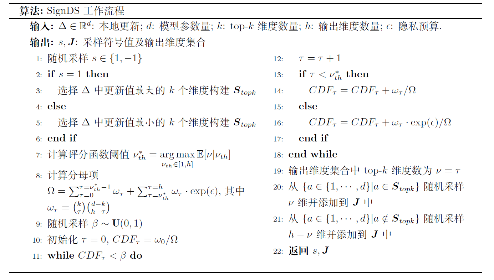

## 隐私加密算法

联邦学习过程中，用户数据仅用于本地设备训练，不需要上传至中央FL-Server。这样可以避免用户个人数据的直接泄露。然而联邦学习框架中，模型的权重以明文形式上云仍然存在间接泄露用户隐私的风险。敌手获取到用户上传的明文权重后，可以通过重构、模型逆向等攻击恢复用户的个人训练数据，导致用户隐私泄露。

MindSpore Federated框架，提供了基于本地差分隐私（LDP）、基于多方安全计算（MPC）的安全聚合算法和华为自研的基于符号的维度选择差分隐私算法（SignDS），在本地模型的权重上云前对其进行加噪或加扰。在保证模型可用性的前提下，解决联邦学习中的隐私泄露问题。

### 基于LDP的安全聚合

差分隐私（differential privacy）是一种保护用户数据隐私的机制。差分隐私定义为：
$$
Pr[\mathcal{K}(D)\in S] \le e^{\epsilon} Pr[\mathcal{K}(D’) \in S]+\delta
$$

对于两个差别只有一条记录的数据集$D$和$D’$，通过随机算法$\mathcal{K}$，输出结果为集合$S$子集的概率满足上面公式。$\epsilon$为差分隐私预算，$\delta$为扰动，$\epsilon$和$\delta$越小，说明$\mathcal{K}$在$D$和$D’$上输出的数据分布越接近。

在联邦学习中，假设FL-Client本地训练之后的模型权重矩阵是$W$，由于模型在训练过程中会“记住”训练集的特征，所以敌手可以借助$W$还原出用户的训练数据集。

MindSpore Federated提供基于本地差分隐私的安全聚合算法，防止本地模型的权重上云时泄露隐私数据。

FL-Client会生成一个与本地模型权重矩阵$W$相同维度的差分噪声矩阵$G$，然后将二者相加，得到一个满足差分隐私定义的权重矩阵$W_p$:

$$
W_p=W+G
$$

FL-Client将加噪后的模型权重矩阵$W_p$上传至云侧FL-Server进行联邦聚合。噪声矩阵$G$相当于给原模型加上了一层掩码，在降低模型泄露敏感数据风险的同时，也会影响模型训练的收敛性。如何在模型隐私性和可用性之间取得更好的平衡，仍然是一个值得研究的问题。实验表明，当参与方的数量$n$足够大时（一般指1000以上），大部分噪声能够相互抵消，本地差分隐私机制对聚合模型的精度和收敛性没有明显影响。

### 基于MPC的安全聚合

尽管差分隐私技术可以适当保护用户数据隐私，但是当参与FL-Client数量比较少或者高斯噪声幅值较大时，模型精度会受较大影响。为了同时满足模型保护和模型收敛这两个要求，MindSpore Federated提供了基于MPC的安全聚合方案。

在这种训练模式下，假设参与的FL-Client集合为$U$，对于任意FL-Client $u$和$v$，它们会两两协商出一对随机扰动$p_{uv}$、$p_{vu}$，满足

$$
\label{puv}
    p_{uv}=
    \begin{cases}
    -p_{vu}, &u{\neq}v\\
    0, &u=v
    \end{cases}
$$
于是每个FL-Client $u$ 在上传模型权重至FL-Server前，会在原模型权重$x_u$加上它与其它用户协商的扰动：

$$
x_{encrypt}=x_u+\sum\limits_{v{\in}U}p_{uv}
$$

从而FL-Server聚合结果$\overline{x}$为：
$$
\label{eq:juhejieguo}
\overline{x}=\sum\limits_{u{\in}U}(x_{u}+\sum\limits_{v{\in}U}p_{uv})=\sum\limits_{u{\in}U}x_{u}+\sum\limits_{u{\in}U}\sum\limits_{v{\in}U}p_{uv}=\sum\limits_{u{\in}U}x_{u}
$$
上面的过程只是介绍了聚合算法的主要思想，基于MPC的聚合方案是精度无损的，代价是通讯轮次的增加。

### 基于LDP-SignDS算法的安全聚合

对于先前的基于维度加噪的LDP算法，添加到每个维度的噪声规模基本上与模型参数的数量成正比。因此，对于高维模型，可能需要非常多的参与方来减轻噪音对模型收敛的影响。为了解决上述“维度依赖”问题，MindSpore Federated 进一步提供了基于维度选择的**Sign-based Dimension Selection (SignDS)** :cite:`jiang2022signds`算法。

SignDS算法的主要思想是，对于每一条真实的本地更新$\Delta\in\mathbb{R}^{d}$，FL-Client首先选择一小部分更新最明显的维度构建Top-K集合$S_k$，并以此选择一个维度集合$J$返回给FL-Server。FL-Server根据维度集合$J$构建一条对应的稀疏更新$\Delta^\prime$，并聚合所有稀疏更新用于更新全局模型。由于本地模型更新与本地数据信息相关联，直接选取真实的最大更新维度可能导致隐私泄露。对此，SignDS算法在两方面实现了隐私安全保证。一方面，算法使用了一种基数机制（Exponential Mechanism， EM :cite:`mcsherry2007mechanism`）的维度选择算法**EM-MDS**，使得所选维度集满足严格的$\epsilon$-LDP保证；另一方面，在构建稀疏更新时，对所选维度分配一个常量值而不直接使用实际更新值，以保证稀疏更新和本地数据不再直接关联。由于维度选择满足$\epsilon$-LDP，且分配给所选维度的更新值与本地数据无关，根据差分隐私的传递性 :cite:`dwork2014algorithmic`，所构建的稀疏更新同样满足$\epsilon$-LDP保证。**相较于之前基于维度加噪的LDP算法，SignDS算法可以显著提升高维模型的训练精度。同时，由于FL-Client只需上传一小部分的维度值而不是所有的模型权重，因此联邦学习的上行通信量也被大大降低。**

下面，我们分别对Top-K集合$S_k$的构建和EM-MDS维度选择算法进行详细介绍。

首先，由于实际更新值有正负，直接给所有选定的维度分配相同的常量值可能会明显改变模型更新方向，影响模型收敛。为了解决这个问题，SignDS提出了一种基于符号的Top-K集合构建策略。具体来讲，算法引入了一个额外的符号变量$s\in\\{-1,1\\}$。该变量由FL-Client以等概率随机采样，用于确定本地更新$\Delta$的Top-K集合$S_k$。如果$s=1$，我们将$\Delta$按**真实更新值**排序，并将**最大**的$k$个更新维度记为$S_k$。我们进一步从$S_k$中随机选择一部分维度，并将$s=1$作为这些维度的更新值用以构建稀疏更新。直觉上，$S_k$中维度的更新值很可能大于零。因此，将$s=1$分配给选定的维度不会导致模型更新方向的太大差异，从而减轻了对模型精度的影响。类似的，当$s=-1$时，我们选取**最小**的$k$个更新维度记为$S_k$，并将$s=-1$分配给所选维度。

下面，我们进一步介绍用于维度选择的EM-MDS算法。简单来说，EM-MDS算法的目的是从输出维度域$\mathcal{J}$中以一定概率$\mathcal{P}$随机选择一个维度集合$J\in\mathcal{J}$，不同维度集合对应的概率不同。我们假设$J$总共包含$h$个维度，其中有$\nu$个维度属于Top-K集合（即$|S_k \cap J|=\nu$，且$\nu\in[0,h]$），另外$h-\nu$个维度属于非Top-K集合。直观上，$\nu$越大，$J$中包含的Top-K维度越多，模型收敛越好。因此，我们希望给$\nu$较大的维度集合分配更高的概率。基于这个想法，我们将评分函数定义为：
$$
u(S_{k}, J) = 𝟙(|S_k\cap J| \geq \nu_{th}) =  𝟙(\nu \geq \nu_{th})
$$
$u(S_{k}, J)$用来衡量输出维度集合$J$中包含的Top-K维度的数量是否超过某一阈值$\nu_{th}$（$\nu_{th}\in[1,h]$），超过则为1，否则为0。进一步，$u(S_{k}, J)$的敏感度可计算为：

$$
\phi = \max_{J\in\mathcal{J}} ||u(S_{k}, J) - u(S^\prime_{k}, J)||= 1 - 0 = 1
$$
注意对于任意一对不同的Top-K集合$S_k$和$S_k^\prime$均成立。

根据以上定义，EM-MDS算法描述如下：

给定真实本地更新$\Delta\in\mathbb{R}^{d}$的Top-K集合$S_k$和隐私预算$\epsilon$，输出维度集合$J\in\mathcal{J}$的采样概率为：

$$
\mathcal{P}=\frac{\mathrm{exp}(\frac{\epsilon}{\phi}\cdot u(S_{k}, J))}{\sum_{J^\prime\in\mathcal{J}}\mathrm{exp}(\frac{\epsilon}{\phi}\cdot u(S_{k}, J^\prime))} 
    = 
    \frac{\mathrm{exp}(\epsilon\cdot 𝟙(\nu \geq \nu_{th}))}{\sum_{\tau=0}^{\tau=h}\omega_{\tau}\cdot \mathrm{exp}(\epsilon\cdot 𝟙(\tau\geq\nu_{th}))}
    =
    \frac{\mathrm{exp}(\epsilon\cdot 𝟙(\nu \geq \nu_{th}))}{\sum_{\tau=0}^{\tau=\nu_{th}-1}\omega_{\tau} + \sum_{\tau=\nu_{th}}^{\tau=h}\omega_{\tau}\cdot \mathrm{exp}(\epsilon)}
$$
其中，$\nu$是$J$中包含的Top-K维度数量，$\nu_{th}$是评分函数的阈值，$J^\prime$是任意一输出维度集合，$\omega_{\tau}=\binom{k}{\tau}\binom{d-k}{h-\tau}$是所有包含$\tau$个Top-K维度的集合数。

我们进一步提供了EM-MDS算法的隐私证明:

对于每个FL-Client，给定随机采样的符号值$x$，任意两个本地更新$\Delta$，$\Delta^\prime$的Top-K集合记为$S_k$和$S_k^\prime$，对于任意输出维度集合$J\in\mathcal{J}$，令$\nu=|S_k \cap J|$, $\nu^\prime=|S_k^\prime \cap J|$为$J$与两组Top-K维度集的交集数量。根据式(14.4.8)，以下不等式成立：

$$
\frac{\mathrm{Pr}[J|\Delta]}{\mathrm{Pr}[J|\Delta^\prime]} = \frac{\mathrm{Pr}[J|S_{k}]}{\mathrm{Pr}[J|S^\prime_{k}]} = \frac{\frac{\mathrm{exp}(\frac{\epsilon}{\phi}\cdot u(S_{k}, J))}{\sum_{J^\prime\in\mathcal{J}}\mathrm{exp}(\frac{\epsilon}{\phi}\cdot u(S_{k}, J^\prime))}}{\frac{\mathrm{exp}(\frac{\epsilon}{\phi}\cdot u(S^\prime_{k}, J))}{\sum_{J^\prime\in\mathcal{J}}\mathrm{exp}(\frac{\epsilon}{\phi}\cdot u(S^\prime_{k}, J^\prime))}} 
    = \frac{\frac{\mathrm{exp}(\epsilon\cdot 𝟙(\nu \geq \nu_{th}))}{\sum_{\tau=0}^{\tau=h}\omega_{\tau}\cdot \mathrm{exp}(\epsilon\cdot 𝟙(\tau\geq\nu_{th}))}}{\frac{
    \mathrm{exp}(\epsilon\cdot 𝟙(\nu^\prime \geq \nu_{th}))}{\sum_{\tau=0}^{\tau=h}\omega_{\tau}\cdot \mathrm{exp}(\epsilon\cdot 𝟙(\tau\geq\nu_{th}))}} \\
    = \frac{\mathrm{exp}(\epsilon\cdot 𝟙(\nu \geq \nu_{th}))}{
    \mathrm{exp}(\epsilon\cdot 𝟙(\nu^\prime \geq \nu_{th}))} 
    \leq \frac{\mathrm{exp}(\epsilon\cdot 1)}{\mathrm{exp}(\epsilon\cdot 0)} = \mathrm{exp}(\epsilon)
$$

证明EM-MDS算法满足$\epsilon$-LDP保证。

值得注意的是，计算式(14.4.8)需要先确定Top-K维度数的阈值$\nu_{th}$。为此，我们首先推导在给定阈值$\nu_{th}$时，任意一组输出维度集合$J$包含的Top-K维度的概率分布和期望：

$$
\mathrm{Pr}(\nu=\tau|\nu_{th})=
    \begin{cases}
        \omega_{\tau} / \Omega \quad \quad \quad \quad \quad \mathrm{ } &if \quad \tau\in[0,\nu_{th}) \\
        \omega_{\tau}\cdot\mathrm{exp}(\epsilon) / \Omega \quad \quad &if \quad \tau\in[\nu_{th},h]
    \end{cases}
$$
$$
\mathbb{E}[\nu|\nu_{th}] = \sum_{\tau=0}^{\tau=h}\tau\cdot \mathrm{Pr}(\nu=\tau|\nu_{th})
$$
这里，$\Omega$为式(14.4.8)中$\mathcal{P}$的分母部分。直觉上，$\mathbb{E}[\nu\mid\nu_{th}]$越高，随机采样的$J$集合中包含的Top-K维度的概率就越大，从而模型效用就越好。因此，我们将$\mathbb{E}[\nu|\nu_{th}]$最高时的阈值确定为目标阈值$\nu_{th}^\star$，即:

$$
\nu_{th}^{\star} = \underset{\nu_{th}\in[1, h]}{\operatorname{argmax}} \mathbb{E}[\nu|\nu_{th}]
$$
最后，我们在 :numref:`signds_workflow`中描述了SignDS算法的详细流程。给定本地模型更新$\Delta$，我们首先随机采样一个符号值$s$并构建Top-K集合$S_k$。接下来，我们根据式(14.4.12)确定阈值$\nu_{th}^{\star}$并遵循式(14.4.8)定义的概率选择输出集合$J$。考虑到输出域$\mathcal{J}$包含$\binom{d}{k}$个可能的维度集合，以一定概率直接从$\mathcal{J}$中随机采样一个组合需要很大的计算成本和空间成本。因此，我们采用了逆采样算法以提升计算效率。具体来说，我们首先从标准均匀分布中采样一个随机值$\beta\sim U(0,1)$，并根据式(14.4.10)中$p(\nu=\tau|\nu_{th})$的累计概率分布$CDF_{\tau}$确定输出维度集合中包含的Top-K维度数$\nu$。最后，我们从Top-K集合$S_k$中随机选取$\nu$个维度，从非Top-K集合中随机采样$h-\nu$个维度，以构建最终的输出维度集合$J$。

:width:`800px`
:label:`signds_workflow`

