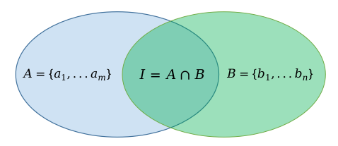

## 纵向联邦学习

现在我们介绍另一种联邦学习算法：纵向联邦学习（Vertical Federated Learning）。纵向联邦学习的参与方拥有相同样本空间、不同特征空间的数据，通过共有样本数据进行安全联合建模，在金融、广告等领域拥有广泛的应用场景。和横向联邦学习相比，纵向联邦学习的参与方之间需要协同完成数据求交集、模型联合训练和模型联合推理。并且，参与方越多，纵向联邦学习系统的复杂度就越高。

下面以企业A和企业B两方为例来介绍纵向联邦学习的基本架构和流程。假设企业A有特征数据和标签数据，可以独立建模；企业B有特征数据，缺乏标签数据，因此无法独立建模。由于隐私法规和行业规范等原因，两个企业之间的数据无法直接互通。企业A和企业B可采用纵向联邦学习解决方案进行合作，数据不出本地，使用双方共同样本数据进行联合建模和训练。最终双方都能获得一个更强大的模型。

### 纵向联邦架构

:width:`800px`
:label:`federated-learning-vfl-arch`

纵向联邦学习系统中的模型训练一般分为如下阶段：
- 样本对齐：首先对齐企业A和企业B中具有相同ID（Identification）的样本数据。在数据对齐阶段，系统会采用加密算法对数据进行保护，确保任何一方的用户数据不会暴露。
- 联合训练：在确定企业A和企业B共有用户数据后，可以使用这些共有的数据来协同训练一个业务模型。模型训练过程中，模型参数信息以加密方式进行传递。已训练好的联邦学习模型可以部署在联邦学习系统的各参与方。

### 样本对齐

隐私集合求交（Private Set Intersection，PSI）技术是纵向联邦学习中数据样本对齐的常用解决方案。业界PSI实现方案有多种：基于电路、基于公钥加密、基于不经意传输协议和基于全同态加密等。不同PSI方案各有优劣势。例如，基于公钥加密方案不需要辅助服务器运行，但公钥加密的计算开销大；而基于不经意传输方案计算性能高，但通信开销较大。因此在具体应用时，要根据实际场景来选择功能、性能和安全之间的最佳平衡方案。

基于RSA盲签名是一种基于公钥加密的经典PSI方法，也是当前业界纵向联邦学习系统中广泛应用的技术之一。下面以企业A和企业B为例描述RSA盲签名算法的基本流程。

:width:`600px`
:label:`federated-learning-vfl-data`

企业A作为服务端，拥有一个包含了标签数据+样本ID的集合。企业B则作为客户端，拥有样本ID集合。首先，企业A利用RSA算法生成私钥和公钥。其中，私钥保留在服务端，公钥则发送给企业B。

服务端利用RSA算法计算出参与样本对齐的ID的签名：
$$t_j=H^{'}(K_{a:j})$$
其中，$K_{a:j}=(H(a_j))^d \ mod \ n$，是采用私钥$d$加密的对$H(a_j)$的RSA加密的结果。$H()$和$H^{'}()$是哈希函数。

_同样，在客户端侧对样本ID进行公钥加密，并乘以一个随机数$R_{b,i}$用于加盲扰动：
$$y_i=H(b_i)\cdot(R_{b,i})^e \ mod \ n$$
客户端侧将上述计算出来的$\{y_1,...,y_v\}$值传输给服务端侧。服务端侧收到$y_i$值后，使用私钥$d$进行签名并计算：
$$y_i^{'}=y_i^d \ mod \ n$$
然后将计算出的$\{y_1^{'},...,y_v^{'}\}$和$\{t_1,...,t_w\}$发送给客户端侧。
而客户端侧收到$y_i^{'}$和$t_j$后，首先完成去盲操作：
$$K_{b:i}={y_i}^{'}/R_{b,i}$$
并将自己的ID签名与服务端发过来的ID签名进行样本对齐，得到加密和哈希组合状态下的ID交集$I$，
$${t_i}^{'}=H^{'}(K_{b:i}) \\I=\{t_1,...,t_w\}\cap \{{t_1}^{'},...,{t_v}^{'}\}$$

最后，将对齐后的样本ID交集$I$发送给服务端，服务端利用自身的映射表单独求取明文结果。这样企业A和企业B在加密状态下完成了求取相交的用户集合，并且在整个过程中双方非重叠样本ID都不会对外暴露。

### 联合训练

在样本ID对齐后，开发人员就可以使用这些公共的数据来建立机器学习模型。

目前，线性回归、决策树和神经网络等模型已经被广泛应用到纵向联邦学习系统中。在纵向联邦学习的模型训练过程中，一般会引入第三方协作者C来实现中心服务器功能，并且假设这个第三方协作者C是可信的，不会与其他参与方合谋。中心服务器在训练过程中作为中立方，产生和分发密钥，并对加密数据进行解密和计算。但中心服务器角色是非必须的，例如在两方联邦学习的场景下，不需要第三方协作者C来协调双方的训练任务，可以由具有标签数据的企业A来充当中心服务器的角色。不失一般性，下面继续以包含第三方协作者C的方案来描述纵向联邦学习模型联合训练过程。

:width:`800px`
:label:`federated-learning-vfl-train`

- 第一步：由第三方协作者C创建密钥对，将公钥发送给企业A和B。
- 第二步：在企业A和B侧分别计算梯度和损失计算需要的中间结果，并进行加密和交换。
- 第三步：企业A和B分别计算加密梯度和添加掩码。同时企业A还将计算加密损失值。计算完成后，企业A和B向第三方协作者C发送加密后的值。
- 第四步：第三方协作者C对梯度和损失值解密，然后将结果发送回企业A和B。
- 第五步：企业A和B将收到的值首先去除梯度上的掩码，然后更新本地模型参数。

在整个训练过程中，企业A和B之间的任何敏感数据都是经过加密算法加密之后再发出的各自的信任域。同态加密（Homomorphic Encryption，HE）是业界联邦学习框架常用的算法之一。同态加密是指加密过后的两份数据进行某些运算之后直接解密，可以得到真实数据经过相同运算的结果。当这种运算是加法时，就称为加法同态加密。将加密函数记为$[[\cdot]]$。
