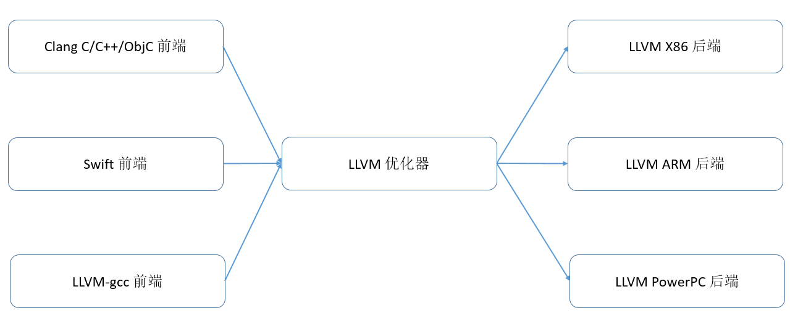
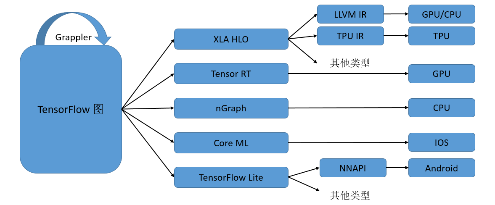
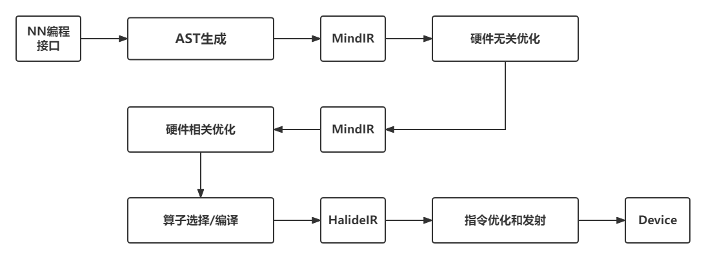

AI编译器设计原理
----

无论是传统编译器还是AI编译器，它们的输入均为用户的编程代码，输出也机器执行的高效代码。进阶篇将用两个章节详细介绍AI编译器，里面的很多概念借用了通用编译器中的概念，如AOT（Ahead of Time提前编译）、JIT（Just in time 即时）、IR（Intermediate Representation中间表示）、PASS优化、AST（Abstract Trees）、副作用、闭包等概念，和编译器教材中对应概念的定义相同，对编译器相关概念感兴趣的读者可以翻阅相关的编译原理教材，本书会将讨论重点放在机器学习编译器相较于传统编译器的独特设计与功能上。

AI编译器的设计受到了主流编译器（如LLVM）的影响。为了方便理解AI编译器，首先通过 :numref:`LLVM_basic_struc`展示LLVM编译器的架构。

:width:`800px`
:label:`LLVM_basic_struc`

LLVM包含了前端、IR和后端三个部分。前端将高级语言转换成IR，后端将IR转换成目标硬件上的机器指令，IR作为桥梁在前后端之间进行基于IR的各种优化。这样无论是新增硬件的支持，还是新增前端的支持，都可以尽可能地复用IR相关的部分。IR可以是单层的，也可以是多层的， LLVM IR是典型的单层IR，其前后端优化都基于相同的LLVM IR进行。 

AI编译器一般采用多层级IR设计。 :numref:`TF_multi_ir`展示了TensorFlow利用MLIR实现多层IR设计的例子（被称为TensorFlow-MLIR）。其包含了三个层次的IR，即TensorFlow Graph IR， XLA（Accelerated Linear Algebra，加速线性代数）、HLO（High Level Operations，高级运算）以及特定硬件的LLVM IR 或者TPU IR，下面就不同的层级IR和其上的编译优化做一个简要介绍。

:width:`800px`
:label:`TF_multi_ir`

计算图中涉及的编译优化一般称为图编译优化。Graph IR主要实现整图级别的优化和操作，如图优化、图切分等，比较适合静态图的执行模式。由于整图级别的IR缺少相应的硬件信息，难以进行硬件相关的优化，所以在中间层次就出现了硬件相关的通用编译优化，比如XLA、Tensor RT、MindSpore的图算融合等，它们能够针对不同的硬件进行算子融合等优化，提升不同网络在特定硬件上的执行性能。
本书“编译器后端”章节的硬件通用优化中有一个小节专门介绍图算融合编译器的相关设计。
最后一个层次的IR是特定硬件加速器专有的IR，一般由硬件厂商自带的编译器提供，如Ascend硬件自带的TBE编译器就是基于TVM的Halide IR生成高效的执行算子。

多层级IR的优势是IR表达上更加地灵活，可以在不同层级的IR上进行合适的PASS优化，更加便捷和高效。
但是多层级IR也存在一些劣势。首先，多层级IR需要进行不同IR之间的转换，而IR转换要做到完全兼容是非常困难的，工程工作量很大，还可能带来信息的损失。上一层IR优化掉某些信息之后，下一层需要考虑其影响，因此IR转换对优化执行的顺序有着更强的约束。其次，多层级IR有些优化既可以在上一层IR进行，也可以在下一层IR进行，让框架开发者很难选择。最后，不同层级IR定义的算子粒度大小不同，可能会给精度带来一定的影响。为了解决这一问题，机器学习框架如MindSpore采用统一的IR设计（MindIR）。 :numref:`MS_Compiler`展示了MindSpore的AI编译器内部的运行流程。其中，编译器前端主要指图编译和硬件无关的优化，编译器后端主要指硬件相关优化、算子选择等。

:width:`800px`
:label:`MS_Compiler`