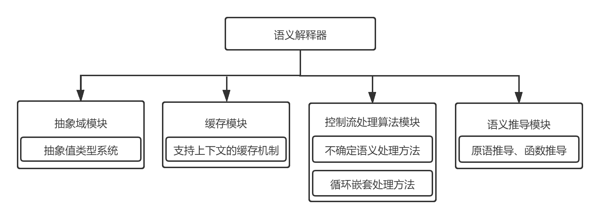

类型系统和静态分析
------------------

上一章节介绍了自动微分的基本概念和实现方法，自动微分是机器学习框架中不可或缺的核心功能。在编译器前端的设计中，为了提高编译器的抽象能力和程序运行的正确性，有效减少程序在运行时可能出现的错误，编译器引入了类型系统和静态分析系统，接下来将对它们的基本概念、主要功能、常见系统进行介绍。

### 类型系统概述

程序设计语言中，类型是指数值、表达式、函数等属性内容。类型系统是指类型的集合以及使用类型来规定程序行为的规则。类型系统用于定义不同的类型，指定类型的操作和类型之间的相互作用，广泛应用于编译器、解释器和静态检查工具中。类型系统提供的主要功能有：

1）正确性。编译器的类型系统引入了类型检查技术，用于检测和避免运行时错误，确保程序运行时的安全性。通过类型推导与检查，编译器能够捕获大多数类型相关的异常报错，避免执行病态程序导致运行时错误，保证内存安全，避免类型间的无效计算和语义上的逻辑错误。

2）优化。静态类型检查可以提供有用的信息给编译器，从而使得编译器可以应用更有效的指令，节省运行时的时间。

3）抽象。在安全的前提下，一个强大的类型系统的标准是抽象能力。通过合理设计抽象，开发者可以更关注更高层次的设计。

4）可读性。阅读代码时，明确的类型声明有助于理解程序代码。

机器学习框架一般使用Python语言作为描述网络模型结构的前端语言。Python语言是一门动态强类型的语言，入门简单易学习，开发代码简洁高效，但由于其解释执行的方式，运行速度往往较慢。Python前端语言给用户带来了动态灵活的语义和高效的开发效率，但是若想要生成运行高效的后端代码，后端框架需要优化友好的静态强类型中间表示。因此，需要一种高效可靠的静态分析方法作为桥梁，将Python前端表示转换成等价的静态强类型中间表示，以此给用户同时带来高效的开发效率和运行效率，例如Hindley--Milner（HM）类型系统。这是一种具有参数多态性的简单类型lambda演算的类型系统。它最初由J.
Roger Hindley 提出 :cite:`1969The`，并由Robin Milner
进行扩展和验证 :cite:`1978A` 。后来，路易斯·达马斯（Luis
Damas）对HM类型推导方法进行了详尽的分析和证明 :cite:`1982Principal`，并将其扩展到支持具有多态引用的系统。Hindley--Milner类型系统的目标是在没有给定类型注解的情况下，自动推导出任意表达式的类型。其算法具有抽象性和通用性，采用简洁的符号表示，能够根据表达式形式推导出明确直观的定义，常用于类型推导和类型检查。因此，Hindley--Milner类型系统广泛应用于编程语言设计中，比如Haskell和Ocaml。

### 静态分析概述

在设计好类型系统后，编译器需要使用静态分析系统来对中间表示进行静态检查与分析。语法解析模块（parser）将程序代码解析为抽象语法树（AST）并生成中间表示。此时的中间表示缺少类型系统中定义的抽象信息，因此引入静态分析模块，对中间表示进行处理分析，并且生成一个静态强类型的中间表示，用于后续的编译优化、自动并行以及自动微分等。在编译器前端的编译过程中，静态分析可能会被执行多次，有些框架还会通过静态分析的结果判断是否终止编译优化。

静态分析模块基于抽象释义对中间表示进行类型推导、常量传播、泛型特化等操作，这些专业术语的含义分别为：

抽象释义：通过抽象解释器将语言的实际语义近似为抽象语义，只获取后续优化需要的属性，进行不确定性的解释执行。抽象值一般包括变量的类型和维度。

类型推导：在抽象释义的基础上，编译器推断出程序中变量或表达式的抽象类型，方便后续利用类型信息进行编译优化。

泛型特化：泛型特化的前提是编译器在编译期间可以进行类型推导，提供类型的上下文。在编译期间，编译器通过类型推导确定调用函数函数时的类型，然后，编译器会通过泛型特化，进行类型取代，为每个类型生成一个对应的函数方法。

接下来以MindSpore框架为例，简要介绍一下静态分析模块的具体实现。MindSpore采用抽象释义的方法，对抽象值做不确定的抽象语义的解释执行，函数图中每个节点的抽象值是所期望得到的程序静态信息。基本的抽象释义方法流程可以理解为，从MindIR的顶层函数图入口开始解释执行，将函数图中所有节点进行拓扑排序，根据节点的语义递归推导各节点的抽象值。当遇到函数子图时，递归进入函数子图进行解释执行，最后返回顶层函数输出节点的抽象值。根据抽象释义方法流程，MindSpore的静态分析模块主要分为抽象域模块、缓存模块、语义推导模块和控制流处理模块。

:width:`850px`
:label:`static_analysis_module`
