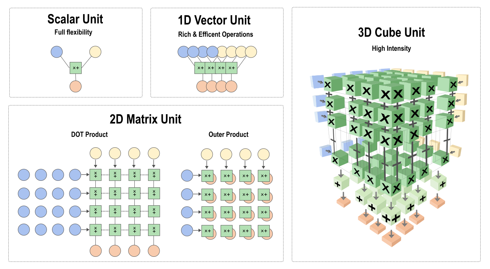
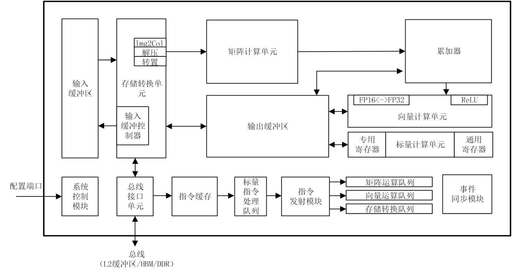

加速器基本组成原理
------------------

上节主要介绍了加速器的意义以及设计思路，了解到加速器与通用处理器在设计上的区别，因此加速器的硬件结构与CPU的硬件结构有着根本的不同，通常都是由多种片上缓存以及多种运算单元组成。本章节主要通过GPU的Volta架构作为样例进行介绍。

### 硬件加速器的架构

现代GPU在十分有限的面积上实现了极强的计算能力和极高的储存器以及IO带宽。一块高端的GPU中，晶体管数量已经达到主流CPU的两倍，而且显存已经达到了16GB以上,工作频率也达到了1GHz。GPU的体系架构由两部分组成，分别是流处理阵列和存储器系统，两部分通过一个片上互联网络连接。流处理器阵列和存储器系统都可以单独扩展，规格可以根据产品的市场定位单独裁剪。如GV100的组成如 :numref:`gv100`所示：


:width:`800px`
:label:`gv100`

-   6个GPU处理集群（GPU Processing Cluster，GPC）, 每个GPC含有：
    -   7个纹理处理集群（Texture Processing Cluster, TPC） (每个TPC含有两个流多处理器（Streaming Multiprocessor, SM）)
    -   14个SM
-   84个SM, 每个流多处理器含有：
    -   64个32位浮点运算单元
    -   64个32位整数运算单元
    -   32个64位浮点运算单元
    -   8个张量核
    -   4个纹理单元
-   8个512-bit内存控制器

一个完整的GV100 GPU含有84个SM，5376个32位浮点运算单元，5376个32位整型运算单元，2688个64位浮点运算单元，672个张量运算单元和336个纹理单元。一对内存控制器控制一个HBM2 DRAM堆栈。图 :numref:`gv100`中展示的为带有84个SM的GV100 GPU(不同的厂商可以使用不同的配置)，Tesla V100则含有80个SM。

### 硬件加速器的存储单元

与传统的CPU模型相似，从一个计算机系统主内存DRAM中获取数据的速度相对于处理器的运算速度较慢。对于加速器而言，如果没有缓存进行快速存取，DRAM的带宽非常不足。如果无法快速的在DRAM上获取程序和数据，加速器将因空置而降低利用率。为了缓解DRAM的带宽问题，GPU提供了不同层次的若干区域供程序员存放数据，每块区域的内存都有自己的最大带宽以及延迟。

-   **寄存器文件（Register File）**：片上最快的存储器，但与CPU不同，GPU的每个SM（流多处理器）有上万个寄存器。但当每个线程使用过多的寄存器时，SM中能够调度的线程块数量就会受到限制，可执行的线程总数量会因此受到限制，可执行的线程数量过少会造成硬件无法充分的利用，性能急剧下降。所以要根据算法的需求合理使用寄存器。

-   **共享内存（Shared Memory）**：共享内存实际上是用户可控的一级缓存，每个SM（流多处理器）中有128KB的一级缓存, 开发者可根据应用程序需要配置最大96KB的一级缓存作为共享内存。共享内存的延迟极低，只有几十个时钟周期，几乎与寄存器相当。共享内存具有高达1.5TB/s的带宽，远远高于全局内存的峰值带宽900GB/s。所以说，共享内存的使用对于一个高性能计算工程师来说是一个必须要掌握的一个概念。

-   **全局内存（Global Memory）**：全局内存之所以称为全局，是因为GPU与CPU都可以对它进行读写操作。全局内存对于GPU中的每个线程都是可见的，都可以直接对全局内存进行读写操作。CPU等其他设备可以通过PCI-E总线对其进行读写操作。全局内存也是GPU中容量最大的一块内存，可达16GB之多。同时也是延迟最大的内存，

-   **常量内存（Constant Memory）**：常量内存其实只是全局内存的一种虚拟地址形式，并没有真正的物理硬件内存块。常量内存有两个特性，一个高速缓存，另一个更重要的特性是它支持将某个单个值广播到线程束中的每个线程中。

-   **纹理内存（Texture Memory）**：纹理内存是全局内存的一个特殊形态。当全局内存被绑定为纹理内存时，执行读写操作将通过专用的纹理缓存来加速。在早期的GPU上没有缓存，因此每个SM（流多处理器）上的纹理内存为设备提供了唯一真正缓存数据的方法。然而随着硬件的升级，一级缓存和二级缓存的出现，纹理缓存的这项优势已经荡然无存。纹理内存的另外一个特性，也是最有用的特性就是当访问存储单元时，允许GPU实现硬件相关的操作。比如说使用纹理内存，可以通过归一化的地址对数组进行访问，获取的数据可以通过硬件进行自动插值，从而达到快速处理数据的目的。此外对于二位数组和三维数组，支持硬件级的双线性插值与三线性插值。纹理内存另一个实用的特性是可以根据数组的索引自动处理边界条件，不需要对特殊边缘进行处理即可完成数组内元素操作，从而防止线程中分支的产生。

由于寄存器的高速读取特性，因此每次计算都离不开寄存器的参与。接着是一级缓存和共享内存，然后是常量内存、纹理内存、全局内存，最后则是主机端内存。根据不同存储器之间的存储速度的数量级的变化规律，选用适当类型的内存以及最大化地利用它们，从而发挥硬件的最大算力，减少计算时间。

### 硬件加速器的计算单元
:label:`compute-unit-title`

为了支持不同的神经网络模型，加速器会提供以下几种计算单元，不同的网络层可以根据需要选择使用对应的计算单元。如图 :numref:`compute-unit`所示

-   **标量计算单元**：与标准的精简指令运算集（Reduced Instruction Set Computer，RISC）相似，一次计算一个标量元素。

-   **一维向量计算单元**：一次可以完成多个元素的计算，与传统的CPU和GPU架构中单指令多数据（SIMD）相似,已广泛应用于高性能计算（High Performance Computing，HPC）和信号处理中。

-   **二维向量计算单元**：一次运算可以完成一个矩阵与向量的内积，或向量的外积。利用数据重复使用这一特性，降低数据通信成本与存储空间，更高效的提高矩阵乘法性能。

-   **三维向量计算单元**：一次完成一个矩阵的乘法，专为神经网络应用设计的计算单元，更充分利用数据重复特性，隐藏数据通信带宽与数据计算的差距。


:width:`800px`
:label:`compute-unit`

GPU计算单元主要由标量计算单元和三维向量计算单元组成。如图 :numref:`SM`所示,对于每个SM，其中64个32位浮点运算单元、64个32位整数运算单元、32个64位浮点运算单元均为标量计算单元。而8个张量核则是专为神经网络应用设计的三维向量计算单元。


:width:`800px`
:label:`SM`

张量核（Tensor Core）每个时钟周期完成一次$4\times4$的矩阵乘累加计算,如图 :numref:`tensorcore`：

```
    D = A * B + C
```


:width:`800px`
:label:`tensorcore`

其中A,B,C和D都是$4\times4$的矩阵，矩阵乘累加的输入矩阵A和B是FP16的矩阵，累加矩阵C和D可以是FP16也可以是FP32。 V100的张量核是可编程的矩阵乘法和累加计算单元，可以提供多达125 Tensor TFLOPS(Tera Floating-point Operations Per Second)的训练和推理应用。相比于普通的FP32计算单元可以提速10倍以上。

### DSA芯片架构

为了满足飞速发展的深度神经网络对芯片算力的需求，业界也纷纷推出了特定领域架构DSA芯片设计。以华为公司昇腾系列AI处理器为例，本质上是一个片上系统（System on Chip，SoC），主要应用在图像、视频、语音、文字处理相关的场景。主要的架构组成部件包括特制的计算单元、大容量的存储单元和相应的控制单元。该芯片由以下几个部分构成：芯片系统控制CPU（Control CPU），AI计算引擎（包括AI Core和AI CPU），多层级的片上系统缓存（Cache）或缓冲区（Buffer），数字视觉预处理模块（Digital Vision Pre-Processing，DVPP）等。


:width:`800px`
:label:`davinci_architecture`

昇腾AI芯片的计算核心主要由AI Core构成，负责执行标量、向量和张量相关的计算密集型算子。AI Core采用了达芬奇架构，基本结构如图 :numref:`davinci_architecture`所示，从控制上可以看成是一个相对简化的现代微处理器基本架构。它包括了三种基础计算单元：矩阵计算单元（Cube Unit）、向量计算单元（Vector Unit）和标量计算单元（Scalar Unit）。这三种计算单元分别对应了张量、向量和标量三种常见的计算模式，在实际的计算过程中各司其职，形成了三条独立的执行流水线，在系统软件的统一调度下互相配合达到优化计算效率的目的。 同GPU类似，在矩阵乘加速设计上，在AICore中也提供了矩阵计算单元作为昇腾AI芯片的核心计算模块，意图高效解决矩阵计算的瓶颈问题。矩阵计算单元提供强大的并行乘加计算能力，可以用一条指令完成两个$16\times16$矩阵的相乘运算，等同于在极短时间内进行了$16\times16\times16=4096$个乘加运算，并且可以实现FP16的运算精度。
