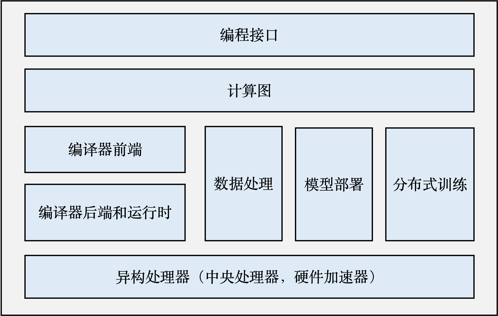

## 机器学习框架的基本组成原理

一个完整的机器学习框架一般具有如图 :numref:`framework-architecture`  所示的基本架构。

:width:`600px`
:label:`framework-architecture`

-   **编程接口:** 
    考虑到机器学习开发人员背景的多样性，机器学习框架首先需要提供以高层次编程语言（如Python）为主的编程接口。同时，机器学习框架为了优化运行性能，需要支持以低层次编程语言（如C和C++）为主的系统实现，从而实现操作系统（如线程管理和网络通讯等）和各类型硬件加速器的高效使用。

-   **计算图：**
    利用不同编程接口实现的机器学习程序需要共享一个运行后端。实现这一后端的关键技术是计算图技术。计算图定义了用户的机器学习程序，其包含大量表达计算操作的图节点、图节点之间的边表达计算依赖关系。

-   **编译器前端：**
    机器学习框架往往具有AI编译器来构建计算图，并将计算图转换为硬件可以执行的程序。这个编译器首先会利用一系列编译器前端技术实现对程序的分析和优化。编译器前端的关键功能包括实现中间表示、自动微分、类型推导和静态分析等。

-   **编译器后端和运行时：**
    完成计算图的分析和优化后，机器学习框架进一步利用编译器后端和运行时实现针对不同底层硬件的优化。常见的优化技术包括分析硬件的L2/L3缓存大小和指令流水线长度，优化算子的选择或者调度顺序。

-   **异构处理器：**
    机器学习应用的执行由中央处理器（Central Processing Unit，CPU）和硬件加速器（如英伟达GPU、华为Ascend和谷歌TPU）共同完成。其中，非矩阵操作（如复杂的数据预处理和计算图的调度执行）由中央处理器完成。矩阵操作和部分频繁使用的机器学习算子（如Transformer算子和Convolution算子）由硬件加速器完成。

-   **数据处理：**
    机器学习应用需要对原始数据进行复杂预处理，同时也需要管理大量的训练数据集、验证数据集和测试数据集。这一系列以数据为核心的操作由数据处理模块（例如TensorFlow的tf.data和PyTorch的DataLoader）完成。

-   **模型部署：**
    在完成模型训练后，机器学习框架下一个需要支持的关键功能是模型部署。为了确保模型可以在内存有限的硬件上执行，会使用模型转换、量化、蒸馏等模型压缩技术。同时，也需要实现针对推理硬件平台（例如英伟达Orin）的模型算子优化。最后，为了保证模型的安全（如拒绝未经授权的用户读取），还会对模型进行混淆设计。

-   **分布式训练：**
    机器学习模型的训练往往需要分布式的计算节点并行完成。其中，常见的并行训练方法包括数据并行、模型并行、混合并行和流水线并行。这些并行训练方法通常由远端程序调用（Remote Procedure Call, RPC）、集合通信（Collective Communication）或者参数服务器（Parameter Server）实现。