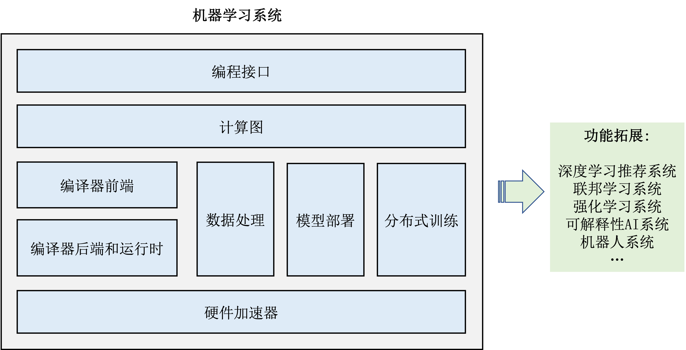

## 机器学习系统基本组成

一个现代的机器学习系统往往具有如 :numref:`framework_architecture`所示的基本架构。

:width:`600px`
:label:`framework_architecture`

-   **编程接口:** 为了支持广泛的开发者，机器学习框架的编程接口（Programming
    interface）不仅仅需要多样的高层次编程函数（例如，Python，Julia和Java），同时也需要支持高性能编程（利用C和C++函数调用操作系统和硬件加速器）。

-   **计算图：**
    利用不同编程接口实现的机器学习应用需要共享一个执行后端。实现这一后端的关键技术是：应用无关的计算图（Computational
    graph）。计算图包含计算节点，节点之间的边表达计算依赖。计算图可以被同步和异步执行。

-   **编译器前端：**
    给定一个计算图，机器学习框架会对计算图做一系列优化。和硬件无关的优化由编译器前端实现。编译器前端实现包括：中间表达（Intermediate
    Representation），自动微分，类型推导和静态分析等等。

-   **编译器后端和运行时：**
    机器学习框架利用编译器后端对计算图可以进一步针对硬件的特性（例如说，L2/L3大小，指令流水线长度）进行性能优化。最终优化后的计算图通过运行时执行在通用处理器（CPU）或者是硬件加速器之上。运行时需要实现算子选择和内存分配等技术。

-   **硬件加速器：**
    现代硬件加速器提供了丰富的编程接口让应用来优化其相关性能。在本书中，我们将会介绍硬件加速器的基本组成原理和编程接口。我们同时会给出一个完整的硬件加速器使用案例来从0到1讲述高效加速器程序的编写。

-   **数据处理：**
    对于数据读取，存储和预处理的功能由数据处理模块（例如，TensorFlow的tf.data和PyTorch的DataLoader）完成。数据处理模块需要针对机器学习应用实现易用性，保序性和高效性等设计目标。

-   **模型部署：**
    在模型完成训练后，下一个常用的系统模块是：模型部署工具。为了确保模型可以被广泛的硬件设备执行，我们往往会使用模型转换，量化，蒸馏等模型压缩技术。同时，针对推理硬件，我们也需要实现特定硬件优化。最后，为了保证模型的安全（不被黑客窃取），实践者还会对模型进行混淆设计。

-   **分布式训练：**
    分布式训练日渐成为一个现代机器学习框架的核心组件。本书将介绍各类型分布式训练的方法（数据并行，模型并行，混合并行和流水线并行）。同时我们会深入介绍这些方法的高效系统实现（包括集合通讯库和参数服务器）。

-   **拓展模块：** 
    机器学习系统的广泛部署使得许多的扩展模块陆续出现。本书将会介绍得到大量实践部署的：深度学习推荐系统，联邦学习系统，强化学习系统，可解释性AI系统和机器人系统。

另外，机器学习算法相关的理论知识是本书的预备知识，本书不做深入讨论。基础的机器学习理论知识可以在附录中找到。