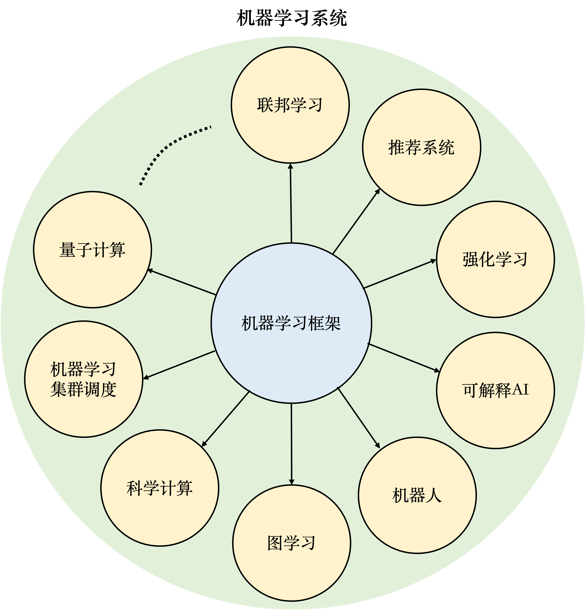

## 机器学习系统生态

以机器学习框架为核心，人工智能社区创造出了庞大的**机器学习系统**生态。广义来说，机器学习系统是指实现和支持机器学习应用的各类型软硬件系统的泛称。图 :numref:`system-ecosystem` 总结了各类型的机器学习系统。

:width:`600px`
:label:`system-ecosystem`

-   **联邦学习：** 
    随着用户隐私保护和数据保护法的出现，许多机器学习应用无法直接接触用户数据完成模型训练。因此这一类应用需要通过机器学习框架实现联邦学习（Federated Learning）。

-   **推荐系统：**
    将机器学习（特别是深度学习）引入推荐系统在过去数年取得了巨大的成功。相比于传统基于规则的推荐系统，深度学习推荐系统能够有效分析用户的海量特征数据，从而实现在推荐准确度和推荐时效性上的巨大提升。

-   **强化学习：**
    强化学习具有数据收集和模型训练方法的特殊性。因此，需要基于机器学习框架进一步开发专用的强化学习系统。

-   **可解释AI：**
    随着机器学习在金融、医疗和政府治理等关键领域的推广，基于机器学习框架进一步开发的可解释性AI系统正得到日益增长的重视。

-   **机器人：**
    机器人是另一个开始广泛使用机器学习框架的领域。相比于传统的机器人视觉方法，机器学习方法在特征自动提取、目标识别、路径规划等多个机器人任务中获得了巨大成功。

-   **图学习：**
    图（Graph）是最广泛使用的数据结构。许多互联网数据（如社交网络、产品关系图）都由图来表达。机器学习算法已经被证明是行之有效的分析大型图数据的方法。这种针对图数据的机器学习系统被称之为图学习系统（Graph Learning System）。

-   **科学计算：**
    科学计算覆盖许多传统领域（如电磁仿真、图形学、天气预报等），这些领域中的许多大规模问题都可以有效利用机器学习方法求解。因此，针对科学计算开发机器学习系统变得日益普遍。

-   **机器学习集群调度：**
    机器学习集群一般由异构处理器、异构网络甚至异构存储设备构成。同时，机器学习集群中的计算任务往往具有共同的执行特点（如基于集合通信算子AllReduce迭代进行）。因此，针对异构设备和任务特点，机器学习集群往往具有特定的调度方法设计。

-   **量子计算：**
    量子计算机一般通过混合架构实现。其中，量子计算由量子计算机完成，而量子仿真由传统计算机完成。由于量子仿真往往涉及到大量矩阵计算，许多量子仿真系统（如TensorFlow Quantum和MindQuantum）都基于机器学习框架实现。 

本书受限于篇幅，将不会对所有机器学习系统进行深入讲解。目前，本书会从系统设计者的角度出发，对应用在联邦学习、推荐系统、强化学习、可解释AI和机器人中的相关核心系统进行讲解。
