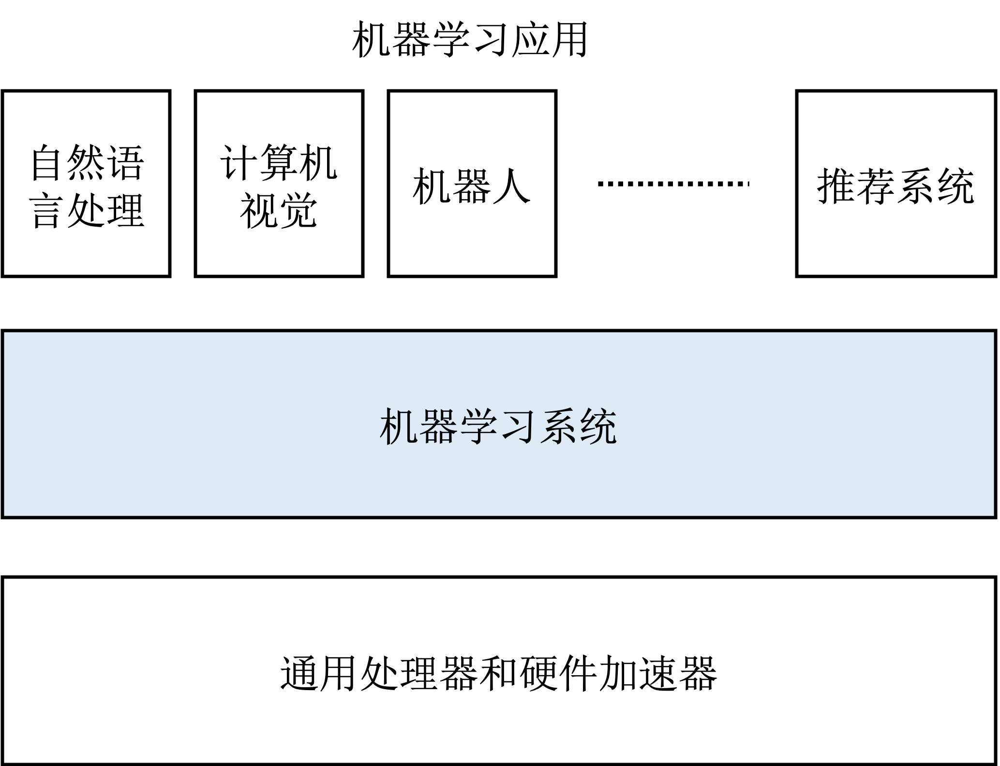

## 设计目标

:width:`600px`
:label:`framework_position`

开发者需要设计和实现机器学习系统来满足以下目标（如 :numref:`framework_position`所示）：

-   **支持多种神经网络：**
    深度学习的巨大成功使得神经网络成为了机器学习应用的核心。不同应用需要不同的神经网络，例如，卷积神经网络（Convolutional
    Neural Networks），图神经网络（Graph Neural
    Networks），自注意力神经网络（Self-Attention Neural
    Networks）等。这些神经网络需要一个共同的系统软件来进行开发和运行。

-   **支持自动微分：**
    为了训练神经网络，我们需要利用数据、标注（Label）和目标损失函数（Loss
    Function）来计算梯度（Gradients）。因此，机器学习系统需要有一个通用的方法来**自动化**计算梯度（这一过程被称之为自动微分）。

-   **支持数据管理和处理：**
    机器学习的核心是数据。这些数据包括训练、评估、测试数据集和模型参数。因此，我们需要系统本身支持数据读取、存储和预处理（例如，数据增强和数据清洗）。

-   **支持模型的训练和部署：**
    为了让机器学习模型达到最佳的性能，人们需要使用优化方法（例如，Mini-Batch
    SGD）来通过多步迭代反复计算梯度（这一过程称之为训练）。训练完成后，系统需要将训练好的模型部署推理设备。

-   **高效使用硬件加速器：**
    神经网络的相关计算往往通过矩阵计算实现。这一类计算可以被硬件加速器（例如，通用图形处理器-GPU）加速。因此，机器学习系统需要高效利用多种硬件加速器。

-   **分布式计算：**
    随着训练数据量和神经网络参数量的上升，机器学习系统的内存用量远远超过了单个机器可以提供的内存。因此，机器学习框架需要天然具备分布式执行的能力。

在设计机器学习系统之初，开发者曾尝试拓展**神经网络开发库**（如Theano和Caffe）和**大数据计算框架**（如Apache
Spark和Google
Pregel）来达到以上目标。可是他们发现（如 :numref:`comparison_of_ml_frameworks`所示），
神经网络库虽然提供了神经网络开发、自动微分和硬件加速器的支持，但是其缺乏管理和处理大型数据集、模型部署和分布式执行的能力，无法满足产品级机器学习应用的开发任务。
另一方面，虽然大数据计算框架具有成熟的分布式执行和数据管理能力，但是其缺乏对神经网络、自动微分和加速器的支持，使得其并不适合开发以神经网络为核心的机器学习应用。因此，业界设计出了包括MindSpore、PaddlePaddle、TensorFlow，PyTorch等一系列新型机器学习系统（框架）。

:机器学习框架和相关系统的比较

|              | 神经网络 | 自动微分 | 数据管理 | 训练和部署 | 加速器 | 分布式 |
|:-: |:-:| :-: |:-:|:-: |:-:|:-:|
| 神经网络库 | 是      | 是      | 否            | 否        | 是    | 否    |
| 大数据框架 | 否      | 否      | 是            | 否        | 否    | 是    |
| 机器学习框架 | 是      | 是      | 是            | 是        | 是    | 是    |
:label:`comparison_of_ml_frameworks`