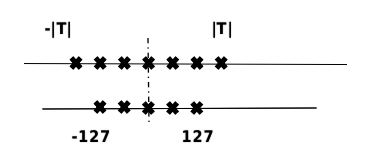

## 模型压缩
:label:`ch08-sec-model_compression`

在上一小节中，我们简要介绍了模型转换的目的，并重点讲述了模型部署时的一些常用的模型优化手段。考虑到不同场景的硬件对模型的要求不同，比如部署在手机上，对于模型的大小比较敏感，一般在兆级别。因此，对于一些较大的模型，我们往往需要通过一些模型压缩的技术，使其能满足不同计算硬件的要求。

### 量化

模型量化是指以较低的推理精度损失将连续取值（通常为FP32或者大量可能的离散值）的浮点型权重或者通过各个算子的数据定点近似（通常为INT8）为有限多个离散值的过程，如 :numref:`ch08-fig-quant_minmax`，T是量化前的数据范围。通过以更少的位数表示浮点数据，模型量化可以减少模型尺寸，进而减少在推理时的内存消耗，并且在一些低精度运算较快的处理器上可以增加推理速度。

:width:`300px`
:label:`ch08-fig-quant_minmax`

计算机中不同数据类型的占用比特数及其表示的数据范围各不相同。可以根据实际业务需求将原模型量化成不同比特数的模型，一般深度神经网络的模型用单精度浮点数表示，如果能用有符号整数来近似原模型的参数，那么被量化的权重参数存储大小就可以降到原先的四分之一，用来量化的比特数越少，量化后的模型压缩率越高。工业界目前最常用的量化位数是8比特，低于8比特的量化被称为低比特量化。1比特是模型压缩的极限，可以将模型压缩为1/32，在推理时也可以使用高效的XNOR和BitCount位运算来提升推理速度。

另外，根据量化数据表示的原始数据范围是否均匀，还可以将量化方法分为线性量化和非线性量化。实际的深度神经网络的权重和激活值通常是不均匀的，因此理论上使用非线性量化能够达到更高的精度，但在实际推理中非线性量化的计算复杂度较高，通常使用线性量化。下面着重介绍线性量化的原理。

假设r表示量化前的浮点数，量化后的整数q可以表示为：

$$q=clip(round(\frac{r}{s}+z),q_{min},q_{max})$$

$round(\cdot)$和$clip(\cdot)$分别表示取整和截断操作，$q_{min}$和$q_{max}$是量化后的最小值和最大值。$s$是数据量化的间隔，$z$是表示数据偏移的偏置，$z$为0的量化被称为对称（Symmetric）量化，不为0的量化称为非对称（Asymmetric）量化。对称量化可以避免量化算子在推理中计算z相关的部分，降低推理时的计算复杂度；非对称量化可以根据实际数据的分布确定最小值和最小值，可以更加充分的利用量化数据信息，使得计算精度更高。

根据量化参数$s$和$z$的共享范围，量化方法可以分为逐层量化和逐通道量化。逐层量化以一层网络为量化单位，每层网络的一组量化参数；逐通道量化以一层网络的每个量化通道为单位，每个通道单独使用一组量化参数。逐通道量化由于量化粒度更细，能获得更高的量化精度，但计算也更复杂。

根据量化过程中是否需要训练，可以将模型量化分为量化感知训练（Quantization Aware Training, QAT）和训练后量化（Post Training Quantization, PTQ）两种,其中感知量化训练是指在模型训练过程中加入伪量化算子，通过训练时统计输入输出的数据范围可以提升量化后模型的精度，适用于对模型精度要求较高的场景；训练后量化指对训练后的模型直接量化，只需要少量校准数据，适用于追求高易用性和缺乏训练资源的场景。

#### 量化感知训练

量化感知训练是在训练过程中模拟量化，利用伪量化节点将量化带来的精度变化计入训练误差，使得优化器能在训练过程中尽量减少量化误差，得到更高的模型精度。量化感知训练的具体流程如下：

-   初始化：设置权重和激活值的范围$q_{min}$和$q_{max}$的初始值；

-   构建模拟量化网络：在需要量化的权重和激活值后插入伪量化节点；

-   量化训练：重复执行以下步骤直到网络收敛，计算量化网络层的权重和激活值的范围$q_{min}$和$q_{max}$，前向计算反向传播更新网络权重参数；

-   导出量化网络：获取$q_{min}$和$q_{max}$，并计算量化参数$s$和$z$；
    根据公式计算权重的量化整数值，并替换对应网络层的参数和数据类型；
    删除伪量化节点，在量化网络层前后分别插入量化和反量化算子。

#### 训练后量化

训练后量化也可以分成两种，权重量化和全量化。权重量化仅量化模型的权重以压缩模型的大小，在推理时将权重反量化为原始的FP32数据，后续推理流程与普通的FP32模型一致。权重量化的好处是不需要校准数据集，不需要实现量化算子，且模型的精度误差较小，由于实际推理使用的仍然是FP32算子，所以推理性能不会提高。全量化不仅会量化模型的权重，还会量化模型的激活值，在模型推理时执行量化算子来加快模型的推理速度。为了量化激活值，需要用户提供一定数量的校准数据集用于统计每一层激活值的分布，并对量化后的算子做校准。校准数据集可以来自训练数据集或者真实场景的输入数据，需要数量通常非常小。在做训练后量化时会以校准数据集为输入，执行推理流程然后统计每层激活值的数据分布并得到相应的量化参数，具体的操作流程如下：

-   使用直方图统计的方式得到原始FP32数据的统计分布$P_f$；

-   在给定的搜索空间中选取若干个$q_{min}$和$q_{max}$分别对激活值量化，得到量化后的数据$Q_q$；

-   使用直方图统计得到$Q_q$的统计分布;

-   计算每个$Q_q$与$P_f$的统计分布差异，并找到差异性最低的一个对应的$q_{min}$和$q_{max}$来计算相应的量化参数，常见的用于度量分布差异的指标包括KL散度(Kullback-Leibler Divergence)、对称KL散度(Symmetric Kullback-Leibler Divergence)和JS散度(Jenson-Shannon Divergence)。

除此之外，由于量化存在固有误差，还需要校正量化误差。以矩阵乘为例，$a=\sum_{i=1}^Nw_ix_i+b$，w表示权重，x表示激活值，b表示偏置。首先需要对量化的均值做校正，对fp32算子和量化算子输出的每个通道求平均，假设某个通道i的fp32算子输出均值为$a_i$，量化算子反量化输出均值为$a_{qi}$，将这个通道两个均值的差$a_i-a_q$加到对应的通道上即可使得最终的输出均值和fp32一致。另外还需要保证量化后的分布和量化前是一致的，设某个通道权重数据的均值、方差为$E(w_c)$、$||w_c-E(w_c)||$，量化后的均值和方差为$E(\hat{w_c})$、$||\hat{w_c}-E(\hat{w_c})||$，对权重做如下校正：
$$\hat{w_c}\leftarrow\zeta_c(\hat{w_c}+u_c)$$
$$u_c=E(w_c)-E(\hat{w_c})$$
$$\zeta_c=\frac{||w_c-E(w_c)||}{||\hat{w_c}-E(\hat{w_c})||}$$

量化方法作为一种通用的模型压缩方法，可以大幅提升神经网络存储和压缩的效率，已经取得了广泛的应用。

### 模型稀疏

模型稀疏是通过去除神经网络中部分组件（如权重、特征图、卷积核）降低网络的存储和计算代价，它和模型权重量化、权重共享、池化等方法一样，属于一种为达到降低模型计算复杂度的目标而引入的一种强归纳偏置。

#### 模型稀疏的动机

因为卷积神经网络中的卷积计算可以被看作输入数据和卷积核中权重的加权线性组合，所以细小的权重对输出数据就具有相对较小的影响。对模型进行稀疏操作的合理性主要来源于两方面的假设：

-   其一，针对权重参数来说，当前许多神经网络模型存在过参数化（Over-parameterized）的现象，动辄具有几千万甚至数亿规模的参数量。

-   其二，针对模型推理过程中生成的激活值特征图，对于许多检测、分类、分割等视觉任务来说激活值特征图中能利用的有效信息相对于整张图仅占较小的比例。

根据以上描述按照模型稀疏性来源的不同，主要分为权重稀疏和激活值稀疏，它们的目的都是为了减少模型当中的冗余成分来达到降低计算量和模型存储的需求。具体来说，对模型进行稀疏就是根据模型的连接强弱程度（一般根据权重或激活的绝对值大小），对一些强度较弱的连接进行剪枝（将权重参数或激活值置为0）来达到模型稀疏并提高模型推理性能的目的。特别地，我们将模型权重或激活值张量中0值所占的比例称为模型稀疏度。一般而言，模型稀疏度越高带来的模型准确率下降越大，因此我们的目标是尽可能在提高模型稀疏度的同时保证模型准确率下降较小。

实际上，如同神经网络本身的发明受到了神经生物学启发一样，神经网络模型稀疏方法同样受到了神经生物学的启发。在一些神经生物学的发现中，人类以及大多数哺乳动物的大脑都会出现一种叫做突触修剪的活动。突触修剪即神经元的轴突和树突发生衰退和完全死亡，这一活动发生在哺乳动物的婴幼儿时期，然后一直持续到成年以后。这种突触修剪机制不断简化和重构哺乳动物大脑的神经元连接，使得哺乳动物的大脑能以更低的能量获得更高效的工作方式。

#### 结构与非结构化稀疏

首先我们考虑权重稀疏，对于权重稀疏来说，按照稀疏模式的不同，主要分为结构化和非结构化稀疏。简单来讲，结构化稀疏就是在通道或者卷积核层面对模型进行剪枝。这种稀疏方式能够得到规则且规模更小的权重矩阵，因此比较适合CPU和GPU进行加速计算。但与此同时，结构化稀疏是一种粗粒度的稀疏方式，将会对模型的推理准确率造成较大的下降。

而非结构化稀疏，可以对权重张量中任意位置的权重进行裁剪，因此这种稀疏方式属于细粒度的稀疏。这种稀疏方式相对于结构化稀疏，造成的模型准确率下降较小。但是也正是因为这种不规则的稀疏方式，导致稀疏后的模型难以利用硬件获得较高的加速比。其背后原因主要有以下几点：

-   不规则排布的模型权重矩阵会带来大量的控制流指令，比如由于大量0值的存在，我们会不可避免地引入大量if-else分支判断指令，因此会降低指令层面的并行度。

-   权重矩阵的不规则内存排布会造成线程发散和负载不均衡，而不同卷积核往往是利用多线程进行计算的，因此这也影响了线程层面的并行度。

-   权重矩阵的不规则内存排布造成了较低的访存效率，因为它降低了数据的局部性以及缓存命中率。

为了解决以上非结构化稀疏带来的种种问题，近期出现的研究当中通过引入特定稀疏模式将结构化稀疏和非结构化稀疏结合了起来，从而一定程度上兼具结构化和非结构化稀疏的优点并克服了两者的缺点。

#### 稀疏策略

明确了模型稀疏的对象之后，我们需要确定模型稀疏的具体策略，具体来说我们需要决定何时对模型进行稀疏以及如何对模型进行稀疏。目前最常见模型稀疏的一般流程为：预训练、剪枝、微调。具体而言，我们首先需要训练得到一个收敛的稠密模型，然后在此基础上进行稀疏和微调。选择在预训练之后进行稀疏动作的原因基于这样一个共识，即预训练模型的参数蕴含了学习到的知识，继承这些知识然后进行稀疏得到的模型效果要比从头开始训练好。除了基于预训练模型进行进行一步修剪之外，训练和剪枝交替进行也是一种常用的策略。相比于一步修剪的方法，这种逐步的修剪方式，使得训练和剪枝紧密结合，可以更有效地发现冗余的卷积核，被广泛采用于现代神经网络剪枝方法中。

以下通过一个具体实例(Deep Compression([@han2015deep])）
来说明如何进行网络修剪：如 :numref:`ch08-fig-deepcomp`所示，在去掉大部分的权值之后，深度卷积神经网络的精度将会低于其原始的精度。对剪枝后稀疏的神经网络进行微调，可以进一步提升压缩后网络的精度。剪枝后的模型可以进一步进行量化，使用更低比特的数据来表示权值；此外，结合霍夫曼（Huffman）编码可以进一步地降低深度神经网络的存储。

![Deep Compression([@han2015deep])](../img/ch08/deepcomp.png)
:width:`700px`
:label:`ch08-fig-deepcomp`

除了直接去除冗余的神经元之外，基于字典学习的方法也可以用来去掉深度卷积神经网络中无用的权值([@bagherinezhad2017lcnn])。通过学习一系列卷积核的基，可以把原始卷积核变换到系数域上并且它们稀疏。比如，Bagherinezhad等人([@bagherinezhad2017lcnn])将原始卷积核分解成卷积核的基和稀疏系数的加权线性组合。

### 知识蒸馏

知识蒸馏，也被称为教师-学生神经网络学习算法，已经受到业界越来越多的关注。大型深度模型在实践中往往会获得良好的性能，因为当考虑新数据时，过度参数化会提高泛化性能。在知识蒸馏中，小模型（学生模型）通常是由一个大模型（教师模型）监督，算法的关键问题是如何从老师模型转换的知识传授给学生模型。通过把一个全新的更深的更窄结构的深度神经网络当作学生神经网络，然后把一个预先训练好的神经网络模型当作教师神经网络。利用这个教师神经网络模型来帮助学生神经网络模型的算法是当下的一个研究热点。

Hinton等人([@Distill])首先提出了教师神经网络-学生神经网络学习框架，通过最小化两个神经网络之间的差异来学习一个更窄更深的神经网络。记教师神经网络为$\mathcal{N}_{T}$，它的参数为$\theta_T$，同时记学生神经网络为$\mathcal{N}_{S}$，相应的参数为$\theta_S$。一般而言，学生神经网络相较于教师神经网络具有更少的参数。

文献([@Distill])提出的知识蒸馏（knowledge distillation，KD）方法，同时令学生神经网络的分类结果接近真实标签并且令学生神经网络的分类结果接近于教师神经网络的分类结果，即，
$$\mathcal{L}_{KD}(\theta_S) = \mathcal{H}(o_S,\mathbf{y}) +\lambda\mathcal{H}(\tau(o_S),\tau(o_T))$$
:eqlabel:`ch08-equ-c2Fcn_distill`

其中，$\mathcal{H}(\cdot,\cdot)$是交叉熵函数，$o_S$和$o_T$分别是学生网络和教师网络的输出，$\mathbf{y}$是标签。公式 :eqref:`ch08-equ-c2Fcn_distill`中的第一项使得学生神经网络的分类结果接近预期的真实标签，而第二项的目的是提取教师神经网络中的有用信息并传递给学生神经网络，$\lambda$是一个权值参数用来平衡两个目标函数。$\tau(\cdot)$是一个软化（soften）函数，将网络输出变得更加平滑。

公式 :eqref:`ch08-equ-c2Fcn_distill`仅仅从教师神经网络分类器输出的数据中提取有价值的信息，并没有从其它中间层去将教师神经网络的信息进行挖掘。因此，Romero等人[@FitNet]）进一步地开发了一种学习轻型学生神经网络的方法，该算法可以从教师神经网络中任意的一层来传递有用的信息给学生神经网络。此外，事实上，并不是所有的输入数据对卷积神经网络的计算和完成后续的任务都是有用的。例如，在一张包含一个动物的图像中，对分类和识别结果比较重要的是动物所在的区域，而不是那些无用的背景信息。所以，有选择性地从教师神经网络的特征图中提取信息是一个更高效的方式。于是，Zagoruyko和Komodakis（[@attentionTS]）提出了一种基于感知（attention）损失函数的学习方法来提升学生神经网络的性能，如 :numref:`ch08-fig-AttentionTS`所示。该算法在学习学生神经网络的过程中，引入了Attention模块，选择性地将教师神经网络中的信息传递给学生神经网络，并帮助其进行训练。

![文献([@attentionTS])所提出的教师神经网络-学生神经网络学习算法，该算法在学习学生神经网络的过程中，引入了感知模块（Attention），选择性地将教师神经网络中的信息传递给学生神经网络，并帮助其进行训练。感知图可以识别输入图像不同位置对最终分类结果的重要性，并从教师网络传递到学生网络。](../img/ch08/AttentionTS.png)
:width:`800px`
:label:`ch08-fig-AttentionTS`

知识蒸馏是一种有效的帮助小网络优化的方法，能够进一步和剪枝、量化等其他压缩方法结合，训练得到精度高、计算量小的高效模型。
