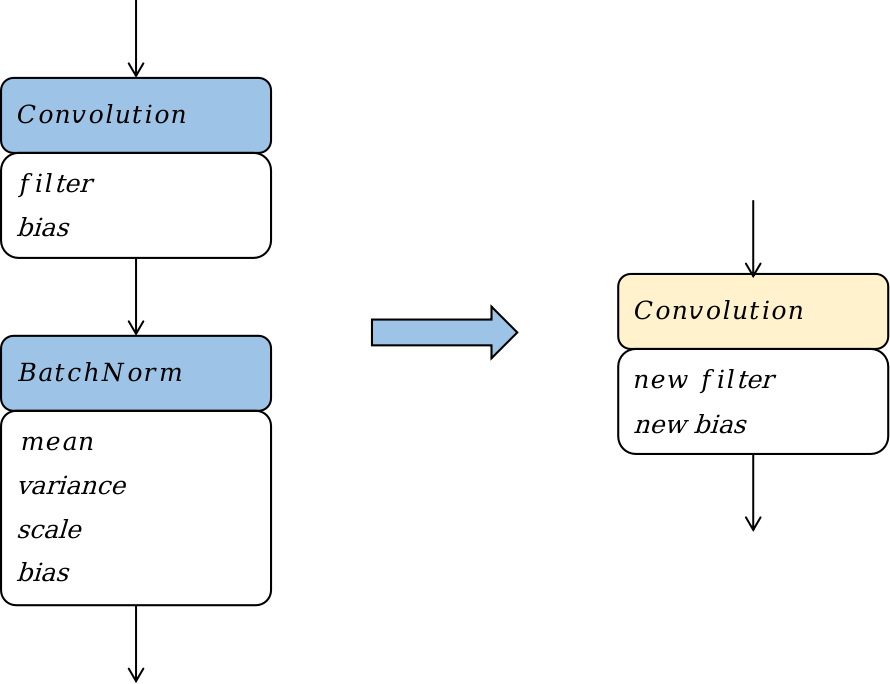
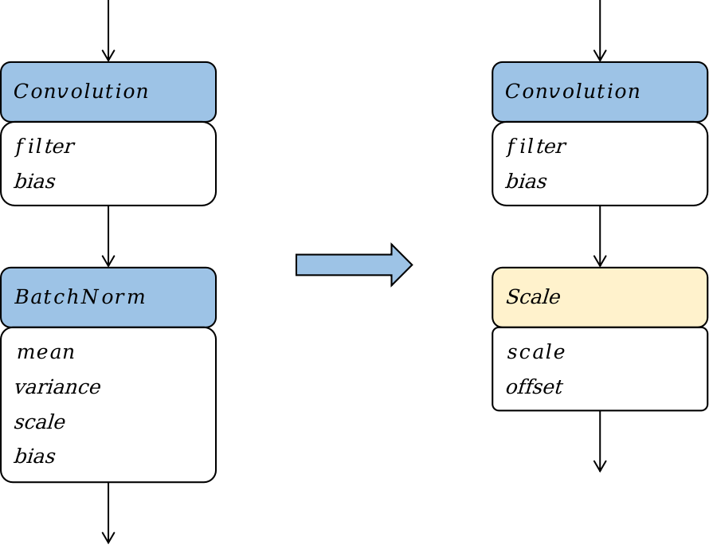
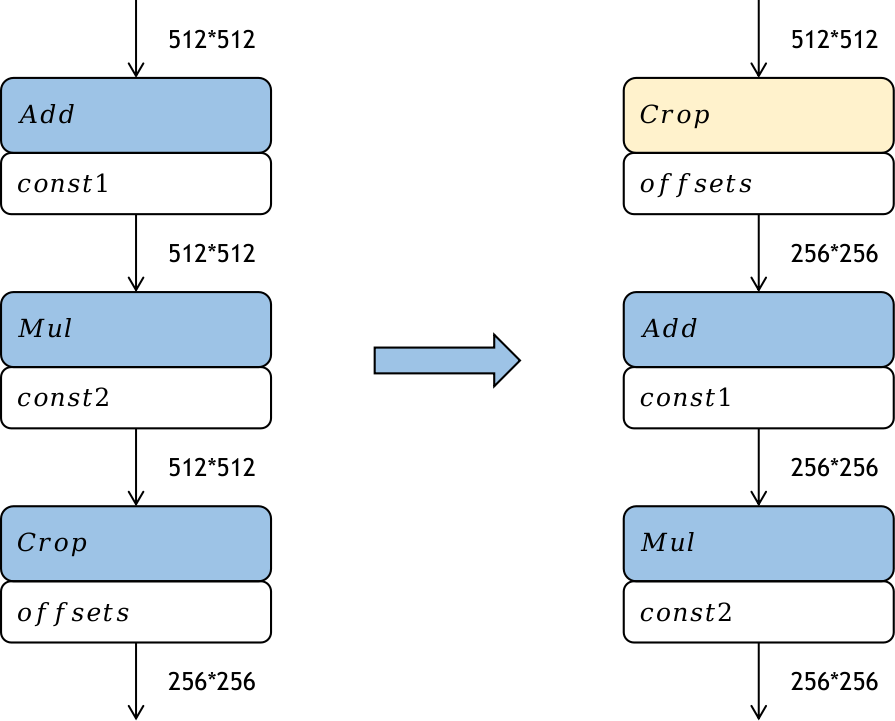

## 训练模型到推理模型的转换及优化

### 模型转换

前面我们提到过，不同的训练框架（Tensorflow、PyTorch、MindSpore、MXNet、CNTK等）都定义了自己的模型的数据结构，推理系统需要将它们转换到统一的一种数据结构上。Open Neural Network Exchange(ONNX）正是为此目的而设计的。ONNX支持广泛的机器学习运算符集合，并提供了不同训练框架的转换器，例如TensorFlow模型到ONNX模型的转换器、PyTorch模型到ONNX模型的转换器等。
模型转换本质上是将模型这种结构化的数据，从一种数据结构转换为另一种数据结构的过程。进行模型转换首先要分析两种数据结构的异同点，然后针对结构相同的数据做搬运；对于结构相似的数据做一一映射；对于结构差异较大的数据则需要根据其语义做合理的数据转换；更进一步如果两种数据结构上存在不兼容，则模型转换无法进行。ONNX的一个优势就在于其强大的表达能力，从而大多数业界框架的模型都能够转换到ONNX的模型上来而不存在不兼容的情况.
模型可以抽象为一种图，从而模型的数据结构可以解构为以下两个要点：

- 模型拓扑表达：从图的角度来说，就是图的边；从模型的角度来说，就是模型中的数据流和控制流等，模型数据流和控制流的定义又可以引申出子图的表达形式、模型输入输出的表达形式、控制流结构的表达形式等。比如Tensorflow1.x中的控制流表达为一种有环图，通过Enter、Exit、Switch、LoopCond、NextIteration等算子来解决成环，而ONNX通过Loop，If等算子来表达控制流，从而避免引入了有环，所以在将Tensorflow1.x的控制流模型转化为ONNX模型时，需要将Tensorflow模型中的控制流图结构融合成ONNX的While或者If算子。

- 算子原型定义：从图的角度来说，就是图的顶点；从模型角度来说，就是模型中的数据处理节点或者控制流节点。算子原型包括但不限于算子类型、算子输入输出的定义、算子属性的定义等。比如Caffe的slice算子和ONNX的slice算子的语义其实是不一致的，Caffe的slice算子应该映射到ONNX的Split算子，所以在将Caffe模型转换成ONNX模型时，需要将Caffe的Slice算子映射到ONNX的Split算子。比如Tensorflow中的中的FusedBatchNorm算子在Caffe中找不到相同语义的算子，需要将Caffe的BatchNorm算子和Scale算子组合起来才能表达相同的语义。
通常模型转换的过程也就是转换模型中的拓扑关系和映射模型中的算子原型。

在完成模型转换之后，通常地，我们会将一些不依赖于输入的工作提前去完成。这些工作包括了如常量折叠、算子融合、算子替换、算子重排等一些优化手段。这些优化手段的概念在前面的章节其实已经提及到，比如在编译器前端阶段，通常也会做常量折叠；在编译器后端阶段，通常会根据后端的硬件支持程度，对算子进行融合和拆分。但是有些优化工作只有在部署阶段才能进行或者彻底进行。

### 算子融合
:label:`ch08-sec-fusion`

算子融合，就是将深度神经网络模型中的多个算子，按照一定的规则，合并成一个新的算子。通过算子融合，可以减少模型在线推理时的计算量、访存开销，从而降低推理时的时延和功耗。

:width:`150px`
:label:`ch08-fig-storage`

算子融合带来的性能上的收益主要来自两个方面，一是通过融合，充分利用寄存器和缓存，避免多个算子运算时，数据在CPU和内存之间的存储和读取的耗时。如 :numref:`ch08-fig-storage`，可以看到计算机的储存系统，从最靠近cpu的寄存器L1、L2等多级缓存，到内存、硬盘，其存储的容量越来越大，但读取数据的耗时也越来越大。融合后，前一次计算的结果可以先暂存在CPU的寄存器(Register)或者缓存（Cache）中，下一次计算直接从寄存器或者缓存中读取，减少了内存读写的IO次数。二是通过融合，可以将一些计算量提前完成，避免了前向推理时的冗余计算或者循环冗余计算。

:width:`500px`
:label:`ch08-fig-conv_bn_fusion`

如 :numref:`ch08-fig-conv_bn_fusion`，我们以Convolution算子和Batchnorm算子的融合为例，阐述算子融合的基本原理，图中蓝色框表示算子，黄色框表示融合后新增或者改变的算子，白色框表示算子中的权重或者常数张量。其融合的过程是一个计算表达式简化的过程，Convolution算子的计算过程可以等效为一个矩阵乘，其公式可以表达为 :eqref:`ch08-equ-conv_equation`。

$$\pmb{Y_{conv}}=\pmb{W_{conv}}*\pmb{X_{conv}}+\pmb{B_{conv}}$$
:eqlabel:`ch08-equ-conv_equation`

这里我们不需要理解公式 :eqref:`ch08-equ-conv_equation`中每个变量的含义，只需要注意到一点，该公式是$\pmb{Y_{conv}}$关于$\pmb{X_{conv}}$的，其他符号均表示常量。

Batchnorm算子的计算过程如公式 :eqref:`ch08-equ-bn_equation`所示。

$$\pmb{Y_{bn}}=\gamma\frac{\pmb{X_{bn}}-\mu_{\mathcal{B}}}{\sqrt{{\sigma_{\mathcal{B}}}^{2}+\epsilon}}+\beta$$
:eqlabel:`ch08-equ-bn_equation`

同样，这里我们不需要理解batchnorm中的所有参数的含义，只需要了解公式 :eqref:`ch08-equ-bn_equation`是$\pmb{Y_{bn}}$关于$\pmb{X_{bn}}$的，其他符号均表示常量。

如 :numref:`ch08-fig-conv_bn_fusion`，当Convlution算子的输出作为Batchnorm输入时，最终Batchnorm算子的计算公式也就是要求$\pmb{Y_{bn}}$关于$\pmb{X_{conv}}$的计算公式，我们将$\pmb{Y_{conv}}$代入到$\pmb{X_{bn}}$，然后将常数项合并提取后，可以得到公式 :eqref:`equ:conv-bn-equation-3`。

$$\pmb{Y_{bn}}=\pmb{A}*\pmb{X_{conv}}+\pmb{B}$$
:eqlabel:`ch08-equ-conv_bn_equation_3`

其中$\pmb{A}$和$\pmb{B}$为两个矩阵。可以看到,公式 :eqref:`ch08-equ-conv_bn_equation_3`其实就是一个Convolution的计算公式。这个结果表明，在模型部署时，我们可以将Convolution和Batchnorm两个算子的计算等价为一个Convolution算子。我们将上述以计算公式的合并和简化为基础的算子融合称为计算公式融合。

在Convolution算子和Batchnorm算子融合的前后，网络结构相当于减少了一个Batchnorm算子，相应的网络中的参数量和网络所需的计算量都减少了；同时由于算子数量的减少，访存次数也相应地减少了。综合来看，该融合Pattern优化了模型部署时的功耗、性能，同时对于模型的体积大小也有少许收益。

在融合过程中，Convolution计算公式和Batchnorm计算公式中被认为是常量的符号在训练时均为参数，并不是常量。训练阶段如果进行该融合会导致模型参数的缺失。从该融合Pattern的结果来看，融合后网络中减少了一个Batchnorm算子，减少了一个Batchnorm算子的参数量，其实就是改变了深度神经网络的算法，会影响到网络的准确率，这是不可接受的。所以Convolution算子与Batchnorm算子的融合一般是在部署阶段特有的一种优化手段，其优化效果我们以MinsSpore Lite为例，构造了包含一个Convolution和一个Batchnorm的sample网络，分别以样例网络和mobilenet-v2网络为例，在华为Mate30手机上，以两线程运行模型推理，取3000轮推理的平均时耗作为模型推理性能的指标，对比融合前后该指标的变化。从表 :numref:`ch08-tab-conv_bn_fusion`可以看到，对于sample网络和mobilenet-v2网络，融合后分别获得了8.5%和11.7%的推理性能提升，这个性能提升非常可观。并且这个性能提升没有带来任何的副作用，也没有对于硬件或算子库的提出额外要求。

::: {#tab:ch08-tab-conv_bn_fusion}
   网络       sample       mobilenet-v2
  ------- ------------- -----------------
   融合前     0.035         15.415
   融合后     0.031         13.606

: Convolution + Batchnorm融合前后推理性能（单位：ms）
:::
:label:`ch08-tab-conv_bn_fusion`

### 算子替换

算子替换，即将模型中某些算子替换计算逻辑一致但对于在线部署更友好的算子。算子替换的原理是通过合并同类项、提取公因式等数学方法，将算子的计算公式加以简化，并将简化后的计算公式映射到某类算子上。算子替换可以达到降低计算量、降低模型大小的效果。

:width:`500px`
:label:`ch08-fig-bn_replace`

如 :numref:`ch08-fig-bn_replace`，我们以Batchnorm算子替换成Scale算子为例，阐述算子替换的原理。我们直接将Batchnorm的计算公式 :eqref:`ch08-equ-bn_equation`进行分解，并将常量合并简化，Batchnorm的计算公式可以写成：

$$\pmb{Y_{bn}}=scale*\pmb{X_{bn}}+offset$$
:eqlabel:`ch08-equ-replace_scale`

其中scale和offset为两个标量。可以看到，计算公式简化后，我们可以将其映射到一个Scale算子。

在Batchnorm算子被替换为Scale算子的前后，网络中的参数量、计算量都减少了，该算子替换策略可以优化模型部署时的功耗和性能。同理，该算子替换优化策略只能在部署阶段才能进行，因为一方面在部署阶段Batchnorm计算公式中被认为是常量的符号，在训练时是参数并非常量。另一方面该优化策略会降低模型的参数量，改变模型的结构，降低模型的表达能力，影响训练收敛时模型的准确率。

### 算子重排

算子重排是指将模型中算子的拓扑序按照某些规则进行重新排布，在不降低模型的推理精度的前提下，降低模型推理的计算量。常用的算子重排技术有针对于Slice算子、StrideSlice算子、Crop算子等裁切类算子的前移、Reshape算子和Transpose算子的重排、BinaryOp算子的重排等。

:width:`500px`
:label:`ch08-fig-crop_reorder`

如 :numref:`ch08-fig-crop_reorder`，Crop算子是从输入的feature map中裁取一部分作为输出，经过Crop算子后，feature map的size就降低了。如果我们将这个裁切的过程前移，提前对feature map进行裁切，那么后续算子的计算量也会相应地减少，从而提高模型部署时的推理性能。Crop算子前移带来的性能提升跟Crop算子的参数有关。但是Crop算子一般只能沿着element wise类算子前移。

通过前面的实验数据我们可以看到，通过推理前的模型优化，可以为推理的时延、功耗、内存占用带来极大的收益。
