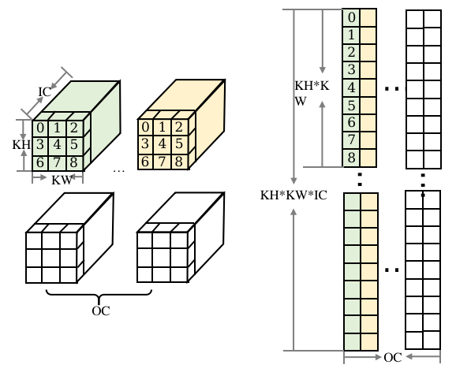

## 模型推理

训练模型经过前面的转换、压缩等流程后，需要部署在计算硬件上进行推理。执行推理主要包含以下步骤：

- 前处理：将原始数据处理成适合网络输入的数据。
- 执行推理：将离线转换得到的模型部署到设备上执行推理流程，根据输入数据计算得到输出数据。
- 后处理：模型的输出结果做进一步的加工处理，如筛选阈值。

### 前处理与后处理

#### 前处理

前处理主要完成数据预处理，在现实问题中，我们得到的原始数据往往非常混乱，机器学习模型无法识别并从中提取信息。数据预处理的目的是将原始数据例如图片、语音、文本等，处理成适合网络输入的tensor数据，并消除其中无关的信息，恢复有用的真实信息，增强有关信息的可检测性，最大限度地简化数据，从而改进模型的特征抽取、图像分割、匹配和识别等可靠性。

常见的数据预处理手段有：

- 特征编码：将描述特征的原始数据编码成数字，输入给机器学习模型，因为它们只能处理数字数据。常见的编码方法有：离散化、序号编码、One-hot编码，二进制编码等；

- 数据归一化：修改数据的值使其达到共同的标度但不改变它们之间的相关性，消除数据指标之间的量纲影响。常用的技术有：Min-Max归一化将数据缩放到给定范围，Z-score归一化使数据符合正态分布；

- 处理离群值: 离群值是与数据中的其他值保持一定距离的数据点，适当地排除离群值可以提升模型的准确性。

#### 后处理

通常，模型推理结束后，需要把推理的输出数据传递给用户完成后处理，常见的数据后处理手段有：

- 连续数据离散化：模型实际用于预测离散数据，例如商品数量时，用回归模型预测得到的是连续值，需要四取五入、取上下限阈值等得到实际结果；

- 数据可视化：将数据图形化、表格化，便于找到数据之间的关系，来决定下一步的分析策略；

- 手动拉宽预测范围：回归模型往往预测不出很大或很小的值，结果都集中在中部区域。例如医院的化验数据，通常是要根据异常值诊断疾病。手动拉宽预测范围，将偏离正常范围的值乘一个系数，可以放大两侧的数据，得到更准确的预测结果。

### 并行计算 
:label:`ch08-sec-parallel_inference`

为提升推理的性能，需要重复利用多核的能力，所以一般推理框架会引入多线程机制。主要的思路是将算子的输入数据进行切分，通过多线程去执行不同数据切片，实现算子并行计算，从而成倍提升算子计算性能。

:width:`800px`
:label:`ch08-fig-parallel`

如图所示，对于矩阵乘可以按左矩阵的行进行切分，可以利用三个线程分别计算A1\*B，A2\*B，A3\*B，实现矩阵乘多线程并行计算。

为方便算子并行计算，同时避免频繁创建销毁线程的开销，推理框架一般会使用线程池机制。业界有两种较为通用的做法：

- 使用OpenMp编程接口：OpenMP（Open Multi-Processing）是一套支持跨平台共享内存方式的多线程并发的编程API，如算子并行最常用的接口\"parallel for\"，实现for循环体的代码被多线程并行执行。
- 推理框架实现针对算子并行计算的线程池，相对OpenMp提供的接口会更有针对性，性能会更高，且更轻量。

### 算子优化
:label:`ch08-sec-kernel_optimization`

在部署AI模型时，我们期望模型执行训练或推理的时间尽可能地短，以获得更优越的性能。对于一个固定的深度学习网络，框架调度的时间占比往往很小，性能的瓶颈就在算子的执行。下面从硬件指令和算法角度介绍一些算子优化的方法。

#### 硬件指令优化

绝大多数的设备上都有CPU，因此算子在CPU上的时间尤为重要，下面介绍一下在ARM
CPU硬件指令优化的方法。

1\. 汇编语言

开发者使用的C++、Java等高级编程语言会通过编译器输出为机器指令码序列，而高级编程语言能做的事通常受编译器所限，汇编语言是靠近机器的语言，可以一对一实现任何指令码序列，编写的程序存储空间占用少、执行速度快、效率优于高级编程语言。

在实际应用中，最好是程序的大部分用高级语言编写，运行性能要求很高的部分用汇编语言来编写，通过混合编程实现优势互补。深度学习的卷积、矩阵乘等算子涉及大量的计算，使用汇编语言能够给模型训练和推理性能带来数十到数百倍量级的提升。

下面以ARMv8系列处理器为例，介绍和硬件指令相关的优化。

2\. 寄存器与NEON指令

ARMv8系列的CPU上有32个NEON寄存器v0-v31，如 :numref:`ch08-fig-register`所示，NEON寄存器v0可存放128bit的数据，即4个float32，8个float16，16个int8等。

:width:`500px`
:label:`ch08-fig-register`

针对该处理器，可以采用SIMD(Single Instruction，Multiple Data，单指令、多数据)提升数据存取计算的速度。相比于单数据操作指令，NEON指令可以一次性操作NEON寄存器的多个数据。例如：对于浮点数的fmla指令，用法为fmla v0.4s, v1.4s, v2.4s，如 :numref:`ch08-fig-fmla`所示，用于将v1和v2两个寄存器中相对应的float值相乘累加到v0的值上。

:width:`600px`
:label:`ch08-fig-fmla`

3\. 汇编语言优化

对于已知功能的汇编语言程序来说，计算类指令通常是固定的，性能的瓶颈就在非计算指令上。如 :numref:`ch08-fig-storage`所示，计算机各存储设备类似于一个金字塔结构，最顶层空间最小，但是速度最快，最底层速度最慢，但是空间最大。L1-L3统称为cache(高速缓冲存储器)，CPU访问数据时，会首先访问位于CPU内部的cache，没找到再访问CPU之外的主存，此时引入了缓存命中率的概念来描述在cache中完成数据存取的占比。要想提升程序的性能，缓存命中率要尽可能的高。

下面简单列举一些提升缓存命中率、优化汇编性能的手段：

（1）循环展开：尽可能使用更多的寄存器，以代码体积换性能；

（2）指令重排：打乱不同执行单元的指令以提高流水线的利用率，提前有延迟的指令以减轻延迟，减少指令前后的数据依赖等；

（3）寄存器分块：合理分块NEON寄存器，减少寄存器空闲，增加寄存器复用；

（4）计算数据重排：尽量保证读写指令内存连续，提高缓存命中率；

（5）使用预取指令：将要使用到的数据从主存提前载入缓存，减少访问延迟。

#### 算法优化

多数AI模型的推理时间主要耗费在卷积、矩阵乘算子的计算上，占到了整网百分之九十甚至更多的时间。本小节主要介绍卷积算子算法方面的优化手段，可以应用到各种硬件设备上。
卷积的计算可以转换为两个矩阵相乘，在前述5.3.3小节中，已经详细介绍了矩阵乘GEMM运算的优化。对于不同的硬件，确定合适的矩阵分块，优化数据访存与指令并行，可以最大限度的发挥硬件的算力，提升推理性能。

1.Img2col

将卷积的计算转换为矩阵乘，一般采用Img2col的方法实现。在常见的神经网络中，卷积的输入通常都是4维的，默认采用的数据排布方式为NHWC，如 :numref:`ch08-fig-conv_nhwc`所示，是一个卷积示意图。输入维度为（1,IH,IW,IC），卷积核维度为（OC,KH,KW,IC），输出维度为（1,OH,OW,OC）。

:width:`800px`
:label:`ch08-fig-conv_nhwc`

对卷积的Img2col规则如下。如 :numref:`ch08-fig-img2col_input`所示，对该输入做重排，得到的矩阵见右侧，行数对应输出的OH\*OW的个数；每个行向量里，先排列计算一个输出点所需要输入上第一个通道的KH\*KW个数据，再按次序排列之后的通道，直到通道IC。

:width:`800px`
:label:`ch08-fig-img2col_input`

如 :numref:`ch08-fig-img2col_weight`所示，对权重数据做重排。将1个卷积核展开为权重矩阵的一列，因此共有OC列，每个列向量上先排列第一个输入通道上KH\*KW的数据，再依次排列后面的通道直到IC。通过重排，卷积的计算就可以转换为两个矩阵相乘的求解。在实际实现时，Img2col和GEMM的数据重排会同时进行，以节省运行时间。

:width:`600px`
:label:`ch08-fig-img2col_weight`

2.Winograd算法

卷积计算归根到底是矩阵乘法，两个二维矩阵相乘的时间复杂度是$O(n^3)$。我们可以使用Winograd来降低矩阵乘法的复杂度。

以一维卷积运算为例，记为F(m，r)，其中，m代表输出的个数，r为卷积核的个数。输入为$d=[d_0 \ d_1 \ d_2 \ d_3]$，卷积核为$g=[g_0 \ g_1 \ g_2]^T$，该卷积计算可以写成矩阵形式如公式 :eqref:`ch08-equ-conv_matmul_one_dimension`所示，需要6次乘法和4次加法。

$$F(2, 3)=
\left[ \begin{matrix} d_0 & d_1 & d_2 \\ d_1 & d_2 & d_3 \end{matrix} \right] \left[ \begin{matrix} g_0 \\ g_1 \\ g_2 \end{matrix} \right]=
\left[ \begin{matrix} y_0 \\ y_1 \end{matrix} \right]$$
:eqlabel:`ch08-equ-conv_matmul_one_dimension`

可以观察到，卷积运算转换为矩阵乘法时输入矩阵中存在着重复元素$d_1$和$d_2$，因此，卷积转换的矩阵乘法相对一般的矩阵乘有了优化空间。可以通过计算中间变量$m_0-m_3$得到矩阵乘的结果，见公式 :eqref:`ch08-equ-conv-2-winograd`：

$$F(2, 3)=
\left[ \begin{matrix} d_0 & d_1 & d_2 \\ d_1 & d_2 & d_3 \end{matrix} \right] \left[ \begin{matrix} g_0 \\ g_1 \\ g_2 \end{matrix} \right]=
\left[ \begin{matrix} m_0+m_1+m_2 \\ m_1-m_2+m_3 \end{matrix} \right]$$
:eqlabel:`ch08-equ-conv-2-winograd`

其中，$m_0-m_3$的分别见公式 :eqref:`ch08-equ-winograd-param`：

$$\begin{aligned}
m_0=(d_0-d_2)*g_0 \\
m_1=(d_1+d_2)*(\frac{g_0+g_1+g_2}{2}) \\
m_2=(d_0-d_2)*(\frac{g_0-g_1+g_2}{2}) \\
m_2=(d_1-d_3)*g_2
\end{aligned}$$
:eqlabel:`ch08-equ-winograd-param`

通过$m_0-m_3$间接计算r1，r2，需要的运算次数包括：输入d的4次加法；输出m的4次乘法和4次加法。在推理阶段，权重的数值是常量，因此卷积核上的运算可以在图编译阶段计算，不计入在线的run时间。所以总的运算次数为4次乘法和8次加法，与直接运算的6次乘法和4次加法相比，乘法次数减少，加法次数增加。在计算机中，乘法一般比加法慢，通过减少乘法次数，增加少量加法，可以实现加速。

计算过程写成矩阵形式如公式 :eqref:`ch08-equ-winograd-matrix`所示，其中，⊙为对应位置相乘，A、B、G都是常量矩阵。这里写成矩阵计算是为了表达清晰，实际使用时，按照公式 :eqref:`ch08-equ-winograd-param`手写展开的计算速度更快。

$$\mathbf{Y}=\mathbf{A^T}(\mathbf{G}g)*(\mathbf{B^T}d)$$
:eqlabel:`ch08-equ-winograd-matrix`

$$\mathbf{B^T}=
\left[ \begin{matrix} 1 & 0 & -1 & 0 \\ 0 & 1 & 1 & 0 \\ 0 & -1 & 1 & 0 \\ 0 & 1 & 0 & -1 \end{matrix} \right]$$
:eqlabel:`ch08-equ-winograd-matrix-bt`

$$\mathbf{G}=
\left[ \begin{matrix} 1 & 0 & 0 \\ 0.5 & 0.5 & 0.5 \\ 0.5 & -0.5 & 0.5 \\ 0 & 0 & 1 \end{matrix} \right]$$
:eqlabel:`ch08-equ-winograd-matrix-g`

$$\mathbf{A^T}= 
\left[ \begin{matrix} 1 & 1 & -1 & 0 \\ 0 & 1 & -1 & -1  \end{matrix} \right] \\$$
:eqlabel:`ch08-equ-winograd-matrix-at`

通常深度学习领域通常使用的都是2D卷积，将F(2，3)扩展到F(2x2，3x3)，可以写成矩阵形式，如公式 :eqref:`ch08-equ-winograd-two-dimension-matrix`所示。此时，Winograd算法的乘法次数为16，而直接卷积的乘法次数为36，降低了2.25倍的乘法计算复杂度。

$$\mathbf{Y}=\mathbf{A^T}(\mathbf{G}g\mathbf{G^T})*(\mathbf{B^T}d\mathbf{B})\mathbf{A}$$
:eqlabel:`ch08-equ-winograd-two-dimension-matrix`

Winograd算法的整个计算过程在逻辑上可以分为4步，如 :numref:`ch08-fig-winograd`所示：

:width:`500px`
:label:`ch08-fig-winograd`

针对任意的输出大小，要使用F(2x2，3x3)的Winograd算法，需要将输出切分成2x2的块，找到对应的输入，按照上述的四个步骤，就可以求出对应的输出值。当然，Winograd算法并不局限于求解F(2x2，3x3)，针对任意的F(m\*m，r\*r)，都可以找到适当的常量矩阵A、B、G，通过间接计算的方式减少乘法次数。但是随着m、r的增大，输入、输出涉及的加法以及常量权重的乘法次数都在增加，那么乘法次数带来的计算量下降会被加法和常量乘法所抵消。因此，在实际使用场景中，还需要根据Winograd的实际收益来选择。

本小节主要介绍了模型推理时的数据处理和性能优化手段。选择合适的数据处理方法，可以更好地提取输入特征，处理输出结果。并行计算以及算子级别的硬件指令与算法优化可以最大限度的发挥硬件的算力。除此之后，内存的占用及访问速率也是影响推理性能的重要因素，因此推理时需要设计合理的内存复用策略，关于内存复用的策略我们在编译器后端章节已经做了阐述。
