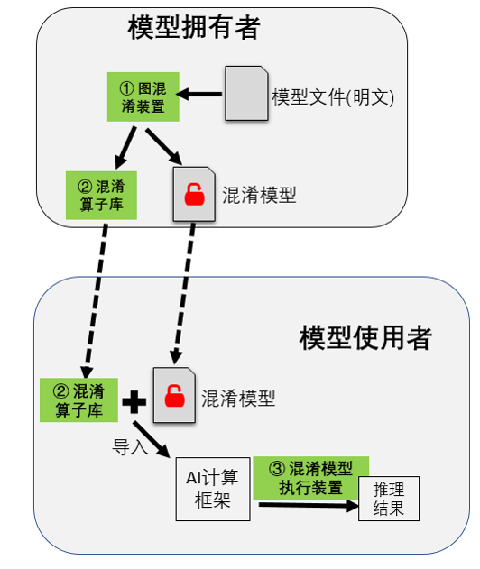

## 模型的安全保护
AI服务提供商在本地完成模型训练和调优后，将模型部署到第三方外包平台上（如终端设备、边缘设备和云服务器）来提供推理服务。由于AI模型的设计和训练需要投入大量时间、数据和算力，如何保护模型的知识产权（包括模型结构和参数等信息），防止模型在部署过程中的传输、存储以及运行环节被窃取，已经成为服务/模型提供商最为关心的问题之一。

### 概述
模型的安全保护可以分为静态保护和动态保护两个方面。静态保护指的是模型在传输和存储时的保护，目前业界普遍采用的是基于文件加密的模型保护方案，AI模型文件以密文形态传输和存储，执行推理前在内存中解密。在整个推理过程中，模型在内存中始终是明文的，存在被敌手从内存中转储的风险。动态保护指的是模型在运行时的保护，目前业界已有的模型运行时保护方案主要有以下三个技术路线：一是基于TEE（Trusted execution environment）的模型保护方案，TEE通常指的是通过可信硬件隔离出来的一个“安全区”，AI模型文件在非安全区加密存储和传输，在安全区中解密运行。该方案在CPU上的推理时延较小，但依赖特定可信硬件，有一定的部署难度。此外，受硬件资源约束，难以保护大规模深度模型，且目前仍无法有效支持异构硬件加速。二是基于密态计算的保护方案，该方案基于密码学方法（如同态加密、多方安全计算等），保证模型在传输、存储和运行过程中始终保持密文状态。该方案不依赖特定硬件，但面临非常大的计算或通信开销问题，且无法保护模型结构信息。三是基于混淆的模型保护方案，该方案主要通过对模型的计算逻辑进行加扰，使得敌手即使能获取到模型也无法理解。与前两种技术路线相比，该方案仅带来较小的性能开销，且精度损失很低，同时，不依赖特定硬件，可支持大模型的保护。下面将重点介绍基于混淆的模型保护技术。

### 模型混淆
模型混淆技术可以自动混淆明文AI模型的计算逻辑，使得攻击者即使在传输和存储时获取到模型也无法理解；且支持模型混淆态执行，保证模型运行时的机密性。同时不影响模型原本的推理结果、仅带来较小的推理性能开销。模型混淆技术主要包含以下几个步骤：

:width:`400px`
:label:`ch08-fig-model_obfuscate`

结合 :numref:`ch08-fig-model_obfuscate`，详细阐述模型混淆的执行步骤：

(1) 解析模型并获取计算图

对于一个训练好的模型，首先根据模型结构解析模型文件并获取模型计算逻辑的图表达（计算图）用于后续操作。获取的计算图包括节点标识、节点算子类型、节点参数权重以及网络结构等信息。

(2) 对计算图的网络结构加扰

通过图压缩和图增广等技术，对计算图中节点与节点之间的依赖关系进行加扰，达到隐藏模型真实计算逻辑的效果。其中，图压缩通过整图检查来匹配原网络中的关键子图结构，这些子图会压缩并替换为单个新的计算节点。对于压缩后的计算图，图增广通过在网络结构中加入新的输入/输出边，进一步隐藏节点间的真实依赖关系。新增的输入/输出边可以来自/指向图中现已有的节点，也可以来自/指向本步骤新增的混淆节点。

(3) 对计算图的节点匿名化

遍历步骤(2)处理后的计算图，筛选出需要保护的节点。对于图中的每个需要保护的节点，将节点标识、节点算子类型以及其它能够描述节点计算逻辑的属性替换为无语义信息的符号。对于节点标识匿名化，本步骤保证匿名化后的节点标识仍然是唯一的，以区分不同的节点。对于算子类型匿名化，为了避免大规模计算图匿名化导致的算子类型爆炸问题，可以将计算图中算子类型相同的节点划分为若干不相交的集合，同一个集合中节点的算子类型替换为相同的匿名符号。步骤(5)将保证节点匿名化后，模型仍然是可被识别和执行的。

(4) 对计算图的参数权重加扰

对于每个需要保护的权重，通过一个随机噪声和映射函数对权重进行加扰。每个权重加扰时可以使用不同的随机噪声和映射函数，步骤(6)将保证权重加扰不会影响模型执行结果的正确性。将经过步骤(2)(3)(4)处理后的计算图保存为模型文件供后续使用。

(5) 算子接口变换

步骤(5)(6)将对每个需要保护的算子类型进行算子形态变换，生成若干候选混淆算子。原算子与混淆算子之间是一对多的对应关系，候选混淆算子的数量等于步骤(3)划分的节点集合的数量。
本步骤根据步骤(2)(3)(4)的得到的匿名化算子类型、算子输入/输出关系等信息，对相应算子的接口进行变换。算子接口的变换方式包括但不局限于输入输出变换、接口名称变换。其中，输入输出变换通过修改原算子的输入输出数据，使得生成的混淆算子与原算子的接口形态不同。新增的输入输出数据包括步骤(2)图增广新增的节点间数据依赖和步骤(4)权重混淆引入的随机噪声。接口名称变换将原算子名称替换为步骤(3)生成的匿名化算子名称，保证节点匿名化后的模型仍然是可被识别和执行的，且算子的名称不会泄露其计算逻辑。

(6) 算子实现变换

对算子的代码实现进行变换。代码实现的变换方式包括但不局限于字符串加密、冗余代码等软件代码混淆技术，保证混淆算子与原算子实现语义相同的计算逻辑，但是难以阅读和理解。不同的算子可以采用不同代码混淆技术的组合进行代码变换。除代码等价变形之外，混淆算子还实现了一些额外的计算逻辑，如对于步骤(4)中参数被加扰的算子，混淆算子也实现了权重加扰的逆映射函数，用于在算子执行过程中动态消除噪声扰动，保证混淆后模型的计算结果与原模型一致。将生成的混淆算子保存为库文件供后续使用。

(7) 部署模型和算子库

将混淆态模型文件以及相应的混淆算子库文件部署到目标设备上。

(8) 混淆模型加载

根据模型结构解析混淆态模型文件并获取模型计算逻辑的图表达，即经过步骤(2)(3)(4)处理后得到的混淆计算图。

(9) 计算图初始化

对计算图进行初始化，生成执行任务序列。根据安全配置选项，若需要保护模型运行时安全，则直接对混淆计算图进行初始化，生成执行任务序列，序列中的每个计算单元对应一个混淆算子或原算子的执行。若仅需保护模型传输和存储时安全，则可先将内存中的混淆计算图恢复为原计算图，然后对原计算图进行初始化，生成执行任务序列，序列中的每个单元对应一个原算子的执行，这样可以进一步降低推理时的性能开销。

(10) 推理任务执行

根据AI应用程序输入的推理数据，遍历执行任务序列中的每个计算单元，得到推理结果。若当前计算单元对应的算子是混淆算子时，调用混淆算子库；否则，调用原算子库。
